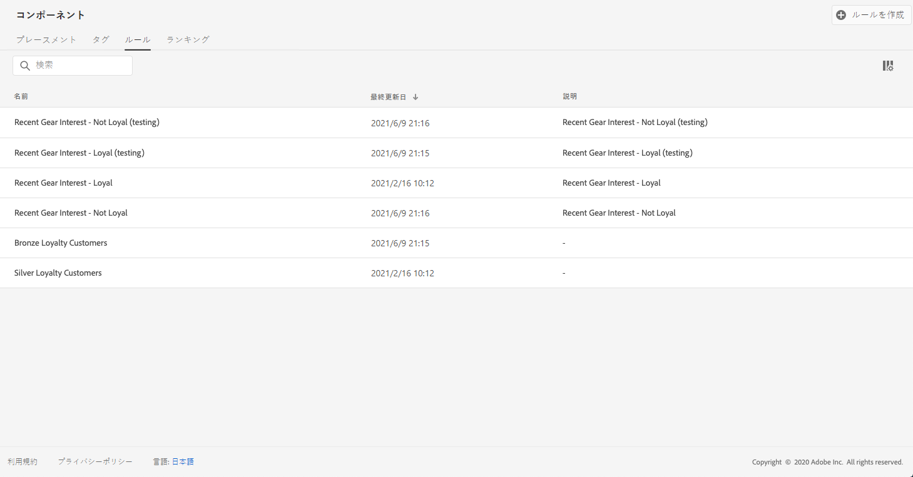
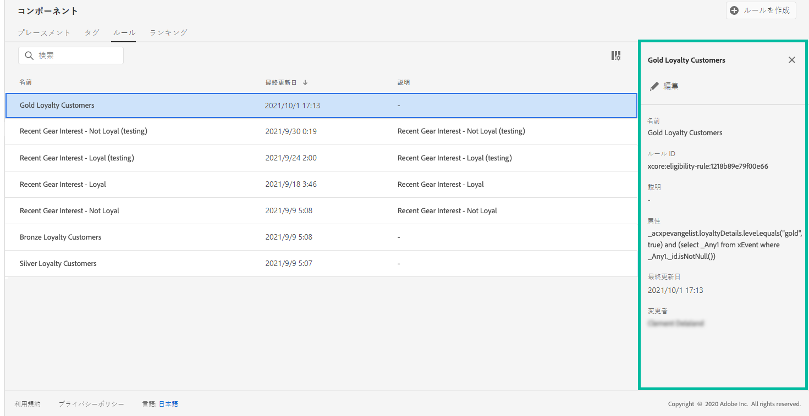

# 決定ルールの作成 {#creating-decision-rules}

Adobe Experience Platform で利用可能なデータに基づいて、オファーの決定ルールを作成できます。決定ルールは、オファーを表示する対象を決定します。

例えば、性別が女性で地域が北東部の場合にのみ「婦人冬服」オファーを表示するように指定できます。

➡️ [この機能をビデオで確認](#video)

作成した決定ルールのリストには、 **[!UICONTROL コンポーネント]**&#x200B;メニューからアクセスできます。

決定ルールを作成するには、次の手順に従います。

1. 「**[!UICONTROL ルール]**」タブに移動し、「**[!UICONTROL ルールを作成]**」をクリックします。

   

1. ルールに名前を付け、説明を入力し、必要に応じてルールを設定します。

   そのためには、ルールの条件を作成する際に役立つ&#x200B;**セグメントビルダー**&#x200B;を使用できます。 [詳細](../../segment/about-segments.md)

   この例では、「ゴールド」ロイヤルティレベルの顧客をターゲットします。

   

   >[!NOTE]
   >
   >決定ルールを作成するために用意されているセグメントビルダーは、**[!UICONTROL Audience Destinations]** サービスで使用されるものと比較して、特異性がいくつかあります。例えば、「**[!UICONTROL セグメント]**」タブは使用できません。ただし、セグメントビルダーのドキュメントで説明されているグローバルプロセスは、オファーの決定ルールを作成する場合にも有効です。

1. 「**[!UICONTROL 保存]**」をクリックして確認します。

1. ルールを作成すると、ルールリストに表示されます。選択するとプロパティが表示され、編集することも削除することもできます。

   

## チュートリアルビデオ {#video}

>[!NOTE]
>
>このビデオは、Adobe Experience Platformで構築された Offer Decisioning アプリケーションサービスに当てはまります。ただし、Journey Optimizer のコンテキストでオファーを使用する際の一般的なガイダンスを提供しています。

>[!VIDEO](https://video.tv.adobe.com/v/329373?quality=12)
