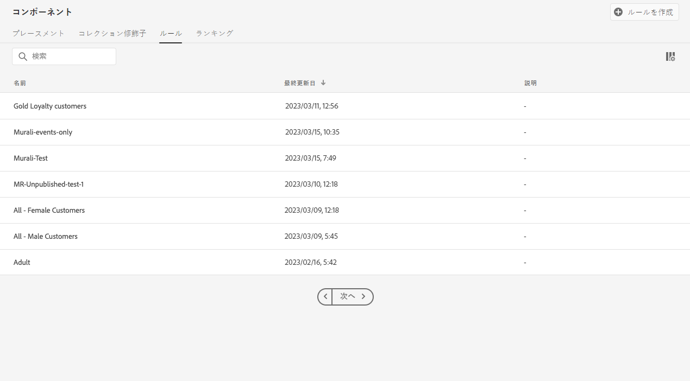
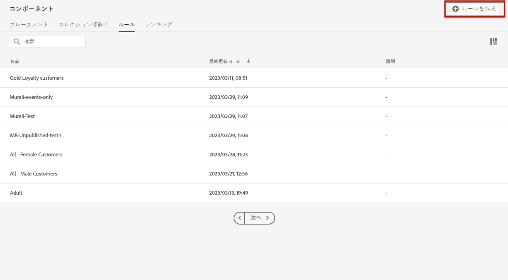
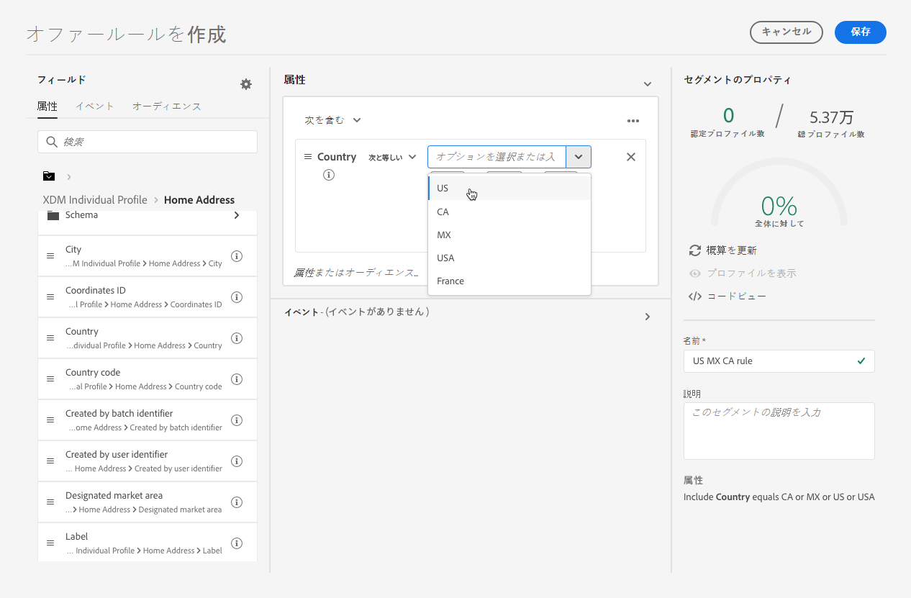
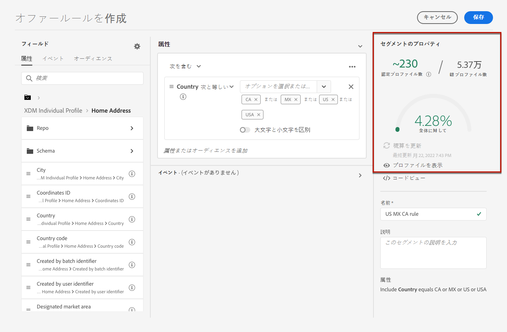
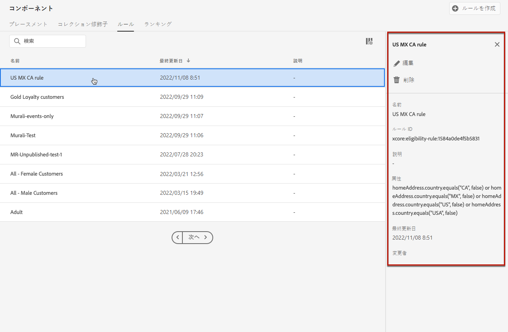

# 決定ルールの作成 {#create-decision-rules}

Adobe Experience Platform で利用可能なデータに基づいて、オファーの決定ルールを作成できます。決定ルールは、オファーを表示する対象を決定します。

例えば、性別が女性で地域が北東部の場合にのみ「婦人冬服」オファーを表示するように指定できます。

➡️ [ビデオでこの機能を確認する](#video)

作成した決定ルールのリストには、 **[!UICONTROL コンポーネント]**&#x200B;メニューからアクセスできます。

決定ルールを作成するには、次の手順に従います。

1. 「**[!UICONTROL ルール]**」タブに移動し、「**[!UICONTROL ルールを作成]**」をクリックします。

   

1. ルールに名前を付け、説明を入力したあと、ルールを必要に応じて設定します。

   それには、ルールの条件の作成に役立つ&#x200B;**セグメントビルダー**&#x200B;を使用できます。[詳細情報](../../segment/about-segments.md)

   <!--In this example, the rule will target customers that have the "Gold" loyalty level.-->

   

   >[!NOTE]
   >
   >決定ルールを作成するために用意されているセグメントビルダーは、**[!UICONTROL Audience Destinations]** サービスで使用されるものと比較して、特異性がいくつかあります。例えば、「**[!UICONTROL セグメント]**」タブは使用できません。ただし、[セグメントビルダー](../../segment/about-segments.md)のドキュメントで説明されているグローバルプロセスは、オファーの決定ルールを作成する場合にも有効です。詳しくは、[Adobe Experience Platform セグメント化サービスのドキュメント](https://experienceleague.adobe.com/docs/experience-platform/segmentation/ui/segment-builder.html?lang=ja)を参照してください。

1. ワークスペースに新しいフィールドを追加および設定すると、**[!UICONTROL セグメントのプロパティ]**&#x200B;パネルに、セグメントに属する予測プロファイルに関する情報が表示されます。「**[!UICONTROL 予測を更新]**」をクリックしてデータを更新します。

   

   >[!NOTE]
   >
   >プロファイルの予測は、ルールパラメーターにコンテキストデータなど、プロファイルに含まれていないデータが含まれている場合は使用できません。例えば、現在の気温が 80 ℃以上であることを条件とする実施要件ルールがあります。

1. 「**[!UICONTROL 保存]**」をクリックして確認します。

1. ルールを作成すると、**[!UICONTROL ルール]**&#x200B;リストに表示されます。選択するとプロパティが表示され、編集することも削除することもできます。

   

>[!CAUTION]
>
>イベントベースのオファーは、現在 [!DNL Journey Optimizer] ではサポートされていません。[イベント](https://experienceleague.adobe.com/docs/experience-platform/segmentation/ui/segment-builder.html?lang=ja#events){target=&quot;_blank&quot;}に基づいて決定ルールを作成しても、それをオファーで活用することはできません。

## チュートリアルビデオ {#video}

>[!VIDEO](https://video.tv.adobe.com/v/329373?quality=12)
