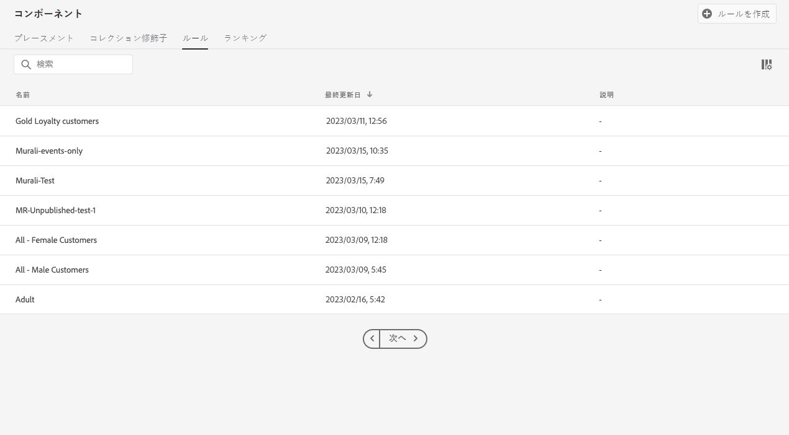
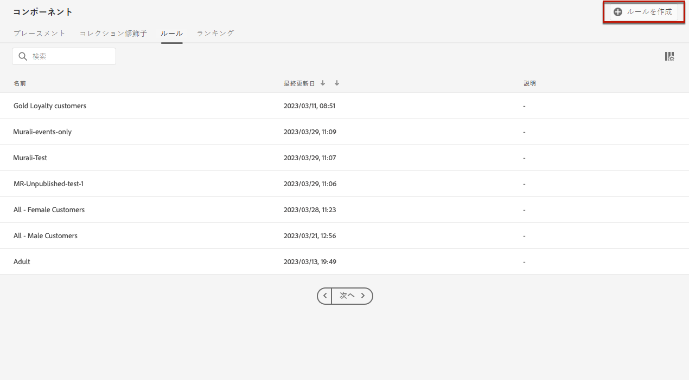
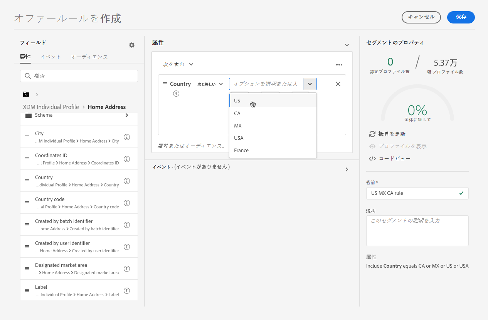
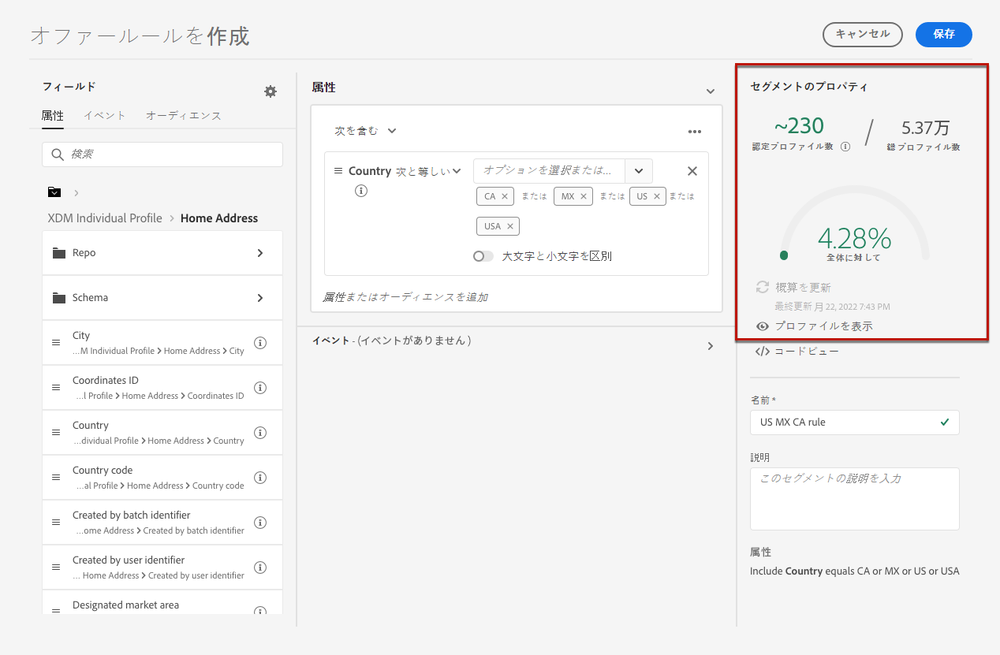
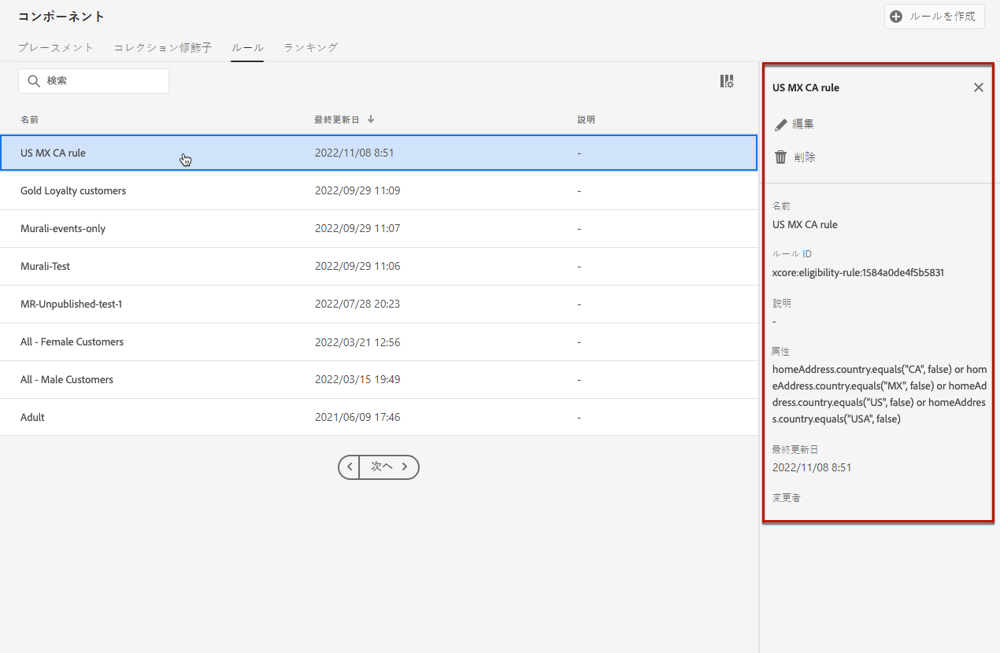

# 決定ルールの作成 {#create-decision-rules}

>[!IMPORTANT]
>
>このページでは、従来の&#x200B;**意思決定管理**&#x200B;機能の決定ルールについて説明します。 **Decisioning**&#x200B;を使用している場合 – コードベースのエクスペリエンスとメールチャネルを介して利用可能な[!DNL Adobe Journey Optimizer]の現在の意思決定機能については、代わりに[ ルールを作成](../../experience-decisioning/rules.md)を参照してください。
>
>どの機能を使用しているか不明な場合は、 [決定について学ぶ](../../experience-decisioning/gs-experience-decisioning.md)。

## 決定ルールについて {#about}

Adobe Experience Platform で利用可能なデータに基づいて、オファーの決定ルールを作成できます。 決定ルールは、オファーを表示する対象を決定します。

例えば、性別が女性で地域が北東部の場合にのみ「婦人冬服」オファーを表示するように指定できます。

➡️ [ビデオでこの機能を確認する](#video)

決定ルールを使用する際に考慮すべき制限事項のリストを以下に示します。

* Edge 決定では、イベントを保存しない Edge プロファイルを使用するので、Edge 決定で使用するルールは無効になります。
* 決定ルールを作成する際に、前の期間をさかのぼることはサポートされていません。 例えば、過去 1 か月以内に発生したエクスペリエンスイベントをルールのコンポーネントとして指定した場合。 ルールの作成中にルックバック期間を含めようとすると、保存時にトリガーが発生します。
  <!--* Decision requests that use the hub profile will look at the last 100 experience events on the profile to evaluate rules that reference historical experience events.-->

## 決定ルールの作成 {#create}

作成した決定ルールのリストには、 **[!UICONTROL コンポーネント]**&#x200B;メニューからアクセスできます。

決定ルールを作成するには、次の手順に従います。

1. 「**[!UICONTROL ルール]**」タブに移動し、「**[!UICONTROL ルールを作成]**」をクリックします。

   

1. ルールに名前を付け、説明を入力したあと、ルールを必要に応じて設定します。

   それには、ルールの条件の作成に役立つ Adobe Experience Platform **セグメントビルダー**&#x200B;を使用できます。 [詳しくは、セグメント定義の作成方法を参照してください](../../audience/creating-a-segment-definition.md)

   <!--In this example, the rule will target customers that have the "Gold" loyalty level.-->

   

   >[!NOTE]
   >
   >決定ルールを作成するために用意されているセグメントビルダーは、**[!UICONTROL Segmentation]** サービスで使用されるものと比較して、異なる点がいくつかあります。 ただし、[セグメントビルダー](../../audience/creating-a-segment-definition.md)のドキュメントで説明されているグローバルプロセスは、オファーの決定ルールを作成する場合にも有効です。 詳しくは、[Adobe Experience Platform セグメント化サービスのドキュメント](https://experienceleague.adobe.com/docs/experience-platform/segmentation/ui/segment-builder.html?lang=ja)を参照してください。

1. ワークスペースに新しいフィールドを追加および設定すると、**[!UICONTROL オーディエンスのプロパティ]**&#x200B;パネルに、オーディエンスに属する推定プロファイルに関する情報が表示されます。 「**[!UICONTROL 予測を更新]**」をクリックして、データを更新します。

   

   >[!NOTE]
   >
   >プロファイルの予測は、ルールパラメーターにコンテキストデータなど、プロファイルに含まれていないデータが含まれている場合は使用できません。 例えば、現在の気温が 80 ℃以上であることを条件とする実施要件ルールがあります。

1. 「**[!UICONTROL 保存]**」をクリックして確認します。

1. ルールを作成すると、**[!UICONTROL ルール]**&#x200B;リストに表示されます。 選択するとプロパティが表示され、編集することも削除することもできます。

   

>[!CAUTION]
>
>イベントベースのオファーは、現在 [!DNL Journey Optimizer] ではサポートされていません。 [イベント](https://experienceleague.adobe.com/docs/experience-platform/segmentation/ui/segment-builder.html?lang=ja#events){target="_blank"}に基づいて決定ルールを作成しても、それをオファーで活用することはできません。

## チュートリアルビデオ {#video}

>[!VIDEO](https://video.tv.adobe.com/v/329373?quality=12)
