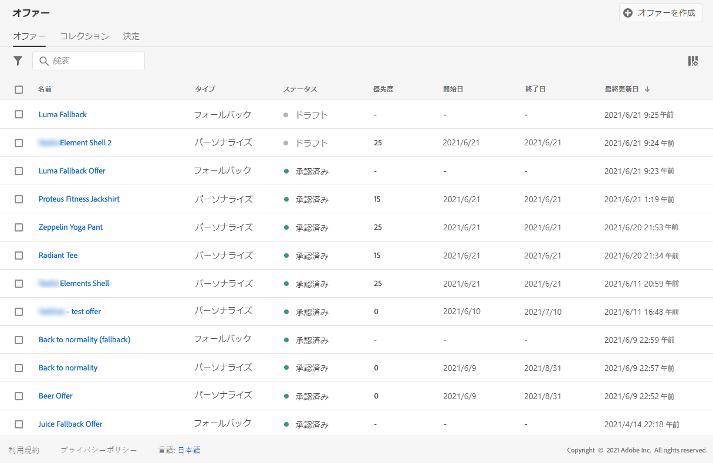
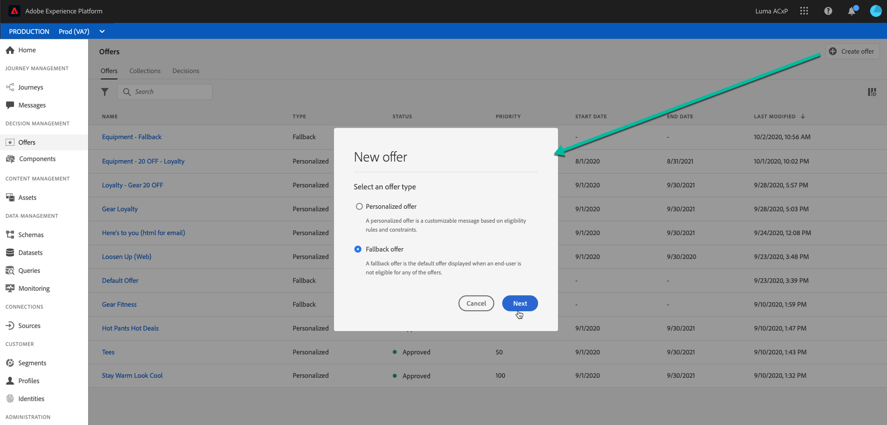
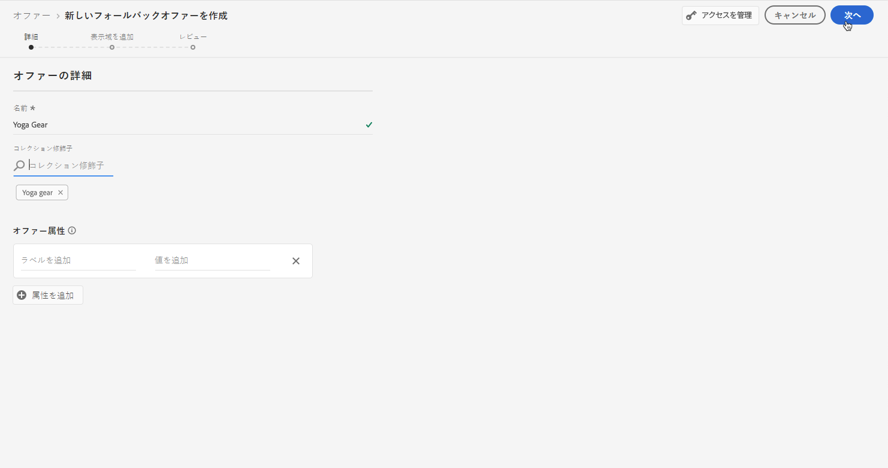
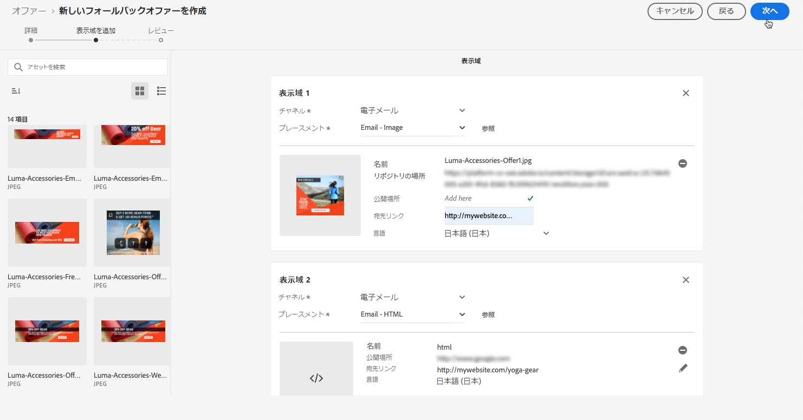
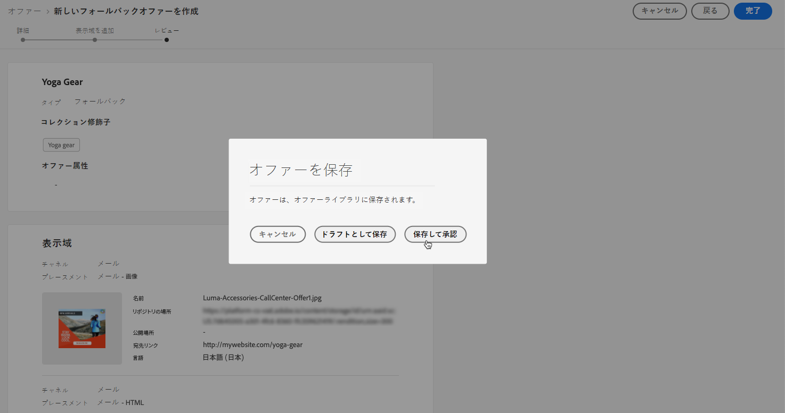
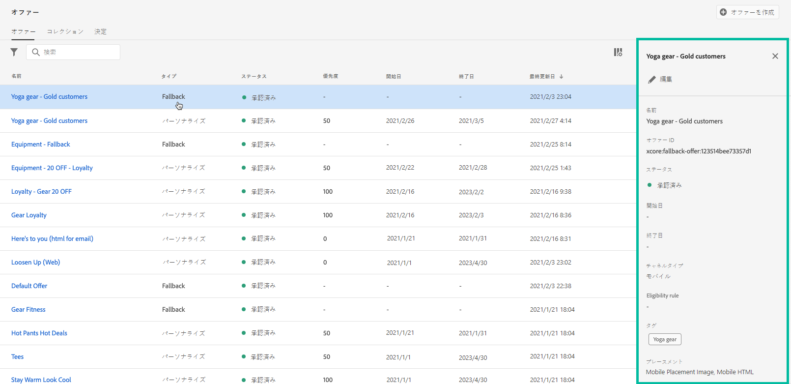

# フォールバックオファーの作成 {#create-fallback-offers}

>[!TIP]
>
>[!DNL Adobe Journey Optimizer] の新しい決定機能である決定が、コードベースのエクスペリエンスチャネルとメールチャネルを通じて使用できるようになりました。 [詳細情報](../../experience-decisioning/gs-experience-decisioning.md)

>[!CONTEXTUALHELP]
>id="ajo_decisioning_new_fallback"
>title="フォールバックオファー"
>abstract="フォールバックオファーは、エンドユーザーがパーソナライズされたオファーの対象でない場合に表示されるデフォルトのオファーです。"

>[!CONTEXTUALHELP]
>id="ajo_decisioning_fallback_offer_details "
>title="フォールバックオファーの詳細"
>abstract="フォールバックオファーの名前を指定します。 また、既存の 1 つまたは複数のコレクション修飾子を関連付けることで、オファーライブラリの検索と整理がしやすくなります。"

フォールバックオファーは、他のオファーに対する資格がない場合に顧客に送信されます。 フォールバックオファーの作成手順は、オファーを作成する際のように、1 つまたは複数の表示域を作成することで構成されます。

➡️ [ビデオでこの機能を確認する](#video)

フォールバックオファーのリストは、**[!UICONTROL オファー]**&#x200B;メニューからアクセスできます。

フォールバックオファーを作成するには、次の手順に従います。

>[!NOTE]
>
>パーソナライズされたオファーとは異なり、フォールバックオファーは、最後の手段として条件なしで顧客に提示されるので、実施要件ルールや制約パラメーターを持ちません。

1. 「**[!UICONTROL オファーの作成]**」をクリックし、「**[!UICONTROL フォールバックオファー]**」を選択します。

   

1. フォールバックオファーの名前を指定します。 また、既存の 1 つまたは複数のコレクション修飾子（旧称「タグ」）を関連付けることで、オファーライブラリの検索と整理がしやすくなります。

   

1. オファーにカスタムデータ使用ラベルまたはコアデータ使用ラベルを割り当てるには、「**[!UICONTROL アクセスを管理]**」を選択します。 [オブジェクトレベルのアクセス制御（OLAC）の詳細情報](../../administration/object-based-access.md)

1. フォールバックオファーの 1 つまたは複数の表示域を作成します。 パーソナライズされたオファーを作成する場合などに、これを行うには、左側のペインからプレースメントをドラッグ&amp;ドロップします。 [パーソナライズされたオファーの作成](../offer-library/creating-personalized-offers.md)を参照してください。

   

   >[!CAUTION]
   >
   >フォールバックオファーには、[決定](../offer-activities/create-offer-activities.md)内で使用されるすべての表示域を含める必要があります。 例えば、決定に 5 つのオファーがあり、それぞれに異なる表示域がある場合、フォールバックオファーには 5 つの表示域を含める必要があります。

1. フォールバックオファーの表示域が追加されると、概要が表示されます。 すべてが適切に設定され、フォールバックオファーが顧客に提示できる状態になったら、「**[!UICONTROL 終了]**」をクリックしたあと、「**[!UICONTROL 保存して承認]**」を選択します。

   フォールバックオファーは、ドラフトとして保存し、後で編集して承認することもできます。

   

1. フォールバックオファーは、前のステップで承認したかどうかに応じて、**[!UICONTROL ライブ]**&#x200B;または&#x200B;**[!UICONTROL ドラフト]**&#x200B;のステータスでリストに表示されます。

   これで、顧客に配信する準備が整いました。 選択してプロパティを表示し、編集できます。<!-- no suppression? -->

   

## チュートリアルビデオ {#video}

>[!VIDEO](https://video.tv.adobe.com/v/341357?captions=jpn&quality=12)

