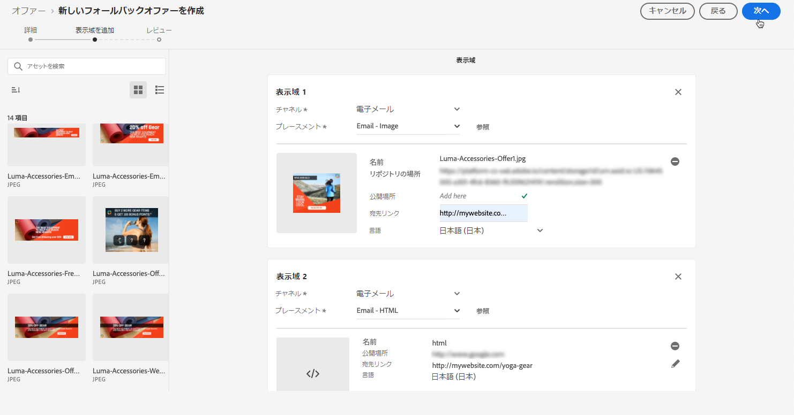

# フォールバックオファーの作成 {#creating-fallback-offers}

フォールバックオファーは、他のオファーに対する資格がない場合に顧客に送信されます。フォールバックオファーを作成する手順は、オファーを作成する場合など、1 つまたは複数の表示域を作成することで構成されます。

 [この機能をビデオで確認](#video)

フォールバックオファーのリストは、**[!UICONTROL オファー]**&#x200B;メニューからアクセスできます。

フォールバックオファーを作成するには、次の手順に従います。

>[!NOTE]
>
>パーソナライズされたオファーとは異なり、フォールバックオファーは、最後の手段として条件なしで顧客に提示されるので、実施要件ルールや制約パラメーターを持ちません。

1. 「**[!UICONTROL オファーを作成]**」をクリックし、「**[!UICONTROL フォールバックオファー]**」を選択します。

   

1. フォールバックオファーの名前を指定します。また、既存の 1 つまたは複数のタグを関連付けることで、オファーライブラリの検索と整理がしやすくなります。

   

1. フォールバックオファーの 1 つまたは複数の表示域を作成します。パーソナライズされたオファーを作成する場合などに、これをおこなうには、左側のパネルからプレースメントをドラッグ&amp;ドロップします。[パーソナライズされたオファーの作成](../offer-library/creating-personalized-offers.md)を参照してください。

   

1. フォールバックオファーの表示域が追加されると、概要が表示されます。すべてが適切に設定され、フォールバックオファーが顧客に提示できる状態になったら、「**[!UICONTROL 完了]**」をクリックしたあと、「**[!UICONTROL 保存して承認]**」を選択します。

   フォールバックオファーは、ドラフトとして保存し、後で編集して承認することもできます。

   

1. フォールバックオファーは、前のステップで承認したかどうかに応じて、**[!UICONTROL ライブ]** または&#x200B;**[!UICONTROL ドラフト]**&#x200B;のステータスでリストに表示されます。

   これで、顧客に配信する準備が整いました。選択してプロパティを表示し、編集できます。<!-- no suppression? -->

   

## チュートリアルビデオ {#video}

>[!NOTE]
>
>このビデオは、Adobe Experience Platformで構築されたOffer decisioningアプリケーションサービスに適用されます。 しかし、Journey Optimizerの状況でオファーを使用する際の一般的なガイダンスを提供しています。

>[!VIDEO](https://video.tv.adobe.com/v/329383?quality=12)
