# パーソナライズされたオファーの作成 {#creating-personalized-offers}

オファーを作成する前に、以下が作成済みであることを確認してください。

* オファーを表示する&#x200B;**プレースメント**。[プレースメントを作成](../offer-library/creating-placements.md)を参照してください。
* オファーを表示する条件を定義する&#x200B;**決定ルール**。[決定ルールを作成](../offer-library/creating-decision-rules.md)を参照してください。
* オファーに関連付ける 1 つまたは複数の&#x200B;**タグ**。[タグを作成](../offer-library/creating-tags.md)を参照してください。

➡️ [この機能をビデオで確認](#video)

パーソナライズされたオファーのリストは、**[!UICONTROL オファー]**&#x200B;メニューからアクセスできます。

## オファーの作成 {#create-offer}

**オファー**&#x200B;を作成するには、次の手順に従います。

1. 「**[!UICONTROL オファーを作成]**」をクリックし、「**[!UICONTROL パーソナライズされたオファー]**」を選択します。

   

1. オファーの名前とともに開始日時と終了日時を指定します。また、既存の 1 つまたは複数のタグをオファーに関連付けることもできます。これにより、オファーライブラリの検索と整理がしやすくなります。

   

   >[!NOTE]
   >
   >「**[!UICONTROL オファー属性]**」セクションでは、レポートや分析のためにキーと値のペアをオファーに関連付けることができます。

## オファーの表示域の設定 {#representations}

オファーは、メッセージ内の様々な場所に表示できます。画像、段落内のテキスト、HTMLブロックなどを含む上部のバナー オファーが持つ表示域が多いほど、異なるプレースメントコンテキストでオファーを使用する機会が多くなります。

1つまたは複数の表示域をオファーに追加して設定するには、次の手順に従います。

1. 1つ目の表現では、まず使用する&#x200B;**[!UICONTROL チャネル]**&#x200B;を選択します。

   

   選択したチャネルで使用可能な配置のみが&#x200B;**[!UICONTROL 配置]**&#x200B;ドロップダウンリストに表示されます。

1. リストからプレースメントを選択するか、**[!UICONTROL プレースメント]**&#x200B;ドロップダウンリストの横にあるボタンを使用して、すべてのプレースメントを参照します。

   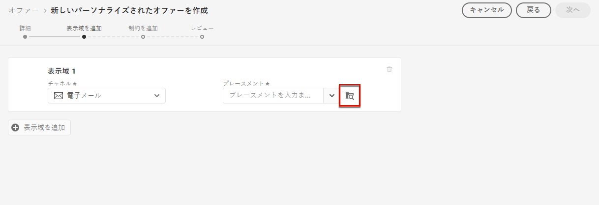

   チャネルやコンテンツタイプに従って配置をフィルタリングできます。 配置を選択し、「**[!UICONTROL 選択]**」をクリックします。

   

1. 表現にコンテンツを追加します。

   >[!NOTE]
   >
   >プレースメントのコンテンツタイプに対応するコンテンツのみが使用できます。

   * 選択した配置が画像タイプの場合、Adobe Experience Cloud Assetライブラリから取得したコンテンツを追加できます。これは、[!DNL Adobe Experience Manager Assets Essentials]から提供されるアセットの一元リポジトリです。

      >[!NOTE]
      >
      > [Adobe Experience Manager Assets Essentials](https://experienceleague.adobe.com/docs/experience-manager-assets-essentials/help/introduction.html?lang=en){target=&quot;_blank&quot;}を操作するには、組織に[!DNL Assets Essentials]をデプロイし、ユーザーが&#x200B;**Assets Essentials Consumer Users**&#x200B;または&#x200B;**Assets Essentials Users**&#x200B;製品プロファイルに含まれていることを確認する必要があります。 [このページ](https://experienceleague.adobe.com/docs/experience-manager-assets-essentials/help/deploy-administer.html?lang=ja){target=&quot;_blank&quot;}の詳細をご覧ください。

      「**[!UICONTROL アセットライブラリ]**」オプションを選択し、「**[!UICONTROL 参照]**」を選択します。

      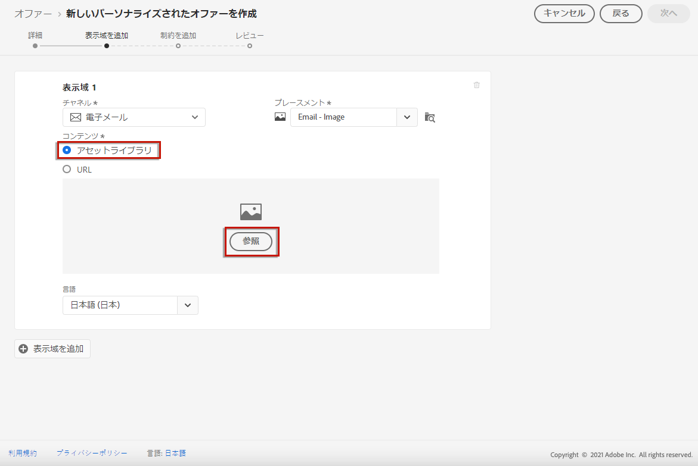

      アセットを参照して目的の画像を選択し、「**[!UICONTROL 選択]**」をクリックします。

      

   * 外部の公開場所からコンテンツを追加するには、「**[!UICONTROL URL]**」を選択し、追加するコンテンツのURLアドレスを入力します。

      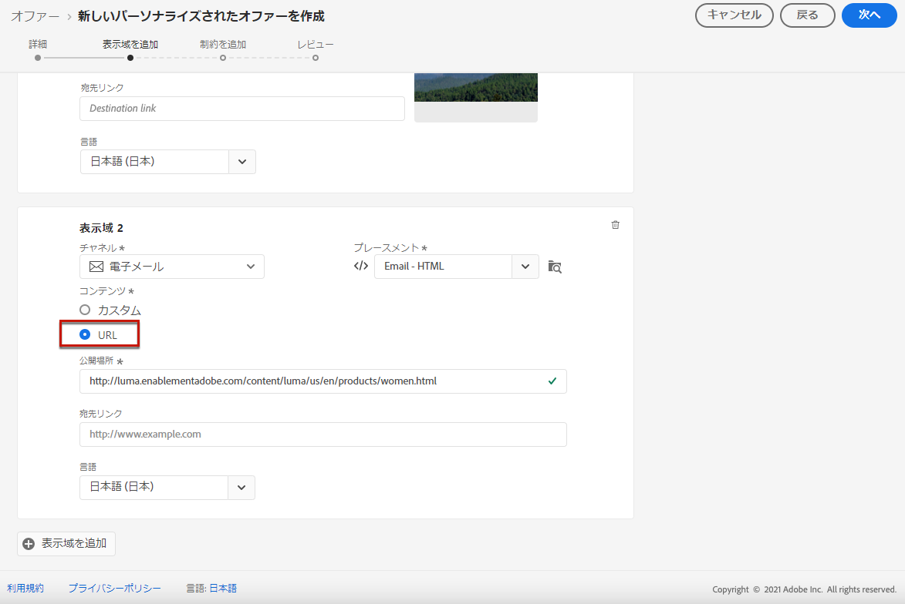

   * 互換性のある配置を選択する際に、テキストタイプのコンテンツを挿入することもできます。 「**[!UICONTROL カスタム]**」オプションを選択し、オファーに表示するテキストを入力します。

      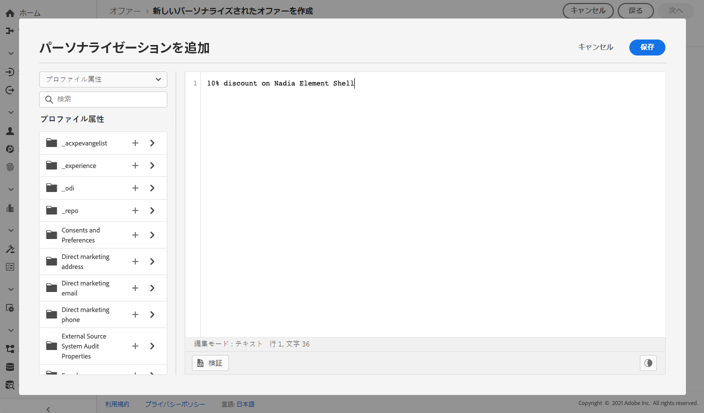

      >[!NOTE]
      >
      >このオプションは、画像タイプのプレースメントには使用できません。

1. 画像やURLなどのコンテンツを追加する際に、**[!UICONTROL 宛先リンク]**&#x200B;を指定できます。オファーをクリックしたユーザーは、対応するページに移動します。

   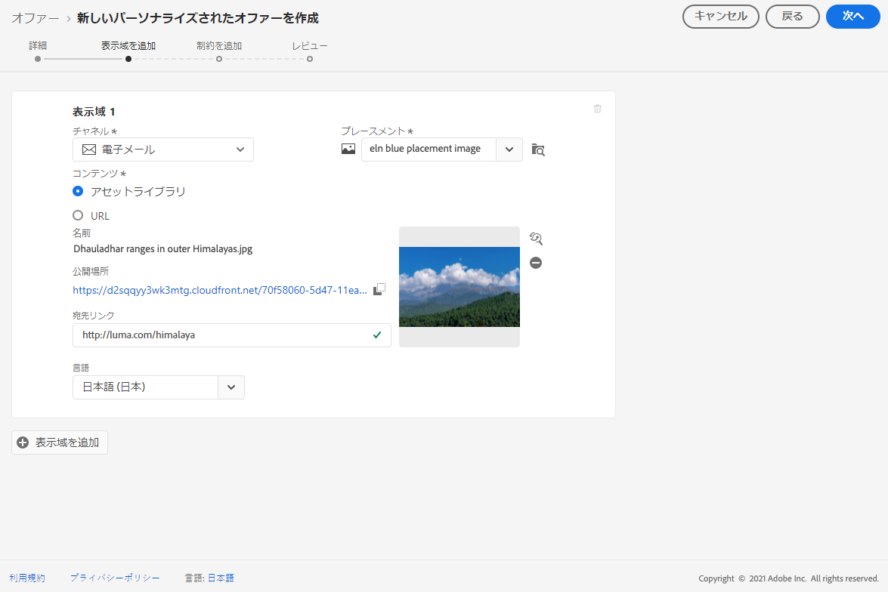

1. 最後に、選択した言語を選択して、ユーザーに表示する内容を識別および管理します。

1. 別の表現を追加するには、「**[!UICONTROL 表現を追加]**」ボタンを使用し、必要な数の表現を追加します。

   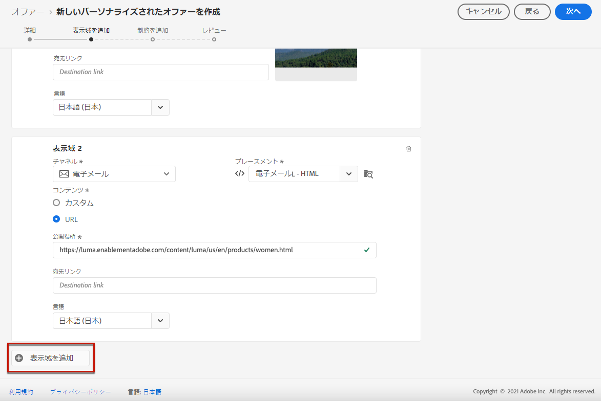

1. すべてのリプレゼンテーションを追加したら、「**[!UICONTROL 次へ]**」を選択します。

## 実施要件ルールと制約の追加 {#eligibility}

実施要件ルールと制約を使用すると、オファーを表示する条件を定義できます。

1. **[!UICONTROL オファー実施要件]**&#x200B;を設定します。デフォルトでは、「**[!UICONTROL すべての訪問者]**」決定ルールオプションが選択されています。これは、すべてのプロファイルがオファーを提示される資格があることを意味します。

   オファーの表示を、1 つまたは複数の Adobe Experience Platform セグメントのメンバーに限定できます。それには、「]**1 つまたは複数のセグメントに分類される訪問者**[!UICONTROL 」オプションを有効にしたあと、左ペインから 1 つまたは複数のセグメントを追加し、**[!UICONTROL かつ]**／**[!UICONTROL または]**&#x200B;論理演算子を使用してそれらを結合します。

   セグメントの操作方法について詳しくは、[このページ](../../segment/about-segments.md)を参照してください。

   

   特定の決定ルールをオファーに関連付ける場合は、「**[!UICONTROL 定義済みの決定ルール]**」を選択し、目的のルールを左ペインから「**[!UICONTROL 決定ルール]**」領域にドラッグします。決定ルールの作成方法について詳しくは、[この節](../offer-library/creating-decision-rules.md)を参照してください。

   

   >[!CAUTION]
   >
   >イベントベースのオファーは、現在 [!DNL Journey Optimizer] ではサポートされていません。 [イベント](https://experienceleague.adobe.com/docs/experience-platform/segmentation/ui/segment-builder.html?lang=ja#events){target=&quot;_blank&quot;}に基づいて決定ルールを作成した場合、それをオファーで活用することはできません。

1. ユーザーが複数のオファーの対象となる場合は、他のオファーと比較したオファーの「**[!UICONTROL 優先度]**」を定義します。オファーの優先度が高いほど、他のオファーと比較して優先順位が高くなります。

1. オファーの「**[!UICONTROL キャッピング]**」を指定します。これは、すべてのユーザーに対するオファーの提示回数の合計を意味します。すべてのユーザーに、このフィールドで指定した回数だけオファーが配信された場合、その配信は停止します。

   >[!NOTE]
   >
   >E メールの準備時に、オファーが提案された回数が計算されます。例えば、複数のオファーを含んだメールを準備する場合、そのメールが送信されるかどうかに関係なく、それらのオファーの数はオファーの提示回数に加算されます。
   >
   >E メール配信を削除した場合、または送信前に再度準備した場合、オファーのキャッピング値は自動的に更新されます。

   

   上の例では、次のようになります。

   * オファーの優先度は「50」に設定されています。つまり、このオファーは優先度が 1～49 のオファーより先に、優先度が 51 以上のオファーより後に表示されます。
   * このオファーは、「ゴールドロイヤルティ顧客」決定ルールに一致するユーザーに対してのみ考慮されます。
   * オファーは、1 人のユーザーにつき 1 回だけ表示されます。

## オファーのレビュー {#review}

実施要件ルールと制約を定義したら、オファープロパティの概要が表示されます。

1. すべてが正しく設定されていることを確認します。

1. オファーをユーザーに提示する準備ができたら、「**[!UICONTROL 完了]**」をクリックします。

1. 「**[!UICONTROL 保存して承認]**」を選択します。

   

   オファーは、ドラフトとして保存し、後で編集して承認することもできます。

オファーは、前のステップで承認したかどうかに応じて、**[!UICONTROL 承認済み]**&#x200B;または&#x200B;**[!UICONTROL ドラフト]**&#x200B;のステータスでリストに表示されます。

これで、ユーザーに配信する準備ができました。

## オファーリスト {#offer-list}

オファーリストからオファーを選択して、そのプロパティを表示できます。 また、編集やステータス（**ドラフト**、**承認済み**、**アーカイブ済み**）の変更、オファーの複製、削除もできます。

「**[!UICONTROL 編集]**」ボタンを選択してオファー編集モードに戻ります。このモードでは、オファーの[詳細](#create-offer)や[表示域](#representations)を変更したり、[実施要件ルールと制約](#eligibility)を編集したりできます。

承認済みオファーを選択し、「**[!UICONTROL 承認を取り消し]**」をクリックすると、オファーのステータスが&#x200B;**[!UICONTROL ドラフト]**&#x200B;に戻ります。

ステータスを再度&#x200B;**[!UICONTROL 承認済み]**&#x200B;に設定するには、表示されている該当ボタンを選択します。

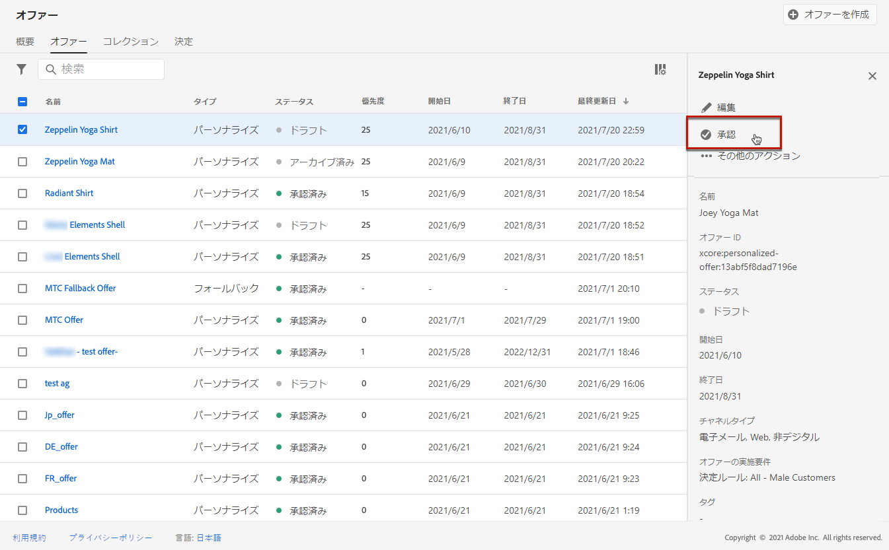

「**[!UICONTROL その他のアクション]**」ボタンをクリックすると、以下に示すアクションが有効になります。

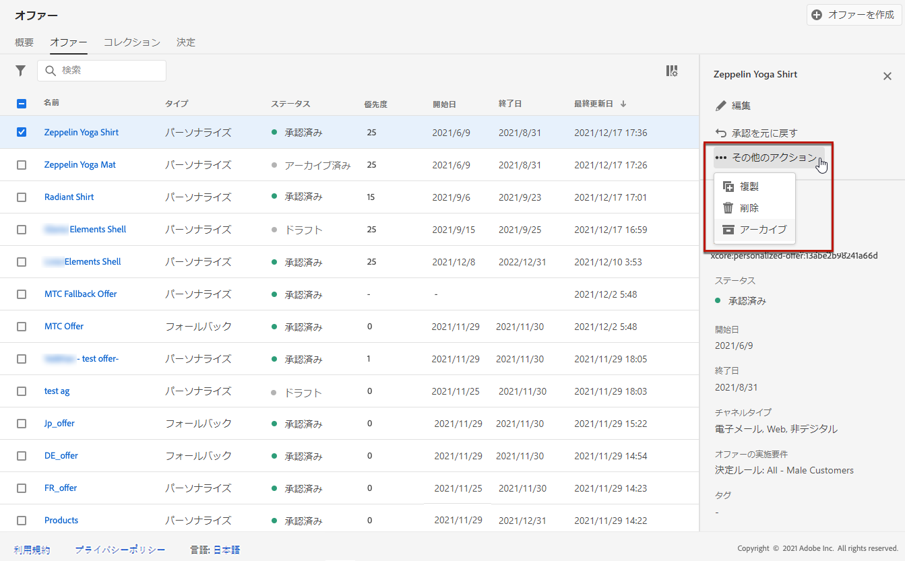

* **[!UICONTROL 複製]**：同じプロパティ、表示域、実施要件ルールおよび制約を持つオファーを作成します。デフォルトでは、新しいオファーのステータスは&#x200B;**[!UICONTROL ドラフト]**&#x200B;になります。
* **[!UICONTROL 削除]**：リストからオファーを削除します。

   >[!CAUTION]
   >
   >オファーとそのコンテンツにアクセスできなくなります。 このアクションは取り消しできません。
   >
   >オファーがコレクションまたは決定で使用されている場合、そのオファーは削除できません。最初に、オファーをオブジェクトから削除する必要があります。

* **[!UICONTROL アーカイブ]**：オファーステータスを&#x200B;**[!UICONTROL アーカイブ済み]**&#x200B;に設定します。オファーは引き続きリストから使用できますが、ステータスを&#x200B;**[!UICONTROL ドラフト]**&#x200B;または&#x200B;**[!UICONTROL 承認済み]**&#x200B;に戻すことはできません。複製または削除のみ可能です。

該当するチェックボックスを選択して、複数のオファーのステータスを同時に削除または変更することもできます。

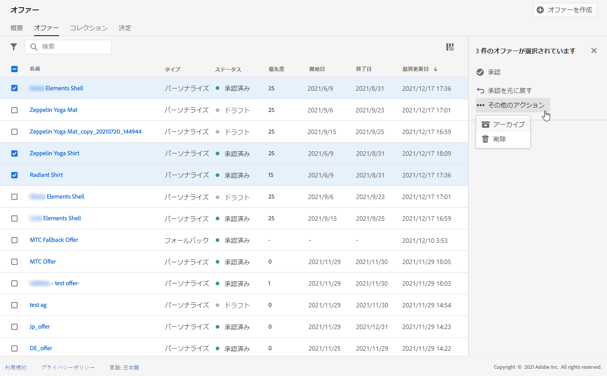

ステータスが異なる複数のオファーのステータスを変更する場合は、関係のあるステータスのみ変更されます。

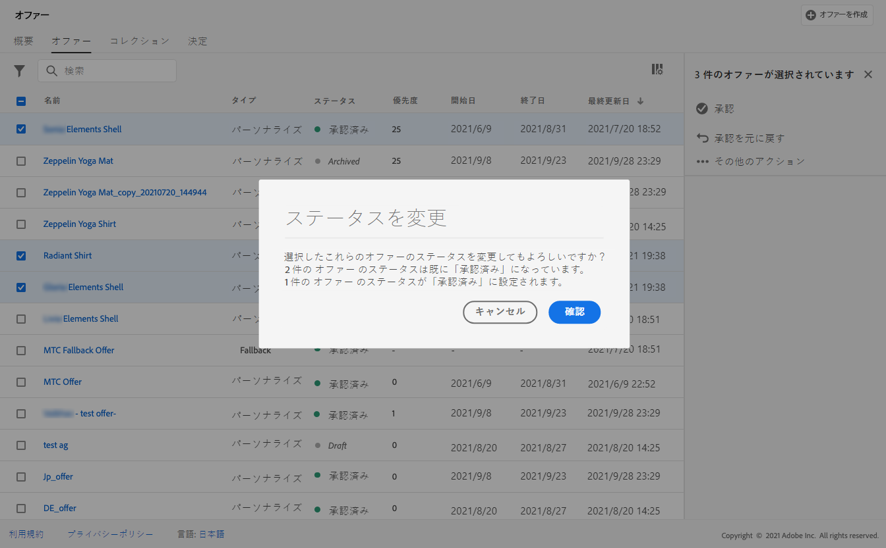

オファーを作成したら、リストからその名前をクリックできます。

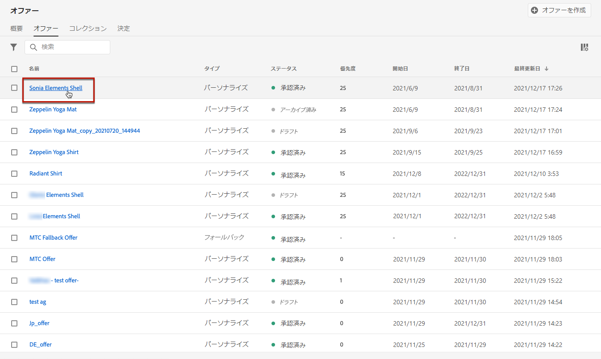

これにより、そのオファーの詳細情報にアクセスできます。「**[!UICONTROL ログを変更]**」タブを選択して、オファーに加えられた[すべての変更を監視](../get-started/user-interface.md#monitoring-changes)します。

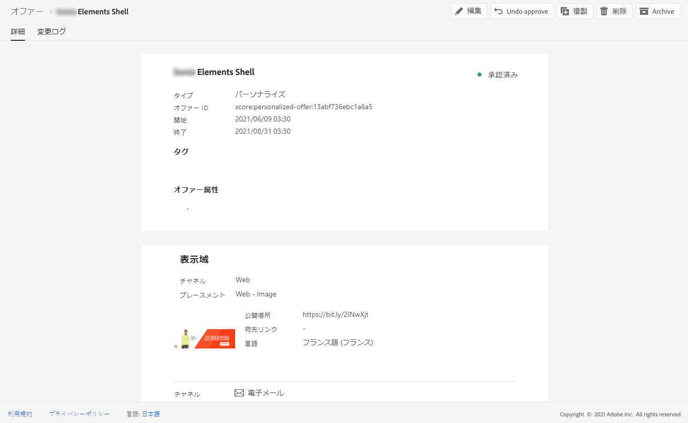

## チュートリアルビデオ {#video}

>[!NOTE]
>
>このビデオは、Adobe Experience Platformで構築された Offer Decisioning アプリケーションサービスに当てはまります。ただし、Journey Optimizer のコンテキストでオファーを使用する際の一般的なガイダンスを提供しています。

>[!VIDEO](https://video.tv.adobe.com/v/329375?quality=12)
