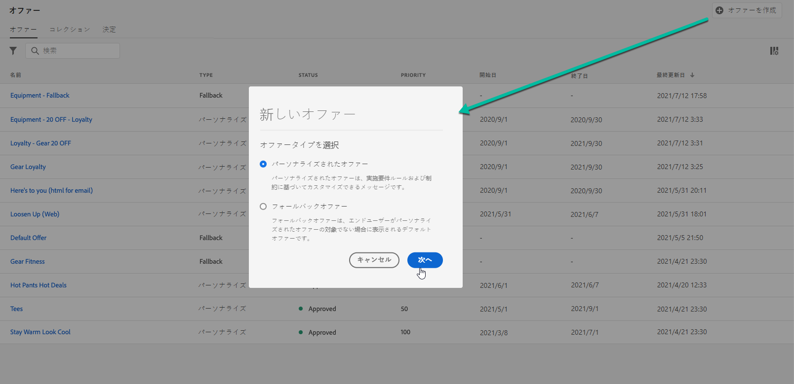
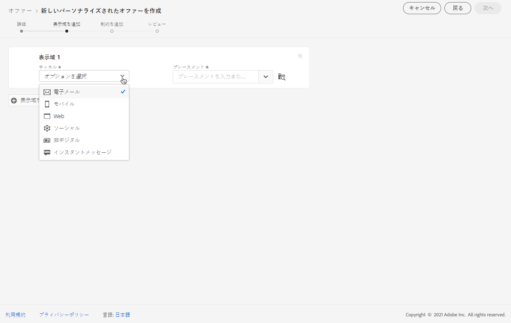
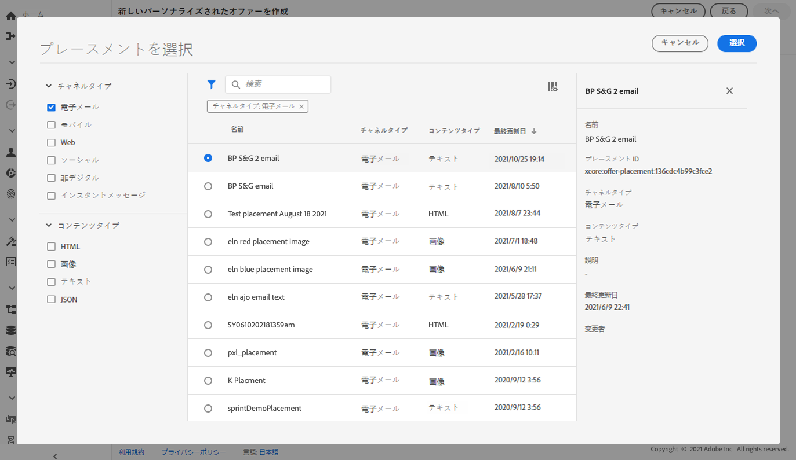
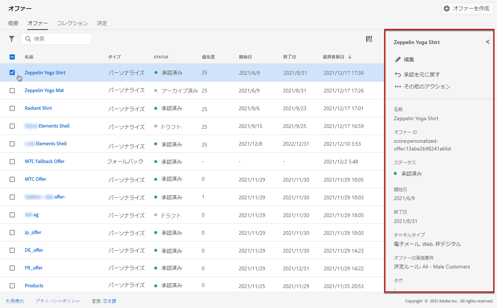

# パーソナライズされたオファーの作成 {#creating-personalized-offers}

オファーを作成する前に、以下が作成済みであることを確認してください。

* オファーを表示する&#x200B;**プレースメント**。[プレースメントを作成](../offer-library/creating-placements.md)を参照してください。
* オファーを表示する条件を定義する&#x200B;**決定ルール**。[決定ルールを作成](../offer-library/creating-decision-rules.md)を参照してください。
* オファーに関連付ける 1 つまたは複数の&#x200B;**タグ**。[タグを作成](../offer-library/creating-tags.md)を参照してください。

 [この機能をビデオで確認](#video)

パーソナライズされたオファーのリストは、**[!UICONTROL オファー]**&#x200B;メニューからアクセスできます。

## オファーの作成 {#create-offer}

**オファー**&#x200B;を作成するには、次の手順に従います。

1. 「**[!UICONTROL オファーを作成]**」をクリックし、「**[!UICONTROL パーソナライズされたオファー]**」を選択します。

   

1. オファーの名前とともに開始日時と終了日時を指定します。また、既存の 1 つまたは複数のタグをオファーに関連付けることもできます。これにより、オファーライブラリの検索と整理がしやすくなります。

   

   >[!NOTE]
   >
   >「**[!UICONTROL オファー属性]**」セクションでは、レポートと分析のためにキーと値のペアをオファーに関連付けることができます。

## オファーの表示域の設定 {#representations}

1. 「**[!UICONTROL 表示域を追加]**」ボタンを使用して、オファーに 1 つまたは複数の表示域を追加します。

   >[!NOTE]
   >
   >オファーは、メッセージの様々な場所に表示できます（画像付きトップバナー、段落内のテキスト、html ブロックなど）。オファーが持つ表示域が多いほど、異なるプレースメントコンテキストでオファーを使用する機会が多くなります。

1. 表示域ごとに、オファーを表示する 「**[!UICONTROL チャネル]**」と「**[!UICONTROL プレースメント]**」を指定します。

   

   「**[!UICONTROL 参照]**」ボタンを使用すると、使用可能なプレースメントをチャネルやコンテンツタイプに従ってフィルターできます。

   

1. Adobe Experience Cloud アセットライブラリや外部の公共の場所から得られるコンテンツを各表示域に追加します。

   * Adobe Experience Cloud アセットライブラリからコンテンツを追加するには、左ペインから表示域にコンテンツをドラッグ＆ドロップし、コンテンツに関連付ける URL を「**[!UICONTROL 宛先リンク]**」フィールドで指定します。

      >[!NOTE]
      >
      >コンテンツは、左側のパネルのアセットピッカーからのみドラッグ＆ドロップできます。プレースメントのコンテンツタイプに対応するコンテンツのみが使用できます。

      

   * 外部の公共の場所からコンテンツを追加するには、「**[!UICONTROL コンテンツを追加]**」ボタンをクリックし、追加するコンテンツの名前、URL、および宛先リンクを指定します。

      追加するコンテンツが、選択したプレースメントのコンテンツタイプに対応していることを確認します。

      

   * また、テキストタイプのコンテンツを挿入することもできます。それには、「**[!UICONTROL コンテンツを追加]**」ボタンをクリックし、「**[!UICONTROL カスタムテキスト]**」オプションを選択します。「**[!UICONTROL テキスト]**」フィールドに、オファーに表示するテキストを入力します。

      >[!NOTE]
      >
      >このオプションは、画像タイプのプレースメントには使用できません。

      

## 実施要件ルールと制約の追加 {#eligibility}

実施要件ルールと制約を使用すると、オファーを表示する条件を定義できます。

1. **[!UICONTROL オファー実施要件]**&#x200B;を設定します。デフォルトでは、「**[!UICONTROL すべての訪問者]**」決定ルールオプションが選択されています。これは、すべてのプロファイルがオファーを提示される資格があることを意味します。

   オファーの表示を、1 つまたは複数の Adobe Experience Platform セグメントのメンバーに限定できます。それには、「]**1 つまたは複数のセグメントに分類される訪問者**[!UICONTROL 」オプションを有効にしたあと、左ペインから 1 つまたは複数のセグメントを追加し、**[!UICONTROL かつ]**／**[!UICONTROL または]**&#x200B;論理演算子を使用してそれらを結合します。

   セグメントの評価方法について詳しくは、[Segmentation Service　ドキュメント](https://experienceleague.adobe.com/docs/experience-platform/segmentation/home.html?lang=ja)を参照してください。

   

   特定の決定ルールをオファーに関連付ける場合は、「**[!UICONTROL 定義済みの決定ルール]**」を選択し、目的のルールを左ペインから「**[!UICONTROL 決定ルール]**」領域にドラッグします。決定ルールの作成方法について詳しくは、[この節](../offer-library/creating-decision-rules.md)を参照してください。

   

1. ユーザーが複数のオファーの対象となる場合は、他のオファーと比較したオファーの「**[!UICONTROL 優先度]**」を定義します。オファーの優先度が高いほど、他のオファーと比較して優先順位が高くなります。

1. オファーの「**[!UICONTROL キャッピング]**」を指定します。これは、すべてのユーザーに対するオファーの提示回数の合計を意味します。すべてのユーザーに、このフィールドで指定した回数だけオファーが配信された場合、その配信は停止します。

   >[!NOTE]
   >
   >E メールの準備時に、オファーが提案された回数が計算されます。例えば、複数のオファーを含んだメールを準備する場合、そのメールが送信されるかどうかに関係なく、それらのオファーの数はオファーの提示回数に加算されます。
   >
   >E メール配信を削除した場合、または送信前に再度準備した場合、オファーのキャッピング値は自動的に更新されます。

   

   上の例では、次のようになります。

   * オファーの優先度は「50」に設定されています。つまり、このオファーは優先度が 1～49 のオファーより先に、優先度が 51 以上のオファーより後に表示されます。
   * このオファーは、「ゴールドロイヤルティ顧客」決定ルールに一致するユーザーに対してのみ考慮されます。
   * オファーは、1 人のユーザーにつき 1 回だけ表示されます。

## オファーのレビュー {#review}

実施要件ルールと制約を定義すると、オファープロパティの概要が表示されます。すべてが適切に設定され、オファーをユーザーに提示する準備が整ったら、「**[!UICONTROL 終了]**」をクリックしたあと「**[!UICONTROL 保存して承認]**」をクリックします。

オファーは、ドラフトとして保存し、後で編集して承認することもできます。

オファーは、前のステップで承認したかどうかに応じて、**[!UICONTROL ライブ]**&#x200B;または&#x200B;**[!UICONTROL ドラフト]**&#x200B;のステータスでリストに表示されます。

これで、ユーザーに配信する用意ができました。選択してプロパティを表示し、編集または抑制できます。

オファーが作成されたら、リスト内の名前をクリックして詳細情報にアクセスできます。また、オファーに加えられたすべての変更を「**[!UICONTROL 変更ログ]**」タブで監視することもできます（[オファーおよび決定に対する変更の監視](../get-started/user-interface.md#monitoring-changes)を参照）。

## チュートリアルビデオ {#video}

>[!NOTE]
>
>このビデオは、Adobe Experience Platformで構築された Offer Decisioning アプリケーションサービスに当てはまります。ただし、Journey Optimizer のコンテキストでオファーを使用する際の一般的なガイダンスを提供しています。

>[!VIDEO](https://video.tv.adobe.com/v/329375?quality=12)
