# パーソナライズされたオファーの作成 {#create-personalized-offers}

オファーを作成する前に、以下が作成済みであることを確認してください。

* オファーを表示する&#x200B;**プレースメント**。[プレースメントを作成](../offer-library/creating-placements.md)を参照してください。
* 実施要件を追加する場合は、オファーの提示条件を定義する&#x200B;**決定ルール**。[決定ルールの作成](../offer-library/creating-decision-rules.md)を参照してください。
* オファーに関連付ける 1 つまたは複数の&#x200B;**コレクション修飾子**（旧称「タグ」）。 詳しくは、[コレクション修飾子の作成](../offer-library/creating-tags.md)を参照してください。

➡️ [この機能について詳しくは、ビデオを参照してください](#video)

パーソナライズされたオファーのリストは、**[!UICONTROL オファー]**&#x200B;メニューからアクセスできます。

## オファーの作成 {#create-offer}

>[!CONTEXTUALHELP]
>id="ajo_decisioning_offer_details"
>title="オファーの詳細"
>abstract="オファーの名前、開始日および終了日を入力します。これらの日付以外では、オファーは決定エンジンによって選択されません。"

>[!CONTEXTUALHELP]
>id="od_offer_attributes"
>title="オファー属性について"
>abstract="オファー属性を使用すると、レポートおよび分析を目的としてキーと値のペアをオファーに関連付けることができます。"

>[!CONTEXTUALHELP]
>id="ajo_decisioning_offer_attributes"
>title="オファー属性"
>abstract="オファー属性を使用すると、レポートおよび分析を目的としてキーと値のペアをオファーに関連付けることができます。"

>[!CONTEXTUALHELP]
>id="ajo_decisioning_new_personalized"
>title="パーソナライズされたオファー"
>abstract="パーソナライズされたオファーは、実施要件ルールおよび制約に基づいてカスタマイズできるメッセージです。"

>[!CONTEXTUALHELP]
>id="ajo_decisioning_new_fallback"
>title="フォールバックオファー"
>abstract="フォールバックオファーは、エンドユーザーがパーソナライズされたオファーの対象でない場合に表示されるデフォルトのオファーです。"

**オファー**&#x200B;を作成するには、次の手順に従います。

1. 「**[!UICONTROL オファーを作成]**」をクリックし、「**[!UICONTROL パーソナライズされたオファー]**」を選択します。

   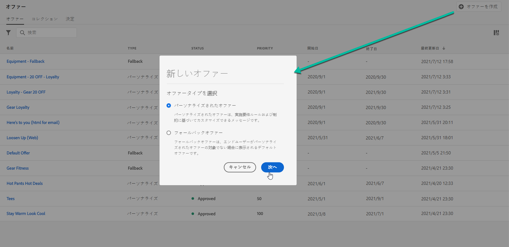

1. オファーの名前とともに開始日時と終了日時を指定します。これらの日付以外では、オファーは決定エンジンによって選択されません。

   >[!NOTE]
   >
   >時間を選択する場合、現在のタイムゾーンが考慮されます。

   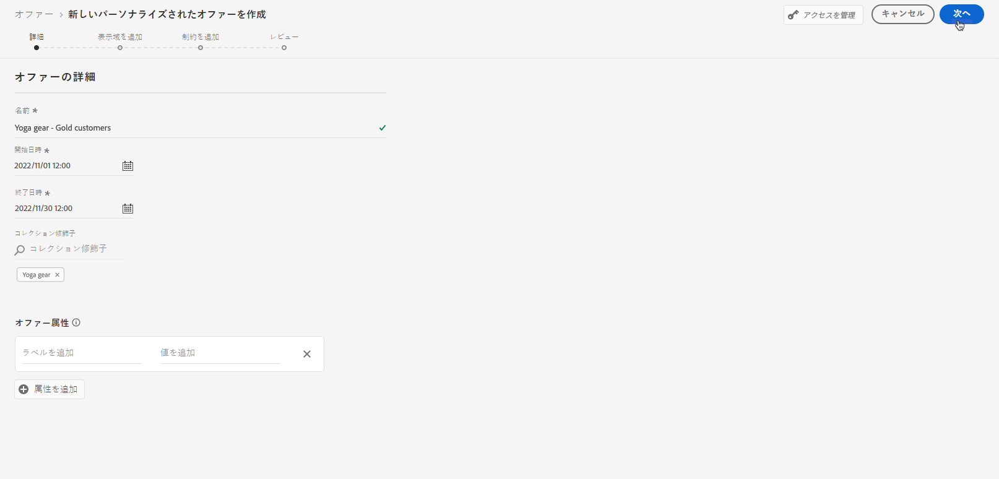

   >[!CAUTION]
   >
   >開始日／終了日を更新すると、キャップに影響を与える可能性があります。[詳細情報](add-constraints.md#capping-change-date)

1. また、1 つまたは複数の既存の&#x200B;**[!UICONTROL コレクション修飾子]**&#x200B;をオファーに関連付けることもできます。これにより、オファーライブラリの検索と整理がしやすくなります。[詳細情報](creating-tags.md)。

1. 「**[!UICONTROL オファー属性]**」セクションでは、レポートや分析のためにキーと値のペアをオファーに関連付けることができます。

1. オファーにカスタムデータ使用ラベルまたはコアデータ使用ラベルを割り当てるには、「**[!UICONTROL アクセスを管理]**」を選択します。[オブジェクトレベルのアクセス制御（OLAC）の詳細情報](../../administration/object-based-access.md)

   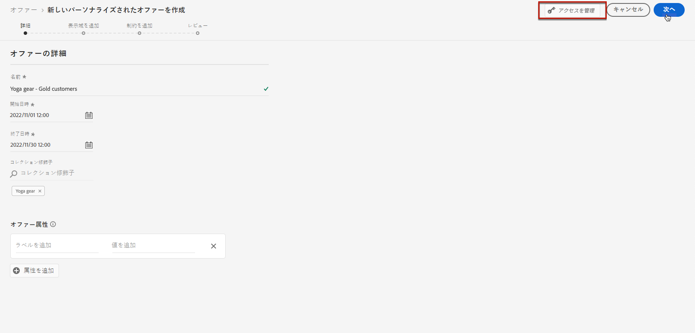

1. 表示域を追加して、メッセージでオファーを表示する場所を定義します。[詳細情報](add-representations.md)

   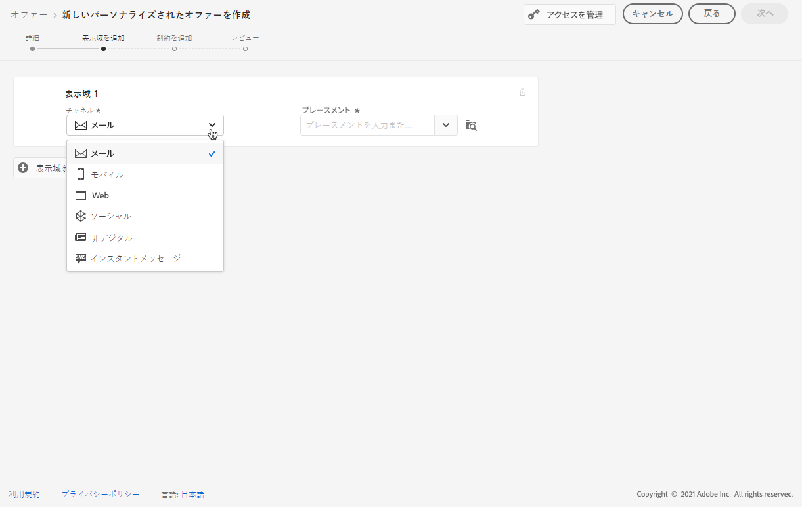

   >[!CAUTION]
   >
   >すべての表示域を含むオファーのサイズは 300 KB を超えることはできません。

1. 制約を追加して、表示するオファーの条件を設定します。[詳細情報](add-constraints.md)

   >[!NOTE]
   >
   >オーディエンスまたは決定ルールを選択すると、推定される認定プロファイルに関する情報が表示されます。「**[!UICONTROL 更新]**」をクリックして、データを更新します。
   >
   >プロファイルの予測は、ルールパラメーターにコンテキストデータなど、プロファイルに含まれないデータが含まれる場合は使用できません。 例えば、現在の気温が 80 ℃以上であることを条件とする実施要件ルールがあります。

   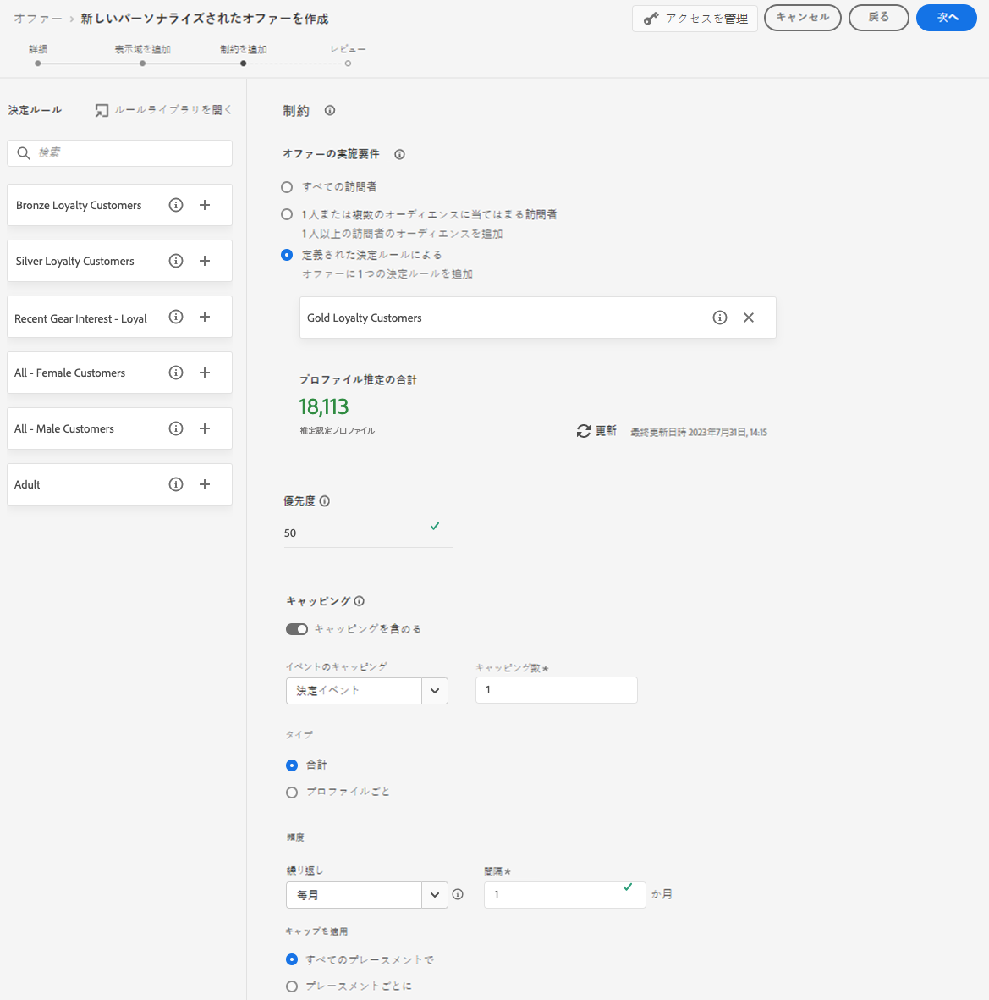

1. オファーをレビューおよび保存します。[詳細情報](#review)

## オファーのレビュー {#review}

実施要件ルールと制約を定義したら、オファープロパティの概要が表示されます。

1. すべてが正しく設定されていることを確認します。

1. 推定認定プロファイルに関する情報を表示できます。 「**[!UICONTROL 更新]**」をクリックして、データを更新します。

   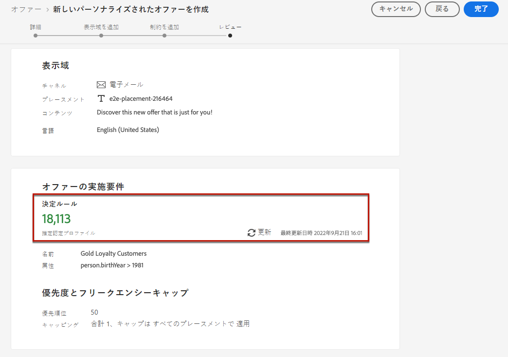

1. オファーをユーザーに提示する準備ができたら、「**[!UICONTROL 完了]**」をクリックします。

1. 「**[!UICONTROL 保存して承認]**」を選択します。

   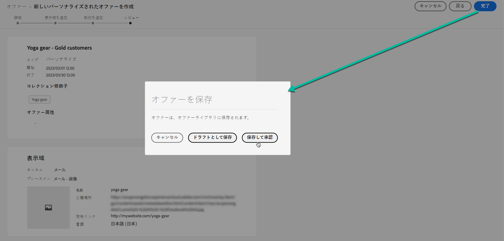

   オファーは、ドラフトとして保存し、後で編集して承認することもできます。

オファーは、前のステップで承認したかどうかに応じて、**[!UICONTROL 承認済み]**&#x200B;または&#x200B;**[!UICONTROL ドラフト]**&#x200B;のステータスでリストに表示されます。

これで、ユーザーに配信する準備ができました。

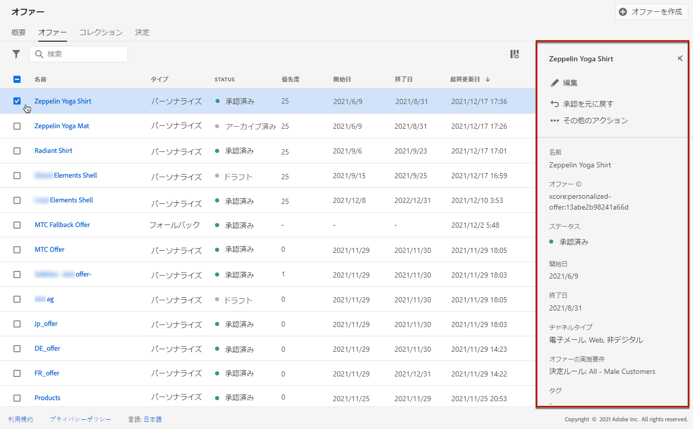

## オファーの管理 {#offer-list}

オファーリストからオファーを選択して、そのプロパティを表示できます。また、編集やステータス（**ドラフト**、**承認済み**、**アーカイブ済み**）の変更、オファーの複製、削除もできます。

「**[!UICONTROL 編集]**」ボタンを選択してオファー編集モードに戻ります。このモードでは、オファーの[詳細](#create-offer)や[表示域](add-representations.md#representations)を変更したり、[実施要件ルールと制約](add-constraints.md#eligibility)を編集したりできます。

承認済みオファーを選択し、「**[!UICONTROL 承認を取り消し]**」をクリックすると、オファーのステータスが&#x200B;**[!UICONTROL ドラフト]**&#x200B;に戻ります。

ステータスを再度&#x200B;**[!UICONTROL 承認済み]**&#x200B;に設定するには、表示されている該当ボタンを選択します。

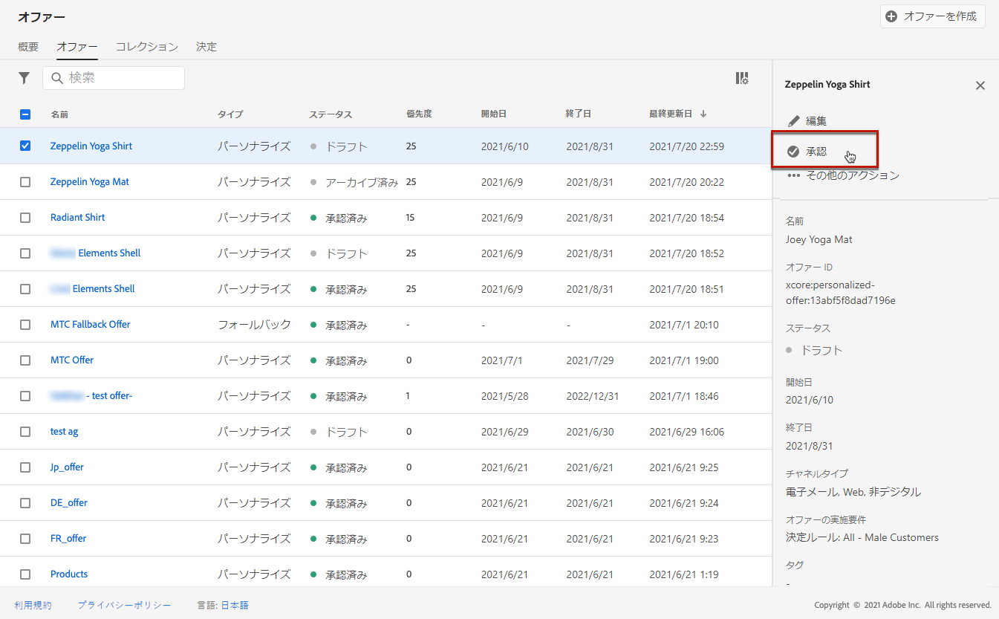

「**[!UICONTROL その他のアクション]**」ボタンをクリックすると、以下に示すアクションが有効になります。

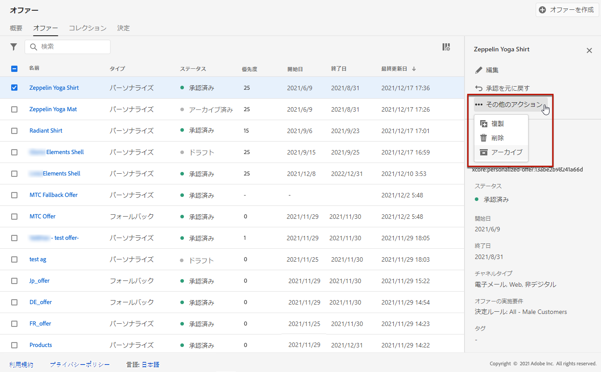

* **[!UICONTROL 複製]**：同じプロパティ、表示域、実施要件ルールおよび制約を持つオファーを作成します。デフォルトでは、新しいオファーのステータスは&#x200B;**[!UICONTROL ドラフト]**&#x200B;になります。
* **[!UICONTROL 削除]**：リストからオファーを削除します。

  >[!CAUTION]
  >
  >オファーとそのコンテンツにアクセスできなくなります。このアクションは取り消しできません。
  >
  >オファーがコレクションまたは決定で使用されている場合、そのオファーは削除できません。最初に、オファーをオブジェクトから削除する必要があります。

* **[!UICONTROL アーカイブ]**：オファーステータスを&#x200B;**[!UICONTROL アーカイブ済み]**&#x200B;に設定します。オファーは引き続きリストから使用できますが、ステータスを&#x200B;**[!UICONTROL ドラフト]**&#x200B;または&#x200B;**[!UICONTROL 承認済み]**&#x200B;に戻すことはできません。複製または削除のみ可能です。

該当するチェックボックスを選択して、複数のオファーのステータスを同時に削除または変更することもできます。

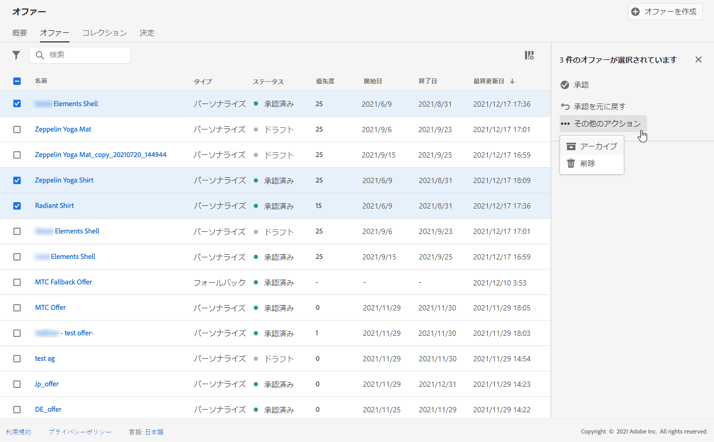

ステータスが異なる複数のオファーのステータスを変更する場合は、関係のあるステータスのみ変更されます。

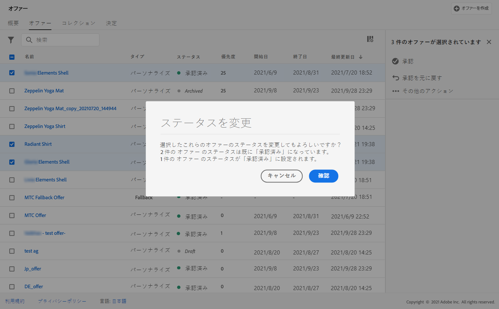

オファーを作成したら、リストからその名前をクリックできます。

これにより、そのオファーの詳細情報にアクセスできます。「**[!UICONTROL ログを変更]**」タブを選択して、オファーに加えられた[すべての変更を監視](../get-started/user-interface.md#changes-logs)します。

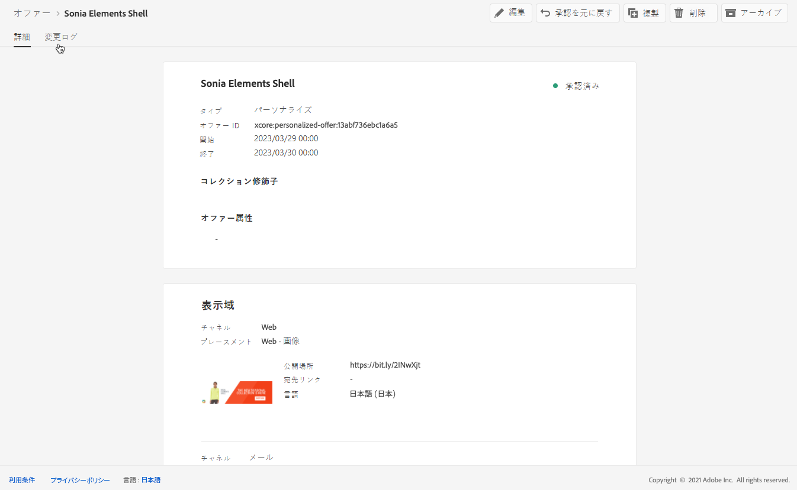

## チュートリアルビデオ {#video}

>[!VIDEO](https://video.tv.adobe.com/v/341356?captions=jpn&quality=12)
