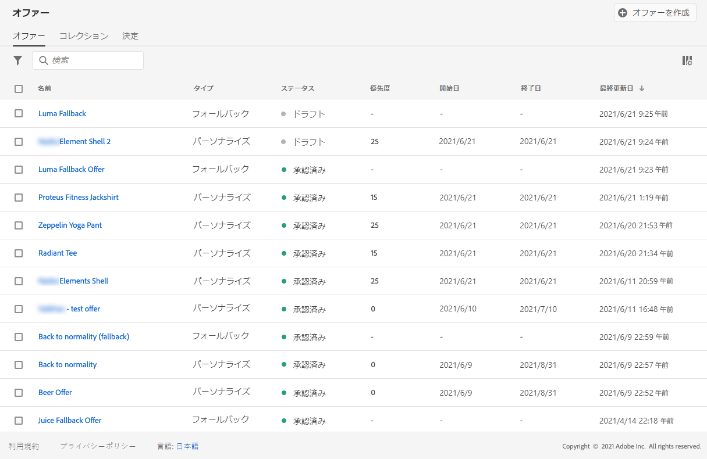
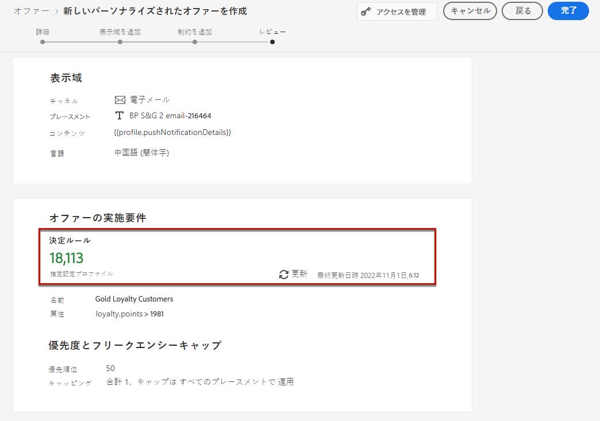

# パーソナライズされた特典の作成 {#create-personalized-offers}

オファーを作成する前に、次のものが作成されていることを確認してください。

* オファーが表示される場所 **を** 指定します。配置の作成を参照してください [ 。](../offer-library/creating-placements.md)
* 適格性条件 **を追加する場合は、オファーが表示される際の条件を定義する意思決定規則** です。 「意思決定ルール ](../offer-library/creating-decision-rules.md) の作成」を参照してください [ 。
* オファーに関連付ける必要がある1つまたは複数 **のタグ**&#x200B;タグ ](../offer-library/creating-tags.md) の作成を参照してください [ 。

➡️ [ ビデオでのこの機能の検出](#video)

メニューで **[!UICONTROL Offers]** は、パーソナライズされたキャンペーンのリストにアクセスできます。

## オファーの作成 {#create-offer}

>[!CONTEXTUALHELP]
>id="od_offer_attributes"
>title="オファー属性について"
>abstract="オファー属性を使用して、キー値ペアと、レポート作成および分析用のサービスを関連付けることができます。"

>[!CONTEXTUALHELP]
>id="ajo_decisioning_offer_attributes"
>title="オファー属性"
>abstract="オファー属性を使用して、キー値ペアと、レポート作成および分析用のサービスを関連付けることができます。"

オファー **を作成** するには、次の手順に従います。

1. をクリック **[!UICONTROL Create offer]** してから、「」を選択 **[!UICONTROL Personalized offer]** します。

   

1. オファーの名前と共に、その開始日と終了日時を指定します。 この日付以外にも、オファーが Decisioning エンジンによって選択されることはありません。

   

   >[!CAUTION]
   >
   >開始日と終了日を更新すると、上限に影響する可能性があります。 [詳細情報](add-constraints.md#capping-change-date)

1. また、既 **[!UICONTROL tags]** に1つまたは複数のサービスを提供することにより、オファーライブラリをより簡単に検索および整理できるようになりました。 [詳しく ](creating-tags.md) は、こちらを参照してください。

1. このセクションでは、 **[!UICONTROL Offer attributes]** キーと値のペアを、レポート作成および分析用のサービスと関連付けることができます。

1. カスタムまたはコアデータ使用状況ラベルをオファーに割り当てるには、を選択 **[!UICONTROL Manage access]** します。 [オブジェクトレベルのアクセス制御について詳しくは、OLAC の説明を参照してください。](../../administration/object-based-access.md)

   

1. メッセージを表示する場所を定義するには、表現を追加します。 [詳細情報](add-representations.md)

   

1. 「制約を追加」を使用して、表示されるオファーの条件を設定します。 [詳細情報](add-constraints.md)

   >[!NOTE]
   >
   >セグメントまたは意志決定ルールを選択すると、見積もりが適用されているプロファイルに関する情報が表示されます。 データを更新するには、をクリック **[!UICONTROL Refresh]** します。
   >
   >ルールパラメーターには、プロファイルにないデータ (コンテキストデータなど) が含まれている場合は、プロファイル見積が使用できないことに注意してください。 例えば、現在の気象に80度の≥が必要な適格性ルールを指定します。

   

1. オファーを確認して保存します。 [詳細情報](#review)

## オファーの確認 {#review}

適格性ルールと制約を定義すると、オファープロパティの一覧が表示されます。

1. すべてが正しく設定されていることを確認してください。

1. 推定可能プロファイルに関する情報を表示することができます。 データを更新するには、をクリック **[!UICONTROL Refresh]** します。

   

1. ユーザーに提示する準備ができたら、をクリック **[!UICONTROL Finish]** します。

1. を選択 **[!UICONTROL Save and approve]** します。

   

   このオファーは、後で編集および承認するために、下書きとして保存することもできます。

このオファーは、前の手順で承認したかどうかによって、一覧 **[!UICONTROL Approved]** には、または **[!UICONTROL Draft]** 状態によって表示されます。

これで、ユーザーに配布できるようになりました。

## 「オファーの管理」 {#offer-list}

オファーリストで、そのプロパティを表示するサービスを選択できます。 また、編集、状態の変更 ( **下書き** 、 **承認** 、 **アーカイブ** )、オファーの複製、または削除を行うこともできます。

**[!UICONTROL Edit]**&#x200B;ボタンを選択すると、オファーエディションに戻ることができます。このモードでは、オファーの [ 詳細 ](#create-offer) 、 [ 表現 ](#representations) 、および適格性ルールと制約 ](#eligibility) を編集 [ することができます。

許可されたオファーリングを選択し、クリック **[!UICONTROL Undo approve]** して、申し出の状態を **[!UICONTROL Draft]** 「戻る」に設定します。

状態を **[!UICONTROL Approved]** もう一度設定するには、表示される対応するボタンを選択します。

このボタンを **[!UICONTROL More actions]** 使用すると、以下に説明する操作を実行できます。

* **[!UICONTROL Duplicate]**&#x200B;次の例では、同じプロパティ、表現、適格性ルールおよび制約を含むオファーが作成されます。 デフォルトでは、新しいオファー **[!UICONTROL Draft]** は状態になります。
* **[!UICONTROL Delete]**: リストからオファーが削除されます。

   >[!CAUTION]
   >
   >このオファーとそのコンテンツには、アクセスできなくなります。 このアクションを取り消すことはできません。
   >
   >オファーがコレクションまたは決定に使用されている場合は、削除できません。 最初に、すべてのオブジェクトからオファーを削除する必要があります。

* **[!UICONTROL Archive]**: オファーの状態をに **[!UICONTROL Archived]** 設定します。 このオファーはリストに表示されますが、その状態をまたは **[!UICONTROL Approved]** に **[!UICONTROL Draft]** 戻すことはできません。複製または削除することはできます。

また、チェックボックスをオンにすると、複数のサービスの状態を一度に削除または変更することもできます。

様々な状態 whith 複数のサービスの状態を変更する場合は、関連する状態のみが変更されます。

オファーを作成したら、リストからその名前をクリックします。

これにより、そのオファーに関する詳細情報にアクセスできます。 **[!UICONTROL Change log]**&#x200B;タブを選択して、オファーに加えられたすべての変更 ](../get-started/user-interface.md#monitoring-changes) を監視する [ ことができます。

## チュートリアルビデオ {#video}

>[!VIDEO](https://video.tv.adobe.com/v/329375?quality=12)
