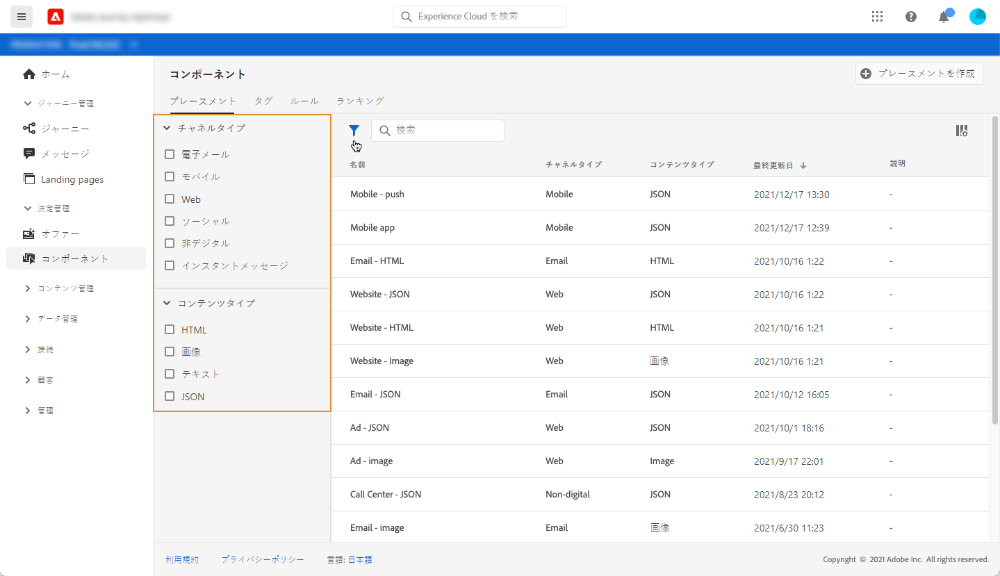
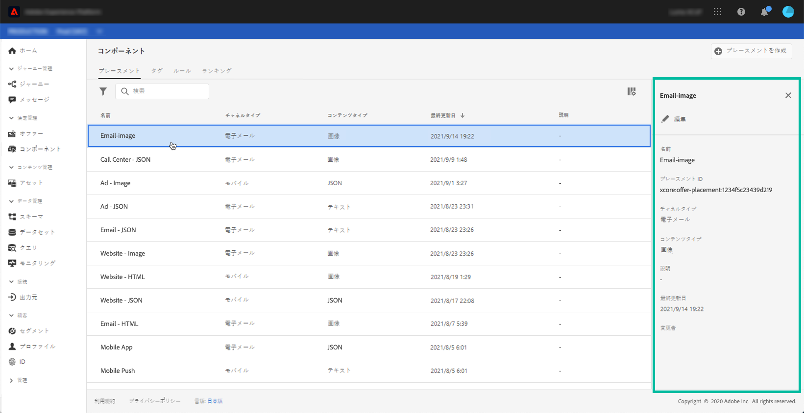

# プレースメントの作成 {#creating-placements}

プレースメントを使用すると、メッセージ内の適切な場所に適切なオファーコンテンツが表示されます。オファーにコンテンツを追加すると、そのコンテンツを表示できるプレースメントを選択するように求められます。

➡️ [この機能をビデオで確認](#video)

下の例では、異なるタイプのコンテンツ（画像、テキスト、HTML）に対応する 3 つのプレースメントがあります。

プレースメントのリストには&#x200B;**[!UICONTROL コンポーネント]**&#x200B;メニューからアクセスできます。フィルターは、特定のチャネルやコンテンツに従ってプレースメントを取得するのに役立ちます。

プレースメントを作成するには、次の手順に従います。

1. 「**[!UICONTROL プレースメントを作成]**」をクリックします。

   

1. プレースメントのプロパティを定義します。

   * **[!UICONTROL 名前]**：プレースメントの名前。わかりやすい名前を定義して、取得しやすくします。
   * **[!UICONTROL チャネルタイプ]**：プレースメントの使用先となるチャネル。
   * **[!UICONTROL コンテンツタイプ]**：プレースメントに表示できるコンテンツのタイプ（テキスト、HTML、画像リンク）。
   * **[!UICONTROL 説明]**：プレースメントの説明（オプション）。

   

1. 「**[!UICONTROL 保存]**」をクリックして確認します。

1. プレースメントが作成されると、プレースメントリストに表示されます。選択してプロパティを表示し、編集できます。

   

## チュートリアルビデオ {#video}

>[!NOTE]
>
>このビデオは、Adobe Experience Platformで構築された Offer Decisioning アプリケーションサービスに当てはまります。ただし、Journey Optimizer のコンテキストでオファーを使用する際の一般的なガイダンスを提供しています。

>[!VIDEO](https://video.tv.adobe.com/v/329372?quality=12)
