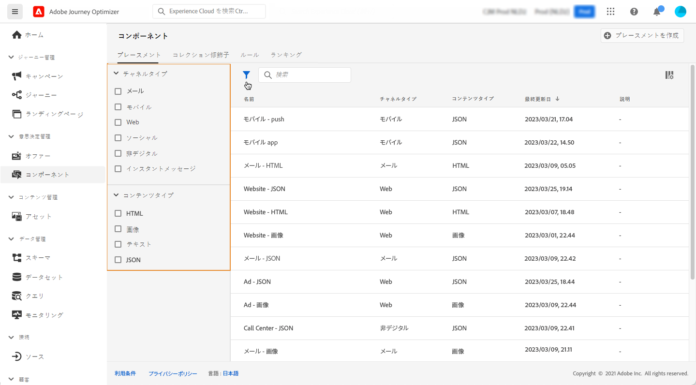
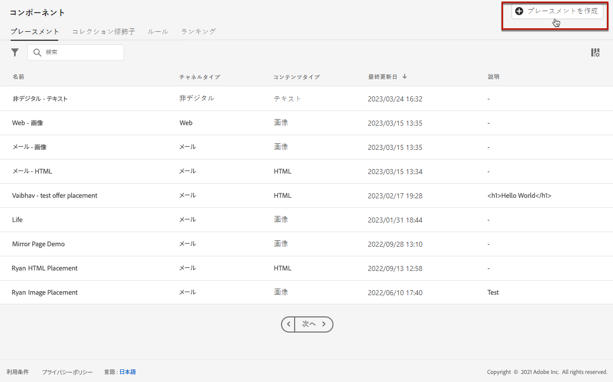
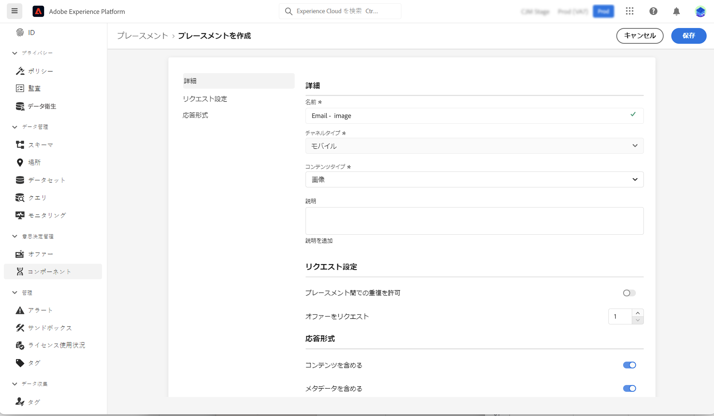
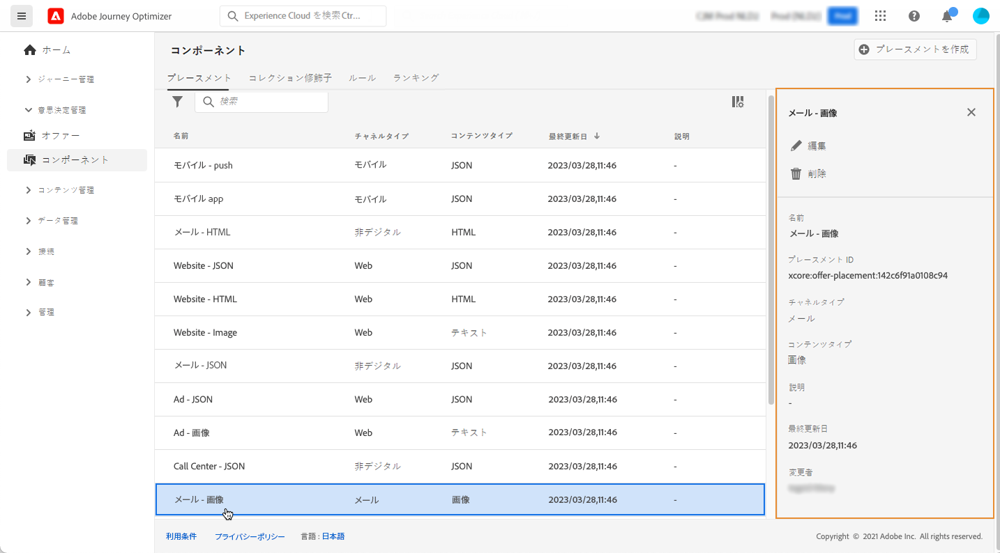

# プレースメントの作成 {#create-placements}

>[!CONTEXTUALHELP]
>id="ajo_decisioning_placement"
>title="プレースメント"
>abstract="プレースメントは、オファーの紹介に使用されるコンテナです。プレースメントを使用すると、メッセージ内の適切な場所にふさわしいオファーコンテンツが表示されます。プレースメントは、「コンポーネント」メニューから作成します。"

>[!CONTEXTUALHELP]
>id="ajo_decisioning_placement_request"
>title="リクエスト設定"
>abstract="「**[!UICONTROL プレースメント間での重複を許可]**」オプションを有効にすると、システムは複数のプレースメントに対して同じオファーを検討します。「**[!UICONTROL オファーをリクエスト]**」フィールドを使用して、返されるオファーの数を調整します。例えば、「2」を選択した場合、選択した決定範囲に最適な 2 つのオファーが表示されます。"

>[!CONTEXTUALHELP]
>id="ajo_decisioning_placement_response"
>title="応答形式"
>abstract="「**[!UICONTROL コンテンツを含める]**」オプションと「**[!UICONTROL メタデータを含める]**」オプションでは、オファーのコンテンツとメタデータを API 応答で返す必要があるかどうかを指定します。すべてのメタデータまたは特定のフィールドのみを含めることができます。デフォルトでは、Include メタデータの値は true に設定されています。"

プレースメントを使用すると、メッセージ内の適切な場所に適切なオファーコンテンツが表示されます。オファーにコンテンツを追加すると、そのコンテンツを表示できるプレースメントを選択するように求められます。

➡️ [プレースメントの作成方法について詳しくは、このビデオを参照してください。](#video)

下の例では、異なるタイプのコンテンツ（画像、テキスト、HTML）に対応する 3 つのプレースメントがあります。

プレースメントのリストには&#x200B;**[!UICONTROL コンポーネント]**&#x200B;メニューからアクセスできます。フィルターは、特定のチャネルやコンテンツに従ってプレースメントを取得するのに役立ちます。

プレースメントを作成するには、次の手順に従います。

1. 「**[!UICONTROL プレースメントを作成]**」をクリックします。

   

1. プレースメントのプロパティを定義します。

   * **[!UICONTROL 名前]**：プレースメントの名前。わかりやすい名前を定義して、取得しやすくします。
   * **[!UICONTROL チャネルタイプ]**：プレースメントの使用先となるチャネル。
   * **[!UICONTROL コンテンツタイプ]**：プレースメントに表示できるコンテンツのタイプ（テキスト、HTML、画像リンク、JSON のいずれか）。
   * **[!UICONTROL 説明]**：プレースメントの説明（オプション）。

   

1. 「**[!UICONTROL リクエスト設定]**」セクションと「**[!UICONTROL 応答の形式]**」セクションには、追加のパラメーターが用意されています。

   * **[!UICONTROL プレースメント間での重複を許可]**：異なるプレースメント間で同じオファーを複数回提案できるかどうかを制御します。有効にすると、システムは複数のプレースメントに対して同じオファーを考慮します。デフォルトでは、 パラメーターは false に設定されています。

     このオプションが決定リクエスト内のいずれかのプレースメントに対して false に設定されている場合、リクエスト内のすべてのプレースメントは「false」設定を継承します。

   * **[!UICONTROL オファーをリクエスト]**：デフォルトでは、決定範囲のオファーが各プロファイルに対して 1 つ返されます。返されるオファーの数は、このオプションを使用して調整できます。例えば、「2」を選択した場合、選択した決定範囲に最適な 2 つのオファーが表示されます。

   * **[!UICONTROL コンテンツを含める]**／**[!UICONTROL メタデータを含める]**：オファーのコンテンツとメタデータを API 応答で返す必要があるかどうかを指定します。すべてのメタデータまたは特定のフィールドのみを含めることができます。デフォルトでは、Include メタデータの値は true に設定されています。

   [Decisioning API](https://experienceleague.adobe.com/docs/journey-optimizer/using/offer-decisioning/api-reference/offer-delivery-api/decisioning-api.html?lang=ja) を使用している場合は、これらのパラメーターを API リクエストに直接設定することもできます。ただし、ユーザーインターフェイスで設定すると、各 API リクエストで渡す必要がないので、時間を節約できます。ユーザーインターフェイスと API リクエストの両方でパラメーターを設定する場合、API リクエストの値がインターフェイスの値よりも優先されます。

   >[!NOTE]
   >
   >[Edge Decisioning API](https://experienceleague.adobe.com/docs/journey-optimizer/using/offer-decisioning/api-reference/offer-delivery-api/edge-decisioning-api.html?lang=ja) を使用している場合、これらのパラメーターをリクエストに設定することはできません。この画面で定義する必要があります。
   >
   >[Batch Decisioning API](../api-reference/offer-delivery-api/batch-decisioning-api.md) を使用している場合、この画面または API リクエストでこれらのパラメーターを設定できます。画面と API リクエストのパラメーター値が一致しない場合は、リクエスト値が使用されます。

1. 「**[!UICONTROL 保存]**」をクリックして確認します。

1. プレースメントが作成されると、プレースメントリストに表示されます。選択してプロパティを表示し、編集できます。

   

## チュートリアルビデオ{#video}

意思決定管理でプレースメントを作成する方法を説明します。

>[!VIDEO](https://video.tv.adobe.com/v/341388?quality=12&captions=jpn)

