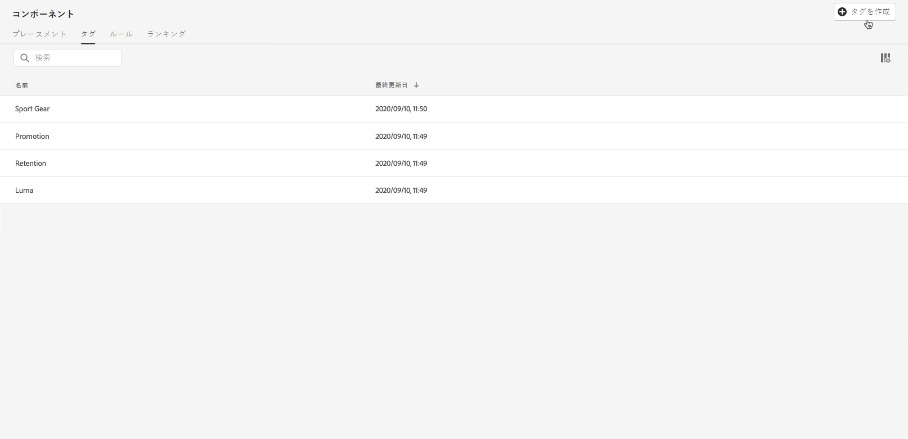
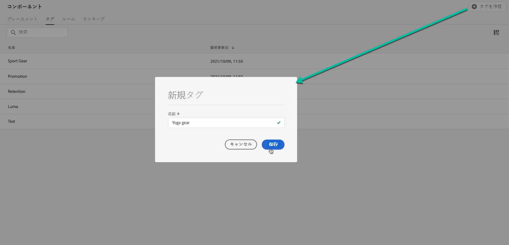
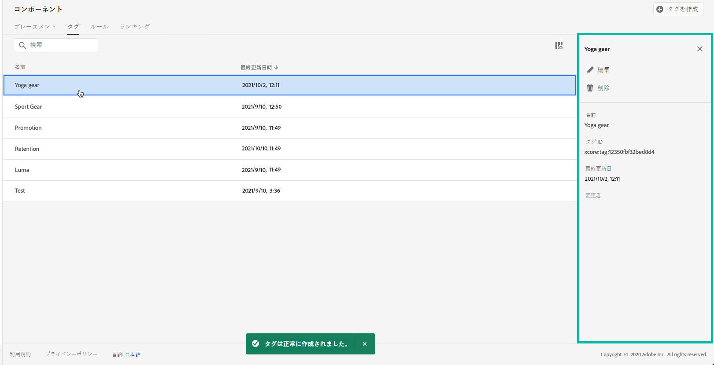

# タグの作成 {#creating-tags}

タグをオファーに関連付けると、タグを整理しやすくなります。例えば、ブラックフライデーオファーに「ブラックフライデー」タグのラベルを付けることができます。オファーライブラリの検索機能を使用して、そのタグを持つすべてのオファーを簡単に見つけることができるようになります。

また、タグを使用して、オファーをオファーコレクションにグループ化することもできます。[コレクションの作成](../offer-library/creating-collections.md)を参照してください。

 [この機能をビデオで確認](#video)

作成したタグのリストは、**[!UICONTROL コンポーネント]**&#x200B;メニューからアクセスできます。

タグを作成するには、次の手順に従います。

1. 「**[!UICONTROL タグ]**」タブに移動し、「**[!UICONTROL タグを作成]**」をクリックします。

1. タグ名を指定して「**[!UICONTROL 保存]**」をクリックします。

   

1. タグが作成されると、リストに表示されます。オファーを選択してプロパティを表示できます。また、オファーを編集したり抑制したりできます。

   

## チュートリアルビデオ {#video}

>[!NOTE]
>
>このビデオは、Adobe Experience Platformで構築されたOffer decisioningアプリケーションサービスに適用されます。 しかし、Journey Optimizerの状況でオファーを使用する際の一般的なガイダンスを提供しています。

>[!VIDEO](https://video.tv.adobe.com/v/329374?quality=12)
