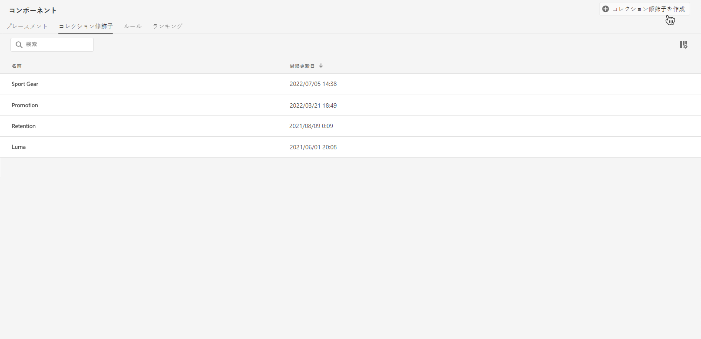
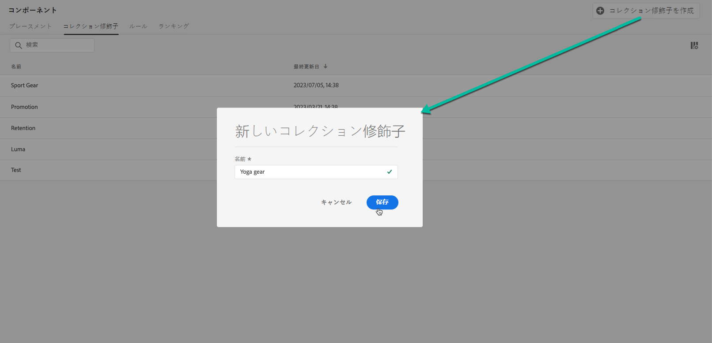
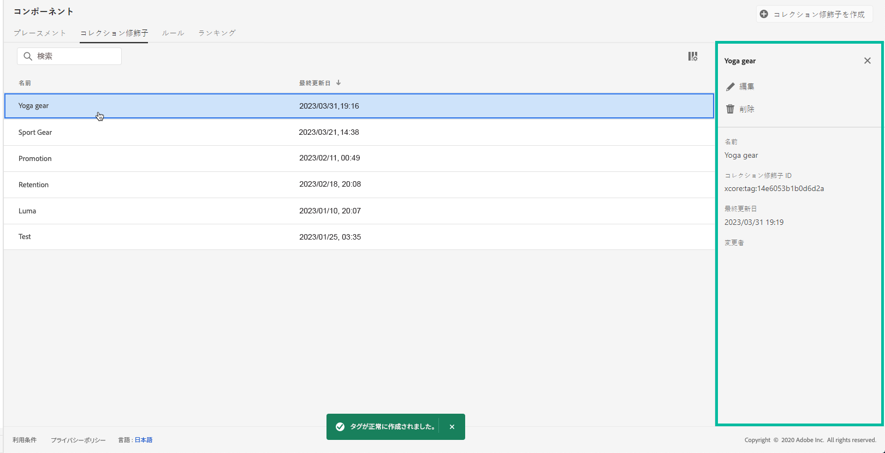

# コレクション修飾子の作成 {#create-tags}

>[!TIP]
>
>[!DNL Adobe Journey Optimizer] の新しい決定機能である決定が、コードベースのエクスペリエンスチャネルとメールチャネルを通じて使用できるようになりました。 [詳細情報](../../experience-decisioning/gs-experience-decisioning.md)

>[!CONTEXTUALHELP]
>id="ajo_decisioning_offer_tags"
>title="コレクション修飾子"
>abstract="1 つまたは複数のコレクション修飾子をオファーに関連付けて、オファーライブラリを整理し、オファーを見つけやすくします。 コレクション修飾子は、「コンポーネント」メニューから作成します。"

コレクション修飾子（旧称：「タグ」）をオファーに関連付けると、オファーを整理しやすくなります。 例えば、ブラックフライデーのオファーに「ブラックフライデー」コレクション修飾子のラベルを付けることができます。 オファーライブラリの検索機能を使用すると、そのコレクション修飾子を持つすべてのオファーを簡単に見つけることができます。

また、コレクション修飾子を使用して、オファーをオファーコレクションにグループ化することもできます。 詳しくは、[コレクションの作成](../offer-library/creating-collections.md)を参照してください。

➡️ [この機能について詳しくは、ビデオを参照してください。](#video)

作成されたコレクション修飾子のリストには、**[!UICONTROL コンポーネント]**&#x200B;メニューからアクセスできます。

コレクション修飾子を作成するには、次の手順に従います。

1. 「**[!UICONTROL コレクション修飾子]**」タブに移動し、「**[!UICONTROL コレクション修飾子を作成]**」をクリックします。

1. コレクション修飾子の名前を指定して、「**[!UICONTROL 保存]**」をクリックします。

   

1. コレクション修飾子が作成されると、リストに表示されます。 タグを選択してプロパティを表示できます。また、タグを編集したり抑制したりできます。

   

## チュートリアルビデオ {#video}

>[!VIDEO](https://video.tv.adobe.com/v/329374?quality=12)
