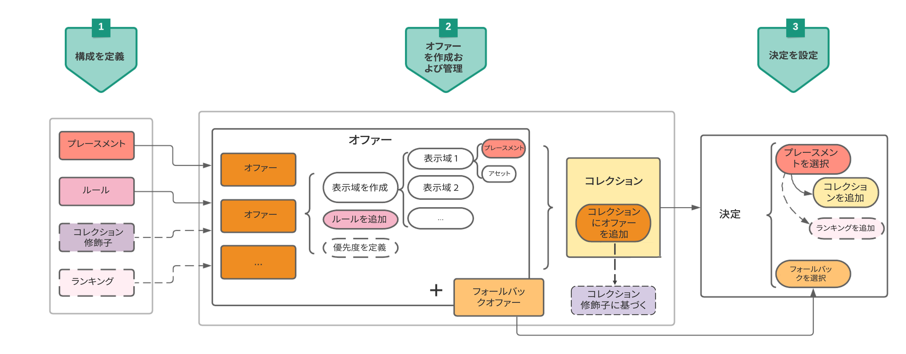

# オファーを作成および管理する主要ステップ {#key-steps-to-manage-offers}

オファーを作成、設定、管理し、決定に使用するための主な手順を以下に示します。

オファーを設定して決定で使用し、この決定をメールで活用する方法を示す完全なエンドツーエンドの例については、[このページ](../offers-e2e.md)を参照してください。

## コンポーネントの作成 {#create-components}

オファーの作成を開始する前に、オファーで使用する複数のコンポーネントを定義する必要があります。

1. [プレースメントを作成](creating-placements.md)します。プレースメントは、オファーを紹介するためのコンテナです。例えば、画像形式のオファー専用で、メッセージの上部に配置するプレースメントを作成できます。

1. オファーを表示する条件を指定する[決定ルールを作成](creating-decision-rules.md)します。

1. オファーに関連付ける[コレクション修飾子を作成](creating-tags.md)すると（旧称「タグ」）、ライブラリを簡単に整理して検索できます。

1. （オファーの優先度スコアを考慮するのではなく）特定のプレースメントに対して最初に提示するオファーを決定するルールを定義する場合は、[ランキング式](../ranking/create-ranking-formulas.md)を作成できます。

<!--
<table style="table-layout:fixed">
<tr style="border: 0;">
<td>

<a href="../offer-library/creating-placements.md">Create placements</a>

</td>
<td>

<a href="../offer-library/creating-decision-rules.md">Create decision rules</a>

<td>

<a href="../offer-library/creating-tags.md">Create collection qualifiers</a>

</td>
<td>

<a href="../ranking/create-ranking-formulas.md">Create ranking formulas</a>

</td>
</tr>
</table>
-->

## オファーの作成と管理 {#create-and-manage-offers}

1. [オファーを作成](creating-personalized-offers.md)し、そのコンテンツとプロパティを設定します。

1. [フォールバックオファーを作成](creating-fallback-offers.md)します。これは、顧客が選択したオファーのいずれにも資格がない場合に表示する最後の手段です。

1. [コレクションを作成](creating-collections.md)し、作成したパーソナライズされたオファーを含めて、それらを決定に使用します。

<!--
<table style="table-layout:fixed">
<tr style="border: 0;">
<td>

<a href="../offer-library/creating-personalized-offers.md">Create offers</a>

</td>
<td>

<a href="../offer-library/creating-fallback-offers.md">Create fallback offers</a>

</td>
<td>

<a href="../offer-library/creating-collections.md">Create collections</a>

</td>
</tr>
</table>
-->

## 決定の作成と設定 {#create-and-configure-decisions}

1. パーソナライズされたオファーおよびフォールバックオファーとプレースメントを組み合わせる[決定を作成](../offer-activities/create-offer-activities.md)します。この組み合わせは、意思決定エンジンが特定のプロファイルに最適なオファーを見つけるために使用されます。

1. [決定を設定します](../offer-activities/create-offer-activities.md#add-decision-scopes)。そのためには、プレースメントを選択し、各プレースメントに対してコレクションとフォールバックを選択します。

1. 必要に応じて、決定を設定する際に、プレースメントに[ランキング式](../offer-activities/configure-offer-selection.md#assign-ranking-formula)または [AI ランキング](../offer-activities/configure-offer-selection.md#use-ranking-strategy)を割り当てることができます。

<!--
<table style="table-layout:fixed">
<tr style="border: 0;">
<td>

<a href="../offer-activities/create-offer-activities.md">Create decisions</a>

</td>
<td>

<a href="../offer-activities/create-offer-activities.md#add-offers">Configure decisions</a>

</td>
<td>

<a href="../offer-activities/configure-offer-selection.md#assign-ranking-formula">Assign ranking</a>

</td>
</tr>
</table>
-->