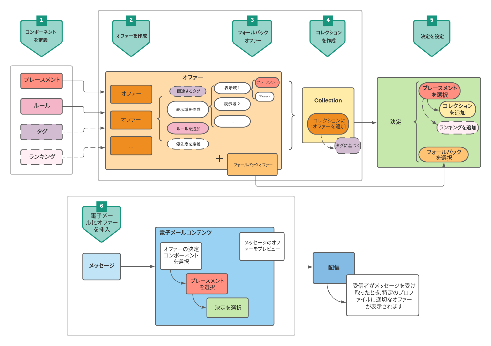
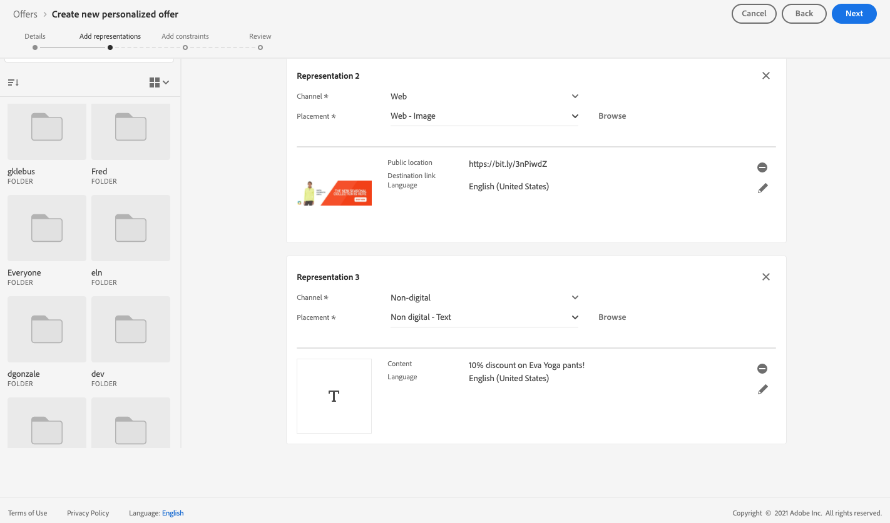

# 使用例：パーソナライズされたオファーをEメールで使用するように設定する {#configure-add-personalized-offers-email}

この節では、以前に作成した決定に基づいてオファーを設定し、Eメールで使用する方法を示すエンドツーエンドの例を示します。

## 主な手順

オファーを設定し、決定に含めて、この決定をEメールで活用するための主な手順を以下に示します。

1. オファーを作成する前に、[コンポーネントを定義します。](#define-components)

   * プレースメントの作成
   * 決定ルールの作成
   * タグの作成
   * ランク付けの作成（オプション）

1. [オファーの設定](#configure-offers)

   * オファーの作成
   * 各オファーに対して：

      * リプレゼンテーションを作成し、各リプレゼンテーションの配置とアセットを選択します。
      * 各オファーにルールを追加
      * 各オファーの優先度の定義

1. [フォールバックオファーの作成](#create-fallback)

1. [コレクションを作](#create-collection) 成して、作成したパーソナライズされたオファーを含めます

1. [決定の設定](#configure-decision)

   * 決定の作成
   * 作成した配置を選択します
   * 各配置に対して、コレクションを選択します
   * 各配置に対して、ランクを選択します（オプション）
   * フォールバックの選択

1. [決定を電子メールに挿入する](#insert-decision-in-email)

   * 表示したいオファーに一致する配置を選択します
   * 選択した配置と互換性のある項目から決定を選択します
   * オファーのプレビュー

Eメールでオファーを使用する全体的な意思決定管理プロセスは、次のように記述できます。

## コンポーネントの定義 {#define-components}

オファーの作成を開始する前に、オファーで使用する複数のコンポーネントを定義する必要があります。

これらは、**[!UICONTROL 判定管理]** > **[!UICONTROL コンポーネントメニュー]**&#x200B;の下に表示されます。

1. 最初に、オファー用の&#x200B;**配置**&#x200B;を作成します。

   これらの配置を使用して、オファー決定を定義する際に結果オファーが表示される場所を定義します。

   この例では、次のチャネルとコンテンツタイプを持つ3つの配置を作成します。

   * *Web — 画像*
   * *電子メール — 画像*
   * *非デジタル — テキスト*

   

   配置を作成する詳細な手順については、[この節](../../using/offers/offer-library/creating-placements.md)で説明します。

1. **判定ルール**&#x200B;を作成します。

   判定ルールは、Adobe Experience Platformのプロファイルに最適なオファーを提供します。

   **[!UICONTROL XDM Individual Profile/Person/Gender]**&#x200B;属性を使用して、2つのシンプルなルールを設定します。

   * *女性客*
   * *男性顧客*

   

   ルールを作成する詳細な手順については、[この節](../../using/offers/offer-library/creating-decision-rules.md)で説明します。

1. **タグ**&#x200B;を作成することもできます。

   その後、オファーに関連付け、このタグを使用してオファーを1つのコレクションにグループ化できます。

   この例では、*Yoga*&#x200B;タグを作成します。

   

   タグを作成する詳細な手順については、[この節](../../using/offers/offer-library/creating-tags.md)を参照してください。

1. （オファーの優先順位スコアを考慮するのではなく）特定の配置に対して最初に提示するオファーを決定するルールを定義する場合は、**ランキング式**&#x200B;を作成できます。

   ランキング式を作成する詳細な手順については、[この節](../../using/offers/offer-library/create-ranking-formulas.md#create-ranking-formula)を参照してください。

   >[!NOTE]
   >
   >この例では、優先度スコアのみを使用します。 [実施要件ルールと制約](../../using/offers/offer-library/creating-personalized-offers.md#eligibility)の詳細を説明します。

## オファーの設定 {#configure-offers}

これで、オファーを作成および設定できます。 この例では、特定の各プロファイルに従って表示するオファーを4つ作成します。

1. オファーの作成. 詳しくは、[この節](../../using/offers/offer-library/creating-personalized-offers.md#create-offer)を参照してください。

1. このオファーで、3つの表示域を作成します。 各表現は、以前に作成した配置とアセットの組み合わせである必要があります。

   * *Web — 画像*&#x200B;配置に対応する1つ
   * *Eメール — 画像*&#x200B;配置に対応する1つ
   * *非デジタル — テキスト*&#x200B;配置に対応するもの

   >[!NOTE]
   >
   >オファーは、メッセージ内の様々な場所に表示され、様々な配置コンテキストでオファーを使用する機会が増えます。

   [この節](../../using/offers/offer-library/creating-personalized-offers.md#representations)での表現について詳しく説明します。

1. 最初の2つの配置に適した画像を選択します。 *非デジタル — テキスト*&#x200B;配置のカスタムテキストを入力します。

   

1. 「**[!UICONTROL オファーの実施要件]**」セクションで、「**[!UICONTROL 定義済みの判定ルール]**」を選択し、選択したルールをドラッグ&amp;ドロップします。

   

1. **[!UICONTROL 優先度]**&#x200B;を入力します。 この例では、*25*&#x200B;を追加します。

1. オファーを確認し、「**[!UICONTROL 保存して承認]**」をクリックします。

   

1. この例では、同じ表示域を持つが異なるアセットを持つオファーをさらに3つ作成します。 次のような様々なルールと優先度を割り当てます。

   * 最初のオファー — 決定ルール：*女性客*、優先度：*25*
   * 2つ目のオファー — 決定ルール：*女性客*、優先度：*15*
   * 3番目のオファー — 決定ルール：*男性顧客*、優先度：*25*
   * 4つ目のオファー — 決定ルール：*男性顧客*、優先度：*15*

   

オファーを作成および設定する詳細な手順については、[この節](../../using/offers/offer-library/creating-personalized-offers.md)で説明します。

## フォールバックオファーの作成 {#create-fallback}

1. フォールバックオファーの作成.

1. 適切なアセットを使用して、オファーと同じ表現を定義します（オファーで使用する表現とは異なる表現を使用する必要があります）。

   各表現は、以前に作成した配置とアセットの組み合わせである必要があります。

   * *Web — 画像*&#x200B;配置に対応する1つ
   * *Eメール — 画像*&#x200B;配置に対応する1つ
   * *非デジタル — テキスト*&#x200B;配置に対応するもの

   

1. フォールバックオファーを確認し、「**[!UICONTROL 保存して承認]**」をクリックします。

これで、フォールバックオファーを判定で使用する準備が整いました。

フォールバックオファーを作成および設定する詳細な手順については、[この節](../../using/offers/offer-library/creating-fallback-offers.md)を参照してください。

## コレクションの作成 {#create-collection}

決定を設定する際に、パーソナライズされたオファーをコレクションの一部として追加する必要があります。

1. 判定プロセスを高速化するには、動的なコレクションを作成します。

1. *Yoga*&#x200B;タグを使用して、先ほど作成した4つのパーソナライズされたオファーを選択します。

   

コレクションを作成する詳細な手順については、[この節](../../using/offers/offer-library/creating-collections.md)で説明します。

## 決定の設定 {#configure-decision}

次に、配置を、先ほど作成したパーソナライズされたオファーおよびフォールバックオファーと組み合わせる決定を作成する必要があります。

この組み合わせは、特定のOffer decisioningに最適なオファーを見つけるために、プロファイルエンジンによって使用されます。この例では、各オファーに割り当てた優先度と判定ルールに基づいています。

オファー決定を作成および設定するには、次の主な手順に従います。

1. 決定の作成. 詳しくは、[この節](../../using/offers/offer-activities/create-offer-activities.md#create-activity)を参照してください。

1. *Web - Image*、*Email - Image*&#x200B;および&#x200B;*Non-digital - Text*&#x200B;の配置を選択します。

   

1. 各配置に対して、作成したコレクションを追加します。

   

1. [コンポーネント](#define-components)の構築時にランキングを定義した場合は、判定の配置に割り当てることができます。 この配置で複数のオファーを提示する資格がある場合、決定はこの数式を使用して、最初に配信するオファーを計算します。

   ランキング式を配置に割り当てる詳細な手順については、[この節](../../using/offers/offer-activities/configure-offer-selection.md#assign-ranking-formula)を参照してください。

1. 作成したフォールバックオファーを選択します。 これは、選択した3つの配置に対して使用可能なフォールバックオファーとして表示されます。

   

1. 決定を確認し、「**[!UICONTROL 保存して承認]**」をクリックします。

   

これで、最適化され、パーソナライズされたオファーを配信するために、決定を使用する準備が整いました。

判定を作成し設定する詳細な手順については、[この節](../../using/offers/offer-activities/create-offer-activities.md)で説明します。

## 決定を電子メールに挿入する {#insert-decision-in-email}

これで決定が完了し、電子メールメッセージに挿入できます。 これをおこなうには、以下の手順に従います。

1. Eメールを作成し、[Eメールデザイナー](../../using/design-emails.md)を開いて、内容を設定します。

1. 左側のパレットから構造コンポーネントを追加します。

1. **[!UICONTROL オファー決定]**&#x200B;コンテンツコンポーネントを追加します。 [この節](../../using/content-components.md)では、コンテンツコンポーネントの使用方法を説明します。

   

1. パターンを選択します。右側のパレットで、「**[!UICONTROL オファーの決定]**&#x200B;を選択」をクリックして、決定を追加します。

   

1. 表示するオファーに対応する配置を「**[!UICONTROL 配置]**」ドロップダウンリストから選択します。

   この場合、この例の一部として前に作成した配置から、電子メールで判定を使用する際に使用できるのは、 **Email - Image**&#x200B;配置のみです。 [配置の作成](../../using/offers/offer-library/creating-placements.md)の詳細を説明します。

   

1. **Eメール — 画像**&#x200B;配置に一致する決定が表示されます。 コンテンツコンポーネントで使用する決定を選択し、「**[!UICONTROL 追加]**」をクリックします。

   

   >[!NOTE]
   >
   >選択した配置と互換性のある決定のみがリストに表示されます。

これで、パーソナライズされたすべてのオファーとフォールバックオファーがEメールデザイナーで視覚化されて表示されるようになります。

**[!UICONTROL オファー]**&#x200B;セクションまたはコンテンツコンポーネントの矢印（右向き矢印と左向き矢印）を使用して、データを参照します。 また、判定の一部となる様々なオファーを顧客プロファイルで表示することもできます。 詳しくは、[この節](../../using/deliver-personalized-offers.md#preview-offers-in-email)を参照してください。

変更を保存し、メッセージが公開されると、ジャーニーの一環としてメッセージを送信する際に、オファーを関連するプロファイルに表示する準備が整います。

**関連トピック：**

* [この節](../../using/preview.md#preview-your-messages)でメッセージのプレビューを確認する方法を説明します。

* [この節](../../using/publish-manage-message.md)でメッセージを公開する方法を説明します。

* [この節](../building-journeys/journey.md)では、1つ以上のジャーニーによってメッセージがトリガーされる方法を説明します。

