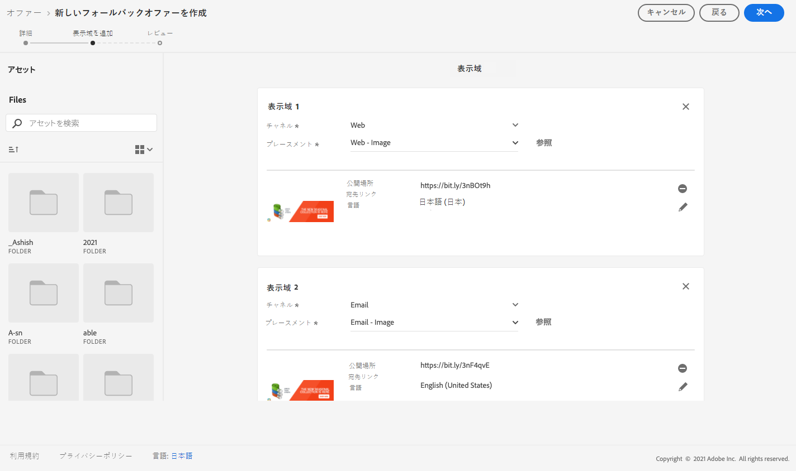
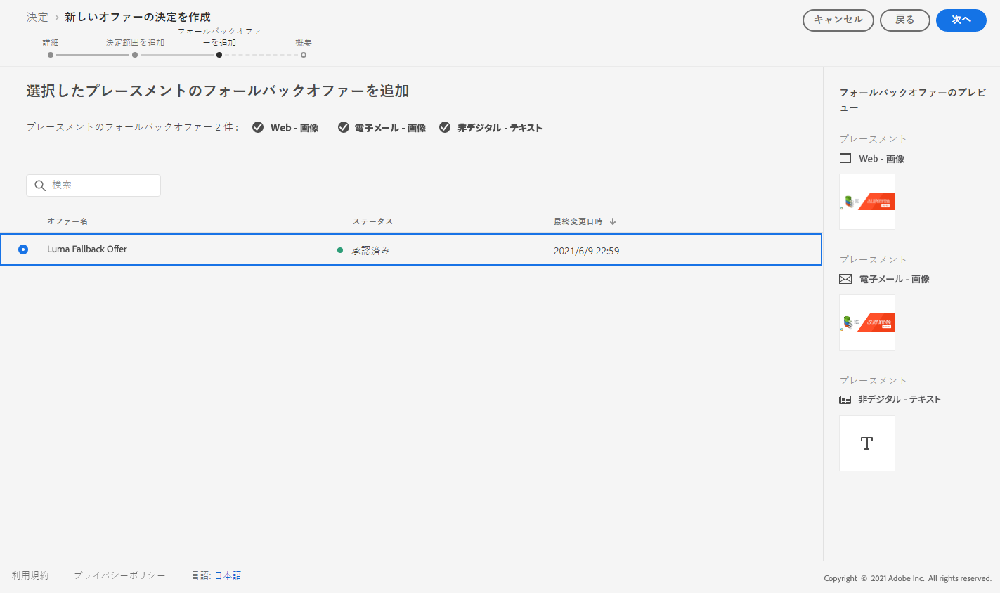

# ユースケース：パーソナライズされたオファーをメールで使用するように設定する {#configure-add-personalized-offers-email}

この節では、以前に作成した決定に基づいてオファーを設定し、メールで使用する方法を示すエンドツーエンドの例を示します。

## 主な手順 {#main-steps}

オファーを設定して決定に含め、この決定をメールで活用するための主な手順を以下に示します。

1. オファーを作成する前に、[コンポーネントを定義します。](#define-components)

   * プレースメントの作成
   * 決定ルールの作成
   * コレクション修飾子（旧称「タグ」）の作成
   * ランキングを作成（オプション）

1. [オファーの設定](#configure-offers)

   * オファーの作成
   * 各オファーに対して：

      * 表示域を作成し、表示域ごとにプレースメントとアセットを選択する
      * 各オファーのルールを定義する
      * 各オファーの優先度を定義する

1. [フォールバックオファーの作成](#create-fallback)

1. [コレクションを作成](#create-collection)して、作成済みのパーソナライズされたオファーを含める

1. [決定の設定](#configure-decision)

   * 決定の作成
   * 作成したプレースメントを選択する
   * 各プレースメントに対して、コレクションを選択する
   * 各プレースメントに対して、ランキングを選択する（オプション）
   * フォールバックの選択

1. [メールへの決定の挿入](#insert-decision-in-email)

   * 表示するオファーに一致するプレースメントを選択する
   * 選択したプレースメントと互換性のある項目から決定を選択する
   * オファーのプレビュー

電子メールでオファーを使用する全体的な意思決定管理プロセスは、次のように説明できます。

## コンポーネントの定義 {#define-components}

オファーの作成を開始する前に、オファーで使用する複数のコンポーネントを定義する必要があります。

これらは、**[!UICONTROL 意思決定管理]**／**[!UICONTROL コンポーネントメニュー]**の下に表示されます。

1. 最初に、オファーの&#x200B;**プレースメント**&#x200B;を作成します。

   オファー決定を定義する際に、これらのプレースメントを使用して結果オファーの表示場所を定義します。

   この例では、次のチャネルとコンテンツタイプを持つ 3 つのプレースメントを作成します。

   * *Web - 画像*
   * *メール - 画像*
   * *非デジタル - テキスト*

   

   プレースメントを作成する詳細な手順については、[この節](../../using/offers/offer-library/creating-placements.md)で説明します。

1. **決定ルール**&#x200B;を作成します。

   決定ルールは、Adobe Experience Platform のプロファイルに最適なオファーを提供します。

   **[!UICONTROL XDM 個人プロファイル／人物／性別]**&#x200B;属性を使用して、2 つのシンプルなルールを設定します。

   * *女性の顧客*
   * *男性の顧客*

   

   ルールを作成する詳細な手順については、[この節](../../using/offers/offer-library/creating-decision-rules.md)で説明します。

1. また、**コレクション修飾子**&#x200B;を作成できます。

   その後、オファーに関連付け、このコレクション修飾子を使用してオファーを 1 つのコレクションにグループ化できます。

   この例では、*Yoga* コレクション修飾子を作成します。

   

   コレクション修飾子を作成する詳細な手順については、[この節](../../using/offers/offer-library/creating-tags.md)で説明します。

1. （オファーの優先度スコアを考慮するのではなく）特定の配置に対して最初に提示するオファーを決定するルールを定義する場合は、**ランキング式**&#x200B;を作成できます。

   ランキング式を作成する詳細な手順については、[この節](../../using/offers/ranking/create-ranking-formulas.md#create-ranking-formula)を参照してください。

   >[!NOTE]
   >
   >この例では、優先度スコアのみを使用します。詳しくは、[実施要件ルールと制約](../../using/offers/offer-library/add-constraints.md#eligibility)を参照してください。

## オファーの設定 {#configure-offers}

これで、オファーを作成および設定できます。この例では、特定のプロファイルごとに表示する 4 つのオファーを作成します。

1. オファーの作成.詳しくは、[この節](../../using/offers/offer-library/creating-personalized-offers.md#create-offer)を参照してください。

1. このオファーでは、3 つの表示域を作成します。各表示域は、以前に作成したプレースメントとアセットの組み合わせにする必要があります。

   * 「*Web - 画像*」プレースメントに対応するもの
   * 「*メール - 画像*」プレースメントに対応するもの
   * 「*非デジタル - テキスト*」プレースメントに対応するもの

   >[!NOTE]
   >
   >オファーをメッセージ内の様々な場所に表示し、様々なプレースメントのコンテキストでオファーを使用する機会を増やすことができます。

   表示域について詳しくは、[この節](../../using/offers/offer-library/add-representations.md#representations)を参照してください。

1. 最初の 2 つのプレースメントに適切な画像を選択します。「*非デジタル - テキスト*」プレースメントのカスタムテキストを入力します。

   

1. 「**[!UICONTROL オファーの適格要件]**」セクションで、「**[!UICONTROL 定義済みの決定ルール]**」を選択し、任意のルールをドラッグ＆ドロップします。

   

1. **[!UICONTROL 優先度]**&#x200B;を入力します。この例では、*25* を追加します。

1. オファーを確認し、「**[!UICONTROL 保存して承認]**」をクリックします。

   

1. この例では、同じ表示域で異なるアセットを持つ 3 つのオファーを作成します。次のような様々なルールと優先度を割り当てます。

   * 最初のオファー - 決定ルール：*女性の顧客*、優先度：*25*
   * 2 番目のオファー - 決定ルール：*女性の顧客*、優先度：*15*
   * 3 番目のオファー - 決定ルール：*男性の顧客*、優先度：*25*
   * 4 番目のオファー - 決定ルール：*男性の顧客*、優先度：*15*

   

オファーを作成および設定する詳細な手順については、[この節](../../using/offers/offer-library/creating-personalized-offers.md)を参照してください。

## フォールバックオファーの作成 {#create-fallback}

1. フォールバックオファーを作成します。

1. 適切なアセットを使用して、オファーと同じ表示域を定義します（オファーで使用する表示域とは異なる表示域を使用する必要があります）。

   各表示域は、以前に作成したプレースメントとアセットの組み合わせにする必要があります。

   * 「*Web - 画像*」プレースメントに対応するもの
   * 「*メール - 画像*」プレースメントに対応するもの
   * 「*非デジタル - テキスト*」プレースメントに対応するもの

   

1. フォールバックオファーを確認し、「**[!UICONTROL 保存して承認]**」をクリックします。

これで、フォールバックオファーを決定で使用する準備が整いました。

フォールバックオファーを作成および設定する詳細な手順については、[この節](../../using/offers/offer-library/creating-fallback-offers.md)を参照してください。

## コレクションの作成 {#create-collection}

決定を設定する際に、パーソナライズされたオファーをコレクションの一部として追加する必要があります。

1. 決定プロセスをスピードアップするには、動的なコレクションを作成します。

1. *Yoga* コレクション修飾子を使用して、以前作成した 4 つのパーソナライズされたオファーを選択します。

   

コレクションを作成する詳細な手順については、[この節](../../using/offers/offer-library/creating-collections.md)で説明します。

## 決定の設定 {#configure-decision}

次に、プレースメントを、作成したパーソナライズされたオファーおよびフォールバックオファーと組み合わせる決定を作成する必要があります。

この組み合わせは、特定のプロファイルに最適なオファーを見つけるために決定エンジンによって使用されます。この例では、各オファーに割り当てた優先度と決定ルールに基づいています。

オファー決定を作成および設定するには、次の主な手順に従います。

1. 決定を作成します。詳しくは、[この節](../../using/offers/offer-activities/create-offer-activities.md#create-activity)を参照してください。

1. 「*Web - 画像*」、「*メール - 画像*」および「*非デジタル - テキスト*」のプレースメントを選択します。

   

1. 各プレースメントに対して、作成したコレクションを追加します。

   

1. [コンポーネントの構築](#define-components)時にランキングを定義した場合は、それを決定のプレースメントに割り当てることができます。このプレースメントで複数のオファーを提示できる場合、決定はこの式を使用して、どのオファーを最初に配信するかを計算します。

   ランキング式をプレースメントに割り当てる詳細な手順については、[この節](../../using/offers/offer-activities/configure-offer-selection.md#assign-ranking-formula)で説明します。

1. 作成したフォールバックオファーを選択します。これは、選択した 3 つのプレースメントに対して使用可能なフォールバックオファーとして表示されます。

   

1. 決定を確認し、「**[!UICONTROL 保存して承認]**」をクリックします。

   

これで、最適化され、パーソナライズされたオファーを配信するために、決定を使用する準備が整いました。

決定を作成して設定する詳細な手順については、[この節](../../using/offers/offer-activities/create-offer-activities.md)で説明します。

## メールへの決定の挿入 {#insert-decision-in-email}

これで決定が有効になったので、メールメッセージに挿入できます。それには、[このページ](../../using/email/add-offers-email.md)で詳細に説明されている手順に従ってください。

