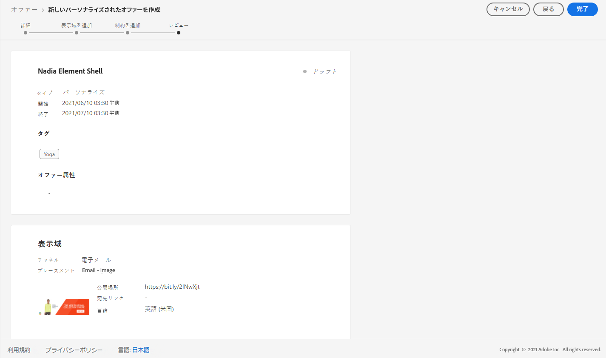

# 用途: パーソナライズされた申し出を電子メールで使用するために設定します。 {#configure-add-personalized-offers-email}

この節では、事前に作成した意思決定に基づいて、オファーを設定して電子メールで使用する方法を示します。

## 主な手順 {#main-steps}

このような設定を行う主な手順については、次のような意思決定に追加し、この決定を電子メールで活用してください。

1. オファーを作成する前に、コンポーネントを定義します [ 。](#define-components)

   * 配置の作成
   * 決定ルールの作成
   * タグの作成
   * ランキングの作成 (オプション)

1. [キャンペーンの設定](#configure-offers)

   * キャンペーンの作成
   * 各オファーについて:

      * プロダクト表現を作成し、それぞれの表示の位置とアセットを選択します。
      * 各オファーに対するルールの追加
      * 各オファーの優先度の定義

1. [フォールバックオファーの作成](#create-fallback)

1. [作成したパーソナライズされた特典を含めるコレクション ](#create-collection) の作成

1. [決定を設定します。](#configure-decision)

   * 意思決定の作成
   * 作成した配置を選択します。
   * 各配置についてコレクションを選択します。
   * 各配置について、ランク付けを選択します (オプション)。
   * 「フォールバック」を選択します。

1. [意思決定を電子メールに挿入します。](#insert-decision-in-email)

   * 表示するオファーに一致する位置を選択します。
   * 選択した配置と互換性のあるアイテムから決定を選択します。
   * キャンペーンのプレビュー

電子メールでのキャンペーンの使用に関する全体的な意思決定管理プロセスは、次のように記述できます。

## コンポーネントの定義 {#define-components}

キャンペーンの作成を開始する前に、オファーで使用するいくつかのコンポーネントを定義しておく必要があります。

> **[!UICONTROL Components menu]** の **[!UICONTROL Decision Management]** 下にそれらが表示されます。

1. 最初に、申し出に応じた配置を作成 **** します。

   この配置を使用して、オファーの決定を定義する際に作成されるオファーが表示される場所を定義します。

   この例では、以下のチャンネルとコンテンツタイプを含む3つの配置を作成します。

   * *Web イメージ*
   * *電子メール-イメージ*
   * *非デジタルテキスト*

   

   この節 ](../../using/offers/offer-library/creating-placements.md) で [ は、配置を作成するための詳細な手順について説明します。

1. 意思決定ルール **を作成** します。

   Decision rules は、Adobe エクスペリエンスプラットフォームにおいて、最良のサービスを提供することをお勧めします。

   次の属性を使用して、2つの **[!UICONTROL XDM Individual Profile > Person > Gender]** 単純な規則を設定します。

   * *お客様の女性*
   * *お客様の男性*

   

   この節 ](../../using/offers/offer-library/creating-decision-rules.md) で [ は、ルールを作成するための詳細な手順について説明します。

1. また、タグ **を** 作成することもできます。

   これにより、それをオファーに関連付け、このタグを使用して、複数のサービスを1つのコレクションにまとめることができます。

   この例では、ヨークの *「ga* 」タグを作成します。

   

   この節 ](../../using/offers/offer-library/creating-tags.md) で [ は、タグを作成するための詳細な手順について説明します。

1. 特定の配置について最初に提示する必要がある特典を決定するためのルールを定義する場合は、ランク計算式 **を** 作成することもできます。

   ランク付けの数式を作成するための詳細な手順については、このセクション ](../../using/offers/ranking/create-ranking-formulas.md#create-ranking-formula) で [ 説明されています。

   >[!NOTE]
   >
   >この例では、優先スコアのみが使用されます。 適格性ルールと制約 ](../../using/offers/offer-library/creating-personalized-offers.md#eligibility) について詳しく説明して [ います。

## オファーの設定 {#configure-offers}

では、オファーの作成と設定を行うことができるようになりました。 この例では、表示する各プロファイルに応じて、4つのオファーを作成します。

1. オファーを作成します。 詳しくは、ここを  参照してください。

1. このオファーでは、3つの表現を作成します。 各表現は、事前に作成した配置とアセットの組み合わせでなければなりません。

   * 1つは Web イメージ *の配置に対応します* 。
   * 1つは電子メールイメージ *の配置に対応しています* 。
   * 非デジタルテキスト *の配置に対応した* 1 つ

   >[!NOTE]
   >
   >1つのメッセージ内の様々な場所にオファーを表示して、異なる配置コンテキストでオファーを使用する機会を増やすことができます。

   このセクション ](../../using/offers/offer-library/creating-personalized-offers.md#representations) の説明について詳しくは、 [ ここを参照してください。

1. 最初の2つの配置に適切なイメージを選択します。 デジタル以外のテキスト *を配置するための* カスタムテキストを入力します。

   

1. **[!UICONTROL Offer eligibility]**&#x200B;セクションで、選択したルールをクリック **[!UICONTROL By defined decision rule]** してドラッグ &amp; ドロップします。

   

1. に **[!UICONTROL Priority]** 入力します。 この例では、「25 *」を追加* します。

1. 申し出を確認し、をクリック **[!UICONTROL Save and approve]** します。

   

1. この例では、同じ表現で異なるアセットを使用して3つのサービスを作成します。 次のように、これらのルールとその他の優先順位を割り当てます。

   * 第1の offer 条件 (女性): *女性: 女性お客様* 、優先度: *25*
   * 第2のキャンペーン決定規則: *女性お客様* 、優先度: *15*
   * 第3のオファー-決定ルール: *男性* 、重要度: *25*
   * 第4オファー-決定規則: *男性* 、優先度: *15*

   

このセクション ](../../using/offers/offer-library/creating-personalized-offers.md) で [ は、サービスの作成と設定に関する詳細な手順について説明します。

## フォールバックオファーの作成 {#create-fallback}

1. 予備オファーを作成します。

1. 適切なアセットを使用して、オファーについても同じ表現を定義します (それらは、オファーで使用されるものとは異なる必要があります)。

   各表現は、事前に作成した配置とアセットの組み合わせでなければなりません。

   * 1つは Web イメージ *の配置に対応します* 。
   * 1つは電子メールイメージ *の配置に対応しています* 。
   * 非デジタルテキスト *の配置に対応した* 1 つ

   

1. 予備オファーを確認し、をクリック **[!UICONTROL Save and approve]** します。

これで、フォールバックオファーを、決定に使用できるようになりました。

このセクション ](../../using/offers/offer-library/creating-fallback-offers.md) で [ は、フォールバックオファーを作成および設定するための詳細な手順について説明します。

## コレクションの作成 {#create-collection}

決定を設定するときは、個人用に設定されたオファーをコレクションの一部として追加する必要があります。

1. 決定プロセスを高速化するには、動的コレクションを作成します。

1. 最初に作成した4つのパーソナライズされた特典を選択するには、 *「ヨーク ga* 」タグを使用してください。

   

コレクションを作成する詳細な手順については、ここを [ 参照 ](../../using/offers/offer-library/creating-collections.md) してください。

## 決定を設定します。 {#configure-decision}

ここでは、パーソナライズされた特典とその他の予備価格が組み合わされた意思決定を作成する必要があります。

この組み合わせを使用して、特定のプロファイルに最適なオファーを見つけるために decisioning engine で使用されます。この例では、各オファーに割り当てた優先度と決定条件に基づいています。

オファーの決定を作成して設定するには、次の主な手順に従います。

1. 意思決定を作成します。 詳しくは、ここを  参照してください。

1. Web イメージ *、電子メールイメージ* *、デジタルテキスト* 以外の *配置を選択し* ます。

   

1. 各配置に作成したコレクションを追加します。

   

1. コンポーネント ](#define-components) を構築するとき [ にランクを定義した場合は、それを決定する位置に割り当てることができます。このような条件に適合したオファーリングが複数ある場合は、次の式を使用して、最初に配信するオファーリングが計算されます。

   このセクション ](../../using/offers/offer-activities/configure-offer-selection.md#assign-ranking-formula) で [ は、位置にランク付け式を割り当てる詳細な手順について説明します。

1. 作成したフォールバックオファーを選択します。 この機能は、選択した3つの提案に使用可能な代替ソリューションとして表示されます。

   

1. 決定内容を確認してから、「」をクリック **[!UICONTROL Save and approve]** します。

   

このようにして、カスタマイズされた特典を利用できるようになりました。

このセクション ](../../using/offers/offer-activities/create-offer-activities.md) で [ は、決定を作成および設定するための詳細な手順について説明します。

## 意思決定を電子メールに挿入します。 {#insert-decision-in-email}

決定が実行されたので、これを電子メールメッセージに挿入できます。 そのためには、このページ ](../../using/email/add-offers-email.md) で [ 説明されている手順に従ってください。

