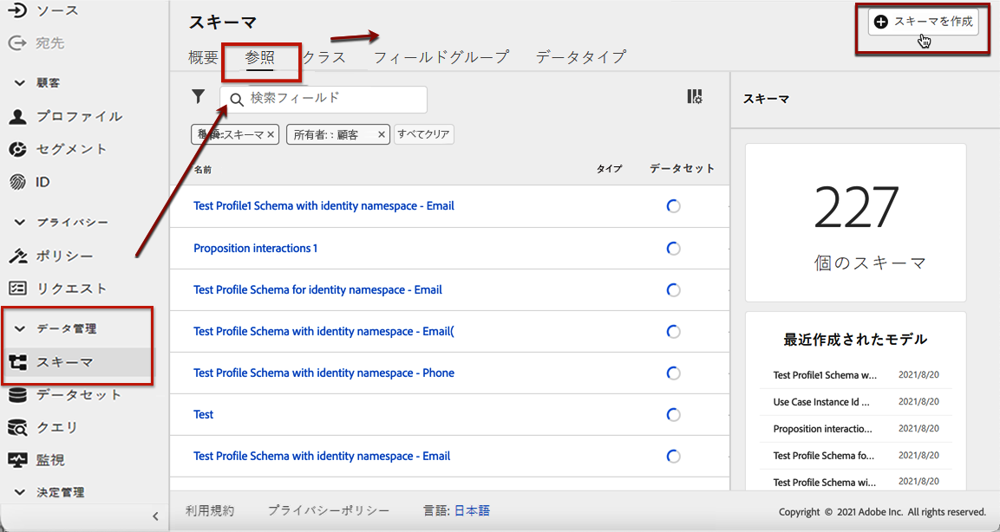
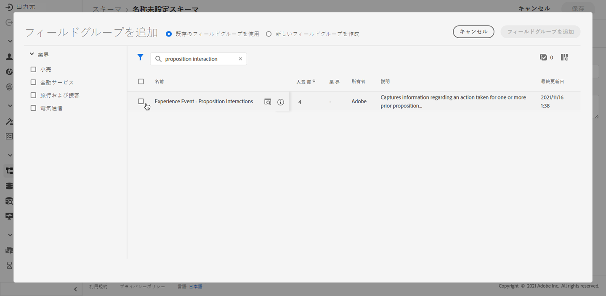
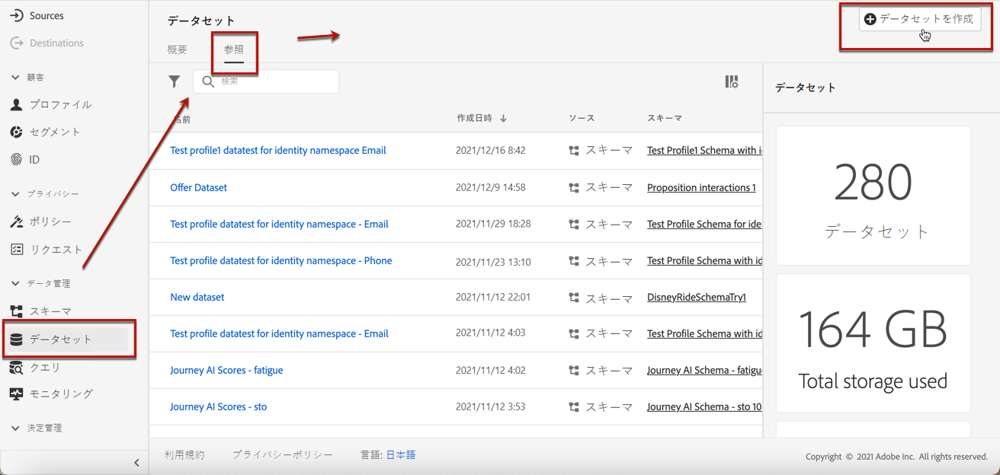
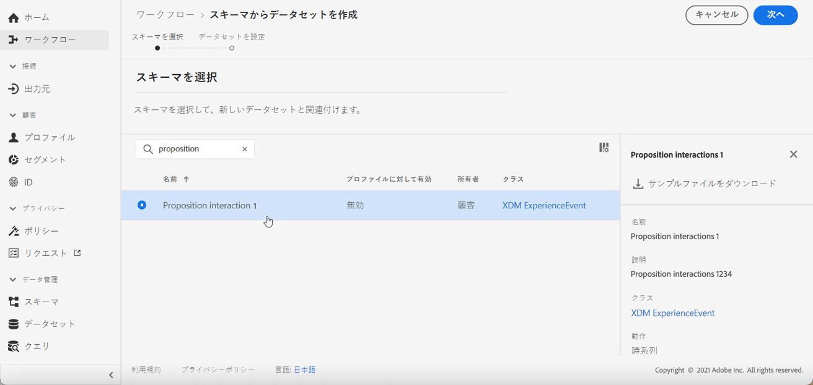

# イベントを収集するデータセットの作成 {#create-dataset}

AI モデルを作成する前に、コンバージョンイベントを収集するデータセットを作成する必要があります。 まず、データセットで使用するスキーマを作成します。

1. **[!UICONTROL データ管理]**&#x200B;メニューから「**[!UICONTROL スキーマ]**」を選択し、「**[!UICONTROL 参照]**」タブに移動して、「**[!UICONTROL スキーマを作成]**」をクリックします。

   

1. **[!UICONTROL XDM ExperienceEvent]** を選択します。

   

   >[!NOTE]
   >
   >    XDM スキーマとフィールドグループについて詳しくは、[XDM システムの概要ドキュメント](https://experienceleague.adobe.com/docs/experience-platform/xdm/home.html?lang=ja)を参照してください。

1. 「**[!UICONTROL 検索]**」フィールドに「提案インタラクション」と入力し、「**[!UICONTROL エクスペリエンスイベント - 提案インタラクション]**」フィールドグループを選択します。

   

   >[!CAUTION]
   >
   >    データセットで使用されるスキーマには、「**[!UICONTROL エクスペリエンスイベント - 提案インタラクション]**」フィールドグループが関連付けられている必要があります。そうしないと、ランキング戦略で使用できなくなります。

1. 「**[!UICONTROL フィールドグループを追加]**」をクリックします。

   

   >[!NOTE]
   >フィールドグループは、以前は mixin と呼ばれていました。

1. 名前を入力し、スキーマを保存します。<!--How do you edit the fields in this new schema? Examples?-->

>[!NOTE]
>
>    スキーマの構築に関して詳しくは、[スキーマ構成の基本](https://experienceleague.adobe.com/docs/experience-platform/xdm/schema/composition.html?lang=ja#understanding-schemas)で説明します。

これで、このスキーマを使用してデータセットを作成する準備が整いました。これを行うには、以下の手順に従います。

1. **[!UICONTROL データ管理]**&#x200B;メニューから「**[!UICONTROL データセット]**」を選択し、「**[!UICONTROL 参照]**」タブに移動して、「**[!UICONTROL データセットを作成]**」をクリックします。

   

1. 「**[!UICONTROL スキーマからデータセットを作成]**」をクリックします。

   

1. 作成したスキーマをリストから選択します。

   

1. 「**[!UICONTROL 次へ]**」をクリックします。

1. 「**[!UICONTROL 名前]**」フィールドにデータセットの一意の名前を入力し、「**[!UICONTROL 完了]**」をクリックします。

   

これで、[ランキング戦略の作成](#create-ranking-strategy)時に、イベントデータを収集するデータセットを選択できる状態になりました。
