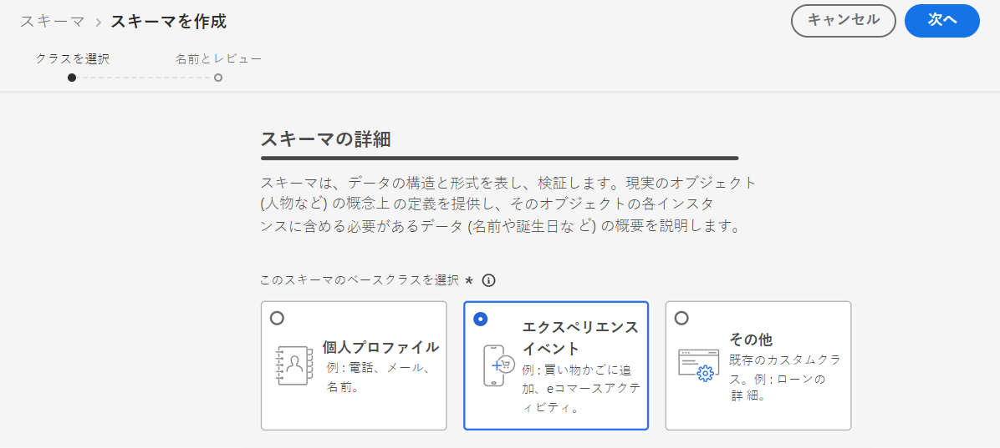

# イベントを収集するためのデータセットの作成 {#create-dataset}

AI モデルを作成する前に、変換イベントが収集されるデータセットを作成する必要があります。 まず、データセットで使用されるスキーマを作成します。

1. **[!UICONTROL Data Management]**&#x200B;メニューのを選択 **[!UICONTROL Schema]** して、タブに **[!UICONTROL Browse]** 移動し、をクリック **[!UICONTROL Create schema]** します。

   

1. 「」を選択 **[!UICONTROL XDM ExperienceEvent]** します。

   

   >[!NOTE]
   >
   >Xdm について詳しくは、 [ xdm の「システム概要 ](https://experienceleague.adobe.com/docs/experience-platform/xdm/home.html?lang=en) について」を参照してください。 {target = &quot;_blank&quot;}。

1. **[!UICONTROL Field groups]**&#x200B;左側のセクションから、を選択 **[!UICONTROL Add]** します。

   

1. **[!UICONTROL Search]**&#x200B;フィールドに「提案インタラクション」と入力し、フィールドグループを選択 **[!UICONTROL Experience Event - Proposition Interactions]** します。

   

   >[!CAUTION]
   >
   >データセットで使用されるスキーマには、フィールドグループが関連付けられている必要があり **[!UICONTROL Experience Event - Proposition Interactions]** ます。 それ以外の場合は、ランク付け方針に使用することはできません。

1. をクリック **[!UICONTROL Add field groups]** します。

   

   >[!NOTE]
   >フィールドグループは、以前は mixin と呼ばれていました。

1. 名前を入力し、スキーマを保存します。

>[!NOTE]
>
>スキーマコンポジション ](https://experienceleague.adobe.com/docs/experience-platform/xdm/schema/composition.html?lang=en#understanding-schemas) の基礎におけるスキーマの構築について詳しくは、 [ {target = &quot;_blank&quot;} を参照してください。

これで、このスキーマを使用してデータセットを作成する準備ができました。 これを行うには、次の手順を実行します。

1. **[!UICONTROL Data Management]**&#x200B;メニューのを選択 **[!UICONTROL Datasets]** して、タブに **[!UICONTROL Browse]** 移動し、をクリック **[!UICONTROL Create dataset]** します。

   

1. を選択 **[!UICONTROL Create dataset from schema]** します。

   

1. 作成したスキーマをリストから選択します。

   

1. をクリック **[!UICONTROL Next]** します。

1. フィールドに **[!UICONTROL Name]** データセットの一意の名前を指定して、をクリック **[!UICONTROL Finish]** します。

   

データセットは、ランク付けストラテジ ](#create-ranking-strategy) の作成時 [ に、イベントデータを収集するために選択できるようになりました。
