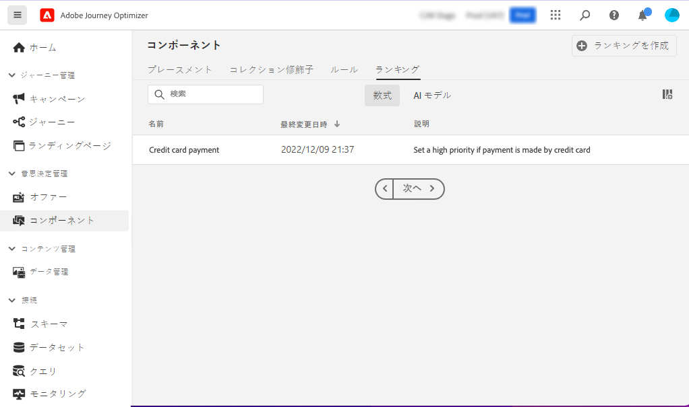
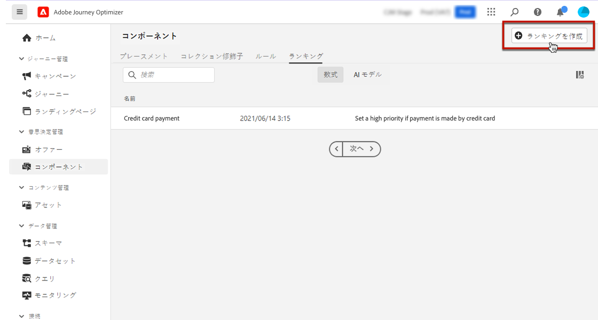
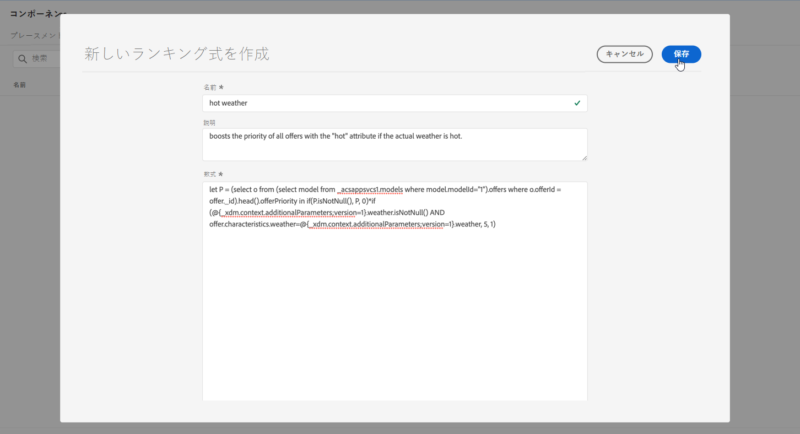
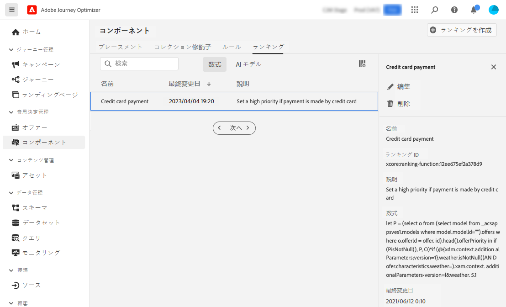
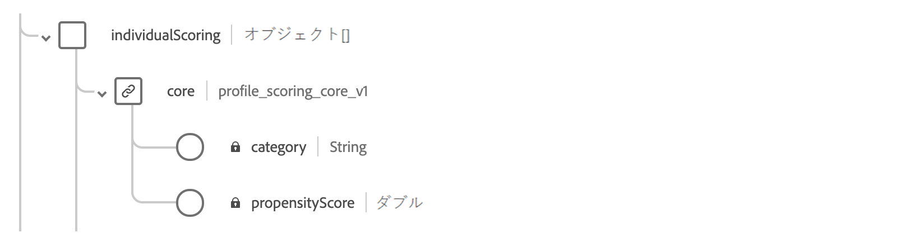

# ランキング式 {#create-ranking-formulas}

## ランキング式について {#about-ranking-formulas}

**ランキング式** を使用すると、オファーの優先度スコアを考慮するのではなく、指定されたプレースメントに対して最初に提示するオファーを決定するルールを定義できます。

ランキング式は **PQL 構文**&#x200B;で表され、式中でプロファイル属性、コンテキストデータ、オファー属性を利用できます。PQL 構文の使用方法について詳しくは、[関連するドキュメント](https://experienceleague.adobe.com/docs/experience-platform/segmentation/pql/overview.html?lang=ja)を参照してください。

ランキング式を作成したら、決定内のプレースメントに割り当てることができます。詳しくは、[決定でのオファーの選択設定](../offer-activities/configure-offer-selection.md)を参照してください。

## ランキング式の作成 {#create-ranking-formula}

ランキング式を作成するには、次の手順に従います。

1. **[!UICONTROL コンポーネント]**&#x200B;メニューにアクセスし、「**[!UICONTROL ランキング]**」タブを選択します。「**[!UICONTROL 式]**」タブがデフォルトで選択されています。以前に作成した式のリストが表示されます。

   

1. 「**[!UICONTROL ランキングを作成]**」をクリックして、新しいランキング式を作成します。

   

1. 式の名前、説明、式を指定します。

   この例では、実際の気温が高い場合に、「hot」属性を持つすべてのオファーの優先度を上げます。そのために、決定の呼び出し時に **contextData.weather=hot** を渡しています。[詳しくは、コンテキストデータの操作方法を参照してください](../context-data.md)

   

   >[!IMPORTANT]
   >
   >ランキング式を作成する場合、前の期間の参照はサポートされません。例えば、先月内に発生したエクスペリエンスイベントを数式のコンポーネントとして指定した場合です。数式の作成中にルックバック期間を含めようとすると、保存時にエラーがトリガーされます。

1. 「**[!UICONTROL 保存]**」をクリックします。ランキング式が作成されたら、リストからその式を選択して詳細を取得し、式を編集または削除したりできます。

   これで、ランキング式を決定で使用して、プレースメントに対する実施要件を満たすオファーをランク付けする準備が整いました（「 [決定でのオファー選択の設定](../offer-activities/configure-offer-selection.md)」を参照してください）。

   

## ランキング式の例 {#ranking-formula-examples}

必要に応じて、様々なランキング式を作成できます。以下に例を示します。

<!--
Boost by offer ID

Boost the priority of an offer with the offer ID *xcore:personalized-offer:13d213cd4cb328ec* by 5.

**Ranking formula:**

```
if( offer._id = "xcore:personalized-offer:13d213cd4cb328ec", offer.rank.priority + 5, offer.rank.priority)
```

Change the offer priority based on a certain profile attribute

Set the offer priority to 30 for offer *xcore:personalized-offer:13d213cd4cb328ec* if the user lives in the city of Bondi.

**Ranking formula:**

```
if( offer._id = "xcore:personalized-offer:13d213cd4cb328ec" and homeAddress.city.equals("Bondi", false), 30, offer.rank.priority)
```

Boost multiple offers by offer ID based on the presence of a profile's audience membership

Boost the priority of offers based on whether the user is a member of a priority audience, which is configured as an attribute in the offer.

**Ranking formula:**

```
if( segmentMembership.get("ups").get(offer.characteristics.get("prioritySegmentId")).status in (["realized","existing"]), offer.rank.priority + 10, offer.rank.priority)
```
-->

### プロファイル属性に基づいた特定のオファー属性を持つオファーのブースト

オファーに対応する市区町村にプロファイルが住んでいる場合は、その市区町村内のすべてのオファーの優先度を 2 倍にします。

**ランキング式：**

```
if( offer.characteristics.get("city") = homeAddress.city, offer.rank.priority * 2, offer.rank.priority)
```

### 終了日が今から 24 時間以内のオファーのブースト

**ランキング式：**

```
if( offer.selectionConstraint.endDate occurs <= 24 hours after now, offer.rank.priority * 3, offer.rank.priority)
```

### オファーされる製品を顧客が購入する傾向に基づいたオファーのブースト

顧客の傾向スコアに基づいて、オファーのスコアを上げることができます。

この例では、インスタンステナントは *_salesvelocity* です。また、プロファイルスキーマには、一連のスコアが配列に格納されます。



これを前提として、例えば、次のようなプロファイルの場合、

```
{"_salesvelocity": {"individualScoring": [
                    {"core": {
                            "category":"insurance",
                            "propensityScore": 96.9
                        }},
                    {"core": {
                            "category":"personalLoan",
                            "propensityScore": 45.3
                        }},
                    {"core": {
                            "category":"creditCard",
                            "propensityScore": 78.1
                        }}
                    ]}
}
```

### コンテキストデータに基づいてオファーの優先度を上げる {#context-data}

[!DNL Journey Optimizer] を使用すると、呼び出しで渡されるコンテキストデータに基づいて、特定のオファーの優先度を上げることができます。例えば、`contextData.weather=hot` が渡される場合は、`attribute=hot` を含んだすべてのオファーの優先度を上げる必要があります。**Edge Decisioning** API および **Decisioning** API を使用してコンテキストデータを渡す方法について詳しくは、[この節](../context-data.md)を参照してください。

**Decisioning** API を使用する場合は、次の例のように、コンテキストデータをリクエスト本文のプロファイル要素に追加します。

```
"xdm:profiles": [
{
    "xdm:identityMap": {
        "crmid": [
            {
            "xdm:id": "CRMID1"
            }
        ]
    },
    "xdm:contextData": [
        {
            "@type":"_xdm.context.additionalParameters;version=1",
            "xdm:data":{
                "xdm:weather":"hot"
            }
        }
    ]
    
}],
```

ランキング式でコンテキストデータを使用してオファーの優先度を上げる方法を示す例を次に示します。各セクションを展開すると、ランキング式の構文の詳細が表示されます。

>[!NOTE]
>
>Edge Decision API の例では、`<OrgID>` を組織のテナント ID に置き換えます。

+++コンテキストデータのチャネルが顧客の優先チャネルと一致する場合は、オファーの優先度を 10 上げます

>[!BEGINTABS]

>[!TAB Decisioning API]

`if (@{_xdm.context.additionalParameters;version=1}.channel.isNotNull() and @{_xdm.context.additionalParameters;version=1}.channel.equals(_abcMobile.preferredChannel), offer.rank.priority + 10, offer.rank.priority)`

>[!TAB Edge Decisioning API]

`if (xEvent.<OrgID>.channel.isNotNull() and xEvent.<OrgID>.channel.equals(_abcMobile.preferredChannel), offer.rank.priority + 10, offer.rank.priority)`

>[!ENDTABS]

+++

+++呼び出しで「contextData.weather=hot」が渡された場合、「attribute=hot」を含むすべてのオファーの優先度を上げます。

>[!BEGINTABS]

>[!TAB Decisioning API]

`if (@{_xdm.context.additionalParameters;version=1}.weather.isNotNull() and offer.characteristics.get("weather")=@{_xdm.context.additionalParameters;version=1}.weather, offer.rank.priority + 5, offer.rank.priority)`

>[!TAB Edge Decisioning API]

`if (xEvent.<OrgID>.weather.isNotNull() and offer.characteristics.get("weather")=xEvent.<OrgID>.weather, offer.rank.priority + 5, offer.rank.priority)`

>[!ENDTABS]

+++

+++コンテンツ生成元ブースト

>[!BEGINTABS]

>[!TAB Decisioning API]

`if (@{_xdm.context.additionalParameters;version=1}.contentorigin.isNotNull() and offer.characteristics.contentorigin=@{_xdm.context.additionalParameters;version=1}.contentorigin, offer.rank.priority * 100, offer.rank.priority)`

>[!TAB Edge Decisioning API]

`if (xEvent.<OrgID>.contentorigin.isNotNull() and offer.characteristics.contentorigin=xEvent.<OrgID>.contentorigin, offer.rank.priority * 100, offer.rank.priority)`

>[!ENDTABS]

+++

+++気象ブースト

>[!BEGINTABS]

>[!TAB Decisioning API]

`if (@{_xdm.context.additionalParameters;version=1}.weather.isNotNull() and offer.characteristics.weather=@{_xdm.context.additionalParameters;version=1}.weather, offer.rank.priority * offer.characteristics.scoringBoost, offer.rank.priority)`

>[!TAB Edge Decisioning API]

`if (xEvent.<OrgID>.weather.isNotNull() and offer.characteristics.weather=xEvent.<OrgID>.weather, offer.rank.priority * offer.characteristics.scoringBoost, offer.rank.priority)`

>[!ENDTABS]

+++
