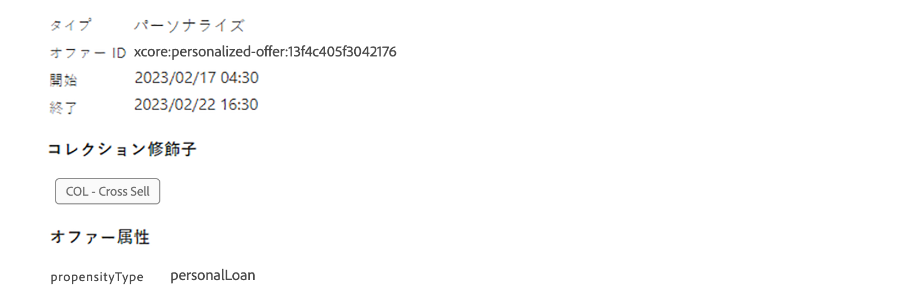

# ランク付け式 {#create-ranking-formulas}

## 式のランク付けについて {#about-ranking-formulas}

**ランク付けされた数式** によって、キャンペーンが特定の場所にどのオファーを最初に表示するかを決定するルールを定義することができます。

ランク付け式は pql シンタックス **で** 表され、プロファイル属性、context データ、およびオファー属性を利用できます。PQL シンタックスの使用方法について詳しくは、専用のマニュアル ](https://experienceleague.adobe.com/docs/experience-platform/segmentation/pql/overview.html) を [ 参照してください。

ランク計算式が作成されると、決定の位置に割り当てることができます。 詳細については、「決定 ](../offer-activities/configure-offer-selection.md) 機能の設定」を参照してください [ 。

## ランク付け式の作成 {#create-ranking-formula}

ランキングの計算を作成するには、次の手順を実行します。

1. **[!UICONTROL Components]**&#x200B;メニューにアクセスし、タブを選択 **[!UICONTROL Rankings]** します。既に作成されているランキングのリストが表示されます。

   

1. クリック **[!UICONTROL Create ranking]** すると、新しいランク計算式が作成されます。

   

1. ランク付けには、式の名前、説明、およびフォーミュラを指定します。

   この例では、実際の気象が熱い場合に、すべてのオファーの優先度を「hot」属性に上げようとします。 **そのためには、contextdata が decisioning の呼び出しに渡されました。**

   

1. をクリック **[!UICONTROL Save]** します。 ランク付け式が作成されている場合は、一覧からそれを選択して、詳細を取得して編集または削除することができます。

   これで、配置について適切なランク付けに使用できるようになりました (決定 ](../offer-activities/configure-offer-selection.md) については、「設定項目の設定」を参照してください [ )。

   

## ランク付け式の例 {#ranking-formula-examples}

必要に応じて、様々なランクの数式を作成することができます。 次に例を示します。

<!--
Boost by offer ID

Boost the priority of an offer with the offer ID *xcore:personalized-offer:13d213cd4cb328ec* by 5.

**Ranking formula:**

```
if( offer._id = "xcore:personalized-offer:13d213cd4cb328ec", offer.rank.priority + 5, offer.rank.priority)
```

Change the offer priority based on a certain profile attribute

Set the offer priority to 30 for offer *xcore:personalized-offer:13d213cd4cb328ec* if the user lives in the city of Bondi.

**Ranking formula:**

```
if( offer._id = "xcore:personalized-offer:13d213cd4cb328ec" and homeAddress.city.equals("Bondi", false), 30, offer.rank.priority)
```

Boost multiple offers by offer ID based on the presence of a profile's segment membership

Boost the priority of offers based on whether the user is a member of a priority segment, which is configured as an attribute in the offer.

**Ranking formula:**

```
if( segmentMembership.get("ups").get(offer.characteristics.prioritySegmentId).status in (["realized","existing"]), offer.rank.priority + 10, offer.rank.priority)
```
-->

### 「ブースト」属性により、profile 属性に基づいた特定のオファー属性が提供されます。

プロフィールがオファーに対応した都市にある場合は、その都市にあるすべての特典の優先度を2倍にします。

**ランク付けの数式:**

```
if( offer.characteristics.city = homeAddress.city, offer.rank.priority * 2, offer.rank.priority)
```

### 「終了日」の値が24時間未満になるようにします。

**ランク付けの数式:**

```
if( offer.selectionConstraint.endDate occurs <= 24 hours after now, offer.rank.priority * 3, offer.rank.priority)
```

### 「ブースト」属性に、context データに基づく特定の提供属性があります。

Decisioning の呼び出しに渡される context データに基づいて、一部のオファーを強化します。 例えば、が decisioning 呼び出しに渡される場合 `contextData.weather=hot` は、すべてのサービス `attribute=hot` の優先度をブーストする必要があります。

**ランク付けの数式:**

```
if (@{_xdm.context.additionalParameters;version=1}.weather.isNotNull()
and offer.characteristics.weather=@{_xdm.context.additionalParameters;version=1}.weather, offer.rank.priority + 5, offer.rank.priority)
```

Decisioning API を使用している場合、次の例に示すように、context データは要求本文の profile 要素に追加されることに注意してください。

**要求本文から抜粋したスニペット:**

```
"xdm:profiles": [
{
    "xdm:identityMap": {
        "crmid": [
            {
            "xdm:id": "CRMID1"
            }
        ]
    },
    "xdm:contextData": [
        {
            "@type":"_xdm.context.additionalParameters;version=1",
            "xdm:data":{
                "xdm:weather":"hot"
            }
        }
    ]
 }],
```

### お客様によって提供される製品の購入に propensity の向上

お客様の propensity 得点に基づいて、オファーのスコアを上げることができます。

次の例では、インスタンステナントが *_salesvelocity* 、プロファイルスキーマに、配列に保存されたスコアの範囲が格納されています。


この場合、次のようなプロファイルを指定します。

```
{"_salesvelocity": {"individualScoring": [
                    {"core": {
                            "category":"insurance",
                            "propensityScore": 96.9
                        }},
                    {"core": {
                            "category":"personalLoan",
                            "propensityScore": 45.3
                        }},
                    {"core": {
                            "category":"creditCard",
                            "propensityScore": 78.1
                        }}
                    ]}
}
```

このオファーには、スコアのカテゴリと一致する propensitytype *の* 属性が含まれています。



これにより、ランク付けが実行されるたびに各オファーの優先度を設定して、その *propensityscore* *と一致* させることができます。スコアが見つからない場合は、オファーに設定された静的な優先度を使用してください。

```
let score = (select _Individual_Scoring1 from _salesvelocity.individualScoring
             where _Individual_Scoring1.core.category.equals(offer.characteristics.propensityType, false)).head().core.propensityScore
in if(score.isNotNull(), score, offer.rank.priority)
```
