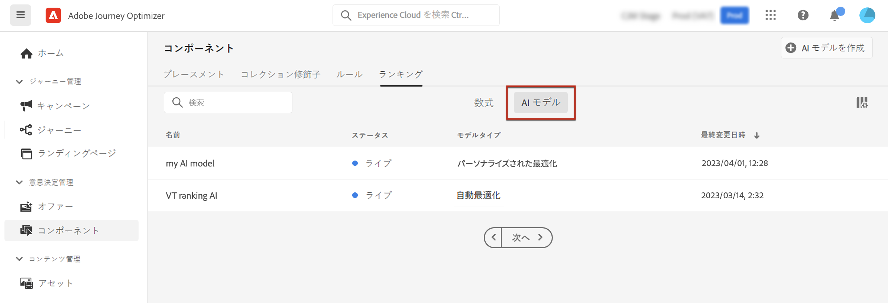
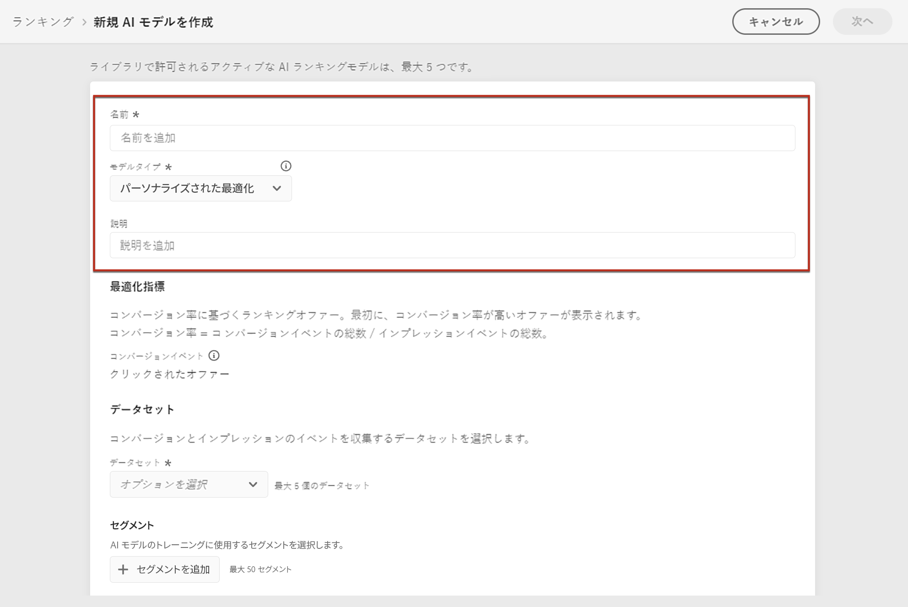
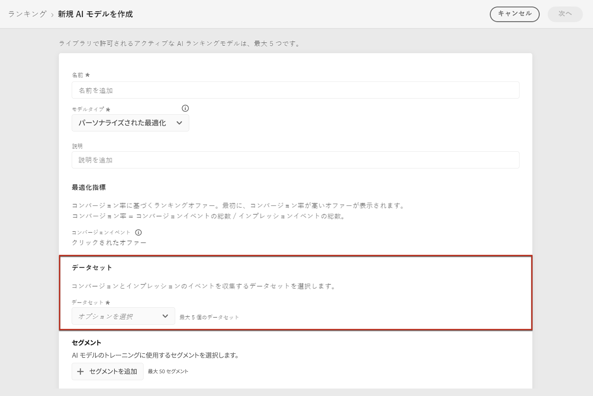
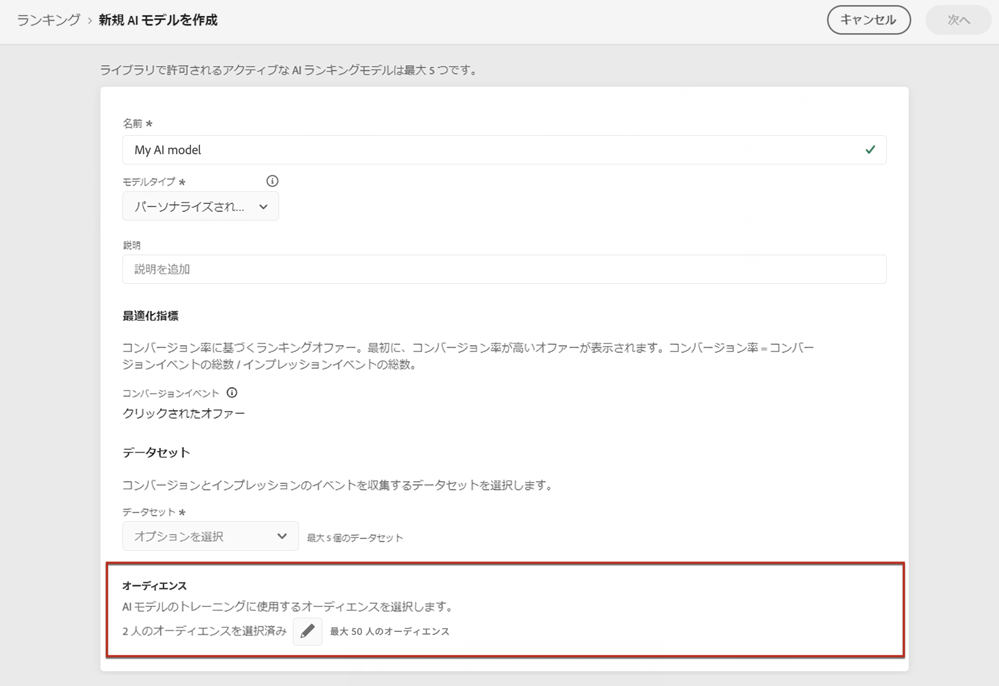
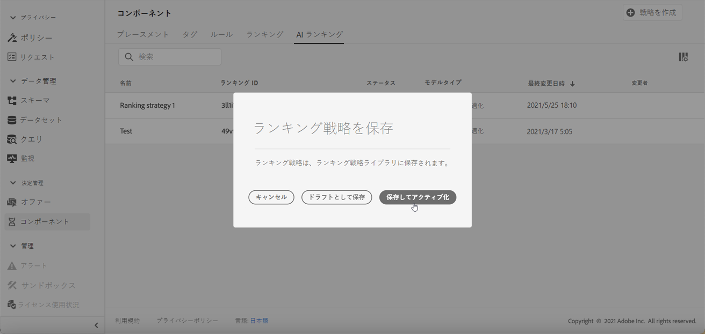

# AI モデルの作成 {#ai-rankings}

[!DNL Journey Optimizer] を使用すると、ビジネス目標に基づいてオファーをランク付けする **AI モデル**&#x200B;を作成できます。

>[!CAUTION]
>
>AI モデルを作成、編集または削除するには、**ランキング戦略を管理**&#x200B;する権限が必要です。[詳細情報](../../administration/high-low-permissions.md#manage-ranking-strategies)

## AI モデルの作成 {#create-ranking-strategy}

>[!CONTEXTUALHELP]
>id="ajo_decisioning_ai_model_metric"
>title="最適化指標"
>abstract="[!DNL Journey Optimizer] は&#x200B;**コンバージョン率**&#x200B;に基づいてオファーをランク付けします（コンバージョン率 = コンバージョンイベントの合計数／インプレッションイベントの合計数）。コンバージョン率は、**インプレッションイベント**（表示されるオファー）と&#x200B;**コンバージョンイベント**（メールまたは web でのクリックにつながるオファー）の 2 種類の指標を使用して計算されます。これらのイベントは、提供されている Web SDK または Mobile SDK を使用して自動的にキャプチャされます。"

AI モデルを作成するには、次の手順を行います。

1. コンバージョンイベントが収集されるデータセットを作成します。[方法についてはこちらを参照](../data-collection/create-dataset.md)

1. **[!UICONTROL コンポーネント]**&#x200B;メニューで、「**[!UICONTROL ランキング]**」タブに移動し、「**[!UICONTROL AI モデル]**」を選択します。

   

   これまでに作成した AI モデルがすべてリストされます。

1. 「**[!UICONTROL AI モデルを作成]**」ボタンをクリックします。

1. AI モデルの一意の名前と説明を指定し、作成する AI モデルのタイプを選択します。

   * **[!UICONTROL 自動最適化]**&#x200B;は、過去のオファーのパフォーマンスに基づいてオファーを最適化します。[詳細情報](auto-optimization-model.md)
   * **[!UICONTROL パーソナライズされた最適化]**&#x200B;では、オーディエンスとオファーのパフォーマンスに基づいて、オファーを最適化およびパーソナライズします。[詳細情報](personalized-optimization-model.md)

   

   >[!NOTE]
   >
   >「**[!UICONTROL 最適化指標]**」セクションでは、AI モデルがオファーのランク付けを計算する際に使用するコンバージョンイベントに関する情報が提供されます。
   >
   >[!DNL Journey Optimizer] は&#x200B;**コンバージョン率**&#x200B;に基づいてオファーをランク付けします（コンバージョン率 = コンバージョンイベントの合計数／インプレッションイベントの合計数）。コンバージョン率は、次の 2 種類の指標を使用して計算されます。
   >* **インプレッションイベント**（表示されるオファー）
   >* **コンバージョンイベント**（メールまたは web でのクリックにつながるオファー）
   >
   >これらのイベントは、提供されている Web SDK または Mobile SDK を使用して自動的にキャプチャされます。詳しくは、[Adobe Experience Platform Web SDK の概要](https://experienceleague.adobe.com/docs/experience-platform/edge/home.html?lang=ja)を参照してください。

1. コンバージョンイベントとインプレッションイベントが収集されるデータセットを選択します。そのようなデータセットを作成する方法については、[こちらの節](../data-collection/create-dataset.md)を参照してください。 <!--This dataset needs to be associated with a schema that must have the **[!UICONTROL Proposition Interactions]** field group (previously known as mixin) associated with it.-->

   

   >[!CAUTION]
   >
   >「**[!UICONTROL エクスペリエンスイベント - 提案インタラクション]**」フィールドグループ（以前の mixin）に関連付けられたスキーマから作成されたデータセットのみがドロップダウンリストに表示されます。

1. **[!UICONTROL パーソナライズされた最適化]**&#x200B;の AI モデルを作成する場合は、AI モデルのトレーニングに使用するセグメントを選択します。

   ➡️ [この機能について詳しくは、ビデオを参照してください](#video)

   

   >[!NOTE]
   >
   >最大 5 個のオーディエンスを選択できます。

1. AI モデルを保存して有効化します。

   

<!--At this point, you must have:

* created the AI model,
* defined which type of event you want to capture - offer displayed (impression) and/or offer clicked (conversion),
* and in which dataset you want to collect the event data.-->

これで、オファーが表示やクリックされるたびに、対応するイベントが [Adobe Experience Platform Web SDK](https://experienceleague.adobe.com/docs/experience-platform/edge/web-sdk-faq.html?lang=ja#what-is-adobe-experience-platform-web-sdk%3F){target="_blank"} または Mobile SDK を使用し、**[!UICONTROL エクスペリエンスイベント - 提案インタラクション]**&#x200B;フィールドグループによって自動的にキャプチャされるようになります。

イベントタイプ（表示されたオファーまたはクリックされたオファー）で送信できるようにするには、Adobe Experience Platform に送信されるエクスペリエンスイベントで、各イベントタイプに正しい値を設定する必要があります。[方法についてはこちらを参照](../data-collection/schema-requirement.md)

## チュートリアルビデオ {#video}

パーソナライズされた最適化モデルを作成する方法と、そのモデルを決定に適用する方法について説明します。

>[!VIDEO](https://video.tv.adobe.com/v/3445952?captions=jpn&quality=12)
