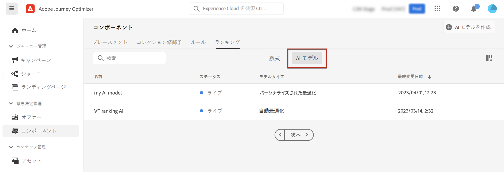
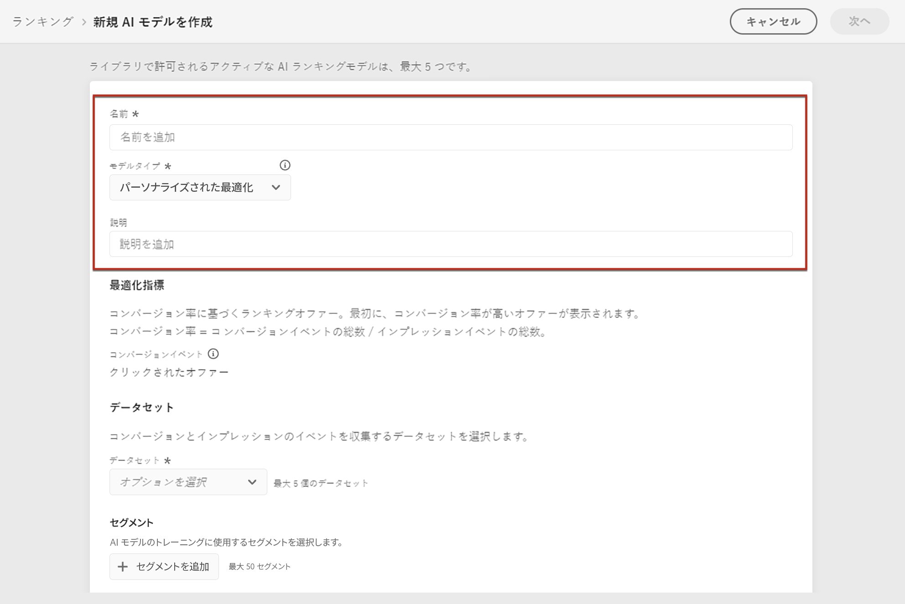
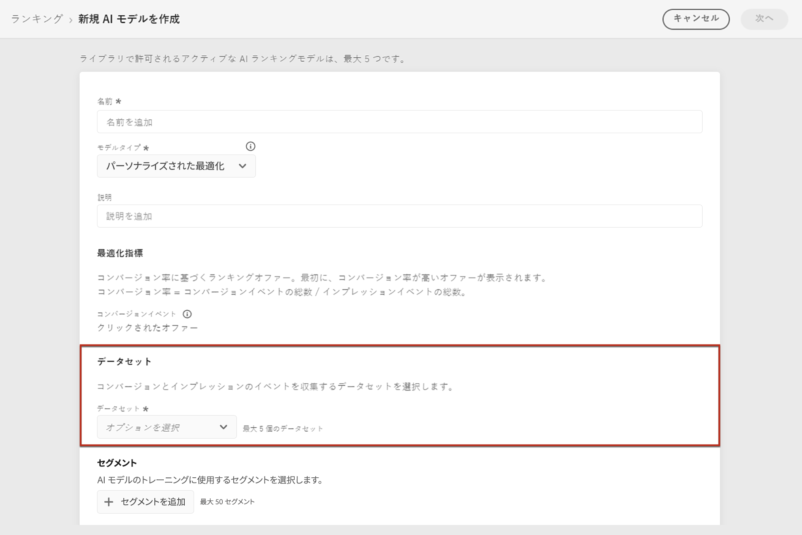
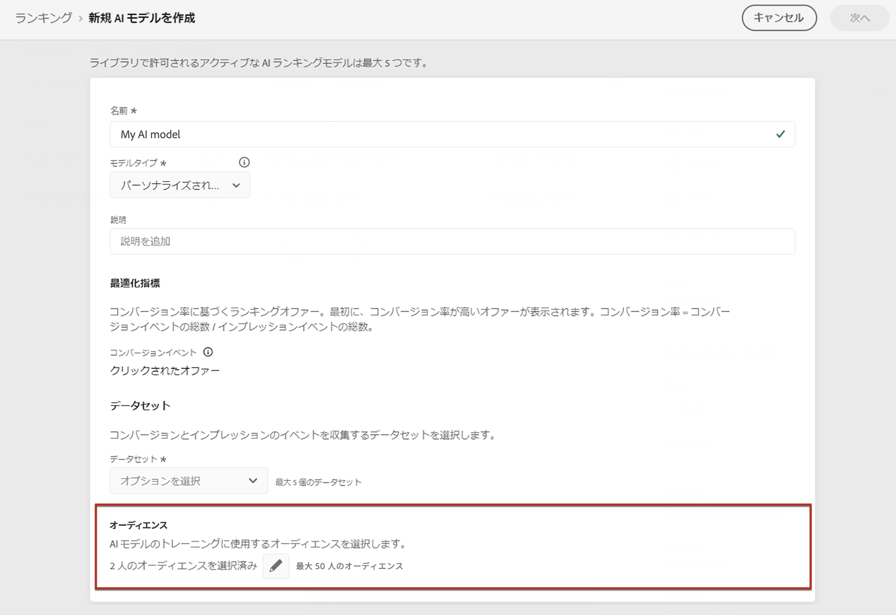
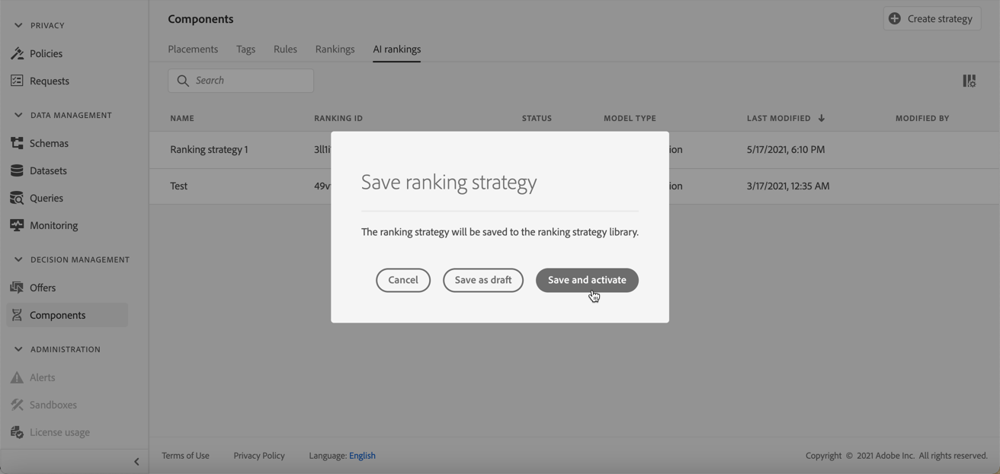

# AI モデルの作成 {#ai-rankings}

>[!TIP]
>
>[!DNL Adobe Journey Optimizer]の新しい決定機能である決定機能が、コードベースのエクスペリエンスとメールチャネルで利用できるようになりました。 [詳細情報](../../experience-decisioning/gs-experience-decisioning.md)

[!DNL Journey Optimizer]を使用すると、**AI モデル**&#x200B;を作成して、ビジネス目標に基づいてオファーをランク付けできます。

>[!CAUTION]
>
>AI モデルを作成、編集、または削除するには、**ランキング戦略の管理**&#x200B;権限が必要です。 [詳細情報](../../administration/high-low-permissions.md#manage-ranking-strategies)

## AI モデルの作成 {#create-ranking-strategy}

>[!CONTEXTUALHELP]
>id="ajo_decisioning_ai_model_metric"
>title="最適化指標"
>abstract="[!DNL Journey Optimizer]は、**コンバージョン率**&#x200B;に基づいてオファーをランク付けします（コンバージョン率= コンバージョンイベントの総数/ インプレッションイベントの総数）。 コンバージョン率は、**インプレッションイベント** （表示されるオファー）と&#x200B;**コンバージョンイベント** （電子メールまたはwebを介してクリックされるオファー）の2種類の指標を使用して計算されます。 これらのイベントは、提供されたWeb SDKまたはモバイルSDKを使用して自動的にキャプチャされます。"

AI モデルを作成するには、次の手順に従います。

1. コンバージョンイベントを収集するデータセットを作成します。 [方法を学ぶ](../data-collection/create-dataset.md)

1. **[!UICONTROL コンポーネント]** メニューで、**[!UICONTROL ランキング]** タブにアクセスし、**[!UICONTROL AI モデル]**&#x200B;を選択します。

   

   これまで作成したすべてのAI モデルが一覧表示されます。

1. 「**[!UICONTROL AI モデルを作成]**」ボタンをクリックします。

1. AI モデルの一意の名前と説明を指定し、作成するAI モデルのタイプを選択します。

   * **[!UICONTROL 自動最適化]**&#x200B;は、過去のオファーのパフォーマンスに基づいてオファーを最適化します。 [詳細情報](auto-optimization-model.md)
   * **[!UICONTROL パーソナライズ最適化]**&#x200B;は、オーディエンスとオファーのパフォーマンスに基づいて、オファーを最適化およびパーソナライズします。 [詳細情報](personalized-optimization-model.md)

   

   >[!NOTE]
   >
   >**[!UICONTROL 最適化指標]** セクションには、AI モデルがオファーのランキングを計算するために使用するコンバージョンイベントに関する情報が表示されます。
   >
   >[!DNL Journey Optimizer]は、**コンバージョン率**&#x200B;に基づいてオファーをランク付けします（コンバージョン率= コンバージョンイベントの総数/ インプレッションイベントの総数）。 コンバージョン率は、次の2種類の指標を使用して計算されます。
   >* **インプレッションイベント** （表示されるオファー）
   >* **コンバージョンイベント** （電子メールまたはweb経由でクリックされるオファー）。
   >
   >これらのイベントは、提供されたWeb SDKまたはモバイルSDKを使用して自動的にキャプチャされます。 詳しくは、[Adobe Experience Platform Web SDKの概要](https://experienceleague.adobe.com/docs/experience-platform/edge/home.html)を参照してください。

1. コンバージョンイベントとインプレッションイベントが収集されるデータセットを選択します。 このようなデータセットを作成する方法については、[このセクション &#x200B;](../data-collection/create-dataset.md)を参照してください。<!--This dataset needs to be associated with a schema that must have the **[!UICONTROL Proposition Interactions]** field group (previously known as mixin) associated with it.-->

   

   >[!CAUTION]
   >
   >**[!UICONTROL Experience Event - Proposition Interactions]** フィールドグループ （以前はmixinと呼ばれていました）に関連付けられたスキーマから作成されたデータセットのみが、ドロップダウンリストに表示されます。

1. **[!UICONTROL パーソナライズされた最適化]** AI モデルを作成する場合は、AI モデルのトレーニングに使用するセグメントを選択します。

   ➡️ [この機能をビデオで見つける](#video)

   

   >[!NOTE]
   >
   >最大5つのオーディエンスを選択できます。

1. AI モデルを保存してアクティブ化します。

   

<!--
At this point, you must have:

* created the AI model,
* defined which type of event you want to capture - offer displayed (impression) and/or offer clicked (conversion),
* and in which dataset you want to collect the event data.
-->

これで、オファーが表示されたり、クリックされたりするたびに、対応するイベントを、[Adobe Experience Platform Web SDK](https://experienceleague.adobe.com/docs/experience-platform/edge/web-sdk-faq.html#what-is-adobe-experience-platform-web-sdk%3F){target="_blank"}またはモバイル SDKを使用して&#x200B;**[!UICONTROL Experience Event - Proposition Interactions]** フィールドグループによって自動的にキャプチャされるようにします。

イベントタイプ（表示されたオファーまたはクリックされたオファー）で送信できるようにするには、Adobe Experience Platformに送信されるエクスペリエンスイベントのイベントタイプごとに正しい値を設定する必要があります。 [方法を学ぶ](../data-collection/schema-requirement.md)

## チュートリアルビデオ {#video}

パーソナライズされた最適化モデルの作成方法と、それを意思決定に適用する方法について説明します。

>[!VIDEO](https://video.tv.adobe.com/v/3419954?quality=12)
