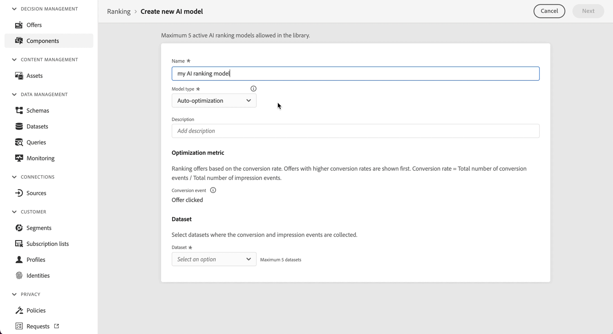
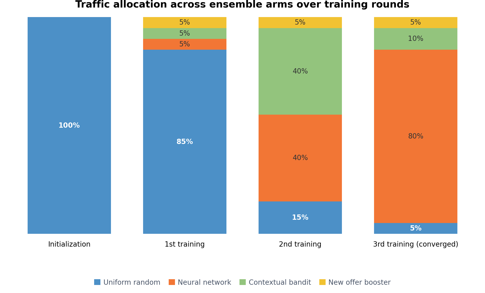

# パーソナライズされた最適化モデル {#personalized-optimization-model}

>[!TIP]
>
>[!DNL Adobe Journey Optimizer] の新しい決定機能である決定が、コードベースのエクスペリエンスチャネルとメールチャネルを通じて使用できるようになりました。 [決定の詳細](../../experience-decisioning/gs-experience-decisioning.md)

パーソナライズされた最適化では、教師ありマシンラーニングとディープラーニングの最先端テクノロジーを活用することで、ビジネスユーザー（マーケター）はビジネス目標を定義し、顧客データを活用して、ビジネス指向モデルをトレーニングして、パーソナライズされたオファーを提供し、KPIを最大化することができます。

パーソナライズされた最適化では、各オファーのグローバルパフォーマンスにもとづいて最適化される、パーソナライズされていないランキングとは異なり、個々の顧客の属性と、その顧客に対して選択されたKPIを最も促進する可能性が高いオファーとの関係を学習します。 これにより、一人ひとりの顧客に最適なオファーを提供するのではなく、各プロファイルに合わせたオファーを選択できます。

## ユースケースと利点 {#use-cases}

パーソナライズされた最適化は、さまざまな顧客が利用可能なオファーに異なる反応をするシナリオや、オファーカタログが有意義に差別化され、頻繁に変更されないシナリオを決定するのに適しています。 一般的なユースケースは次のとおりです。

* **次善のオファーの選択**：複数の競合するオファーまたはプロモーションのうち、各顧客にリアルタイムで提示するものを選択します。
* **コンテンツのパーソナライゼーション**:web、モバイル、電子メール、その他のチャネルをまたいで、各顧客に対するコンテンツ（バナー、クリエイティブなど）またはメッセージを選択します。
* **オーディエンスに応じたパーソナライゼーション**：顧客が誰であるか、インタラクションのコンテキストをレコメンデーションに反映できるように、オーディエンスメンバーシップとコンテキストシグナルを組み込みます。
* **収益と価値の最適化**：クリックやコンバージョンなどのバイナリ結果に加えて、収益や顧客生涯価値などの継続的な結果に向けて最適化します。

主な利点：

* グローバルに最適な単一のオファーではなく、各顧客が最も反応する可能性の高いオファーを提供することで、選択したビジネス KPIを最大化できます。
* 新しいインタラクションデータの到着に合わせて継続的に適応し、テストが不十分なオファーの探索と実績のあるパフォーマーの活用のバランスを取ります。
* AI モデル式ビルダー式で直接使用できるランキングスコアにより、バイナリ指標と連続最適化指標の両方をサポートしています。
* オファーと顧客の適合性を自動的に学習することで、A/B テストやルール作成にかかる手作業を削減できます。

## データセットの要件 {#dataset}

パーソナライズされた最適化モデルをトレーニングするには、データセットに、過去30日以内に少なくとも250の表示イベント（インプレッションなど）と1つの成功イベント（クリックまたはコンバージョンなど）を含む少なくとも2つのオファーが必要です。

250件未満のディスプレイイベントや、過去30日以内に成功イベントがないオファーは、引き続き探索トラフィックに含めることができます。 また、パーソナライゼーショントラフィックに含める資格もありますが、必要な最小表示/成功イベントを満たし、モデルが再トレーニングされるまで、決定における最悪のスコアリング予測オファーと同等に扱われます。

パーソナライズされた最適化モデルが初めてトレーニングされるまで、パーソナライズされた最適化モデルを利用した選択戦略内のオファーはランダムに提供されます。

## 仕組み {#how}

モデルでは、オファー、ユーザー情報およびコンテキスト情報間の複雑な機能インタラクションを学習し、パーソナライズされたオファーをエンドユーザーに推奨します。 機能は、モデルへの入力です。

次の 3 種類の機能があります。

| 機能タイプ | モデルに機能を追加する方法 |
|--------------|----------------------------|
| 意思決定オブジェクト（placementID、activityID、decisionScopeID） | AEP に送信される意思決定管理フィードバックエクスペリエンスイベントの一部 |
| オーディエンス | ランキング AI モデルを作成する際に、0～50 のオーディエンスを機能として追加できます |
| コンテキストデータ | AEP に送信される意思決定フィードバックエクスペリエンスイベントの一部。 スキーマに追加できるコンテキストデータ：コマースの詳細、チャネルの詳細、アプリケーションの詳細、web の詳細、環境の詳細、デバイスの詳細、placeContext |

このモデルには次の 2 つのフェーズがあります。

* **オフラインモデルトレーニング**&#x200B;フェーズでは、履歴データで機能インタラクションを学習および記憶することによってモデルをトレーニングします。
* **オンライン推論** フェーズでは、候補オファーは、モデルによって生成されたリアルタイムのスコアに基づいてランク付けされます。 ユーザーやオファーの機能を含めるのが困難な従来の協調フィルタリング手法とは異なり、パーソナライズされた最適化はディープラーニングにもとづくレコメンデーション手法であり、複雑で非線形な機能のインタラクションパターンを含めて学習することができます。

このモデルは、バイナリ変数（クリック数やコンバージョン数など）に加え、連続的な変数（収益や顧客のライフタイムバリューなど）の最適化をサポートします。 クリックなどのバイナリ指標の予測値は、常に0 ～ 1の間になります。 注文値などの連続指標の予測値は、常に0以上の数値になります。 ランキングスコアは正規化され、式や比較で使用される場合に、両方の指標タイプで一貫した動作を保証します。

## 実例 {#illustrative-example}

### バイナリ応答（コンバージョン） {#binary-response}

ユーザーとオファー間の過去のインタラクションに関する、簡素化されたデータセットを検討する。 各行には、表示されたオファーが記録されます。2つの顧客シグナルは、ロイヤルティ層（高= 1）と、顧客が最近メールを開封したかどうか（はい= 1）、顧客がコンバージョンしたかどうか（はい= 1）です。

オファーAでは、両方のシグナルが一致する（高い場合も低い場合も）場合、コンバージョンの可能性が高くなります。 オファーBでは、ロイヤルティ層に関係なく、電子メールが開封されたときにコンバージョンに達する可能性が高くなります。 このモデルは、学習したパターンにもとづいて、顧客一人ひとりのシグナルにもとづいて、より優れたオファーを予測できます。

顧客シグナルに基づく、オファーAとオファーBの

*図1：強調表示された不一致の行で、シグナルが一致せず、コンバージョンしなかった場合にオファーAが表示されます。 学習したパターンに基づいて、オファーBは次回の顧客に対する推奨として最適です。*

これがアプローチの本質です。過去の機能インタラクションを学習および記憶し、それらを適用して、各顧客にパーソナライズされた予測を生成します。

### 継続的な対応（収益） {#continuous-response}

同じ考え方が継続的な成果にも及んでいます。 このモデルは、顧客がコンバージョンに至るかどうかを予測する代わりに、オファーと顧客セグメントごとに連続的な価値（予想売上）を予測し、その予測価値にもとづいてオファーをランク付けします。

*図2: 4つの顧客セグメントにわたる2つのオファーの予測収益。 電子メールを開封したロイヤルティの高い顧客に対しては、オファーAが最も多くの売上をもたらすことが期待されています。電子メールを開封したロイヤルティの低い顧客に対しては、オファーBが優れた選択肢となります。 モデルは、すべての顧客に1つのルールを適用するのではなく、各セグメントに対して最も予測値の高いオファーを選択します。*

## モデルコンポーネントのアンサンブル {#ensemble}

パーソナライズされた最適化は、アンサンブルモデルとして提供されます。いくつかの補完的なモデルアームが一緒に動作し、監督層が各アームがどれだけのライブトラフィックを受け取るかを決定します。 この設計により、システムは2つの目標を同時に追求できます。最もパフォーマンスの高いオファーを学習する（探索）と、パフォーマンスの高いオファーを提供する（搾取）ことです。

**探索と活用のバランス**

あらゆる意思決定システムは、情報を収集するためにテストが不十分なオファーを探すことと、実績のあるオファーを活用して即座にリターンを最大化することの間のトレードオフに直面しています。 探索のためのトラフィックを少なすぎると、潜在的な可能性の高いオファーが見つからなくなり、多くの犠牲を予約すると、既にパフォーマンスを発揮しているオファーが向上します。 アンサンブルは、最小限の探索フロアを保持しながら、残りのトラフィックをよりパフォーマンスの高いパーソナライズされた武器に時間をかけてシフトさせることで、このバランスを自動的に管理します。

アンサンブルは4つの交通機関で構成されています：

### ユニフォームランダム（探索アーム） {#uniform-random}

均一ランダムアームは、対象となるオファーの中からランダムに顧客にオファーを割り当てる。 このモデルでは、どのようなオファーも好ましくないため、顧客がカタログ全体でどのように反応するか、つまりパーソナライズされた武器の原材料に関する偏りのないデータを生成します。 最初のモデルが訓練される前にアクティブな唯一のアームであり、その後、システムが学習を続けるために最小限の探査フロアを保持し続けます。

* 初期化時：トラフィックの100%。
* 最初のトレーニングの実行後：1つのオファーごとに観察されたインプレッションとコンバージョンイベントの数に応じて、トラフィックの最低5 ～ 20%、最大85%。

### ニューラルネットワーク（personalized arm） {#neural-network}

ニューラルネットワークは、顧客の属性とオーディエンスメンバーシップにもとづいて、顧客に最適なオファーを予測する、パーソナライズされた施策です。 オファー、顧客の機能、コンテキスト間の複雑で非直線的なインタラクションを学習し、多くの機能をまたいで微妙なパターンを捉えるのに適しています。

* 初期化時：トラフィックの0%。
* 最初のトレーニングの実行後：トラフィックの最低5%、最大85%。

### コンテクスト型バンディット（personalized arm） {#contextual-bandit}

コンテクストにもとづくバンディットとは、継続的に学習とパフォーマンスのバランスを取るバンディット手法を用いて、オーディエンスメンバーシップにもとづいて顧客一人ひとりに対する最適なオファーを予測する、2番目にパーソナライズされたチームです。 ニューラルネットワークと並行して運用することで、ふたつの独自のパーソナライズされた手法の強みを活用できます。

* 初期化時：トラフィックの0%。
* 最初のトレーニングの実行後：トラフィックの最低5%、最大85%。

### 新しいオファーブースター（パーソナライズされていないアーム） {#new-offer-booster}

新しいオファーブースターは、モデルのルックバック期間内にインプレッションイベントが記録されていないものなど、新しいオファーのパフォーマンスに関して楽観的な仮定を立てる、全体的な勝者であるThompson Sampling バンディット（パーソナライズされていない）です。 これにより、有望な新規オファーは早期に発見する必要があり、モデルが十分なトラフィックを新規オファーや高パフォーマンスだが適格性が限定的なオファーに誘導するのに苦慮していた既知のコールドスタートの欠点に対処できます。

* 真のインプレッションとコンバージョンデータが収集されると、各オファーの推定パフォーマンスは、真の基礎となるパフォーマンスに素早く近づき、楽観的な仮定の影響はゼロに近づきます。
* オファーが比較的新しくない場合（すべてのオファーに同程度のインプレッション数がある、すべて1,000を超えるインプレッションがある場合など）、楽観的効果はほぼゼロであり、このアームは、実際にはパーソナライズされていない全体的な勝者モデルとして動作します。
* 初期化時：トラフィックの0%。
* 最初のトレーニングが成功した後：トラフィックの5%。

### トラフィックの割り当て {#traffic-allocation}

初期化時、モデルはまだトレーニングされていないため、トラフィックの100%が均一なランダムベースライン（学習した分布を持つ唯一のアーム）に送信されます。 最初のトレーニングランが成功した後、各アームは最小トラフィックフロア（5%）を受け取り、監督者バンディットは観察されたパフォーマンスに基づいて残りのトラフィックを割り当てます。 このモデルが複数のラウンドを連続して訓練すると、トラフィックは可能な限り85%のトラフィックを割り当てながら、最もパフォーマンスの高い武器に向かって収束します。

*図3：初期化時および連続するトレーニング ラウンド間の4つのアンサンブル アーム間のトラフィック割り当て軌道の可能性。 初期化時に、すべてのトラフィックはランダムなベースラインに流れます。 トレーニングの実行後、監督のThompson Sampling バンディットは、最小5%のトラフィックを維持しながら、よりパフォーマンスの高い武器に割り当てをシフトします。 実際の割り当ては、観察された腕のパフォーマンスに基づいて異なります。*

## 主要モデルの仮定と制限事項 {#key}

パーソナライズされた最適化を使用する利点を最大限に活かすために、いくつかの主な前提と制限事項に注意する必要があります。

* **ユーザーが検討中のオファー間で様々な環境設定を使用できるよう、オファーは十分に異なります**。 オファーが類似しすぎる場合、応答が一見ランダムに見えるので、結果として得られるモデルの影響は少なくなります。例えば、銀行が2つのクレジットカードのオファーを提供しており、その違いが色だけである場合、どのカードが推奨されているかは関係ありませんが、各カードの条件が異なる場合、特定の顧客が1つを選択する理由を裏付け、より効果的なモデルを構築するためにオファー間で十分な違いを提供します。
* **ユーザートラフィックの構成が安定しています**。 モデルのトレーニングと予測中にユーザートラフィックの構成が大幅に変化すると、モデルのパフォーマンスが低下する可能性があります。 例えば、モデルのトレーニングフェーズで、オーディエンス A のユーザーのデータしか利用できない場合、トレーニング済みのモデルを使用してオーディエンス B のユーザーの予測を生成すると、モデルのパフォーマンスに影響する可能性があります。
* **オファーのパフォーマンスは短期間に大幅に変化するものではありません**。このモデルは毎週更新され、モデルの更新に伴ってパフォーマンスの変化が伝えられます。 例えば、ある製品は以前は非常に人気がありましたが、公開レポートでその製品が健康に有害であることが特定されると、急速に人気がなくなりました。 このシナリオでは、ユーザーの行動の変化でモデルが更新されるまで、モデルは引き続きこの製品を予測できます。

## コールドスタートの問題 {#cold-start}

レコメンデーションを行うのに十分なデータがない場合、コールドスタートの問題が発生します。 パーソナライズされた最適化には、4つの種類のコールドスタート問題があります。

* **履歴データのない新しいAI モデルを作成した後**、オファーは必要なデータを収集するために一定期間ランダムに提供され、その後、最初のモデルのトレーニングに使用されます。
* **最初のAI モデルがリリースされた後**、総トラフィックの一部が均一なランダム探索に割り当てられ、残りはモデルのレコメンデーションに使用されます。 探索および悪用バンディットコンポーネント全体のトラフィック分布は、オファー数やそのパフォーマンスしきい値などの要因に基づいて自動的に調整されます。
* **AI ランキングモデルに関連付けられた戦略で選択されたオファーコレクション**&#x200B;に新しいオファーが追加されると、それらのオファーは、均一なランダムモデルと新しいオファーブースターモデル腕の両方（60分以内）による探索の対象となる候補になります。 次回の予定された再トレーニング実行中に、オファーの推定パフォーマンスが新しいオファーブースターモデルアームで更新され、インプレッションとクリックのしきい値を満たした場合、オファーはパーソナライズされたモデルアームに含まれる資格が得られます。
* **AI ランキング モデルに関連付けられた選択戦略に関連付けられている既存のオーディエンスセット**&#x200B;に新しいプロファイルが追加された後、それらのプロファイルは、オーディエンスセット自体からパーソナライゼーション属性を継承します。 したがって、コールドスタートの問題もなく、最初から属性に基づいてパーソナライズされたオファーを受け取ることができます。

## 再トレーニング {#re-training}

最新の機能インタラクションを学習し、モデルパフォーマンスの低下を軽減するために、モデルの再トレーニングが毎週行われます。
