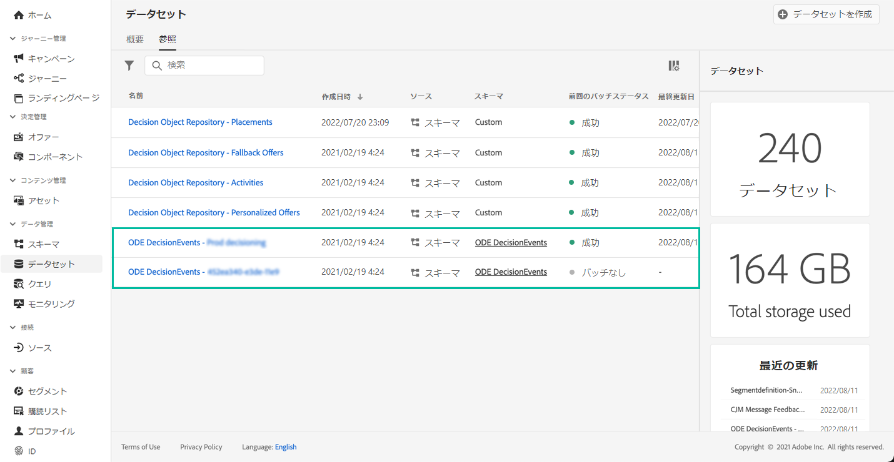

# Decision Managementイベントの使い始めに{#monitor-offer-events}

Decision Managementが特定のプロファイルに対して決定を行うたびに、これらのイベントに関連する情報がAdobe Experience Platformに自動的に送信されます。

これにより、これらのデータをエクスポートして、その分析結果を独自のレポートシステムに送信できます。また、分析やレポートの強化を目的として、Adobe Experience Platform の[クエリサービス](https://experienceleague.adobe.com/docs/experience-platform/query/home.html?lang=ja)を他のツールと組み合わせて利用することもできます。

Decision Managementイベントを含むデータセットは、Adobe Experience Platform **[!UICONTROL データセット]**&#x200B;メニューからアクセスできます。 各インスタンスのプロビジョニング時に、データセットが 1 つ自動的に作成されます。

これらのデータセットは、**[!UICONTROL ODE DecisionEvents]**&#x200B;スキーマに基づいています。この中には、Decision ManagementからAdobe Experience Platformに情報を送信するために必要なすべてのXDMフィールドが含まれています。

>[!NOTE]
>
>なお、ODE DecisionEvents データセットは&#x200B;**プロファイル以外のデータセット**&#x200B;です。つまり、Experience Platform に取り込んでリアルタイム顧客プロファイルで使用することはできません。

**関連トピック：**

* [Decision Managementイベントの主な情報](../reports/key-information.md)
* [イベントの XDM フィールドへのアクセス ](../reports/xdm-fields.md)
