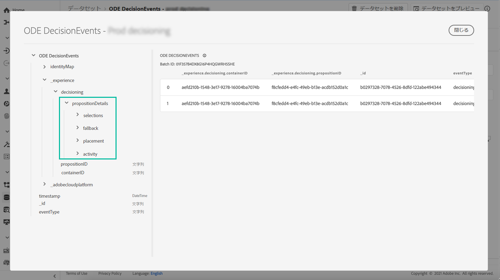

# 意思決定管理イベントの基本を学ぶ {#monitor-offer-events}

意思決定管理で特定のプロファイルに対する決定が行われるたびに、これらのイベントに関連する情報が Adobe Experience Platform に自動的に送信されます。

これにより、意思決定に関するインサイトを得て、例えば特定のプロファイルに提示されたオファーを把握することができます。これらのデータをエクスポートして分析し、独自のレポートシステムに取り込むことも、分析とレポート作成の強化を目的に他のツールと組み合わせて Adobe Experience Platform [クエリサービス](https://experienceleague.adobe.com/docs/experience-platform/query/home.html?lang=ja) を活用することもできます。

## データセットで使用できる主な情報 {#key-information}

意思決定時に送信される各イベントには、分析とレポートに利用できる 4 つの主要なデータポイントが含まれています。

* **[!UICONTROL フォールバック]**：フォールバックオファーの名前と ID（パーソナライズされたオファーが選択されていない場合）
* **[!UICONTROL プレースメント]**：オファーの配信に使用するプレースメントの名前、ID、チャネル
* **[!UICONTROL 選択]**：プロファイルに対して選択したオファーの名前と ID
* **[!UICONTROL アクティビティ]**：決定の名前と ID

さらに、**[!UICONTROL identityMap]** と **[!UICONTROL Timestamp]** の各フィールドを利用して、オファー配信時のプロファイルと時刻に関する情報を取得することもできます。

決定のたびに送信されるすべての XDM フィールドについて詳しくは、[この節](xdm-fields.md)を参照してください。

## データセットへのアクセス {#access-datasets}

意思決定管理イベントを含むデータセットには、Adobe Experience Platform の&#x200B;**[!UICONTROL データセット]**&#x200B;メニューからアクセスできます。各インスタンスのプロビジョニング時、データセットが自動的に 1 つ作成されます。

これらのデータセットは、**[!UICONTROL ODE DecisionEvents]** スキーマに基づいています。このスキーマには、意思決定管理サービスから Adobe Experience Platform に情報を送信するために必要なすべての XDM フィールドが含まれています。

>[!NOTE]
>
>なお、ODE DecisionEvents データセットは&#x200B;**プロファイル以外のデータセット**&#x200B;です。つまり、Experience Platform に取り込んでリアルタイム顧客プロファイルで使用することはできません。
