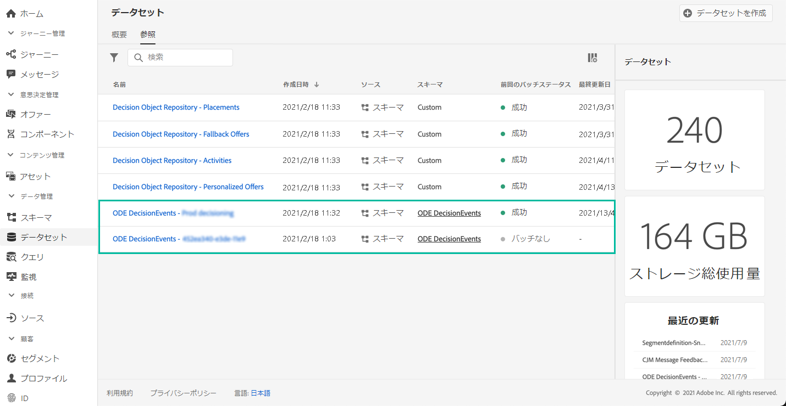

# 決定管理イベントの概要 {#monitor-offer-events}

決定管理サービスで特定のプロファイルに対する決定が行われるたびに、これらのイベントに関連する情報が Adobe Experience Platform へと自動的に送信されます。

これにより、これらのデータをエクスポートして、その分析結果を独自のレポートシステムに送信できます。また、分析やレポートの強化を目的として、Adobe Experience Platform の[クエリサービス](https://experienceleague.adobe.com/docs/experience-platform/query/home.html?lang=ja)を他のツールと組み合わせて利用することもできます。

決定管理イベントを含むデータセットは、Adobe Experience Platform の&#x200B;**[!UICONTROL データセット]**&#x200B;メニューからアクセスできます。各インスタンスのプロビジョニング時、データセットが自動的に 1 つ作成されます。

これらのデータセットは、**[!UICONTROL ODE DecisionEvents]** スキーマに基づいています。このスキーマには、決定管理サービスから Adobe Experience Platform に情報を送信するために必要なすべての XDM フィールドが含まれています。

>[!NOTE]
>
>なお、ODE DecisionEvents データセットは&#x200B;**プロファイル以外のデータセット**&#x200B;です。つまり、Experience Platform に取り込んでリアルタイム顧客プロファイルで使用することはできません。

**関連トピック：**

* [決定管理イベントの主な情報](../reports/key-information.md)
* [イベントの XDM フィールドへのアクセス](../reports/xdm-fields.md)
