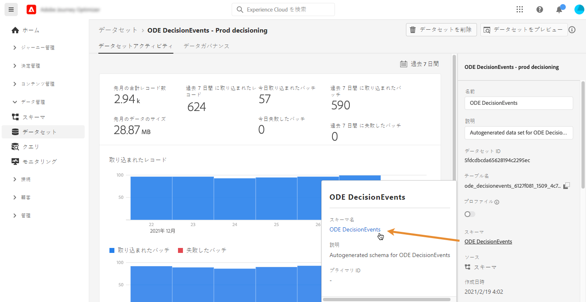
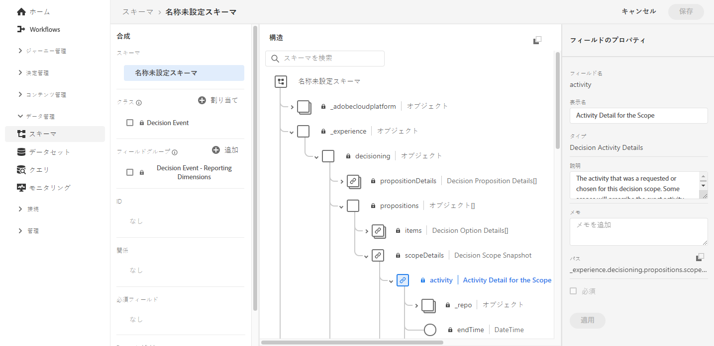

# イベントの XDM フィールドへのアクセス {#decisioningevents-xdm-schema}

意思決定管理イベントを含むデータセットから、DecisioningEvents XDM スキーマに直接アクセスできます。

このスキーマには、意思決定管理から Adobe Experience Platform へ情報を送信するために必要なすべてのフィールドが含まれています。

特定のフィールドの詳細を取得するには、そのフィールドを選択して、フィールドのプロパティを一覧できる情報ペインを表示します。

XDM スキーマおよびフィールドの使用方法について詳しくは、Experience Data Model（XDM）に関する次のドキュメントを参照してください。

* [XDM システムの概要](https://experienceleague.adobe.com/docs/experience-platform/xdm/home.html?lang=ja)
* [XDM リソースの参照](https://experienceleague.adobe.com/docs/experience-platform/xdm/ui/explore.html?lang=ja)
