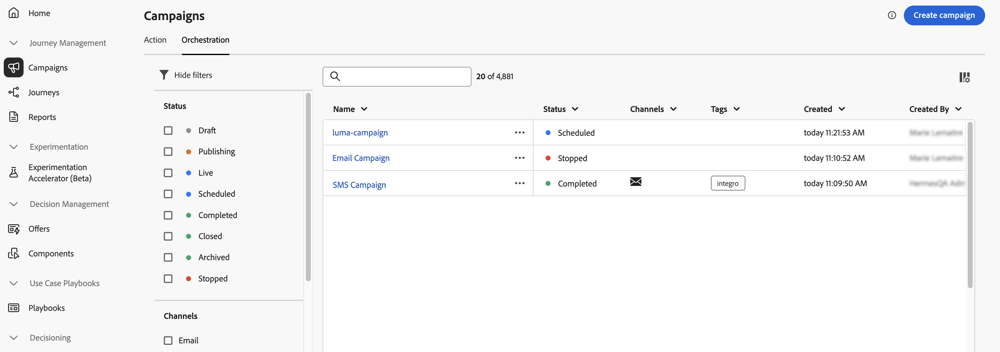

# 調整されたキャンペーンへのアクセスと管理 {#orchestrated-campaign-creation}

>[!CONTEXTUALHELP]
>id="ajo_targeting_workflow_list"
>title="調整されたキャンペーン"
>abstract="この画面では、調整されたキャンペーンの完全なリストにアクセスし、現在のステータス、前回／次回の実行日を確認して、新しい調整されたキャンペーンを作成できます。"

>[!CONTEXTUALHELP]
>id="ajo_orchestration_campaign_action"
>title="アクション"
>abstract="この節では、調整されたキャンペーン内で使用されるすべてのアクションを示します。"

+++ 目次

| 調整されたキャンペーンへようこそ | 最初の調整されたキャンペーンの開始 | データベースのクエリ | 調整されたキャンペーンアクティビティ |
|---|---|---|---|
| [ オーケストレーションされたキャンペーンの基本を学ぶ ](gs-orchestrated-campaigns.md)  [ 設定手順 ](configuration-steps.md)  <b>[ オーケストレーションされたキャンペーンへのアクセスと管理 ](access-manage-orchestrated-campaigns.md)</b> | [ キャンペーンの作成を調整するための主な手順 ](gs-campaign-creation.md)  [ キャンペーンの作成およびスケジュール設定 ](create-orchestrated-campaign.md)  [ アクティビティの調整 ](orchestrate-activities.md)  [ キャンペーンの開始および監視 ](start-monitor-campaigns.md)  [ レポート ](reporting-campaigns.md) | [ ルールビルダーの操作 ](orchestrated-rule-builder.md)  [ 最初のクエリの作成 ](build-query.md)  [ 式の編集 ](edit-expressions.md) | [ アクティビティの基本を学ぶ ](activities/about-activities.md)   アクティビティ： [AND 結合 ](activities/and-join.md) - [ オーディエンスを作成 ](activities/build-audience.md) - [ ディメンションの変更 ](activities/change-dimension.md) - **[チャネルアクティビティ](activities/channels.md)** - [ 結合 ](activities/combine.md) - [ 重複排除 ](activities/deduplication.md) - [ エンリッチメント ](activities/enrichment.md) - [ 分岐 ](activities/fork.md) - [ 紐付け ](activities/reconciliation.md)   - |

{style="table-layout:fixed"}

+++

 

## 調整されたキャンペーンへのアクセス

**[!UICONTROL キャンペーン]** メニューに移動し、「**[!UICONTROL オーケストレーション]** タブを選択して、オーケストレーションされたキャンペーンの完全なリストにアクセスします。

{zoomable="yes"}{zoomable="yes"}

リスト内でオーケストレーションされた各キャンペーンには、キャンペーンの現在の [ ステータス ](#status)、関連付けられたチャネルとタグ、前回の変更日時などの情報が表示されます。 「 ボタンをクリックすると、表示される列をカスタマイズできます。

また、検索バーとフィルターを使用して、リスト内での検索を簡単にすることができます。例えば、オーケストレーションされたキャンペーンをフィルタリングして、特定のチャネルやタグに関連付けられているキャンペーンや、特定の日付範囲内に作成されたキャンペーンのみを表示できます。

キャンペーンインベントリの  ボタンを使用すると、以下に説明する様々な操作を実行できます。

* **[!UICONTROL すべての時間レポートを表示]** / **[!UICONTROL 過去 24 時間のレポートを表示]** - レポートにアクセスして、オーケストレーションされたキャンペーンの影響とパフォーマンスを測定および視覚化します。 [ オーケストレートキャンペーンレポートについて詳しくはこちらを参照 ](../orchestrated/reporting-campaigns.md)
* **[!UICONTROL タグを編集]** - キャンペーンに関連付けられたタグを編集します。
* **[!UICONTROL 複製]** – 停止されたキャンペーンを実行したり、スケジュールされたキャンペーンの実行頻度を変更したりするために、オーケストレーションされたキャンペーンを複製する必要がある場合があります。
* **[!UICONTROL 削除]** - キャンペーンを削除します。 このアクションは、**[!UICONTROL ドラフト]** キャンペーンでのみ使用できます。
* **[!UICONTROL アーカイブ]** - キャンペーンをアーカイブします。 アーカイブされたすべてのキャンペーンは、最終変更日から 30 日後にローリング再スケジュールで削除されます。 このアクションは、「ドラフト **[!UICONTROL キャンペーンを除くすべてのキャンペーンで使用]** きます。

## オーケストレーションされたキャンペーンの内部とは {#gs-ms-campaign-inside}

調整されたキャンペーンキャンバスは、実行される処理を表現したものです。 これは、実行される様々なタスクと、タスク同士の関係を示すものです。

調整された各キャンペーンには、次が含まれます。

* **アクティビティ**：アクティビティとは、実行されるタスクです。各種アクティビティは、ダイアグラム内にアイコンで示されます。各アクティビティには、特定のプロパティと、すべてのアクティビティに共通のその他のプロパティがあります。

  調整されたキャンペーン図では、特定のアクティビティが、特にループまたは繰り返しアクションがある場合に複数のタスクを生成できます。

* **トランジション**：トランジションは、ソースアクティビティを宛先アクティビティにリンクし、そのシーケンスを定義します。

* **作業用テーブル**：作業用テーブルには、トランジションによって実行されるすべての情報が含まれます。調整されたキャンペーンごとに、複数のワークテーブルが使用されます。 これらのテーブルで伝達されたデータは、調整されたキャンペーンのライフサイクルを通じて使用できます。

## キャンペーンのステータス {#status}

調整されたキャンペーンには、次の複数のステータスがあります。

* **[!UICONTROL ドラフト]**：オーケストレーションされたキャンペーンが作成されました。 まだ公開されていません。
* **[!UICONTROL 公開中]**：オーケストレーションされたキャンペーンを公開しています。
* **[!UICONTROL ライブ]**：オーケストレーションされたキャンペーンが公開され、実行中です。
* **[!UICONTROL スケジュール済み]**：オーケストレーションされたキャンペーンの実行がスケジュールされています。
* **[!UICONTROL 完了]**：オーケストレーションされたキャンペーンの実行が完了しました。 キャンペーンがエラーなしでメッセージの送信を完了してから最大 3 日後に、完了ステータスが自動的に割り当てられます。
* **[!UICONTROL クローズ]**：このステータスは、繰り返しキャンペーンがクローズされたときに表示されます。 キャンペーンは、すべてのアクティビティが完了するまで実行を続けますが、それ以上プロファイルをキャンペーンにエントリさせることはできません。
* **[!UICONTROL アーカイブ済み]**：オーケストレーションされたキャンペーンはアーカイブされています。 アーカイブされたすべてのキャンペーンは、最終変更日から 30 日後にローリング再スケジュールで削除されます。 必要に応じて、アーカイブしたキャンペーンを複製して、作業を続行できます。
* **[!UICONTROL 停止]**：オーケストレーションされたキャンペーンの実行が停止しました。 キャンペーンを再度開始するには、複製する必要があります。 si erur ,restera avec triangle
