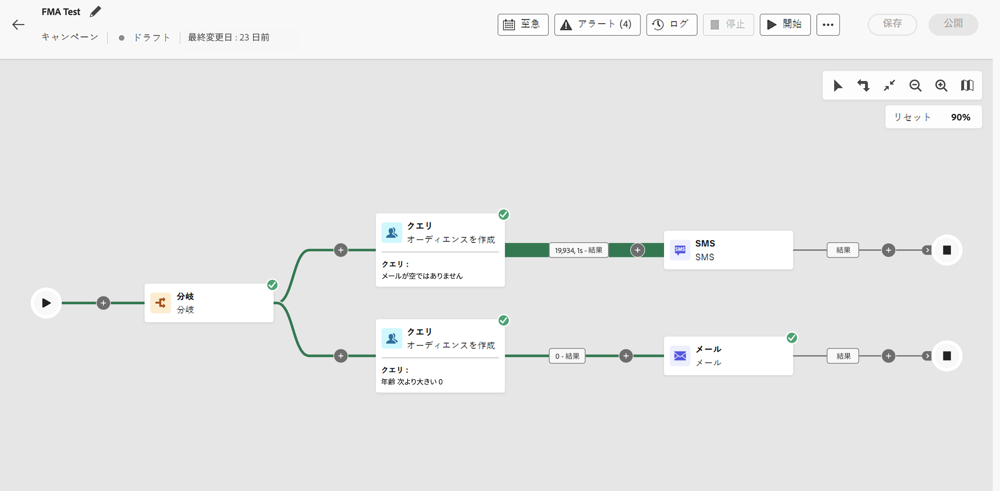

# 調整されたキャンペーンへのアクセスと管理 {#orchestrated-campaign-creation}

>[!CONTEXTUALHELP]
>id="ajo_targeting_workflow_list"
>title="調整されたキャンペーン"
>abstract="この画面では、調整されたキャンペーンの完全なリストにアクセスし、現在のステータス、前回／次回の実行日を確認して、新しい調整されたキャンペーンを作成できます。"

>[!CONTEXTUALHELP]
>id="ajo_orchestration_campaign_action"
>title="アクション"
>abstract="この節では、調整されたキャンペーン内で使用されるすべてのアクションを示します。"

+++ 目次

| 調整されたキャンペーンへようこそ | 最初の調整されたキャンペーンの開始 | データベースのクエリ | 調整されたキャンペーンアクティビティ |
|---|---|---|---|
| [ 調整されたキャンペーンの基本を学ぶ ](gs-orchestrated-campaigns.md)   リレーショナルスキーマとデータセットの作成および管理：  <ul><li>[ スキーマとデータセットの概要 ](gs-schemas.md)</li><li>[ 手動スキーマ ](manual-schema.md)</li><li>[ ファイルアップロードスキーマ ](file-upload-schema.md)</li><li>[ データの取り込み ](ingest-data.md)</li></ul>  <b>[ オーケストレーションされたキャンペーンへのアクセスと管理 ](access-manage-orchestrated-campaigns.md)</b>  [ オーケストレーションされたキャンペーンを作成するための主な手順 ](gs-campaign-creation.md) | [キャンペーンの作成とスケジュール](create-orchestrated-campaign.md)  [アクティビティの調整](orchestrate-activities.md)  [キャンペーンの開始と監視](start-monitor-campaigns.md)  [レポート](reporting-campaigns.md) | [ルールビルダーの操作](orchestrated-rule-builder.md)  [最初のクエリの作成](build-query.md)  [式の編集](edit-expressions.md)  [リターゲティング](retarget.md) | [アクティビティの基本を学ぶ](activities/about-activities.md)  アクティビティ： [AND 結合](activities/and-join.md) - [オーディエンスを作成](activities/build-audience.md) - [ディメンションを変更](activities/change-dimension.md) - [チャネルアクティビティ](activities/channels.md) - [結合](activities/combine.md) - [重複排除](activities/deduplication.md) - [エンリッチメント](activities/enrichment.md) - [分岐](activities/fork.md) - [紐付け](activities/reconciliation.md) - [オーディエンスを保存](activities/save-audience.md) - [分割](activities/split.md) - [待機](activities/wait.md) |

{style="table-layout:fixed"}

+++

 

>[!BEGINSHADEBOX]

 

このページのコンテンツは最終的なものではなく、変更される場合があります。

>[!ENDSHADEBOX]

## 調整されたキャンペーンへのアクセス

**[!UICONTROL キャンペーン]**&#x200B;メニューに移動し、「**[!UICONTROL オーケストレーション]**」タブを選択して、調整されたキャンペーンの完全なリストにアクセスします。

{zoomable="yes"}{zoomable="yes"}

リスト内の調整された各キャンペーンには、キャンペーンの現在の[ステータス](#status)、関連付けられたチャネルとタグ、最終変更日時などの情報が表示されます。 ボタンをクリックすると、表示される列をカスタマイズできます。

また、検索バーとフィルターを使用して、リスト内での検索を簡単にすることができます。例えば、調整されたキャンペーンをフィルタリングして、特定のチャネルまたはタグに関連付けられたキャンペーンや、特定の日付範囲中に作成されたキャンペーンのみを表示できます。

キャンペーン在庫の  ボタンを使用すると、以下に説明する様々な操作を実行できます。

* **[!UICONTROL 全期間のレポートを表示]**／**[!UICONTROL 過去 24 時間のレポートを表示]** - レポートにアクセスして、調整されたキャンペーンの影響とパフォーマンスを測定および視覚化します。[詳しくは、調整されたキャンペーンレポートを参照してください。](../orchestrated/reporting-campaigns.md)
* **[!UICONTROL タグを編集]** - キャンペーンに関連付けられたタグを編集します。
* **[!UICONTROL 複製]** - 場合によっては、停止済みキャンペーンを実行したり、スケジュール済みキャンペーンの実行頻度を変更したりするのに、調整されたキャンペーンを複製する必要があることがあります。
* **[!UICONTROL 削除]** - キャンペーンを削除します。このアクションは、**[!UICONTROL ドラフト]**&#x200B;キャンペーンでのみ使用できます。
* **[!UICONTROL アーカイブ]** - キャンペーンをアーカイブします。すべてのアーカイブ済みキャンペーンは、最終変更日から 30 日後にローリング再スケジュールで削除されます。このアクションは、**[!UICONTROL ドラフト]**&#x200B;キャンペーンを除くすべてのキャンペーンで使用できます。

## 調整されたキャンペーンの内部とは {#gs-ms-campaign-inside}

調整されたキャンペーンキャンバスは、実行される処理を表したものです。これは、実行される様々なタスクと、タスク同士の関係を示すものです。

調整された各キャンペーンには、次が含まれます。

* **アクティビティ**：アクティビティとは、実行されるタスクです。各種アクティビティは、ダイアグラム内にアイコンで示されます。各アクティビティには、特定のプロパティと、すべてのアクティビティに共通のその他のプロパティがあります。

  調整されたキャンペーンのダイアグラムでは、指定されたアクティビティが、特にループまたは繰り返しアクションがある場合に複数のタスクを生成できます。

* **トランジション**：トランジションは、ソースアクティビティを宛先アクティビティにリンクし、そのシーケンスを定義します。

* **作業用テーブル**：作業用テーブルには、トランジションによって実行されるすべての情報が含まれます。調整された各キャンペーンは、複数のワークテーブルを使用します。これらのテーブルで伝達されたデータは、調整されたキャンペーンのライフサイクルを通じて使用できます。

## キャンペーンのステータス {#status}

調整されたキャンペーンには複数のステータスがあります。

* **[!UICONTROL ドラフト]**：調整されたキャンペーンが作成されています。まだ公開されていません。
* **[!UICONTROL 公開中]**：調整されたキャンペーンを公開中です。
* **[!UICONTROL ライブ]**：調整されたキャンペーンが公開され、実行中です。
* **[!UICONTROL スケジュール済み]**：調整されたキャンペーンの実行がスケジュールされています。
* **[!UICONTROL 完了]**：調整されたキャンペーンの実行は完了しています。キャンペーンがエラーなしでメッセージの送信を完了してから最大 3 日後に、完了ステータスが自動的に割り当てられます。
* **[!UICONTROL クローズ済み]**：このステータスは、繰り返しキャンペーンがクローズされた際に表示されます。キャンペーンはすべてのアクティビティが完了するまで引き続き実行しますが、それ以上のプロファイルはキャンペーンにエントリできません。
* **[!UICONTROL アーカイブ済み]**：キャンペーンはアーカイブされています。すべてのアーカイブ済みキャンペーンは、最終変更日から 30 日後にローリング再スケジュールで削除されます。必要に応じて、アーカイブ済みキャンペーンを複製して、引き続き作業できます。
* **[!UICONTROL 停止済み]**：調整されたキャンペーンの実行が停止されています。キャンペーンを再度開始するには、複製する必要があります。
