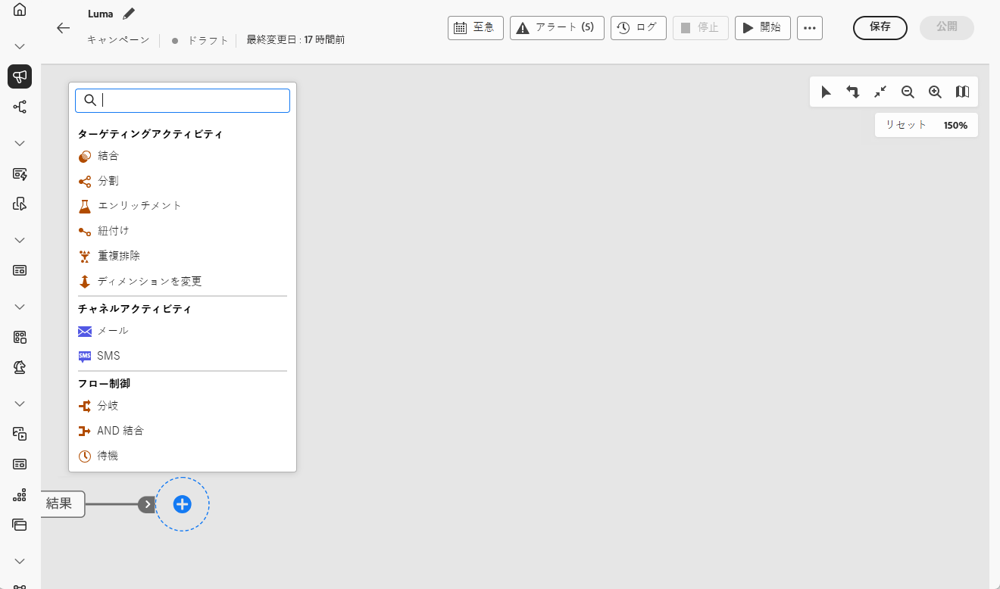
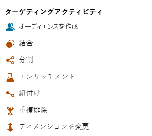
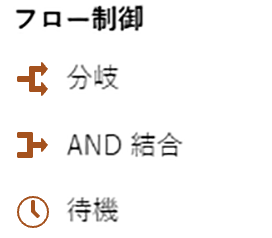

# 調整されたキャンペーンアクティビティについて {#orchestrated-campaign-activities}

+++ 目次

| 調整されたキャンペーンへようこそ | 最初の調整されたキャンペーンの開始 | データベースのクエリ | 調整されたキャンペーンアクティビティ |
|---|---|---|---|
| [ オーケストレーションされたキャンペーンの概要 ](../gs-orchestrated-campaigns.md)  [ 設定手順 ](../configuration-steps.md)  [ オーケストレーションされたキャンペーンを作成するための主な手順 ](../gs-campaign-creation.md) | [ オーケストレーションされたキャンペーンの作成 ](../create-orchestrated-campaign.md)  [ アクティビティのオーケストレーション ](../orchestrate-activities.md)  [ キャンペーンの開始および監視 ](../start-monitor-campaigns.md)  [ レポート ](../reporting-campaigns.md) | [ クエリの操作Modeler](../orchestrated-rule-builder.md)  [ 最初のクエリ ](../build-query.md)  [ 編集式を作成 ](../edit-expressions.md) | [ アクティビティの基本を学ぶ ](about-activities.md)   アクティビティ： [AND 結合 ](and-join.md) - [ オーディエンスを作成 ](build-audience.md) - [ ディメンションの変更 ](change-dimension.md) - [ チャネルアクティビティ ](channels.md) - [ 結合 ](combine.md) - [ 重複排除 ](deduplication.md) - [ エンリッチメント ](enrichment.md) - [ 分岐 ](fork.md) - [ 紐付け ](reconciliation.md) [&#128279;](split.md) [&#128279;](wait.md) - |

{style="table-layout:fixed"}

+++

 

調整されたキャンペーンアクティビティは、3 つのカテゴリにグループ化されます。 使用可能なアクティビティは、コンテキストに応じて異なる場合があります。

すべてのアクティビティについて、以下の節で詳しく説明します。

* [ターゲティングアクティビティ](#targeting)
* [チャネルアクティビティ](#channel)
* [フロー制御アクティビティ](#flow-control)

{width="80%" align="left"}

## ターゲティングアクティビティ {#targeting}

これらのアクティビティは、ターゲティングに固有です。オーディエンスを定義するか、積集合、和集合、除外の各操作を使用して分割または結合することで、1 つまたは複数のターゲットを作成できます。

{width="40%" align="left"}

* [オーディエンスを作成](build-audience.md)：ターゲット母集団を定義します。既存のオーディエンスを選択するか、クエリモデラーを使用して独自のクエリを定義できます。
* [ ディメンションの変更 ](change-dimension.md)：調整されたキャンペーンを作成する際に、ターゲティングディメンションを変更します。
* [結合](combine.md)：インバウンド母集団に対してセグメント化を実行します。和集合、積集合または除外を使用できます。
* [重複排除 - 重複](deduplication.md)：インバウンドアクティビティの結果から重複を削除します。
* [ エンリッチメント ](enrichment.md)：調整されたキャンペーンで処理する追加データを定義します。 このアクティビティでは、インバウンドトランジションを利用し、追加データを活用して出力トランジションを補完するようにアクティビティを設定できます。
* [ 紐付け ](reconciliation.md):Journey Optimizer データのデータと作業用テーブル内のデータの間のリンクを定義します（外部ファイルから読み込まれたデータなど）。
* [分割](split.md)：入力母集団を複数のサブセットにセグメント化します。

## チャネルアクティビティ {#channel}

Adobe Journey Optimizerを使用すると、複数のチャネルをまたいでマーケティングキャンペーンを自動化および実行できます。 チャネルアクティビティをキャンバスに組み合わせて、顧客の行動に基づいてアクションをトリガーにできるクロスチャネルオーケストレーションされたキャンペーンを作成できます。 使用できる **チャネル** アクティビティは、メールと SMS です。 [ オーケストレートキャンペーンのコンテキストでチャネルアクションを作成する方法を説明します ](channels.md)。

## フロー制御アクティビティ {#flow-control}

>[!CONTEXTUALHELP]
>id="ajo_orchestration_end"
>title="終了アクティビティ"
>abstract="**終了**&#x200B;アクティビティを使用すると、調整されたキャンペーンの終了をグラフィカルに示すことができます。このアクティビティは、機能上の影響はないので、省略可能です。"

{width="30%" align="left"}

次のアクティビティは、オーケストレーションされたキャンペーンの整理と実行に固有です。 主なタスクは、他のアクティビティの調整です。

* [AND 結合 ](and-join.md)：調整されたキャンペーンの複数の実行分岐を同期します。
* [分岐](fork.md)：アウトバウンドトランジションを作成して、複数のアクティビティを同時に開始します。
* [ 待機 ](wait.md)：オーケストレーションされたキャンペーンの一部の実行を一時的に一時停止します。
  <!--* [Test](test.md): Enable transitions based on specified conditions.-->

>[!NOTE]
>**終了** アクティビティは、調整されたキャンペーンの終了を視覚的に示します。 このアクティビティは、機能上の影響はないので、省略可能です。
