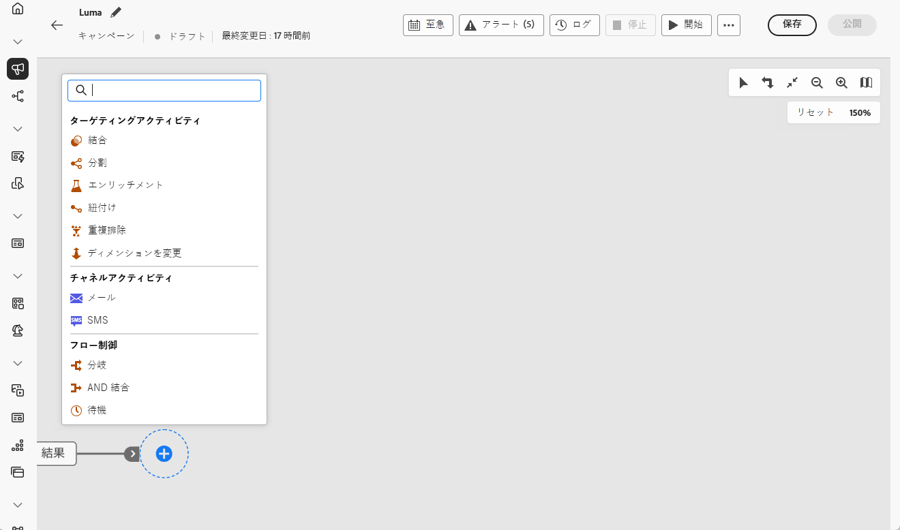
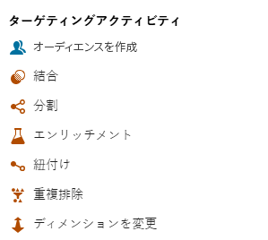
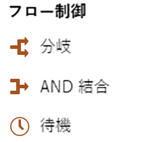

# 調整されたキャンペーンアクティビティについて {#orchestrated-campaign-activities}

調整されたキャンペーンアクティビティは、3 つのカテゴリにグループ化されます。 使用可能なアクティビティは、コンテキストに応じて異なる場合があります。

すべてのアクティビティについて、以下の節で詳しく説明します。

* [ターゲティングアクティビティ](#targeting)
* [チャネルアクティビティ](#channel)
* [フロー制御アクティビティ](#flow-control)

{width="80%" align="left"}

>[!NOTE]
>
>* ライセンスモデル、権限、実装に応じて、使用可能なアクティビティが異なる場合があります。
>
>* オーケストレーションキャンペーンのアクティビティ数は 500 に制限されます。

## ターゲティングアクティビティ {#targeting}

これらのアクティビティは、ターゲティングに固有です。 オーディエンスを定義するか、積集合、和集合、除外の各操作を使用して分割または結合することで、1 つまたは複数のターゲットを作成できます。

{width="40%" align="left"}

使用可能なターゲティングアクティビティは次のとおりです。

* [オーディエンスを作成](build-audience.md)：ターゲット母集団を定義します。 既存のオーディエンスを選択するか、ルールビルダーを使用して独自のクエリを定義できます。
* [ディメンションを変更](change-dimension.md)：調整されたキャンペーンの作成時にターゲティングディメンションを変更します。
* [結合](combine.md)：インバウンド母集団に対してセグメント化を実行します。 和集合、積集合または除外を使用できます。
* [重複排除 - 重複](deduplication.md)：インバウンドアクティビティの結果から重複を削除します。
* [エンリッチメント](enrichment.md)：調整されたキャンペーンで処理する追加のデータを定義します。 このアクティビティでは、インバウンドトランジションを利用し、追加データを活用して出力トランジションを補完するようにアクティビティを設定できます。
* [紐付け](reconciliation.md)：Journey Optimizer データ内のデータと作業用テーブル内のデータ（外部ファイルから読み込まれたデータなど）を結ぶリンクを定義します。
* [分割](split.md)：入力母集団を複数のサブセットにセグメント化します。

## チャネルアクティビティ {#channel}

Adobe Journey Optimizer を使用すると、複数のチャネル間でマーケティングキャンペーンを自動化および実行できます。 [チャネルアクティビティ](channels.md)をキャンバスに組み合わせて、顧客の行動に基づいてアクションをトリガーできるクロスチャネルのオーケストレーションキャンペーンを作成できます。

詳しくは、[オーケストレーションキャンペーンでのチャネルアクションの作成](channels.md)を参照してください。

## フロー制御アクティビティ {#flow-control}

>[!CONTEXTUALHELP]
>id="ajo_orchestration_end"
>title="終了アクティビティ"
>abstract="**End** アクティビティは、キャンバス上のブランチの終わりを示します。 オプションで、**外部信号**&#x200B;を使用して、下流のオーケストレーションされたキャンペーンを開始し、ブランチが完了したときにパラメーターを渡します。 [詳細情報](../trigger-orchestrated-campaign.md#signal-end)"

>[!CONTEXTUALHELP]
>id="ajo_orchestration_signal"
>title="外部シグナル"
>abstract="このブランチが終了したときに開始する下流のオーケストレーションキャンペーンを選択し、シグナルで送信するパラメーター名と値をマッピングします。 このキャンペーンが終了アクティビティに達する前に、ダウンストリームキャンペーンを&#x200B;**シグナルによってトリガーされ**&#x200B;公開する必要があります。 [詳細情報](../trigger-orchestrated-campaign.md#signal-end)"

次のアクティビティは、オーケストレーションキャンペーンの整理と実行に固有です。 主なタスクは、他のアクティビティの調整です。

{width="20%" align="left"}

使用可能なフロー制御アクティビティは次のとおりです。

* [AND 結合](and-join.md)：調整されたキャンペーンの複数の実行分岐を同期します。
* [分岐](fork.md)：アウトバウンドトランジションを作成して、複数のアクティビティを同時に開始します。
* [待機](wait.md)：調整されたキャンペーンの一部の実行を一時的に中断します。
  <!--* [Test](test.md): Enable transitions based on specified conditions.-->

* **[!UICONTROL 終了]**: キャンバス上のブランチの末尾をマークします。 オプションで、シグナルで始まる別のオーケストレーションキャンペーンにシグナルを送信するために使用できます。 [詳細情報](../trigger-orchestrated-campaign.md#signal-end)
