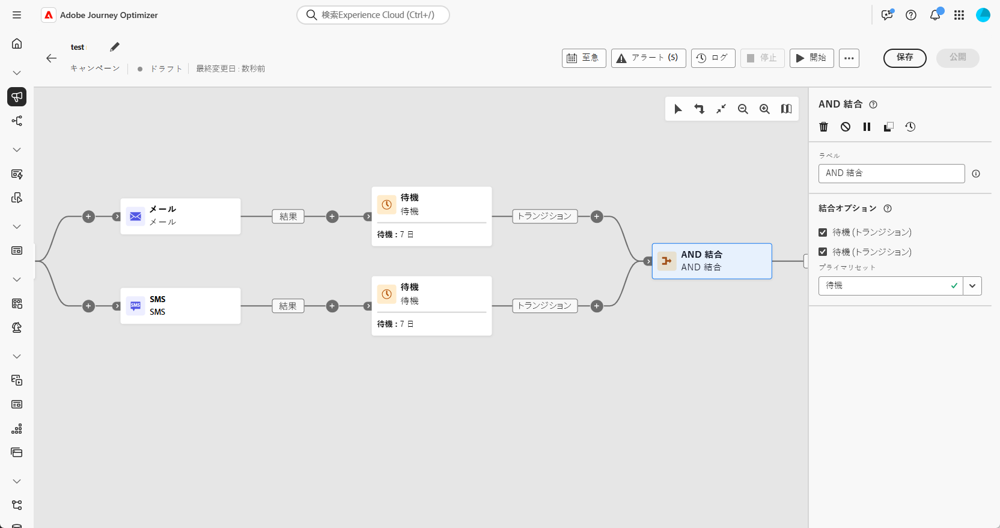
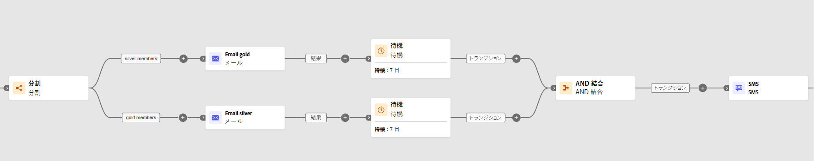

# AND 結合 {#join}

>[!CONTEXTUALHELP]
>id="ajo_orchestration_and-join"
>title="「AND 結合」アクティビティ"
>abstract="**AND 結合**&#x200B;アクティビティを使用すると、調整されたキャンペーンの複数の実行分岐を同期させることができます。先行するアクティビティがすべて終了すると、トリガーされます。これにより、調整されたキャンペーンの実行を続ける前に、特定のアクティビティを確実に終了させることができます。"

+++ 目次

| 調整されたキャンペーンへようこそ | 最初の調整されたキャンペーンの開始 | データベースのクエリ | キャンペーンアクティビティをキャンセル |
|---|---|---|---|
| [ オーケストレーションされたキャンペーンの概要 ](../gs-orchestrated-campaigns.md)  [ 設定手順 ](../configuration-steps.md)  [ オーケストレーションされたキャンペーンを作成するための主な手順 ](../gs-campaign-creation.md) | [ オーケストレーションされたキャンペーンの作成 ](../create-orchestrated-campaign.md)  [ アクティビティのオーケストレーション ](../orchestrate-activities.md)  [ オーケストレーションされたキャンペーンでのメッセージの送信 ](../send-messages.md)  [ キャンペーンの開始および監視 ](../start-monitor-campaigns.md)  [ レポート ](../reporting-campaigns.md) | [ クエリの操作Modeler](../orchestrated-query-modeler.md)  [ 最初のクエリ ](../build-query.md)  [ 編集式を作成 ](../edit-expressions.md) | [ アクティビティの基本を学ぶ ](about-activities.md)   アクティビティ： [AND 結合 ](and-join.md) - [ オーディエンスを作成 ](build-audience.md) - [ ディメンションを変更 ](change-dimension.md) - [ 結合 ](combine.md) - [ 重複排除 ](deduplication.md) - [ エンリッチメント ](enrichment.md) - [ 分岐 ](fork.md) - [ 紐付け ](reconciliation.md) - [ 分割 ](split.md)  - |

{style="table-layout:fixed"}

+++

  

**AND 結合**&#x200B;アクティビティは、**フロー制御**&#x200B;アクティビティです。オーケストレーションされたキャンペーンの複数の実行分岐を同期できます。

このアクティビティは、すべてのインバウンドトランジションが有効化された（つまり、前のアクティビティがすべて終了した）ときにのみ、アウトバウンドトランジションをトリガーします。これにより、オーケストレーションされたキャンペーンを続行する前に、特定のアクティビティを確実に完了させることができます。

## AND 結合アクティビティの設定{#and-join-configuration}

>[!CONTEXTUALHELP]
>id="ajo_orchestration_and-join_merging"
>title="結合オプション"
>abstract="結合するアクティビティを選択します。 **プライマリセット**&#x200B;ドロップダウンで、保持するインバウンドトランジションの母集団を選択します。"

**AND 結合**&#x200B;アクティビティを設定するには、次の手順に従います。

1. チャネルアクティビティなど、複数のアクティビティを追加して、2 つ以上の異なる実行分岐を形成します。
1. **AND 結合**&#x200B;アクティビティを任意の分岐に追加します。
1. 「**結合オプション**」セクションで、結合する以前のアクティビティをすべて確認します。
1. **プライマリセット**&#x200B;ドロップダウンで、保持するインバウンドトランジションの母集団を選択します。アウトバウンドトランジションには、インバウンドトランジションの母集団の 1 つのみを含むことができます。

## 例{#and-join-example}

次の例は、メールと SMS 配信を含む、オーケストレーションされた 2 つのキャンペーン分岐を示しています。 両方のインバウンドトランジションが有効な場合、AND 結合がトリガーします。プッシュ通知は、両方の配信が完了した後にのみ送信されます。

{zoomable="yes"}
