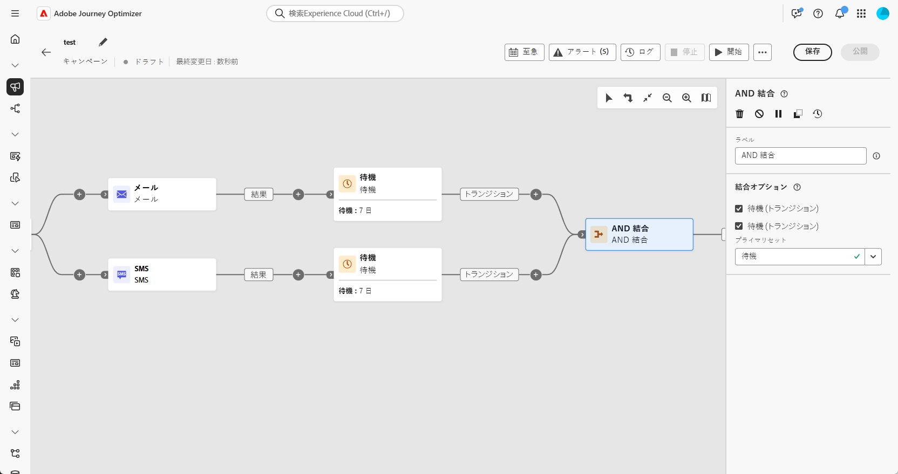
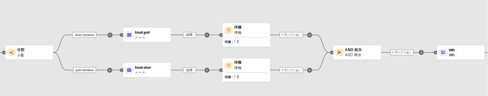

# AND 結合 {#join}

>[!BEGINSHADEBOX]

**このページ：**&#x200B;では、オーケストレーションされたキャンペーンでAnd結合フロー制御アクティビティを使用して複数の実行ブランチを同期する方法を説明します。これにより、キャンペーンは直前のすべてのアクティビティが終了した後にのみ続行されます。

>[!ENDSHADEBOX]

>[!CONTEXTUALHELP]
>id="ajo_orchestration_and-join"
>title="「AND 結合」アクティビティ"
>abstract="**AND 結合**&#x200B;アクティビティを使用すると、調整されたキャンペーンの複数の実行分岐を同期させることができます。 先行するアクティビティがすべて完了すると、トリガーされます。 これにより、調整されたキャンペーンの実行を続ける前に、特定のアクティビティを確実に終了させることができます。"

>[!CONTEXTUALHELP]
>id="ajo_orchestration_join"
>title="結合アクティビティ"
>abstract="結合アクティビティのプレースホルダー。"

**[!UICONTROL AND 結合]**&#x200B;アクティビティは、**[!UICONTROL フロー制御]**&#x200B;アクティビティです。 調整されたキャンペーンの複数の実行分岐を同期できます。

このアクティビティは、すべてのインバウンドトランジションが有効化された（つまり、前のアクティビティがすべて終了した）ときにのみ、アウトバウンドトランジションをトリガーします。 これにより、調整されたキャンペーンの実行を続ける前に、特定のアクティビティを確実に終了させることができます。

## AND 結合アクティビティの設定{#and-join-configuration}

>[!CONTEXTUALHELP]
>id="ajo_orchestration_and-join_merging"
>title="結合オプション"
>abstract="結合するアクティビティを選択します。 **プライマリセット**&#x200B;ドロップダウンで、保持するインバウンドトランジションの母集団を選択します。"

**[!UICONTROL AND 結合]**&#x200B;アクティビティを設定するには、次の手順に従います。

1. チャネルアクティビティなど、複数のアクティビティを追加して、2 つ以上の異なる実行分岐を作成します。

1. **[!UICONTROL AND 結合]**&#x200B;アクティビティをいずれかの分岐に挿入します。

1. 「**[!UICONTROL 結合オプション]**」セクションで、結合する前のアクティビティをすべて選択します。

1. **[!UICONTROL プライマリセット]**&#x200B;ドロップダウンから、保持するインバウンドトランジションの母集団を選択します。

## 例{#and-join-example}

この例では、調整された 2 つのキャンペーン分岐における、それぞれのメール配信（1 つはゴールドメンバーをターゲティングにし、もう 1 つはシルバーメンバーをターゲティングにしている）を示します。 **[!UICONTROL AND 結合]**&#x200B;は、両方の受信トランジションがトリガーされるとアクティブ化され、7 日間の遅延の後、両方のメール配信が完了した後にのみ SMS が送信されます。

{zoomable="yes"}
