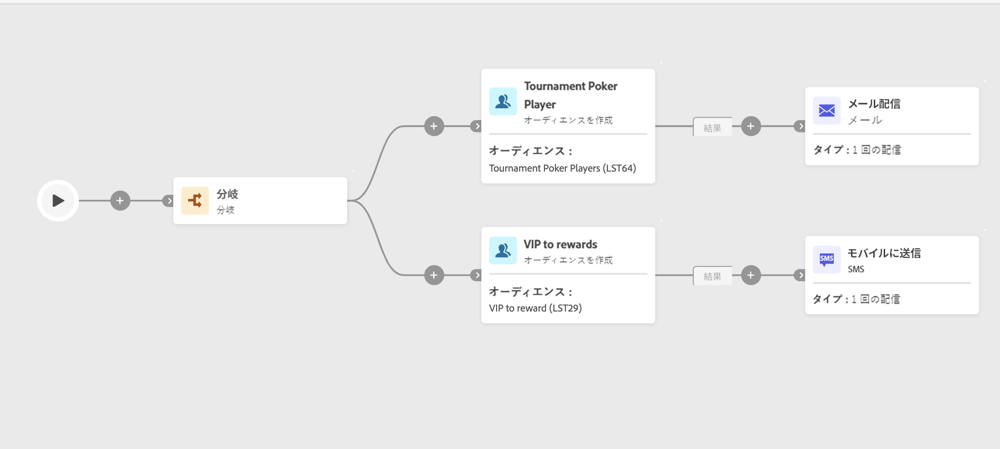

# オーディエンスを作成 {#build-audience}

>[!CONTEXTUALHELP]
>id="ajo_orchestration_build_audience"
>title="オーディエンスを作成アクティビティ"
>abstract="**オーディエンスを作成**&#x200B;アクティビティを使用すると、調整されたキャンペーンにエントリするオーディエンスを定義できます。調整されたキャンペーンのコンテキストでメッセージを送信する際、メッセージオーディエンスはチャネルアクティビティではなく、「**オーディエンスを作成**」アクティビティで定義されます。"

+++ 目次

| 調整されたキャンペーンへようこそ | 最初の調整されたキャンペーンの開始 | データベースのクエリ | キャンペーンアクティビティをキャンセル |
|---|---|---|---|
| [ オーケストレーションされたキャンペーンの概要 ](gs-orchestrated-campaigns.md)  [ 設定手順 ](configuration-steps.md)  [ オーケストレーションされたキャンペーンを作成するための主な手順 ](gs-campaign-creation.md) | [ オーケストレーションされたキャンペーンの作成 ](create-orchestrated-campaign.md)  [ アクティビティのオーケストレーション ](orchestrate-activities.md)  [ オーケストレーションされたキャンペーンでのメッセージの送信 ](send-messages.md)  [ キャンペーンの開始および監視 ](start-monitor-campaigns.md)  [ レポート ](reporting-campaigns.md) | [ クエリの操作Modeler](orchestrated-query-modeler.md)  [ 最初のクエリ ](build-query.md)  [ 編集式を作成 ](edit-expressions.md) | [ アクティビティの基本を学ぶ ](activities/about-activities.md)   アクティビティ： [AND 結合 ](activities/and-join.md) - [ オーディエンスを作成 ](activities/build-audience.md) - [ ディメンションを変更 ](activities/change-dimension.md) - [ 結合 ](activities/combine.md) - [ 重複排除 ](activities/deduplication.md) - [ エンリッチメント ](activities/enrichment.md) - [ 分岐 ](activities/fork.md) - [ 紐付け ](activities/reconciliation.md) - [ 分割 ](activities/split.md) [&#128279;](activities/wait.md) - |

{style="table-layout:fixed"}

+++

  

マーケターの場合、使いやすいインターフェイスを使用して複雑なクエリを簡単に作成でき、様々な条件や行動に基づいてオーディエンスをセグメント化し、キャンペーンをより効果的に調整できます。

これを実行するには、**オーディエンスを作成** ターゲティングアクティビティを使用します。 このアクティビティを使用すると、オーケストレーションされたキャンペーンにエントリするオーディエンスを定義できます。 調整されたキャンペーンのコンテキストでメッセージを送信する際、メッセージオーディエンスはチャネルアクティビティではなく、「**オーディエンスを作成**」アクティビティで定義されます。

オーディエンス母集団を定義するには、次の操作を実行します。

* 既存のオーディエンスを選択します。
* 定義済みフィルターを選択します。
* クエリモデラーを使用してフィルタリング条件を定義および組み合わせて、新しいオーディエンスを作成します。

>[!NOTE]
>
>ファイルから読み込まれたオーディエンスは、「オーディエンスを作成」アクティビティを使用してターゲット設定できません。これを行うには、「**ファイルを読み込み**」アクティビティの後に「**紐付け**」アクティビティを使用する必要があります。

## オーディエンスを作成アクティビティの設定 {#build-audience-configuration}

>[!CONTEXTUALHELP]
>id="ajo_orchestration_build_audience_audienceselector"
>title="オーディエンス"
>abstract="新しい配信をデザインする際にオーディエンスを使用するのと同じ方法で、オーディエンスを選択します。"

**オーディエンスを作成**&#x200B;アクティビティを設定するには、次の手順に従います。

1. **オーディエンスを作成**&#x200B;アクティビティを追加します。
1. ラベルを定義します。
1. **独自に作成**&#x200B;または&#x200B;**オーディエンスを読み取り**&#x200B;のオーディエンスタイプを定義します。
1. 以下のタブに示す手順に従って、オーディエンスを設定します。

独自のクエリを作成するには、次の手順に従います。

1. 「**独自のクエリを作成**」を選択します。
1. 「**ターゲティングディメンション**」を選択します。ターゲティングディメンションは、受信者、契約の受益者、オペレーター、サブスクライバーなど、ターゲットされる母集団を操作ごとに定義します。デフォルトでは、ターゲットが受信者から選択されます。
1. 「**続行**」をクリックします。
1. クエリモデラーを使用してクエリを定義します。 [ クエリモデラーの詳細については、この節を参照してください ](../orchestrated-query-modeler.md)

## 例{#build-audience-examples}

次に、2 つの **オーディエンスを作成** アクティビティを使用して調整されたキャンペーンの例を示します。 最初のアクティビティは、ポーカープレーヤーのオーディエンスをターゲットにし、次にメール配信が続きます。2 番目のアクティビティは VIP クライアントオーディエンスをターゲットにし、次に SMS 配信が続きます。

