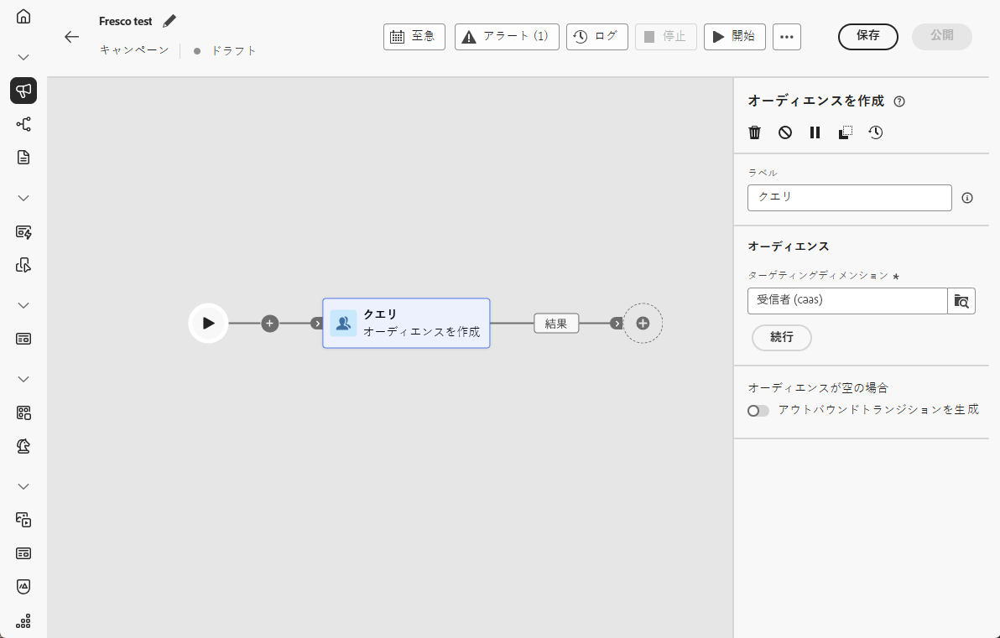
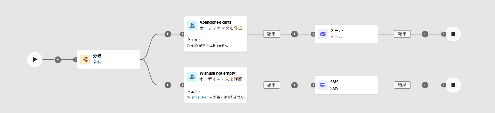

# オーディエンスを作成 {#build-audience}

>[!CONTEXTUALHELP]
>id="ajo_orchestration_build_audience"
>title="オーディエンスを作成アクティビティ"
>abstract="**オーディエンスを作成**&#x200B;アクティビティを使用すると、調整されたキャンペーンにエントリするオーディエンスを定義できます。調整されたキャンペーンのコンテキストでメッセージを送信する際、メッセージオーディエンスはチャネルアクティビティではなく、「**オーディエンスを作成**」アクティビティで定義されます。"

マーケターは、直感的なインターフェイスを通じて複雑なオーディエンスセグメントを作成し、様々な条件と行動に基づいてユーザーをターゲットにして、キャンペーンをより効果的にカスタマイズできます。

これを行うには、**[!UICONTROL オーディエンスを作成]**&#x200B;ターゲティングアクティビティを使用します。このアクティビティは、オーケストレートキャンペーンに参加するオーディエンスを定義します。 オーケストレートキャンペーンの一部としてメッセージを送信する場合、オーディエンスは、オーケストレートキャンペーン内ではなく、**[!UICONTROL オーディエンスを作成]** アクティビティで定義されます。

## オーディエンスを作成アクティビティの設定 {#build-audience-configuration}

>[!CONTEXTUALHELP]
>id="ajo_orchestration_build_audience_audienceselector"
>title="オーディエンス"
>abstract="新しい配信をデザインする際にオーディエンスを使用するのと同じ方法で、オーディエンスを選択します。"

**[!UICONTROL オーディエンスを作成]**&#x200B;アクティビティを設定するには、次の手順に従います。

1. **[!UICONTROL オーディエンスを作成]**&#x200B;アクティビティを追加します。

   

1. **[!UICONTROL ラベル]**&#x200B;を定義します。

1. 以下のタブに示す手順に従って、オーディエンスを設定します。

1. 「**[!UICONTROL ターゲティングディメンション]**」を選択します。ターゲティングディメンションは、受信者、契約の受益者、オペレーター、サブスクライバーなど、ターゲットされる母集団を操作ごとに定義します。デフォルトでは、ターゲットが受信者から選択されます。

1. 「**[!UICONTROL 続行]**」をクリックします。

1. ルールビルダーを使用してクエリを定義します。 [ ルールビルダーの詳細については、この節を参照してください ](../orchestrated-rule-builder.md)

1. オーディエンスが空の場合に、アウトバウンドトランジションを生成するかどうかを指定します。

## 例{#build-audience-examples}

2 つの **[!UICONTROL オーディエンスを作成]** アクティビティを使用したオーケストレートキャンペーンの例を次に示します。 最初は、買い物かごに商品があるプロファイルをターゲットにし、次にメール配信が続きます。2 番目は、ウィッシュリストがあるプロファイルをターゲットにし、次に SMS 配信が続きます。

