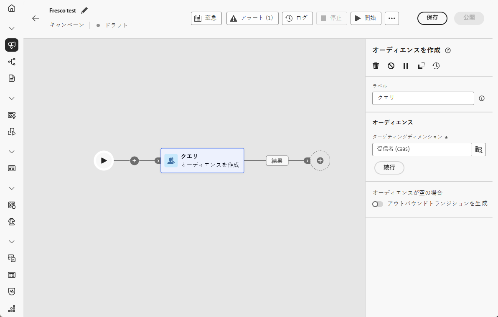
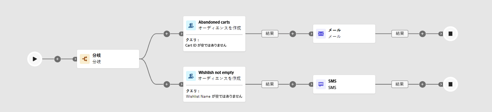

# オーディエンスを作成 {#build-audience}

>[!CONTEXTUALHELP]
>id="ajo_orchestration_build_audience"
>title="オーディエンスを作成アクティビティ"
>abstract="**オーディエンスを作成**&#x200B;アクティビティを使用すると、調整されたキャンペーンにエントリするオーディエンスを定義できます。 調整されたキャンペーンのコンテキストでメッセージを送信する際、メッセージオーディエンスはチャネルアクティビティではなく、「**オーディエンスを作成**」アクティビティで定義されます。"

マーケターは、直感的なインターフェイスを通じて複雑なオーディエンスセグメントを作成し、様々な条件と行動に基づいてユーザーをターゲットにして、キャンペーンをより効果的にカスタマイズできます。

これを行うには、**[!UICONTROL オーディエンスを作成]**&#x200B;ターゲティングアクティビティを使用します。 このアクティビティは、調整されたキャンペーンにエントリするオーディエンスを定義します。 調整されたキャンペーンの一部としてメッセージを送信する際、オーディエンスは調整されたキャンペーン内ではなく、**[!UICONTROL オーディエンスを作成]**&#x200B;アクティビティで定義されます。

## オーディエンスを作成アクティビティの設定 {#build-audience-configuration}

>[!CONTEXTUALHELP]
>id="ajo_orchestration_build_audience_audienceselector"
>title="オーディエンス"
>abstract="新しい配信をデザインする際にオーディエンスを使用するのと同じ方法で、オーディエンスを選択します。"

**[!UICONTROL オーディエンスを作成]**&#x200B;アクティビティを設定するには、次の手順に従います。

1. **[!UICONTROL オーディエンスを作成]**&#x200B;アクティビティを追加します。

   

1. **[!UICONTROL ラベル]**&#x200B;を定義します。

1. 以下のタブに示す手順に従って、オーディエンスを設定します。

1. 「**[!UICONTROL ターゲティングディメンション]**」を選択します。 ターゲティングディメンションを使用すると、操作のターゲットとなる母集団（受信者、契約受益者、オペレーター、サブスクライバーなど）を定義できます。デフォルトでは、ターゲットは受信者から選択されます。

1. 「**[!UICONTROL 続行]**」をクリックします。

1. ルールビルダーを使用してクエリを定義します。 [ルールビルダーの詳細情報](../orchestrated-rule-builder.md)

1. オーディエンスが空の場合に、アウトバウンドトランジションを生成するかどうかを指定します。

## 例{#build-audience-examples}

2 つの&#x200B;**[!UICONTROL オーディエンスを作成]**&#x200B;アクティビティを持つ、調整されたキャンペーンの例を次に示します。 最初は、買い物かごに商品があるプロファイルをターゲットにし、次にメール配信が続きます。 2 番目は、ウィッシュリストがあるプロファイルをターゲットにし、次に SMS 配信が続きます。

次の例では、**[!UICONTROL オーディエンスを作成]** アクティビティがルールビルダーを使用して、サブスクリプションプランでプロファイルをフィルタリングしています。 `plan`属性に条件を設定して、`plan = "basic"`のプロファイルのみを含め、オーディエンスを次のアクティビティに渡す前に基本階層のサブスクライバーに絞り込みます。

{width="50%"}
