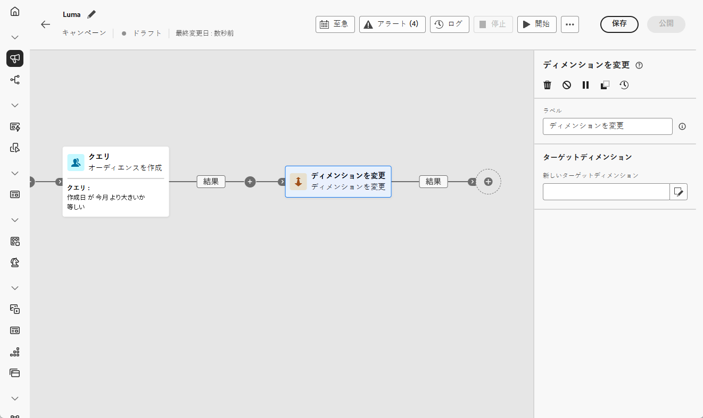
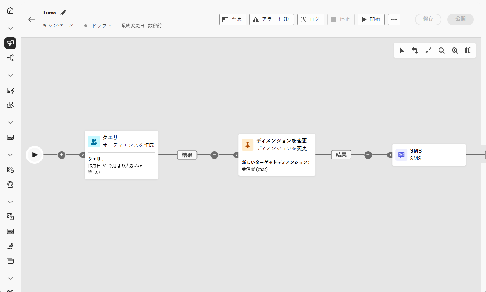

# ディメンションを変更 {#change-dimension}

>[!CONTEXTUALHELP]
>id="ajo_orchestration_dimension_complement"
>title="補集合の生成"
>abstract="重複として除外された残りの母集団を使用して、追加のアウトバウンドトランジションを生成できます。 これを行うには、「**補集合を生成**」オプションの切替スイッチをオンにします。"

>[!CONTEXTUALHELP]
>id="ajo_orchestration_change_dimension"
>title="ディメンションを変更アクティビティ"
>abstract="このアクティビティを使用すると、オーディエンスの作成時にターゲティングディメンションを変更できます。 データテンプレートと入力ディメンションに応じて軸を移動します。 例えば、「契約」ディメンションから「クライアント」ディメンションに切り替えることができます。"

マーケターは、調整されたキャンペーン内で、あるエンティティから別のリンクされたエンティティにターゲティングディメンションを切り替え、様々なデータセットに基づいてオーディエンスのターゲティングを調整できます（ユーザーのプロファイリングから、特定のアクションや予約のターゲティングに移行するなど）。

これを実行するには、「**ディメンションを変更**」ターゲティングアクティビティを使用します。 このアクティビティを使用すると、オーケストレーションされたキャンペーンを作成する際に、ターゲティングディメンションを変更できます。 データテンプレートと入力ディメンションに応じて軸を移動します。

例えば、オーケストレーションされたキャンペーンのターゲティングディメンションを「プロファイル」から「契約」に切り替えて、ターゲットの契約所有者にメッセージを送信できます。

<!--
>[!IMPORTANT]
>
>Please note that the **[!UICONTROL Change Dimension]** and **[!UICONTROL Change Data source]** activities should not be added in one row. If you need to use both activities consecutively, make sure you include an **[!UICONTROL Enrichement]** activity in between them. This ensures proper execution and prevents potential conflicts or errors.-->

## ディメンションを変更アクティビティの設定 {#configure}

**ディメンションを変更**&#x200B;アクティビティを設定するには、次の手順に従います。

1. **ディメンションを変更** アクティビティをオーケストレーションされたキャンペーンに追加します。

   

1. **新しいターゲットディメンション**&#x200B;を定義します。ディメンションの変更時には、すべてのレコードが保持されます。

1. 調整したキャンペーンを実行して、結果を表示します。 ディメンションの変更アクティビティの前後でテーブル内のデータを比較し、調整されたキャンペーンテーブルの構造を比較します。

## 例 {#example}

この例では、購入を行ったすべてのプロファイルに SMS 配信を送信します。これを行うには、まず、カスタムの「購入」ターゲティングディメンションにリンクされた&#x200B;**[!UICONTROL オーディエンスを作成]**&#x200B;アクティビティを使用して、発生したすべての購入をターゲットにします。

次に、「**[!UICONTROL ディメンションを変更]** アクティビティを使用して、オーケストレーションされたキャンペーンのターゲティングディメンションを「受信者」に切り替えます。 これにより、クエリに一致する受信者をターゲットにすることができます。

