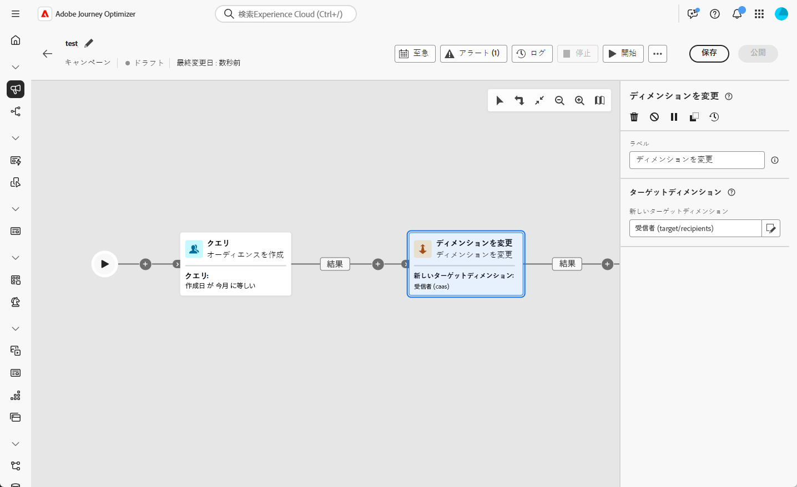
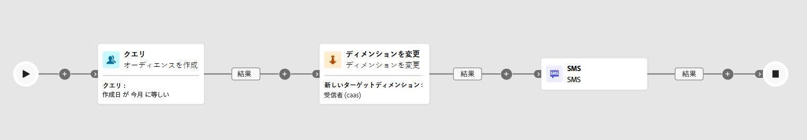

# ディメンションを変更 {#change-dimension}

>[!CONTEXTUALHELP]
>id="ajo_orchestration_dimension_complement"
>title="補集合の生成"
>abstract="重複として除外された残りの母集団を使用して、追加のアウトバウンドトランジションを生成できます。 これを行うには、「**補集合を生成**」オプションの切替スイッチをオンにします。"

>[!CONTEXTUALHELP]
>id="ajo_orchestration_change_dimension"
>title="ディメンションを変更アクティビティ"
>abstract="このアクティビティを使用すると、オーディエンスの作成時にターゲティングディメンションを変更できます。 データテンプレートと入力ディメンションに応じて軸を移動します。 例えば、「契約」ディメンションから「クライアント」ディメンションに切り替えることができます。"

+++ 目次

| 調整されたキャンペーンへようこそ | 最初の調整されたキャンペーンの開始 | データベースのクエリ | 調整されたキャンペーンアクティビティ |
|---|---|---|---|
| [ オーケストレーションされたキャンペーンの基本を学ぶ ](gs-orchestrated-campaigns.md)  [ 設定手順 ](configuration-steps.md)  [ オーケストレーションされたキャンペーンへのアクセスと管理 ](access-manage-orchestrated-campaigns.md) | [ キャンペーンの作成を調整するための主な手順 ](gs-campaign-creation.md)  [ キャンペーンの作成およびスケジュール設定 ](create-orchestrated-campaign.md)  [ アクティビティの調整 ](orchestrate-activities.md)  <b>[ キャンペーンの開始および監視 ](start-monitor-campaigns.md)</b>  [ レポート ](reporting-campaigns.md) | [ ルールビルダーの操作 ](orchestrated-rule-builder.md)  [ 最初のクエリの作成 ](build-query.md)  [ 式の編集 ](edit-expressions.md)  [ リターゲティング ](retarget.md) | [ アクティビティの基本を学ぶ ](activities/about-activities.md)   アクティビティ： [AND 結合 ](activities/and-join.md) - [ オーディエンスを作成 ](activities/build-audience.md) - [ ディメンションの変更 ](activities/change-dimension.md) - [ チャネルアクティビティ ](activities/channels.md) - [ 結合 ](activities/combine.md) - [ 重複排除 ](activities/deduplication.md) - [ エンリッチメント ](activities/enrichment.md) - [ 分岐 ](activities/fork.md) - [ 紐付け ](activities/reconciliation.md)    - |

{style="table-layout:fixed"}

+++

 

マーケターは、調整されたキャンペーン内で、あるデータエンティティから関連するデータエンティティに移行することで、オーディエンスのターゲティングを強化できます。 これにより、ユーザープロファイルを超えて、購入、予約、その他のインタラクションなどの特定の行動に焦点を当てることができます。

それには、「**[!UICONTROL ディメンションを変更]** アクティビティを使用します。 これにより、オーケストレーションされたキャンペーン中にターゲティングディメンションを調整できます。

<!--
>[!IMPORTANT]
>
>Please note that the **[!UICONTROL Change Dimension]** and **[!UICONTROL Change Data source]** activities should not be added in one row. If you need to use both activities consecutively, make sure you include an **[!UICONTROL Enrichement]** activity in between them. This ensures proper execution and prevents potential conflicts or errors.-->

## ディメンションを変更アクティビティの設定 {#configure}

**[!UICONTROL ディメンションを変更]**&#x200B;アクティビティを設定するには、次の手順に従います。

1. **[!UICONTROL ディメンションを変更]** アクティビティをオーケストレーションされたキャンペーンに追加します。

   

1. **[!UICONTROL 新しいターゲットディメンション]**&#x200B;を定義します。ディメンションの変更時には、すべてのレコードが保持されます。

## 例 {#example}

このユースケースは、過去 1 か月以内にウィッシュリストを作成したプロファイルへの SMS の送信に焦点を当てています。

**[!UICONTROL ウィッシュリスト]** ターゲティングディメンションを使用して **[!UICONTROL オーディエンスを作成]** アクティビティを開始し、関連するすべてのウィッシュリストを特定します。

次に、「**[!UICONTROL ディメンションを変更]**」アクティビティを追加して、ターゲティングディメンションを **[!UICONTROL ウィッシュリスト]** から **[!UICONTROL 受信者 ] に切り替えます。この手順**、オーケストレーションされたキャンペーンが、これらのウィッシュリストにリンクされた正しいプロファイルをターゲットにし、SMS を目的のプロファイルに送信できるようにします。

