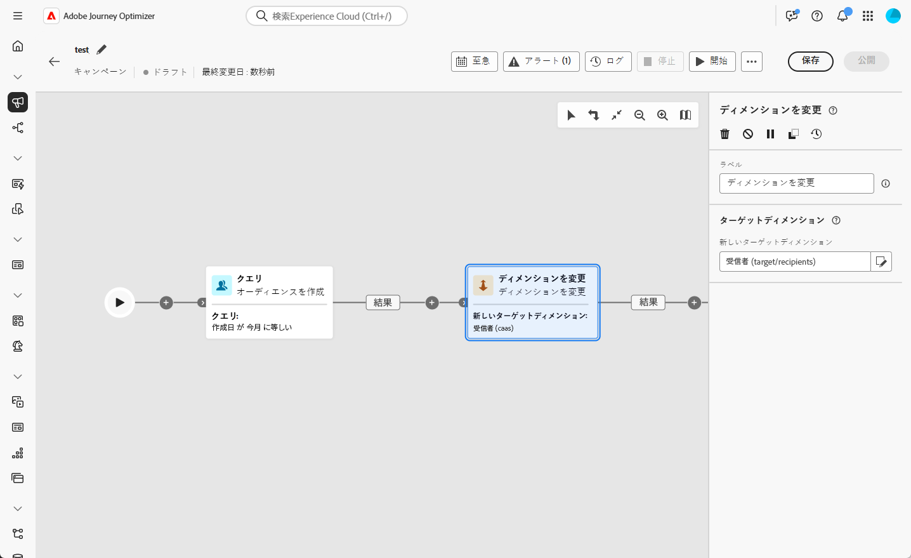
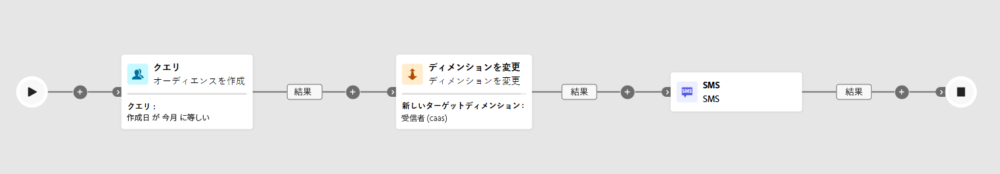

# ディメンションを変更 {#change-dimension}

>[!CONTEXTUALHELP]
>id="ajo_orchestration_dimension_complement"
>title="補集合の生成"
>abstract="重複として除外された残りの母集団を使用して、追加のアウトバウンドトランジションを生成できます。 これを行うには、「**補集合を生成**」オプションの切替スイッチをオンにします。"

>[!CONTEXTUALHELP]
>id="ajo_orchestration_change_dimension"
>title="ディメンションを変更アクティビティ"
>abstract="このアクティビティを使用すると、オーディエンスの作成時にターゲティングディメンションを変更できます。 データテンプレートと入力ディメンションに応じて軸を移動します。 例えば、「契約」ディメンションから「クライアント」ディメンションに切り替えることができます。"

マーケターは、調整されたキャンペーン内で 1 つのデータエンティティから関連するデータエンティティに移行することで、オーディエンスのターゲティングを強化できます。 これにより、ユーザープロファイルを超えて、購入、予約、その他のインタラクションなどの特定の行動に焦点を当てることができます。

これを実現するには、**[!UICONTROL ディメンションを変更]**&#x200B;アクティビティを使用します。 調整されたキャンペーン中にターゲティングディメンションを調整できます。

<!--
>[!IMPORTANT]
>
>Please note that the **[!UICONTROL Change Dimension]** and **[!UICONTROL Change Data source]** activities should not be added in one row. If you need to use both activities consecutively, make sure you include an **[!UICONTROL Enrichement]** activity in between them. This ensures proper execution and prevents potential conflicts or errors.
-->

## ディメンションを変更アクティビティの設定 {#configure}

**[!UICONTROL ディメンションを変更]**&#x200B;アクティビティを設定するには、次の手順に従います。

1. **[!UICONTROL ディメンションを変更]**&#x200B;アクティビティを調整されたキャンペーンに追加します。

   

1. **[!UICONTROL 新しいターゲットディメンション]**&#x200B;を定義します。 ディメンションの変更ステップでは、外部結合が使用されます。入力母集団からのすべてのレコードが通過し、新しいディメンションに一致するエントリがないレコードも含まれます。

   >[!IMPORTANT]
   >
   >新しいターゲティングディメンションに一致するプロファイルがないレコードは、**メッセージ配信時にサイレントで除外されます**。 この除外は、現在、除外ログには反映されません。 一致しないレコードを早い段階で特定するには、ディメンションを変更ステップの後の移行で&#x200B;**結果をプレビュー** オプションを使用し、続行する前にレコード数が期待値と一致することを確認します。

## 例 {#example}

このユースケースは、過去 1 か月以内にウィッシュリストを作成したプロファイルへの SMS の送信に焦点を当てています。

**[!UICONTROL オーディエンスを作成]**&#x200B;アクティビティから開始し、**[!UICONTROL ウィッシュリスト]**&#x200B;ターゲティングディメンションを使用して関連するすべてのウィッシュリストを特定します。

次に、**[!UICONTROL ディメンションを変更]** アクティビティを追加して、ターゲティングディメンションを&#x200B;**[!UICONTROL ウィッシュリスト]**&#x200B;から&#x200B;**[!UICONTROL 受信者]**&#x200B;に切り替えます。 この手順により、オーケストレーションされたキャンペーンは、これらのウィッシュリストにリンクされた正しいプロファイルをターゲットにして、SMSを目的のプロファイルに送信できるようになります。

