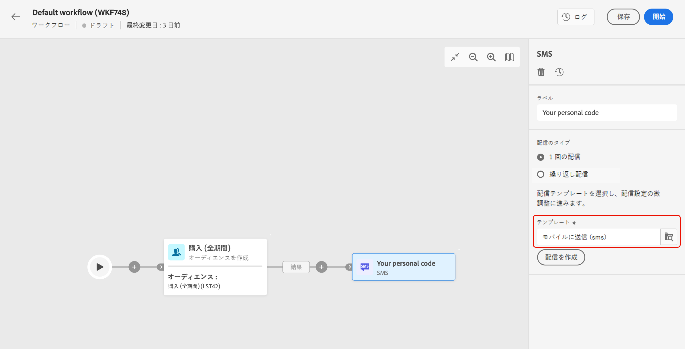
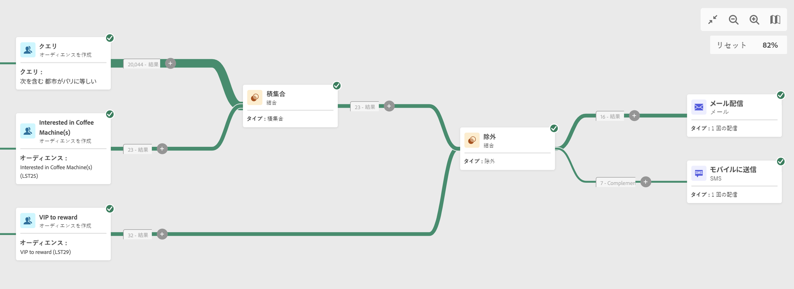
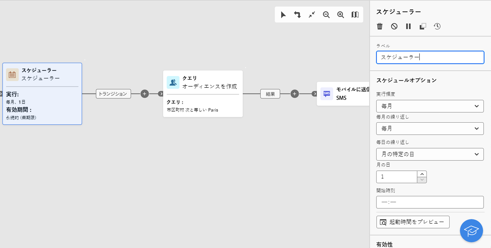

# チャネルアクティビティ {#channel}

+++ 目次

| 調整されたキャンペーンへようこそ | 最初の調整されたキャンペーンの開始 | データベースのクエリ | キャンペーンアクティビティをキャンセル |
|---|---|---|---|
| [ オーケストレーションされたキャンペーンの概要 ](../gs-orchestrated-campaigns.md)  [ 設定手順 ](../configuration-steps.md)  [ オーケストレーションされたキャンペーンを作成するための主な手順 ](../gs-campaign-creation.md) | [ オーケストレーションされたキャンペーンの作成 ](../create-orchestrated-campaign.md)  [ アクティビティのオーケストレーション ](../orchestrate-activities.md)  [ オーケストレーションされたキャンペーンでのメッセージの送信 ](../send-messages.md)  [ キャンペーンの開始および監視 ](../start-monitor-campaigns.md)  [ レポート ](../reporting-campaigns.md) | [ クエリの操作Modeler](../orchestrated-query-modeler.md)  [ 最初のクエリ ](../build-query.md)  [ 編集式を作成 ](../edit-expressions.md) | [ アクティビティの基本を学ぶ ](about-activities.md)   アクティビティ： [AND 結合 ](and-join.md) - [ オーディエンスを作成 ](build-audience.md) - [ ディメンションを変更 ](change-dimension.md) - [ 結合 ](combine.md) - [ 重複排除 ](deduplication.md) - [ エンリッチメント ](enrichment.md) - [ 分岐 ](fork.md) - [ 紐付け ](reconciliation.md) - [ 分割 ](split.md) [&#128279;](wait.md) - |

{style="table-layout:fixed"}

+++

  

Adobe Journey Optimizerを使用すると、インバウンドチャネルとアウトバウンドチャネルをまたいでマーケティングキャンペーンを自動化および実行できます。 チャネルアクティビティを調整されたキャンペーンキャンバスに組み合わせて、顧客の行動とデータに基づいてアクションをトリガーにできるクロスチャネルの調整されたキャンペーンを作成できます。 サポートされているチャネルは [ このページ ](../../channels/gs-channels.md) に一覧表示されます。

例えば、メール、SMS、プッシュ、ダイレクトメールなど、様々なチャネルをまたいで一連のメッセージを含むウェルカムメールキャンペーンを作成できます。また、顧客が購入を完了した後や、SMS を使用してパーソナライズされた誕生日メッセージを顧客に送信した後に、フォローアップメールを送信することもできます。

チャネルアクティビティを使用すると、複数のタッチポイントで顧客を引きつけてコンバージョンを促進する、包括的でパーソナライズされたキャンペーンを作成できます。

## 前提条件 {#channel-activity-prereq}

関連するアクティビティを使用して、調整されたキャンペーンの作成を開始します。

* チャネルアクティビティを挿入する前に、オーディエンスを定義する必要があります。オーディエンスは配信のメインターゲットであり、メッセージを受信するプロファイルとなります。

* 繰り返し配信を送信するには、調整したキャンペーンを **スケジューラー** アクティビティで開始します。 また、「**スケジューラー**」アクティビティを 1 回限りのワンショット配信に使用して、その配信の連絡日を設定することもできます。その連絡日は、配信設定でも設定できます。

## チャネルを設定アクティビティ {#create-a-delivery-in-a-workflow}

>[!CONTEXTUALHELP]
>id="ajo_orchestration_email"
>title="メールアクティビティ"
>abstract="メールアクティビティを使用すると、複数の手順のキャンペーン内で、1 回限りのメッセージと繰り返しメッセージの両方でメールを送信できます。これは、同じ複数の手順のキャンペーン内で計算されたターゲットにメールを送信するプロセスを自動化するのに役立ちます。チャネルアクティビティを複数の手順のキャンペーンキャンバスに組み合わせて、顧客の行動とデータに基づいてアクションをトリガーできるクロスチャネルキャンペーンを作成できます。"

>[!CONTEXTUALHELP]
>id="ajo_orchestration_sms"
>title="SMS アクティビティ"
>abstract="SMS アクティビティを使用すると、複数の手順のキャンペーン内で、1 回限りのメッセージと繰り返しメッセージで SMS を送信できます。これは、同じ複数の手順のキャンペーン内で計算されたターゲットに SMS を送信するプロセスを自動化するのに役立ちます。チャネルアクティビティを複数の手順のキャンペーンキャンバスに組み合わせて、顧客の行動とデータに基づいてアクションをトリガーできるクロスチャネルキャンペーンを作成できます。"

>[!CONTEXTUALHELP]
>id="ajo_orchestration_push_ios"
>title="iOS をプッシュアクティビティ"
>abstract="iOS をプッシュアクティビティを使用すると、複数の手順のキャンペーンの一部として iOS プッシュ通知を送信できます。これにより、1 回限りのキャンペーンと繰り返しの複数の手順のキャンペーンの両方の配信が可能になり、同じワークフロー内の定義済みターゲットへの iOS プッシュ通知の送信が自動化されます。チャネルアクティビティをワークフローキャンバスに組み合わせて、顧客の行動とデータに基づいてアクションをトリガーできるクロスチャネルワークフローを作成できます。"

>[!CONTEXTUALHELP]
>id="ajo_orchestration_push_android"
>title="Android をプッシュアクティビティ"
>abstract="Android をプッシュアクティビティを使用すると、複数の手順のキャンペーンの一部として Android プッシュ通知を送信できます。これにより、1 回限りのメッセージと繰り返しメッセージの両方の配信が可能になり、同じ複数の手順のキャンペーン内の定義済みターゲットへの Android プッシュ通知の送信が自動化されます。チャネルアクティビティを複数の手順のキャンペーンキャンバスに組み合わせて、顧客の行動とデータに基づいてアクションをトリガーできるクロスチャネルキャンペーンを作成できます。"

>[!CONTEXTUALHELP]
>id="ajo_orchestration_directmail"
>title="ダイレクトメールアクティビティ"
>abstract="ダイレクトメールアクティビティでは、複数の手順のキャンペーン内でダイレクトメール送信を促進し、1 回限りのメッセージと繰り返しメッセージの両方を送信できます。これは、ダイレクトメールプロバイダーが必要とする抽出ファイルを生成するプロセスを自動化するのに役立ちます。チャネルアクティビティを複数の手順のキャンペーンキャンバスに組み合わせて、顧客の行動とデータに基づいてアクションをトリガーできるクロスチャネルキャンペーンを作成できます。"

オーケストレーションされたキャンペーンのコンテキストで配信を設定するには、次の手順に従います。

1. チャネルアクティビティ（**[!UICONTROL メール]**、**[!UICONTROL SMS]**、**[!UICONTROL プッシュ通知（Android）]**、**[!UICONTROL プッシュ通知（iOS）]**&#x200B;または&#x200B;**[!UICONTROL ダイレクトメール]**）を追加します。

1. 「**配信のタイプ**」（単一または繰り返し）を選択します。

   * **単一の配信**&#x200B;は 1 回限りの配信で、ブラックフライデーのメールなど 1 回だけ送信されます。
   * **繰り返し配信** は、実行頻度に基づいて複数回送信されます。 オーケストレーションされたキャンペーンが実行されるたびに、オーディエンスが再計算され、更新されたオーディエンスに更新されたコンテンツと共に配信が送信されます。 例えば、週刊ニュースレターや毎年の誕生日メールなどがあります。

1. 配信&#x200B;**テンプレート**&#x200B;を選択します。テンプレートは、チャネルに固有の事前設定済みの配信設定です。組み込みテンプレートは各チャネルで使用でき、デフォルトでは事前入力されます。

   

   チャネルアクティビティ設定の左側のパネルからテンプレートを選択できます。以前に選択したオーディエンスがチャネルに対応していない場合は、テンプレートを選択できません。これを解決するには、**オーディエンスを作成** アクティビティを更新して、ターゲットマッピングが正しいオーディエンスを選択します。

1. 「**配信を作成**」をクリックします。スタンドアロン配信の作成時と同様に、メッセージの設定とコンテンツを定義できます。また、コンテンツをテストし、シミュレートすることもできます。

1. ワークフローに戻ります。ワークフローを続行する場合は、「**アウトバウンドトランジションを生成**」オプションの切替スイッチをオンにし、チャネルアクティビティの後にトランジションを追加します。

1. 「**開始**」をクリックして、調整したキャンペーンを開始します。

   デフォルトでは、オーケストレーションされたキャンペーンを開始すると、メッセージはすぐに送信されずに、メッセージの準備ステージにトリガーします。

1. チャネルアクティビティを開き、「**確認して送信**」ボタンから送信を確定します。

1. 配信ダッシュボードで、「**送信**」をクリックします。

## 例 {#cross-channel-workflow-sample}

以下は、セグメント化と 2 つの配信を含むクロスチャネルオーケストレーションされたキャンペーンの例です。 オーケストレーションされたキャンペーンは、パリに在住し、コーヒーマシンに興味があるすべての顧客をターゲットにします。 この母集団の中で、通常の顧客にはメールが送信され、VIP クライアントには SMS が送信されます。

<!--
description, which use case you can perform (common other activities that you can link before of after the activity)

how to add and configure the activity

example of a configured activity within a workflow
The Email delivery activity allows you to configure the sending an email in a workflow. 

-->

また、毎月 1 日の午後 8 時に、パリに住むすべての顧客にパーソナライズされた SMS を送信する、繰り返しのオーケストレートキャンペーンを作成することもできます。

<!-- Scheduled emails available?

This can be a single send email and sent just once, or it can be a recurring email.
* Single send emails are standard emails, sent once.
* Recurring emails allow you to send the same email multiple times to different targets over a defined period. You can aggregate the deliveries per period in order to get reports that correspond to your needs.

When linked to a scheduler, you can define recurring emails.
Email recipients are defined upstream of the activity in the same workflow, via an Audience targeting activity.

-->

<!--The message preparation is triggered according to the workflow execution parameters. From the message dashboard, you can select whether to request or not a manual confirmation to send the message (required by default). You can start the workflow manually or place a scheduler activity in the workflow to automate execution.-->
