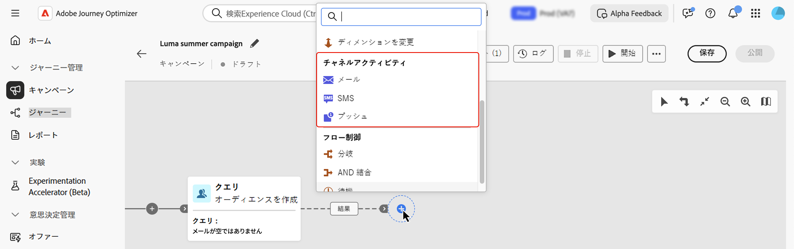
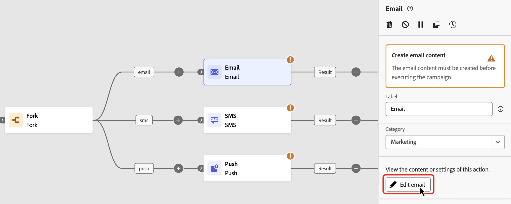
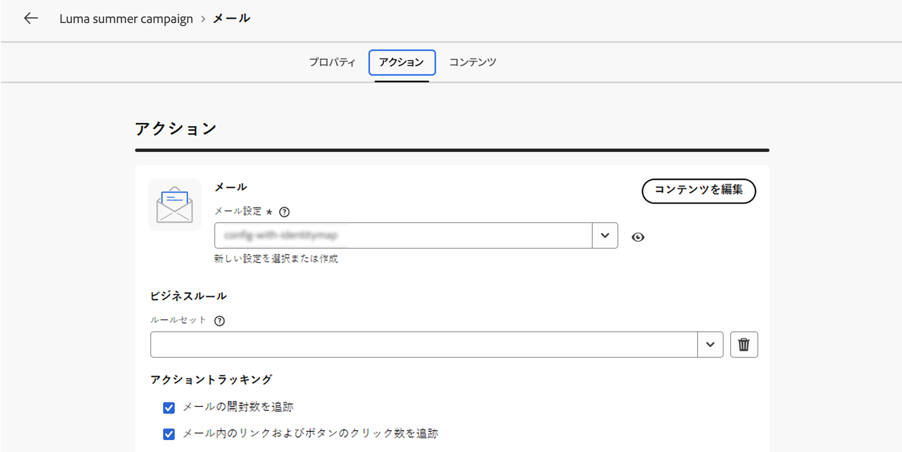
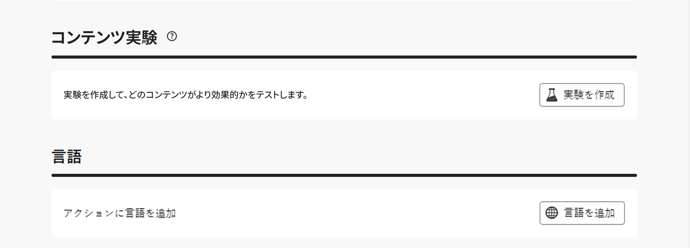
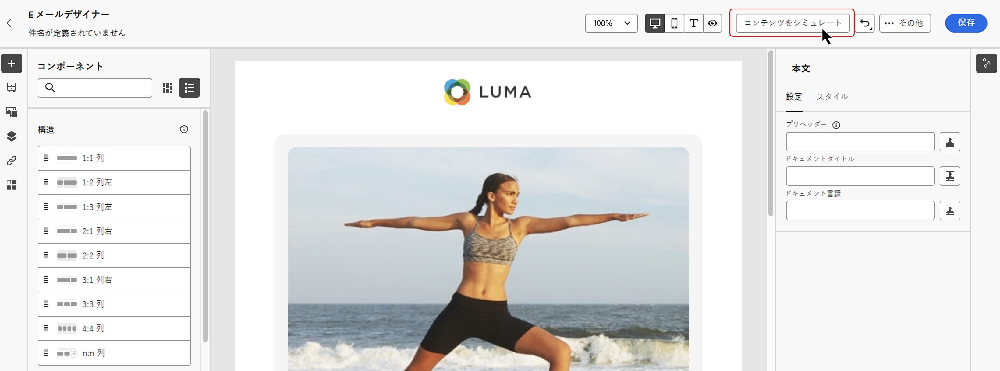
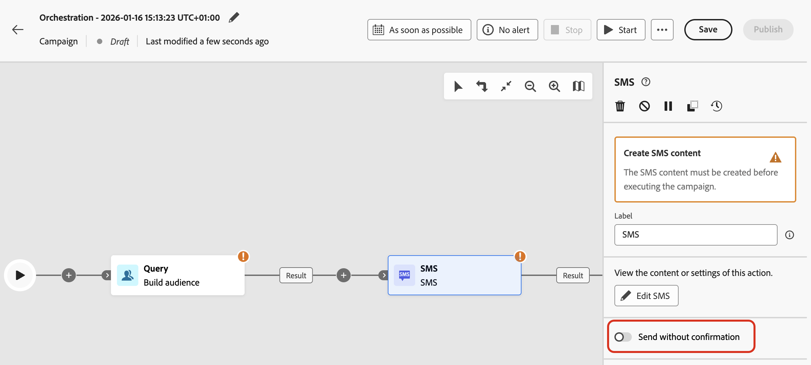
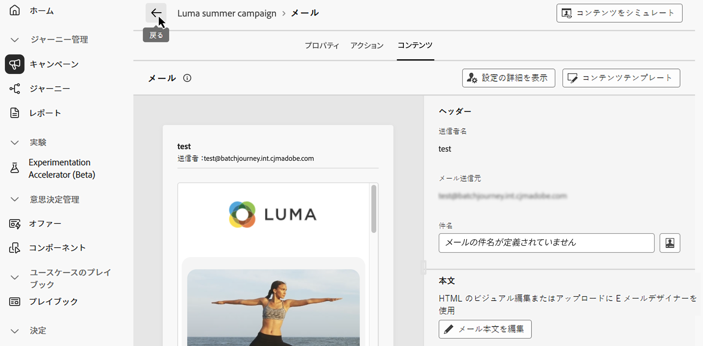
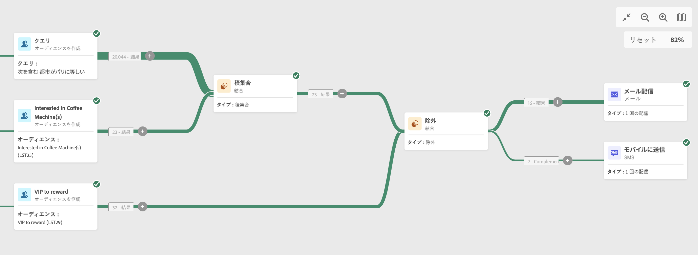
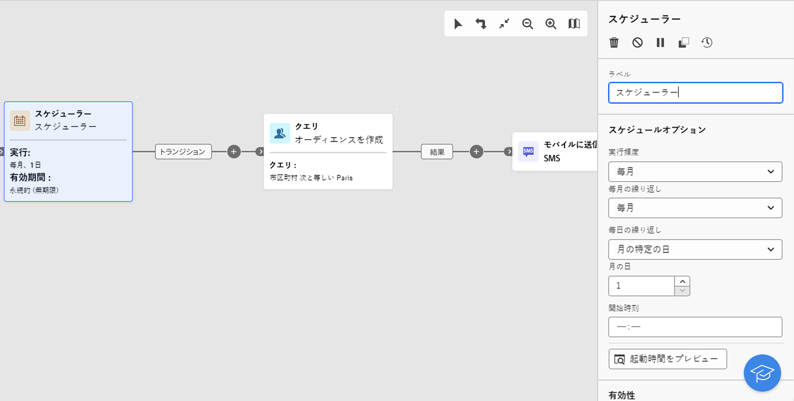

# チャネルアクティビティ {#channel}

>[!CONTEXTUALHELP]
>id="ajo_orchestration_email"
>title="メールアクティビティ"
>abstract="メールアクティビティを使用すると、オーケストレーションキャンペーン内で、1 回限りのメッセージと繰り返しメッセージの両方についてメールを送信できます。 これは、調整された同じキャンペーン内で計算されたターゲットにメールを送信するプロセスを自動化するのに役立ちます。 チャネルアクティビティを複数の手順のキャンペーンキャンバスに組み合わせて、顧客の行動とデータに基づいてアクションをトリガーできるクロスチャネルキャンペーンを作成できます。"

>[!CONTEXTUALHELP]
>id="ajo_orchestration_sms"
>title="SMS アクティビティ"
>abstract="SMS アクティビティを使用すると、オーケストレーションキャンペーン内で、1 回限りのメッセージと繰り返しメッセージの両方について SMS を送信できます。 これは、調整された同じキャンペーン内で計算されたターゲットに SMS を送信するプロセスを自動化するのに役立ちます。 チャネルアクティビティを複数の手順のキャンペーンキャンバスに組み合わせて、顧客の行動とデータに基づいてアクションをトリガーできるクロスチャネルキャンペーンを作成できます。"

>[!CONTEXTUALHELP]
>id="ajo_orchestration_push"
>title="プッシュアクティビティ"
>abstract="プッシュアクティビティを使用すると、オーケストレーションキャンペーンの一部としてプッシュ通知を送信できます。 これにより、1 回限りのオーケストレーションキャンペーンと繰り返しのオーケストレーションキャンペーンの両方を配信できるようになり、同じオーケストレーションキャンペーン内で、事前定義されたターゲットへのプッシュ通知の送信が自動化されます。 チャネルアクティビティをキャンペーンキャンバスに組み合わせて、顧客の行動とデータに基づいてアクションをトリガーできるクロスチャネルキャンペーンを作成できます。"

>[!CONTEXTUALHELP]
>id="ajo_orchestration_target"
>title="Target"
>abstract="Target セクションのプレースホルダー"

<!--
UNUSED IDs in BJ

>[!CONTEXTUALHELP]
>id="ajo_orchestration_push_ios"
>title="Push iOS activity"
>abstract="The Push iOS activity lets you send iOS Push notifications as part of your Orchestrated campaign. It enables the delivery of both one-time and recurring Orchestrated campaigns, automating the sending of iOS Push notifications to a predefined target within the same workflow. You can combine channel activities into the campaign canvas to create cross-channel campaigns that can trigger actions based on customer behavior and data."

>[!CONTEXTUALHELP]
>id="ajo_orchestration_push_android"
>title="Push Android activity"
>abstract="The Push Android activity lets you send Android Push notifications as part of your Orchestrated campaign. It enables the delivery of both one-time and recurring messages, automating the sending of Android Push notifications to a predefined target within the same Orchestrated campaign. You can combine channel activities into the Orchestrated campaign canvas to create cross-channel campaigns that can trigger actions based on customer behavior and data."
-->

>[!CONTEXTUALHELP]
>id="ajo_orchestration_directmail"
>title="ダイレクトメールアクティビティ"
>abstract="ダイレクトメールアクティビティでは、調整されたキャンペーン内でのダイレクトメール送信が促進され、1 回限りのメッセージと繰り返しメッセージの両方を送信できます。 これは、ダイレクトメールプロバイダーが必要とする抽出ファイルを生成するプロセスを自動化するのに役立ちます。 チャネルアクティビティをオーケストレーションキャンペーンキャンバスに組み合わせて、顧客の行動とデータに基づいてアクションをトリガーできるクロスチャネルキャンペーンを作成できます。"

[!DNL Adobe Journey Optimizer]を使用すると、マーケティングメッセージとトランザクションメッセージの両方に対して、メール、SMS、プッシュ通知、ダイレクトメールなどのチャネルをまたいでキャンペーンを自動化および実行できます。 これらのチャネルアクティビティをキャンペーンキャンバスに組み合わせて、クロスチャネルのオーケストレーションされたキャンペーンを作成できます。 これらの施策では、顧客の行動やデータにもとづいて行動をトリガーにすることができます。

次に例を示します。

* 電子メール、SMS、プッシュ通知、ダイレクトメールを通じて、ウェルカムシリーズを送信します。
* 購入後にフォローアップメールを配信します。
* パーソナライズされた誕生日の挨拶を SMS 経由で送信します。

チャネルアクティビティを使用すると、複数のタッチポイントで顧客を引きつけてコンバージョンを促進する、包括的でパーソナライズされたキャンペーンを作成できます。

## ガードレールと制限 {#channel-guardrails}

* **サポートされているチャネル** - オーケストレーションされたキャンペーンでは、SMS、プッシュ、電子メール、およびダイレクトメールのチャネルのみがサポートされます。

* **チャネルアクティビティ制限** - オーケストレーションされたキャンペーンは、最大10個のチャネルアクティビティ（メール、SMS、プッシュ、またはダイレクトメール）をサポートします。 この制限にカウントされるのはチャネルアクティビティのみです。ターゲティングおよびフロー制御アクティビティはカウントされません。

  保存または公開時に制限を超えると、操作は失敗します。 制限内に収まるように、チャネルアクティビティの数を減らしたり、複数のオーケストレーションされたキャンペーンをまたいでメッセージ配信を分割したりします。

オーケストレーションされたすべてのキャンペーンのガードレールと制限事項については、[&#x200B; ガードレールと制限事項](../guardrails.md)を参照してください。

## チャネルアクティビティを追加し、そのプロパティを定義します。 {#add}

>[!CONTEXTUALHELP]
>id="ajo_orchestration_category"
>title="カテゴリ"
>abstract="このチャネルアクティビティの「マーケティング」または「トランザクション」を選択します。 マーケティングメッセージは、マーケティングチャネル設定を使用し、標準的なビジネスルールに従います。 トランザクションメッセージは、運用上のコミュニケーションに使用され、多くの場合、個人のアクション（例：パスワードのリセットや購入確認）によってトリガーされるか、中断やキャンセルなどの時間的制約のある通知に使用されます。 トランザクションメッセージでは、トランザクションチャネル設定が使用されます。ビジネスルールはバイパスされ、オプトインは必要ありません。"

>[!PREREQUISITES]
>
>チャネルアクティビティを追加する前に、[オーディエンスを作成](build-audience.md)または[オーディエンスを読み取り](read-audience.md)アクティビティを使用してターゲットオーディエンスを定義します。

1. チャネルアクティビティをキャンバスに追加します。 利用可能なチャネルアクティビティは、**[!UICONTROL 電子メール]**、**[!UICONTROL SMS]**、**[!UICONTROL プッシュ]**&#x200B;および&#x200B;**[!UICONTROL ダイレクトメール]**&#x200B;です。

   

1. 右側のパネルで、**[!UICONTROL カテゴリ]** フィールドを使用して、このメッセージに&#x200B;**[!UICONTROL マーケティング]**&#x200B;または&#x200B;**[!UICONTROL トランザクション]**&#x200B;を選択します。 トランザクションメッセージは、オプトインを必要とせず、中断、緊急事態、キャンセルなど、時間的制約のある通信に適しています。

1. アクティビティを選択し、選択したチャネルに応じて、**[!UICONTROL メールを編集]**、**[!UICONTROL SMSを編集]**、**[!UICONTROL プッシュを編集]**&#x200B;または&#x200B;**[!UICONTROL ダイレクトメールを編集]**&#x200B;をクリックします。

   

1. 「**[!UICONTROL プロパティ]**」タブで説明を入力し、「**[!UICONTROL アクション]**」タブに切り替えてアクティビティを設定します。

## マーケティングとトランザクションメッセージ {#marketing-vs-transactional}

適切なカテゴリを選択することで、メッセージの配信方法と適用されるルールが決まります。

| | マーケティング | 取引 |
| --- | --- | --- |
| **オプトインが必要** | ○ | × |
| **ビジネスルール** | 適用（頻度の上限、疲労ルール） | バイパス |
| **チャネル設定タイプ** | マーケティングチャネル設定 | トランザクションチャネル設定 |
| **一般的なユースケース** | プロモーション、ニュースレター、季節キャンペーン | 注文確認、パスワードリセット、中断アラート |
| **オーディエンス** | オプトインした購読者のみ | オプトインステータスに関係なく任意のプロファイル |

>[!NOTE]
>
>運用上または時間的制約のあるコミュニケーションにのみトランザクションを使用します。 プロモーションメッセージを「トランザクション」と誤分類すると、同意やビジネスルールが無視され、規制要件に違反する可能性があります。

## チャネル設定と設定の設定 {#configuration}

「**[!UICONTROL アクション]**」タブを使用すると、メッセージのチャネル設定を選択し、トラッキング、コンテンツ実験、多言語コンテンツなどの追加設定を指定できます。

1. **チャネル設定を選択**

   設定は、[システム管理者](../../start/path/administrator.md)によって定義されます。 ヘッダーパラメーター、サブドメイン、モバイルアプリなど、メッセージを送信するためのすべての技術的なパラメーターが含まれます。[&#x200B; チャネル設定の設定方法を説明します](../../configuration/channel-surfaces.md)

   

1. **キャッピングルールの適用**

   **[!UICONTROL ルールセット]**&#x200B;ドロップダウンリストで、キャッピングルールをキャンペーンに適用するチャネルルールセットを選択します。 チャネルルールセットを活用すると、通信タイプ別のフリークエンシーキャップを設定し、類似したメッセージで顧客に過剰な負荷がかかるのを防ぐことができます。 [&#x200B; ルールセットの操作方法を説明](../../conflict-prioritization/rule-sets.md)。

1. **コンテンツ実験を作成**

   「**[!UICONTROL コンテンツ実験]**」セクションを使用すると、複数の配信処理を定義して、ターゲットオーディエンスに最適なパフォーマンスを発揮する配信を測定できます。 「**[!UICONTROL 実験を作成]**」ボタンをクリックし、[コンテンツ実験を作成](../../content-management/content-experiment.md)の節で説明している手順に従います。

1. **多言語コンテンツを追加**

   「**[!UICONTROL 言語]**」セクションを使用すると、キャンペーン内の複数の言語でコンテンツを作成できます。 これを行うには、「**[!UICONTROL 言語を追加]**」ボタンをクリックし、目的の&#x200B;**[!UICONTROL 言語設定]**&#x200B;を選択します。 多言語機能の設定と使用方法について詳しくは、[多言語コンテンツの基本を学ぶ](../../content-management/multilingual-gs.md)の節を参照してください。

   

選択した通信チャネルに応じて、追加の設定を使用できます。 詳しくは、以下の節を展開してください。

+++**エンゲージメントを追跡** （電子メールとSMS）。

「**[!UICONTROL アクショントラッキング]**」セクションを使用すると、受信者がメールや SMS の配信にどのように反応したかを追跡できます。 キャンペーンが実行されると、キャンペーンレポートからトラッキング結果にアクセスできるようになります。 [詳しくは、キャンペーンレポートを参照してください](../../reports/campaign-global-report-cja.md)

+++

+++**迅速配信モードを有効にする**（プッシュ）。

迅速配信モードは、キャンペーンを通じて大量のプッシュメッセージを非常に高速に送信できるようにする [!DNL Journey Optimizer] アドオンです。 迅速配信は、メッセージ配信の遅延がビジネスに不可欠な場合に使用されます。 例えば、ニュースチャネルアプリをインストールしたユーザーにニュース速報などの緊急プッシュアラートを携帯電話で送信するとします。 プッシュ通知の迅速配信モードを有効にする方法について詳しくは、[このページ](../../push/create-push.md#rapid-delivery)を参照してください。

迅速配信モードを使用する場合のパフォーマンスについて詳しくは、[Adobe Journey Optimizer製品の説明](https://helpx.adobe.com/jp/legal/product-descriptions/adobe-journey-optimizer.html){target="_blank"}を参照してください。

+++

チャネルアクティビティを設定したら、「**[!UICONTROL コンテンツ]**」タブを選択してコンテンツを定義します。

## コンテンツの定義 {#content}

### メッセージコンテンツの作成

「**[!UICONTROL コンテンツ]**」タブに切り替えて、メッセージを作成します。 選択したチャネルに応じて、プロセスの手順が異なります。 メッセージコンテンツを作成する手順について詳しくは、次のページを参照してください。

<table style="table-layout:fixed"><tr style="border: 0; text-align: center;" >
<td> <a href="../../email/create-email.md"><strong>メールの作成</strong></a></td>
<td> <a href="../../mobile/create-mobile-message.md"><strong>SMS の作成</strong></a></td>
<td><a href="../../push/create-push.md"><strong>プッシュ通知の作成</strong></a></td><td><a href="../../direct-mail/create-direct-mail.md"><strong>ダイレクトメールの作成</strong></a></td>
</tr></table>

### パーソナライゼーションの追加

オーケストレーションされたキャンペーンのPersonalizationは、他の[!DNL Journey Optimizer]件のキャンペーンまたはジャーニーと同様に機能しますが、オーケストレーションされたキャンバスに固有のいくつかの重要な違いがあります。

調整されたキャンペーンからパーソナライゼーションエディターにアクセスすると、2 つのメインフォルダーに、以下に説明するパーソナライゼーションに使用できる属性が含まれます。

* **[!UICONTROL プロファイル属性]**

  このフォルダーには、[!DNL Adobe Experience Platform] のすべてのプロファイル関連データが含まれます。 これらは、名前、メールアドレス、場所、ユーザープロファイルで取得されたその他の特性などの標準属性です。

* **[!UICONTROL ターゲット属性]**（調整されたキャンペーンに固有）

  このフォルダーは、調整されたキャンペーンに固有です。 キャンペーンキャンバス内で直接計算された属性が含まれます。 次の 2 つのサブフォルダーが含まれます。

   * **`<Targeting dimension>`**（例：「受信者」、「購入」）：キャンペーンでターゲットにするディメンションに関連するすべての属性が含まれます。

   * **`Enrichment`**：キャンバス内の&#x200B;**[!UICONTROL エンリッチメント]**&#x200B;アクティビティを通じて追加されたデータを含めます。 これにより、外部データセットまたはオーケストレーション中に組み込まれた追加ロジックに基づいて、メッセージをパーソナライズできます。 [エンリッチメントアクティビティの使用方法の詳細情報](../activities/enrichment.md)

パーソナライゼーションエディターの使用方法について詳しくは、[&#x200B; パーソナライゼーションの基本を学ぶ](../../personalization/personalize.md)を参照してください。

### コンテンツの確認とテスト {#simulate-content-test-profiles}

コンテンツを作成したら、次のいずれかのシミュレーション方法を使用してプレビューおよびテストできます。

* 「**[!UICONTROL コンテンツをシミュレート]**」をクリックして、サンプル入力データまたはAI自動生成を使用してコンテンツのバリエーションをテストします。 [コンテンツバリエーションのシミュレート方法を学ぶ](../../test-approve/simulate-sample-input.md)
* 「**[!UICONTROL コンテンツをシミュレート]**」をクリックし、ドロップダウンから「**[!UICONTROL コンテンツをシミュレート（AEP プロファイル）]**」を選択して、テストプロファイルでコンテンツをプレビューおよびテストします。 [詳細情報](../../content-management/preview-test.md)

オーケストレーションされたキャンペーンで&#x200B;**テストプロファイル**&#x200B;を使用してコンテンツをシミュレートする場合、次の2つの重要な制約が適用されます。

* **実行がテスト中のチャネルアクティビティに達している必要があります** - ワークフローがシミュレートするチャネルアクティビティに達するように、**[!UICONTROL 開始]** ボタンを使用してテスト中のキャンペーンを実行します。 テストモードでは、ワークフローはチャネルアクティビティで一時停止するため、別のチャネルアクティビティの後に来るチャネルアクティビティに到達することはありません。 これらのダウンストリームチャネルアクティビティに&#x200B;**[!UICONTROL コンテンツをシミュレート]**&#x200B;することはできません。 [公開前にキャンペーンをテストする](../start-monitor-campaigns.md#test)を参照してください。

* **テストプロファイルはチャネルアクティビティのターゲットと一致する必要があります** – そのチャネルアクティビティのターゲットとなるオーディエンスに属するテストプロファイルを使用します。 プロファイルがそのオーディエンスに含まれていない場合、プロファイルを選択してもコンテンツのプレビューはレンダリングされません。 [&#x200B; テストプロファイルの選択](../../content-management/test-profiles.md)を参照してください。

## メッセージ送信を確認

デフォルトでは、非定期的なオーケストレーションされたキャンペーンの場合、送信を明示的に承認するまでメッセージ配信は一時停止されます。 キャンペーンを公開したら、チャネルアクティビティのプロパティペインから送信リクエストを確認します。

確認ボタンを表示する

オーケストレーションされたキャンペーンを公開する前に、確認の送信を無効にすることができます。 これを行うには、キャンバス内のチャネルアクティビティを選択してプロパティを表示し、**[!UICONTROL 確認なしで送信]**&#x200B;をオンにします。

確認せずに送信ボタンを表示する

## レート制御の設定 {#rate-control}

[!DNL Journey Optimizer]では、オーケストレーションされたキャンペーンのアウトバウンドアクションのレート制御を有効にできます。

この機能は、ランディングページやカスタマーケアプラットフォームなどのダウンストリームシステムの過負荷を防ぐのに特に役立ちます。 例えば、ダウンストリームシステムに負担をかけずに安定した配信を確保するために、1 秒あたり 165 メッセージのレート制限を設定できます。

レート制御を設定するには、次の手順に従います。

1. キャンバスでアウトバウンドチャネルアクティビティを選択し、選択したチャネルに応じて&#x200B;**[!UICONTROL メールを編集]**、**[!UICONTROL SMSを編集]**&#x200B;または&#x200B;**[!UICONTROL プッシュを編集]**&#x200B;をクリックします。

   

1. 「**[!UICONTROL スケジュール]**」タブに移動し、**[!UICONTROL 配信設定]** セクションの&#x200B;**[!UICONTROL スロットル配信]** オプションを有効にします。

   

1. 1秒あたりの希望の&#x200B;**[!UICONTROL 配信率]**&#x200B;を指定してください。

   * サポートされる最小配信レート：1 秒あたり 1 件。
   * サポートされる最大配信レート：「配信をスロットル」オプションが有効になっている場合、1 秒あたり 2000 件。

>[!IMPORTANT]
>
>配信率を設定する場合、キャンペーンオーディエンスが実行できる最大期間は12時間です。 配信率が、すべてのオーディエンスが12時間以内にメッセージを送信できない値に設定されている場合、残りのプロファイルはキャンペーンから除外されます。 これらの除外されたプロファイルの数は、キャンペーンレポートで確認できます。

## 次の手順 {#next}

メッセージコンテンツの準備が整ったら、**[!UICONTROL 戻る]**&#x200B;矢印を使用して、調整されたキャンペーンに戻ります。 その後、キャンバスでアクティビティのオーケストレーションを完了し、キャンペーンを公開してメッセージの送信を開始できます。 [詳しくは、調整されたキャンペーンの開始と監視方法を参照してください。](../start-monitor-campaigns.md)

<!--
## Examples {#cross-channel-workflow-sample}

Here is a cross-channel Orchestrated campaign example with a segmentation and two deliveries. The Orchestrated campaign targets all customers who live in Paris and who are interested in coffee machines. Among this population, an email is sent to the regular customers and an SMS is sent to the VIP clients.

<!--
description, which use case you can perform (common other activities that you can link before of after the activity)

how to add and configure the activity

example of a configured activity within a workflow
The Email delivery activity allows you to configure the sending an email in a workflow. 
-->

<!--
You can also create a recurring Orchestrated campaign to send a personalized SMS every first day of the month at 8 PM to all customers living in Paris.

-->

<!--
 Scheduled emails available?

This can be a single send email and sent just once, or it can be a recurring email.
* Single send emails are standard emails, sent once.
* Recurring emails allow you to send the same email multiple times to different targets over a defined period. You can aggregate the deliveries per period in order to get reports that correspond to your needs.

When linked to a scheduler, you can define recurring emails.
Email recipients are defined upstream of the activity in the same workflow, via an Audience targeting activity.
-->

<!--The message preparation is triggered according to the workflow execution parameters. From the message dashboard, you can select whether to request or not a manual confirmation to send the message (required by default). You can start the workflow manually or place a scheduler activity in the workflow to automate execution.-->

