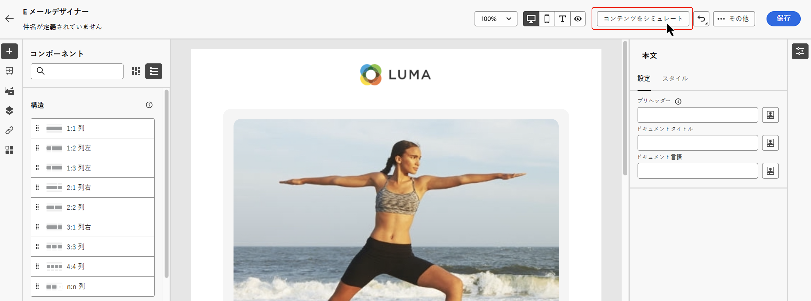

# チャネルアクティビティ {#channel}

>[!CONTEXTUALHELP]
>id="ajo_orchestration_email"
>title="メールアクティビティ"
>abstract="メールアクティビティを使用すると、調整されたキャンペーン内で、1 回限りのメッセージと繰り返しメッセージの両方でメールを送信できます。これは、調整された同じキャンペーン内で計算されたターゲットにメールを送信するプロセスを自動化するのに役立ちます。チャネルアクティビティを複数の手順のキャンペーンキャンバスに組み合わせて、顧客の行動とデータに基づいてアクションをトリガーできるクロスチャネルキャンペーンを作成できます。"

>[!CONTEXTUALHELP]
>id="ajo_orchestration_sms"
>title="SMS アクティビティ"
>abstract="SMS アクティビティを使用すると、調整されたキャンペーン内で、1 回限りのメッセージと繰り返しメッセージで SMS を送信できます。これは、調整された同じキャンペーン内で計算されたターゲットに SMS を送信するプロセスを自動化するのに役立ちます。チャネルアクティビティを複数の手順のキャンペーンキャンバスに組み合わせて、顧客の行動とデータに基づいてアクションをトリガーできるクロスチャネルキャンペーンを作成できます。"

>[!CONTEXTUALHELP]
>id="ajo_orchestration_push"
>title="プッシュアクティビティ"
>abstract="プッシュアクティビティを使用すると、調整されたキャンペーンの一部としてプッシュ通知を送信できます。これにより、1 回限りのキャンペーンと調整された繰り返しのキャンペーンの両方の配信が可能になり、調整された同じキャンペーン内の定義済みターゲットへのプッシュ通知の送信が自動化されます。チャネルアクティビティをキャンペーンキャンバスに組み合わせて、顧客の行動とデータに基づいてアクションをトリガーできるクロスチャネルキャンペーンを作成できます。"

<!--
UNUSED IDs in BJ

>[!CONTEXTUALHELP]
>id="ajo_orchestration_push_ios"
>title="Push iOS activity"
>abstract="The Push iOS activity let you send iOS Push notifications as part of your Orchestrated campaign. It enables the delivery of both one-time and recurring Orchestrated campaigns, automating the sending iOS Push notifications to a predefined target within the same workflow. You can combine channel activities into the campaign canvas to create cross-channel campaigns that can trigger actions based on customer behavior and data."

>[!CONTEXTUALHELP]
>id="ajo_orchestration_push_android"
>title="Push Android activity"
>abstract="The Push Android activity ket you send Android Push notifications as part of your Orchestrated campaign. It enables the delivery of both one-time and recurring messages, automating the sending Android Push notifications to a predefined target within the same Orchestrated campaign. You can combine channel activities into the Orchestrated campaign canvas to create cross-channel campaigns that can trigger actions based on customer behavior and data."

-->

>[!CONTEXTUALHELP]
>id="ajo_orchestration_directmail"
>title="ダイレクトメールアクティビティ"
>abstract="ダイレクトメールアクティビティでは、調整されたキャンペーン内でのダイレクトメール送信が促進され、1 回限りのメッセージと繰り返しメッセージの両方を送信できます。これは、ダイレクトメールプロバイダーが必要とする抽出ファイルを生成するプロセスを自動化するのに役立ちます。チャネルアクティビティを調整されたキャンペーンキャンバスに組み合わせて、顧客の行動とデータに基づいてアクションをトリガーできるクロスチャネルキャンペーンを作成できます。"

[!DNL Adobe Journey Optimizer] を使用すると、メール、SMS、プッシュ通知などのチャネルをまたいでマーケティングキャンペーンを自動化および実行できます。これらのチャネルアクティビティをキャンペーンキャンバスに組み合わせて、顧客の行動とデータに基づいてアクションをトリガーできるクロスチャネルの調整されたキャンペーンを作成できます。

例：

* メール、SMS、プッシュを通じてウェルカムシリーズを送信します。
* 購入後にフォローアップメールを配信します。
* パーソナライズされた誕生日の挨拶を SMS 経由で送信します。

チャネルアクティビティを使用すると、複数のタッチポイントで顧客を引きつけてコンバージョンを促進する、包括的でパーソナライズされたキャンペーンを作成できます。

>[!CAUTION]
>
>調整されたキャンペーンでは、SMS、プッシュ、メールチャネルのみがサポートされます。

## チャネルアクティビティを追加し、そのプロパティを定義します。 {#add}

>[!PREREQUISITES]
>
>チャネルアクティビティを追加する前に、[オーディエンスを作成](build-audience.md)または[オーディエンスを読み取り](read-audience.md)アクティビティを使用してターゲットオーディエンスを定義します。

1. チャネルアクティビティをキャンバスに追加します。使用できるチャネルアクティビティは、**[!UICONTROL メール]**、**[!UICONTROL SMS]** および&#x200B;**[!UICONTROL プッシュ]**&#x200B;です。

   

1. アクティビティを選択し、選択したチャネルに応じて「**[!UICONTROL メールを編集]**」、「**[!UICONTROL SMS を編集]**」または「**[!UICONTROL プッシュを編集]**」をクリックします。

   

1. 「**[!UICONTROL プロパティ]**」タブで説明を入力し、「**[!UICONTROL アクション]**」タブに切り替えてアクティビティを設定します。

## チャネル設定と設定の指定 {#configuration}

「**[!UICONTROL アクション]**」タブを使用すると、メッセージのチャネル設定を選択し、トラッキング、コンテンツ実験、多言語コンテンツなどの追加設定を指定できます。

1. **チャネル設定を選択**

   設定は、[システム管理者](../../start/path/administrator.md)によって定義されます。ヘッダーパラメーター、サブドメイン、モバイルアプリなど、メッセージを送信するすべての技術的なパラメーターが含まれています。[詳しくは、チャネル設定の指定方法を参照してください](../../configuration/channel-surfaces.md)。

   

1. **キャッピングルールの適用**

   **[!UICONTROL ルールセット]**&#x200B;ドロップダウンリストで、キャッピングルールをキャンペーンに適用するチャネルルールセットを選択します。チャネルルールセットを活用すると、通信タイプ別のフリークエンシーキャップを設定し、類似したメッセージで顧客に過剰な負荷がかかるのを防ぐことができます。[詳しくは、ルールセットの操作方法を参照してください](../../conflict-prioritization/rule-sets.md)。

1. **エンゲージメントのトラッキング**（メールと SMS）。

   「**[!UICONTROL アクショントラッキング]**」セクションを使用すると、受信者がメールや SMS の配信にどのように反応したかを追跡できます。キャンペーンが実行されると、キャンペーンレポートからトラッキング結果にアクセスできるようになります。[詳しくは、キャンペーンレポートを参照してください](../../reports/campaign-global-report-cja.md)

1. **迅速配信モードを有効にする**（プッシュ）

   迅速配信モードは、キャンペーンを通じて大量のプッシュメッセージを非常に高速に送信できるようにする [!DNL Journey Optimizer] アドオンです。迅速配信は、メッセージ配信の遅延がビジネス上の重要な問題になる状況で、携帯電話に緊急のプッシュアラートを送信するときに使用します（ニュースチャネルアプリをインストールしたユーザーにニュース速報を配信するなど）。プッシュ通知の迅速配信モードを有効にする方法について詳しくは、[このページ](../../push/create-push.md#rapid-delivery)を参照してください。

   迅速配信モードを使用する際のパフォーマンスについて詳しくは、[Adobe Journey Optimizer 製品説明](https://helpx.adobe.com/jp/legal/product-descriptions/adobe-journey-optimizer.html){target="_blank"}を参照してください。

1. **コンテンツ実験を作成**

   「**[!UICONTROL コンテンツ実験]**」セクションを使用すると、複数の配信処理を定義して、ターゲットオーディエンスに最適なパフォーマンスを発揮する配信を測定できます。「**[!UICONTROL 実験を作成]**」ボタンをクリックし、[コンテンツ実験を作成](../../content-management/content-experiment.md)の節で説明している手順に従います。

1. **多言語コンテンツを追加**

   「**[!UICONTROL 言語]**」セクションを使用すると、キャンペーン内の複数の言語でコンテンツを作成できます。これを行うには、「**[!UICONTROL 言語を追加]**」ボタンをクリックし、目的の&#x200B;**[!UICONTROL 言語設定]**&#x200B;を選択します。多言語機能の設定と使用方法について詳しくは、[多言語コンテンツの基本を学ぶ](../../content-management/multilingual-gs.md)の節を参照してください。

   

チャネルアクティビティを設定したら、「**[!UICONTROL コンテンツ]**」タブを選択してコンテンツを定義します。

## コンテンツの定義 {#content}

「**[!UICONTROL コンテンツ]**」タブに切り替えて、メッセージを作成します。手順は、選択したチャネルによって異なります。メッセージコンテンツを作成する手順について詳しくは、次のページを参照してください。

<table style="table-layout:fixed"><tr style="border: 0; text-align: center;" >
<td> <a href="../../email/create-email.md"><strong>メールの作成</strong></a></td>
<td> <a href="../../sms/create-sms.md"><strong>SMS の作成</strong></a></td>
<td><a href="../../push/create-push.md"><strong>プッシュ通知の作成</strong></a></td>
</tr></table>

## パーソナライゼーションの追加

調整されたキャンペーンのパーソナライゼーションは、他の **[!UICONTROL Journey Optimizer]** キャンペーンやジャーニーと同様に機能しますが、調整されたキャンバスに固有の重要な違いがいくつかあります。

調整されたキャンペーンからパーソナライゼーションエディターにアクセスすると、2 つのメインフォルダーに、以下に説明するパーソナライゼーションに使用できる属性が含まれます。

* **[!UICONTROL プロファイル属性]**

  このフォルダーには、[!DNL Adobe Experience Platform] のすべてのプロファイル関連データが含まれます。これらは、名前、メールアドレス、場所、ユーザープロファイルで取得されたその他の特性などの標準属性です。

* **[!UICONTROL ターゲット属性]**（調整されたキャンペーンに固有）

  このフォルダーは、調整されたキャンペーンに固有です。キャンペーンキャンバス内で直接計算された属性が含まれます。次の 2 つのサブフォルダーが含まれます。

   * **`<Targeting dimension>`**（例：「受信者」、「購入」）：キャンペーンでターゲットにするディメンションに関連するすべての属性が含まれます。

   * **`Enrichment`**：キャンバス内の&#x200B;**[!UICONTROL エンリッチメント]**&#x200B;アクティビティを通じて追加されたデータを含めます。これにより、外部データセットまたはオーケストレーション中に組み込まれた追加ロジックに基づいて、メッセージをパーソナライズできます。[エンリッチメントアクティビティの使用方法の詳細情報](../activities/enrichment.md)

パーソナライゼーションエディターの使用方法の概要について詳しくは、[パーソナライゼーションの基本を学ぶ](../../personalization/personalize.md)を参照してください。

## コンテンツの確認とテスト

コンテンツを作成したら、「**[!UICONTROL コンテンツをシミュレート]**」ボタンを使用して、CSV／JSON ファイルからアップロードした、または手動で追加したテストプロファイルやサンプル入力データを使用して、そのコンテンツをプレビューおよびテストします。[詳細情報](../../content-management/preview-test.md)

## 次の手順 {#next}

メッセージコンテンツの準備が整ったら、**[!UICONTROL 戻る]**&#x200B;矢印を使用して、調整されたキャンペーンに戻ります。次に、キャンバスでアクティビティのオーケストレーションを完了し、キャンペーンを公開してメッセージの送信を開始できます。[詳しくは、調整されたキャンペーンの開始と監視方法を参照してください。](../start-monitor-campaigns.md)

<!--
## Examples {#cross-channel-workflow-sample}

Here is a cross-channel Orchestrated campaign example with a segmentation and two deliveries. The Orchestrated campaign targets all customers who live in Paris and who are interested in coffee machines. Among this population, an email is sent to the regular customers and an SMS is sent to the VIP clients.

<!--
description, which use case you can perform (common other activities that you can link before of after the activity)

how to add and configure the activity

example of a configured activity within a workflow
The Email delivery activity allows you to configure the sending an email in a workflow. 

-->

<!--You can also create a recurring Orchestrated campaign to send a personalized SMS every first day of the month at 8 PM to all customers living in Paris.

-->

<!-- Scheduled emails available?

This can be a single send email and sent just once, or it can be a recurring email.
* Single send emails are standard emails, sent once.
* Recurring emails allow you to send the same email multiple times to different targets over a defined period. You can aggregate the deliveries per period in order to get reports that correspond to your needs.

When linked to a scheduler, you can define recurring emails.
Email recipients are defined upstream of the activity in the same workflow, via an Audience targeting activity.

-->

<!--The message preparation is triggered according to the workflow execution parameters. From the message dashboard, you can select whether to request or not a manual confirmation to send the message (required by default). You can start the workflow manually or place a scheduler activity in the workflow to automate execution.-->
