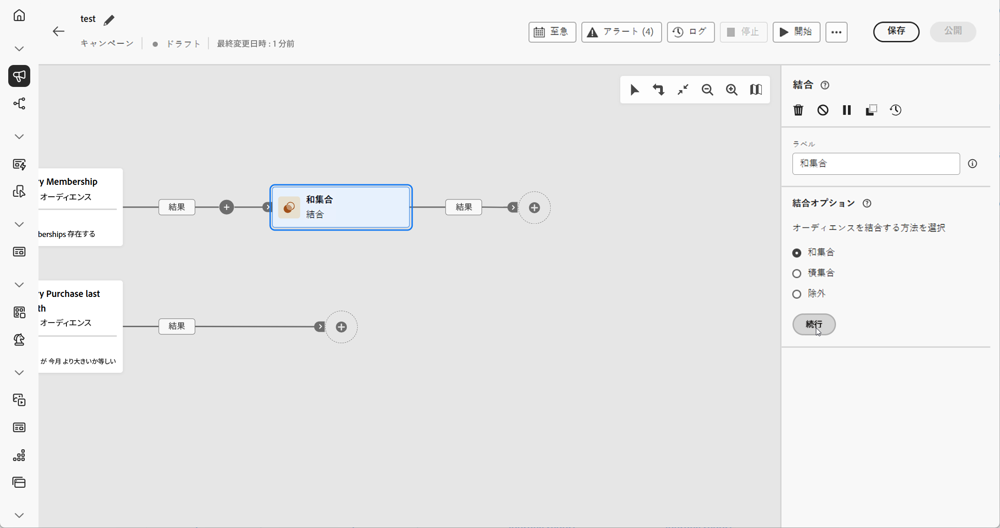
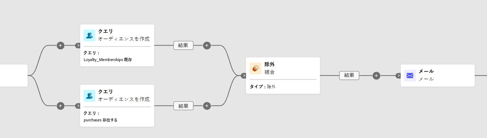
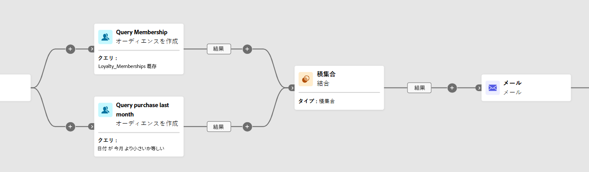
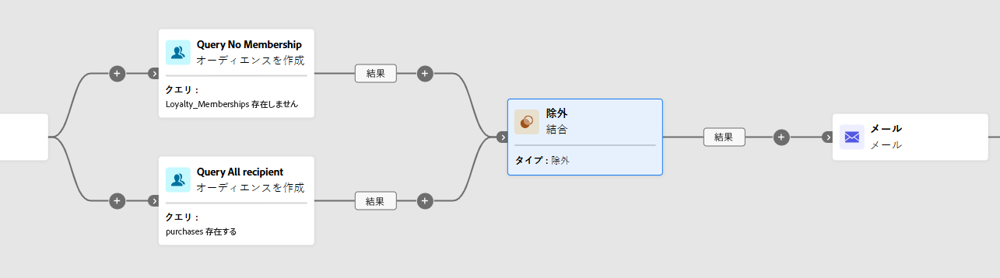

# 結合 {#combine}

>[!CONTEXTUALHELP]
>id="ajo_orchestration_combine"
>title="アクティビティを結合"
>abstract="**結合**&#x200B;アクティビティを使用すると、インバウンド母集団でセグメント化を実行できます。したがって、いくつもの母集団を組み合わせて、一部を除外したり、複数のターゲットに共通するデータのみを保持したりできます。"

+++ 目次

| 調整されたキャンペーンへようこそ | 最初の調整されたキャンペーンの開始 | データベースのクエリ | 調整されたキャンペーンアクティビティ |
|---|---|---|---|
| [ オーケストレーションされたキャンペーンの概要 ](../gs-orchestrated-campaigns.md)  [ 設定手順 ](../configuration-steps.md)  [ オーケストレーションされたキャンペーンを作成するための主な手順 ](../gs-campaign-creation.md) | [ オーケストレーションされたキャンペーンの作成 ](../create-orchestrated-campaign.md)  [ アクティビティのオーケストレーション ](../orchestrate-activities.md)   [ キャンペーンの開始および監視 ](../start-monitor-campaigns.md)  [ レポート ](../reporting-campaigns.md) | [ クエリの操作Modeler](../orchestrated-rule-builder.md)  [ 最初のクエリ ](../build-query.md)  [ 編集式を作成 ](../edit-expressions.md) | [ アクティビティの基本を学ぶ ](about-activities.md)   アクティビティ： [AND 結合 ](and-join.md) - [ オーディエンスを作成 ](build-audience.md) - [ ディメンションの変更 ](change-dimension.md) - [ チャネルアクティビティ ](channels.md) - **[結合](combine.md)** - [ 重複排除 ](deduplication.md) - [ エンリッチメント ](enrichment.md) - [ 分岐 ](fork.md) - [ 紐付け ](reconciliation.md) [&#128279;](split.md) [&#128279;](wait.md) - |

{style="table-layout:fixed"}

+++

 

**[!UICONTROL 結合]** アクティビティは、インバウンド母集団を効果的にセグメント化できる **[!UICONTROL ターゲティング]** アクティビティの一種です。 複数の母集団を結合したり、特定のセグメントを除外したり、複数のターゲットで共有されるデータのみを保持したりできます。

次のセグメント化オプションを使用できます。

* **[!UICONTROL 和集合]**：複数のアクティビティの結果を 1 つの統合されたターゲットに結合します。

* **[!UICONTROL 積集合]**：インバウンドのすべての母集団で共通の要素のみを保持します。

* **[!UICONTROL 除外]**：指定した条件に基づいて、ある母集団から要素を削除します。

## 結合アクティビティを設定 {#combine-configuration}

>[!CONTEXTUALHELP]
>id="ajo_orchestration_intersection_merging_options"
>title="「積集合」結合オプション"
>abstract="積集合では、アクティビティ内の異なるインバウンド母集団に共通の要素のみを保持できます。「結合の設定」セクションで、結合する前のアクティビティをすべてオンにします。"

>[!CONTEXTUALHELP]
>id="ajo_orchestration_exclusion_merging_options"
>title="「除外」結合オプション"
>abstract="除外では、特定の条件に従って、ある母集団から要素を除外することができます。「結合の設定」セクションで、結合する前のアクティビティをすべてオンにします。"

>[!CONTEXTUALHELP]
>id="ajo_orchestration_combine_options"
>title="セグメント化タイプの選択"
>abstract="オーディエンスを結合する方法を選択します。**和集合**&#x200B;では、複数のアクティビティの結果を 1 つのターゲットに再グループ化できます。**積集合**&#x200B;では、アクティビティ内の異なるインバウンド母集団に共通の要素のみを保持できます。**除外**&#x200B;では、特定の条件に従って、ある母集団から要素を除外することができます。 "

**[!UICONTROL 結合]**&#x200B;アクティビティの設定を開始するには、次の一般的な手順に従います。

1. **[!UICONTROL オーディエンスを作成]**&#x200B;アクティビティなどの複数のアクティビティを追加して、2 つ以上の異なる実行分岐を形成します。
1. **[!UICONTROL 結合]**&#x200B;アクティビティを任意の前の分岐に追加します。
1. [和集合](#union)、[積集合](#intersection)または[除外](#exclusion)のセグメント化タイプを選択します。
1. 「**[!UICONTROL 続行]**」をクリックします。
1. 「**[!UICONTROL 結合の設定]**」セクションで、結合する前のアクティビティをすべてオンにします。

## 和集合 {#combine-union}

>[!CONTEXTUALHELP]
>id="ajo_orchestration_combine_reconciliation"
>title="紐付けオプション"
>abstract="「**紐付けタイプ**」を選択して、重複の処理方法を定義します。デフォルトでは、「**キー**」オプションがアクティブ化されます。つまり、アクティビティは、異なるインバウンドトランジションの要素が同じキーを持つ場合、1 つの要素のみを保持します。「**列の選択**」オプションを使用して、データの紐付けが適用される列のリストを定義します。"

**[!UICONTROL 結合]** アクティビティ内で **[!UICONTROL 紐付けタイプ]** を選択して **[!UICONTROL 和集合]** を設定し、重複レコードの管理方法を決定できます。

* **[!UICONTROL キーのみ]** （デフォルト）：複数のインバウンドトランジションが同じキーを共有する場合に、単一のレコードを保持します。 このオプションは、インバウンドの母集団が同種の場合にのみ適用されます。

* **[!UICONTROL 列の選択]**：データの紐付けに使用する列を指定できます。 **[!UICONTROL 属性を追加]** を選択します。

次の例では、**[!UICONTROL 結合]** アクティビティを **[!UICONTROL 和集合]** と使用して、**ロイヤルティメンバー** と **購入者** の 2 つのクエリの結果を、両方のセグメントのすべてのプロファイルを含む単一の大きなオーディエンスに結合します。

## 積集合 {#combine-intersection}

>[!CONTEXTUALHELP]
>id="ajo_orchestration_intersection_reconciliation_options"
>title="積集合の紐付けオプション"
>abstract="「**紐付けタイプ**」を選択して、重複の処理方法を定義します。デフォルトでは、「**キー**」オプションがアクティブ化されます。つまり、アクティビティは、異なるインバウンドトランジションの要素が同じキーを持つ場合、1 つの要素のみを保持します。「**列の選択**」オプションを使用して、データの紐付けが適用される列のリストを定義します。"

**[!UICONTROL 結合]**&#x200B;アクティビティでは、「**[!UICONTROL 積集合]**」を設定できます。このためには、以下の追加の手順に従う必要があります。

1. **[!UICONTROL 紐付けタイプ]** を選択して、重複の処理方法を定義します。

   * **[!UICONTROL キーのみ]** （デフォルト）：複数のインバウンドトランジションが同じキーを共有する場合に、単一のレコードを保持します。 このオプションは、インバウンドの母集団が同種の場合にのみ適用されます。

   * **[!UICONTROL 列の選択]**：データの紐付けに使用する列を指定できます。 **[!UICONTROL 属性を追加]** を選択します。

1. 残りの母集団を処理するには、「**[!UICONTROL 補集合を生成]**」を有効にします。 補集合には、積集合を除くすべてのインバウンドアクティビティ結果の和集合が含まれます。 追加のアウトバウンドトランジションがアクティビティに追加されます。

次の例は、2 つのクエリアクティビティ間での **[!UICONTROL 積集合]** の使用を示しています。 **ロイヤルティメンバー** であり、過去 1 か月以内に購入したプロファイルを識別するために使用されます。

## 除外 {#combine-exclusion}

>[!CONTEXTUALHELP]
>id="ajo_orchestration_exclusion_options"
>title="除外ルール"
>abstract="必要に応じて、インバウンドテーブルを操作できます。別のディメンションからターゲットを除外するには、このターゲットが同じターゲティングディメンションをメインターゲットとして返します。 それには、「除外ルール」セクションの「ルールを追加」をクリックし、ディメンションの変更条件を指定します。データの紐付けは、属性または結合を使用して実行されます。"

>[!CONTEXTUALHELP]
>id="ajo_orchestration_combine_sets"
>title="結合するセットを選択"
>abstract="「**結合の設定**」セクションで、インバウンドトランジションから「**プライマリセット**」を選択します。 これは、要素の除外元のセットです。 これ以外のセットは、プライマリセットから除外する前の要素に一致します。"

>[!CONTEXTUALHELP]
>id="ajo_orchestration_combine_exclusion"
>title="除外ルール"
>abstract="必要に応じて、インバウンドテーブルを操作できます。別のディメンションからターゲットを除外するには、このターゲットが同じターゲティングディメンションをメインターゲットとして返します。 それには、「除外ルール」セクションの「ルールを追加」をクリックし、ディメンションの変更条件を指定します。データの紐付けは、属性または結合を使用して実行されます。"

>[!CONTEXTUALHELP]
>id="ajo_orchestration_combine_complement"
>title="結合で補集合を生成"
>abstract="「補集合を生成」オプションの切替スイッチをオンにして、追加のトランジションで残りの母集団を処理します。"

**[!UICONTROL 結合]**&#x200B;アクティビティでは、「**[!UICONTROL 除外]**」を設定できます。このためには、以下の追加の手順に従う必要があります。

1. 「**[!UICONTROL 結合の設定]**」セクションで、メイン母集団を表す **[!UICONTROL 2&rbrace;プライマリセット &rbrace; を選択します。]**&#x200B;他のセットで見つかったレコードは、このプライマリセットから除外されます。

1. 必要に応じて、インバウンドテーブルを調整して、様々なディメンションのターゲットを揃えることができます。 別のディメンションからターゲットを除外するには、まず、メイン母集団と同じターゲティングディメンションにターゲットを取り込む必要があります。 それには、「**[!UICONTROL ルールを追加]**」をクリックし、ディメンションを変更する条件を定義します。 その後、属性または結合を使用して紐付けが行われます。

1. 残りの母集団を処理するには、「**[!UICONTROL 補集合を生成]**」を有効にします。 補集合には、積集合を除くすべてのインバウンドアクティビティ結果の和集合が含まれます。 追加のアウトバウンドトランジションがアクティビティに追加されます。

次の **[!UICONTROL 除外]** 例は、製品を購入したプロファイルをフィルタリングするように設定された 2 つのクエリを示しています。 ロイヤルティメンバーシップを持たないプロファイルは、最初のセットから除外されます。

