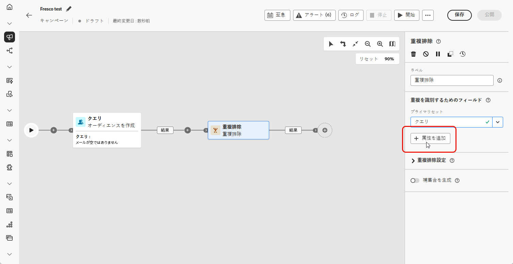
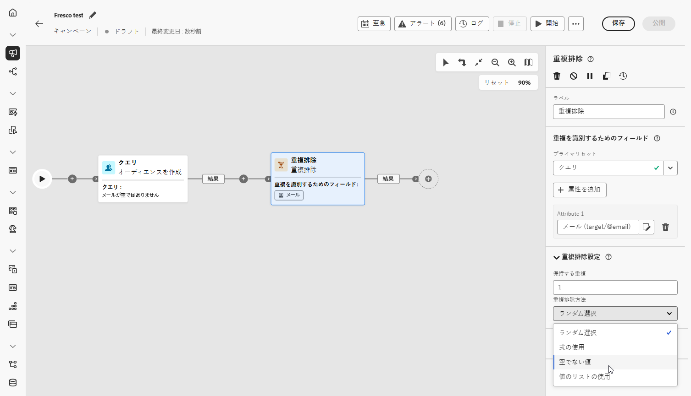
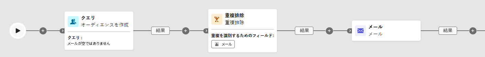

# 重複の除外 {#deduplication}

>[!CONTEXTUALHELP]
>id="ajo_orchestration_deduplication_fields"
>title="重複を識別するためのフィールド"
>abstract="「**重複を識別するためのフィールド**」セクションで、「**属性を追加**」ボタンをクリックして、メールアドレス、名、姓など、同一の値によって重複を識別できるフィールドを指定します。 フィールドの順序によって、最初に処理するフィールドを指定できます。"

>[!CONTEXTUALHELP]
>id="ajo_orchestration_deduplication"
>title="重複排除アクティビティ"
>abstract="**重複排除 - 重複**&#x200B;アクティビティでは、インバウンドアクティビティの結果から重複を削除できます。 主に、ターゲティングアクティビティの後と、ターゲティングデータを使用できるアクティビティの前に使用されます。"

>[!CONTEXTUALHELP]
>id="ajo_orchestration_deduplication_complement"
>title="補集合の生成"
>abstract="重複として除外された残りの母集団を使用して、追加のアウトバウンドトランジションを生成できます。 これを行うには、「**補集合を生成**」オプションの切替スイッチをオンにします。"

>[!CONTEXTUALHELP]
>id="ajo_orchestration_deduplication_settings"
>title="重複排除設定"
>abstract="受信データ内の重複を削除するには、以下のフィールドで「重複排除 - 重複」メソッドを定義します。 デフォルトでは、1 つのレコードのみが保持されます。 また、式または属性に基づいて「重複排除 - 重複」モードを選択する必要があります。 デフォルトでは、重複から除外するレコードはランダムに選択されます。"

+++ 目次

| 調整されたキャンペーンへようこそ | 最初の調整されたキャンペーンの開始 | データベースのクエリ | 調整されたキャンペーンアクティビティ |
|---|---|---|---|
| [ オーケストレーションされたキャンペーンの概要 ](../gs-orchestrated-campaigns.md)  [ 設定手順 ](../configuration-steps.md)  [ オーケストレーションされたキャンペーンを作成するための主な手順 ](../gs-campaign-creation.md) | [ オーケストレーションされたキャンペーンの作成 ](../create-orchestrated-campaign.md)  [ アクティビティのオーケストレーション ](../orchestrate-activities.md)  [ キャンペーンの開始および監視 ](../start-monitor-campaigns.md)  [ レポート ](../reporting-campaigns.md) | [ クエリの操作Modeler](../orchestrated-rule-builder.md)  [ 最初のクエリ ](../build-query.md)  [ 編集式を作成 ](../edit-expressions.md) | [ アクティビティの基本を学ぶ ](about-activities.md)   アクティビティ： [AND 結合 ](and-join.md) - [ オーディエンスを作成 ](build-audience.md) - [ ディメンションの変更 ](change-dimension.md) - [ チャネルアクティビティ ](channels.md) - [ 結合 ](combine.md) - [ 重複排除 ](deduplication.md) - [ エンリッチメント ](enrichment.md) - [ 分岐 ](fork.md) - [ 紐付け ](reconciliation.md) [&#128279;](split.md) [&#128279;](wait.md) - |

{style="table-layout:fixed"}

+++

 

**[!UICONTROL 重複排除 - 重複]**&#x200B;アクティビティは、**[!UICONTROL ターゲティング]**&#x200B;アクティビティです。このアクティビティでは、受信者リストに重複したプロファイルなど、インバウンドアクティビティの結果から重複を削除できます。**[!UICONTROL 重複排除 - 重複]**&#x200B;アクティビティは、通常、ターゲティングアクティビティの後と、ターゲットデータを使用できるアクティビティの前に使用されます。

## 重複排除 - 重複アクティビティの設定{#deduplication-configuration}

**[!UICONTROL 重複排除 - 重複]**&#x200B;アクティビティを設定するには、次の手順に従います。

1. 調整したキャンペーンに **[!UICONTROL 重複排除]** アクティビティを追加します。

1. 「**[!UICONTROL 重複を識別するためのフィールド]**」セクションで、「**[!UICONTROL 属性を追加]**」ボタンをクリックして、メールアドレス、名、姓など、同一の値によって重複を識別できるフィールドを指定します。 フィールドの順序によって、最初に処理するフィールドを指定できます。

   

1. 「**[!UICONTROL 重複排除設定]**」セクションで、保持する重複フィールドを使用して、保持する一意のレコードの数を選択します。 デフォルトは 1 で、重複したグループごとに 1 つのレコードを保持します。 すべての重複を保持するには、これを 0 に設定します。

   例えば、レコード A とレコード B が Y の重複で、レコード C が Z の重複である場合は、次のようになります。

   * **フィールドの値が 1 の場合**:Y レコードと Z レコードのみが保持されます。
   * **フィールドの値が 0 の場合**：すべてのレコード（A、B、C、Y、Z）が保持されます。
   * **フィールドの値が 2 の場合**:C と Z が保持され、加えて A、B、Y の 2 つの値がランダムに、または重複排除方法に基づいて保持されます。

1. **[!UICONTROL 重複排除方法]** を選択します。これにより、重複の各グループから保持するレコードをシステムがどのように決定するかを定義します。

   * **[!UICONTROL ランダム選択]**：重複から除外するレコードをランダムに選択します。
   * **[!UICONTROL 式の使用]**：定義した式に基づいて、最大値または最小値のレコードを保持します。
   * **[!UICONTROL 空でない値]**：選択したフィールドが空でないレコードを保持します（例：電話番号の付いたプロファイルのみを保持など）。
   * **[!UICONTROL 値のリストに従う]**:1 つ以上のフィールドに対して特定の値に優先順位を付けることができます。例えば、「国」がフランスに設定されているレコードを優先させることができます。 **[!UICONTROL 属性]** をクリックして、フィールドを選択するか、カスタム式を作成します。 **[!UICONTROL 「追加」ボタン]** を使用して、優先順位順に優先値を入力します。

   

1. 残りの母集団を利用するには、「**[!UICONTROL 補集合を生成]**」オプションをチェックします。補集合はすべての重複から構成されます。その後、追加のトランジションがアクティビティに追加されます。

## 例{#deduplication-example}

次の例では、**[!UICONTROL 重複排除]** アクティビティを使用して、配信を送信する前にターゲットオーディエンスから重複レコードを削除します。 オーディエンスは、まず、空でない「メール」フィールドを持つプロファイルのみを含めるようにフィルタリングされます。 次に、**[!UICONTROL 重複排除]** アクティビティは、メールアドレスを使用して重複を識別し、除外します。

