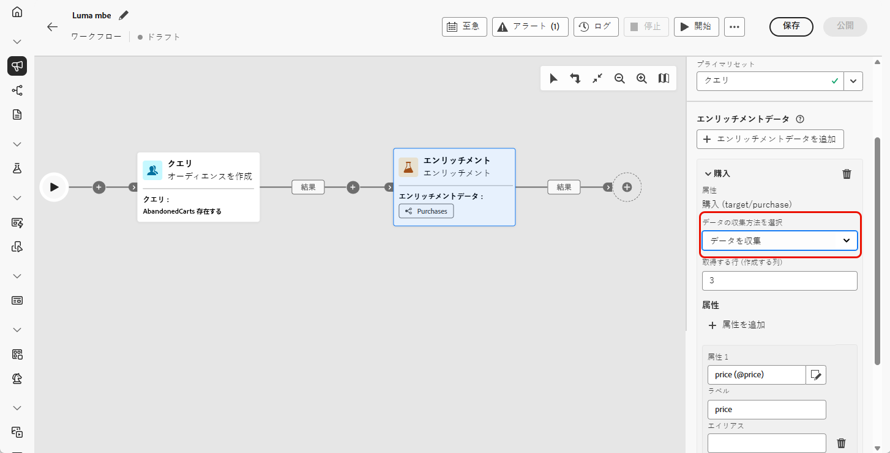

# エンリッチメント {#enrichment}

>[!CONTEXTUALHELP]
>id="ajo_orchestration_enrichment"
>title="エンリッチメントアクティビティ"
>abstract="**エンリッチメント**&#x200B;アクティビティでは、データベースからの追加情報を使用してターゲットデータを強化できます。 一般的に、セグメント化アクティビティの後のワークフローで使用されます。"

+++ 目次

| 調整されたキャンペーンへようこそ | 最初の調整されたキャンペーンの開始 | データベースのクエリ | 調整されたキャンペーンアクティビティ |
|---|---|---|---|
| [ オーケストレーションされたキャンペーンの基本を学ぶ ](../gs-orchestrated-campaigns.md)  [ 設定手順 ](../configuration-steps.md)  [ オーケストレーションされたキャンペーンへのアクセスと管理 ](../access-manage-orchestrated-campaigns.md) | [ キャンペーンの作成を調整するための主な手順 ](../gs-campaign-creation.md)  [ キャンペーンの作成およびスケジュール設定 ](../create-orchestrated-campaign.md)  [ アクティビティの調整 ](../orchestrate-activities.md)  [ キャンペーンの開始および監視 ](../start-monitor-campaigns.md)  [ レポート ](../reporting-campaigns.md) | [ ルールビルダーの操作 ](../orchestrated-rule-builder.md)  [ 最初のクエリの作成 ](../build-query.md)  [ 式の編集 ](../edit-expressions.md)  [ リターゲティング ](../retarget.md) | [ アクティビティの基本を学ぶ ](about-activities.md)   アクティビティ： [AND 結合 ](and-join.md) - [ オーディエンスを作成 ](build-audience.md) - [ ディメンションの変更 ](change-dimension.md) - [ チャネルアクティビティ ](channels.md) - [ 結合 ](combine.md) - [ 重複排除 ](deduplication.md) - <b>[ エンリッチメント ](enrichment.md)</b> - [ 分岐 ](fork.md) - [ 紐付け ](reconciliation.md)    - |

{style="table-layout:fixed"}

+++

 

**[!UICONTROL エンリッチメント]** アクティビティは、追加の属性でオーディエンスデータを強化できる **[!UICONTROL ターゲティング]** アクティビティです。

この情報を活用して、行動、好み、ニーズに基づいてオーディエンスをより正確にセグメント化し、各プロファイルとのつながりを深めるパーソナライズされたメッセージを作成できます。

## エンリッチメントアクティビティの追加 {#enrichment-configuration}

>[!CONTEXTUALHELP]
>id="ajo_targetdata_personalization_enrichmentdata"
>title="エンリッチメントデータ"
>abstract="調整されたキャンペーンの強化に使用するデータを選択します。2 種類のエンリッチメントデータを選択できます。ターゲットディメンションの単一のエンリッチメント属性、またはテーブル間の基数が 1-N のリンクであるコレクションリンクです。"

>[!CONTEXTUALHELP]
>id="ajo_orchestration_enrichment_data"
>title="エンリッチメントアクティビティ"
>abstract="エンリッチメントデータが調整されたキャンペーンに追加されたら、エンリッチメントアクティビティ後に追加されたアクティビティで使用して、顧客の行動、好み、ニーズに基づいて顧客を個別のグループにセグメント化したり、ターゲットオーディエンスの共感を呼ぶ可能性が高いパーソナライズされたマーケティングメッセージとキャンペーンを作成したりできます。"

次の手順に従って、**エンリッチメント**&#x200B;アクティビティを設定します。

1. **エンリッチメント**&#x200B;アクティビティを追加します。

1. 「**エンリッチメントデータを追加**」をクリックし、データのエンリッチメントに使用する属性を選択します。

   選択できるエンリッチメントデータには、ターゲットディメンションからの単一エンリッチメント属性と、コレクションリンクの 2 つのタイプがあります。これらの各タイプについて詳しくは、以下の例を参照してください。

   * [単一エンリッチメント属性](#single-attribute)
   * [コレクションリンク](#collection-link)

   

## 例 {#example}

### 単一エンリッチメント属性 {#single-attribute}

この例では、現在のターゲティングディメンションから、生年月日などの 1 つの属性を持つオーディエンスをエンリッチメントします。

その手順は次のとおりです。

1. 「**[!UICONTROL エンリッチメントデータを追加]**」をクリックします。

1. 現在のディメンションから単純なフィールド（**[!UICONTROL 生年月日]** など）を選択します。

   

1. 「**[!UICONTROL 確認]**」をクリックします。

### コレクションリンク {#collection-link}

このユースケースでは、リンクされたテーブルのデータでオーディエンスを強化します。 例えば、$100 未満で最新の 3 つの購入を取得するとします。

これを行うには、次のようにエンリッチメントを設定します。

* **エンリッチメント属性**: **[!UICONTROL Price]**

* **取得するレコードの数**:3

* **フィルター**:**[!UICONTROL 価格]** が 100 ドル未満の購入のみを含める

#### 属性を追加 {#add-attribute}

まず、エンリッチメントするデータを含んだコレクションリンクを選択します。

1. 「**[!UICONTROL エンリッチメントデータを追加]**」をクリックします。

1. **[!UICONTROL 購入]** テーブルから「**[!UICONTROL 価格]**」フィールドを選択します。

   

#### コレクション設定の定義{#collection-settings}

次に、データの収集方法と含めるエントリの数を設定します。

1. **[!UICONTROL データの収集方法を選択]** ドロップダウンで **[!UICONTROL データを収集]** を選択します。

   

1. 「**[!UICONTROL 取得する行（作成する列）]**」フィールドに「`3`」と入力します。

1. 平均購入額などの集計を実行するには、「集計データ **[!UICONTROL 」を選択し、「集計関数]** ドロップダウンから「**** **[!UICONTROL 平均]**」を選択します。

   

1. **[!UICONTROL ラベル]** および **[!UICONTROL エイリアス]** フィールドを使用して、エンリッチメントされた属性を後続のアクティビティで識別しやすくします。

#### フィルターの定義{#collection-filters}

最後に、フィルターを適用して、関連するレコードのみが含まれるようにします。

1. 「**[!UICONTROL フィルターを作成]**」をクリックします。

1. 次の 2 つの条件を追加します。

   * **[!UICONTROL 価格]** が存在する（NULL を除外するため）

   * **[!UICONTROL 価格]** 100 未満

   

1. 「**[!UICONTROL 確認]**」をクリックします。

<!--
#### Define the sorting{#collection-sorting}

We now need to apply sorting in order to retrieve the three **latest** purchases.

1. Activate the **Enable sorting** option.
1. Click inside the **Attribute** field.
1. Select the **Order date** field.
1. Click **Confirm**. 
1. Select **Descending** from the **Sort** drop-down.

## Data reconciliation {#reconciliation}

>[!CONTEXTUALHELP]
>id="ajo_orchestration_enrichment_reconciliation"
>title="Reconciliation"
>abstract="The **Enrichment** activity can be used to reconcile data from the Journey Optimizer schema with data from another schema, or with data coming from a temporary schema such as data uploaded using a Load file activity. This type of link defines a reconciliation towards a unique record. Journey Optimizer creates a link to a target table by adding a foreign key in it for storing a reference to the unique record."

The **Enrichment** activity can be used to reconcile data from the the Campaign database schema with data from another schema, or with data coming from a temporary schema such as data uploaded using a Load file activity. This type of link defines a reconciliation towards a unique record. Journey Optimizer creates a link to a target table by adding a foreign key in it for storing a reference to the unique record.

For example, you can use this option to reconcile a profile's country, specified in an uploaded file, with one of the countries available in the dedicated table of the Campaign database. 

Follow the steps to configure an **Enrichment** activity with a reconciliation link: 

1. Click the **Add link** button in the **Reconciliation** section.
1. Identify the data you want to create a reconciliation link with.

    * To create a reconciliation link with data from the Campaign database, select **Database schema** and choose the schema where the target is stored. 
    * To create a reconciliation link with data coming from the input transition, select **Temporary schema** and choose the orchestrated campaign transition where the target data is stored. 

1. The **Label** and **Name** fields are automatically populated based on the selected target schema. You can change their values if necessary.

1. In the **Reconciliation criteria** section, specify how you want to reconcile data from the source and destination tables:

    * **Simple join**: Reconcile a specific field from the source table with another field in the destination table. To do this, click the **Add join** button and specify the **Source** and **Destination** fields to use for the reconciliation.

        >[!NOTE]
        >
        >You can use one or more **Simple join** criteria, in which case they must all be verified so that the data can be linked together.

    * **Advanced join**: Use the query modeler to configure the reconciliation criteria. To do this, click the **Create condition** button then define your reconciliation criteria by building your own rule using AND and OR operations.

The example below shows an orchestrated campaign configured to create a link between Journey Optimizer profiles table and a temporary table generated a **Load file** activity. In this example, the **Enrichment** activity reconciliates both tables using the email address as reconciliation criteria.

### Enrichment with linked data {#link-example}

The example below shows an orchestrated campaign configured to create a link between two transitions. The first transitions targets profile data using a **Query** activity, while the second transition includes purchase data stored into a file loaded through a Load file activity.

* The first **Enrichment** activity links the primary set (data from the **Query** activity) with the schema from the **Load file** activity. This allows us to match each profile targeted by the query with the corresponding purchase data.

    

* A second **Enrichment** activity is added in order to enrich data from the orchestrated campaign table with the purchase data coming from the **Load file** activity. This allows us to use those data in further activities, for example, to personalize messages sent to the customers with information on their purchase.

    

## Create links between tables {#create-links}

>[!CONTEXTUALHELP]
>id="ajo_orchestration_enrichment_simplejoin"
>title="Link definition"
>abstract="Create a link between the working table data and Adobe Journey Optimizer. For example, if you load data from a file which contains the account number, country and email of recipients, you have to create a link towards the country table in order to update this information in their profiles."

The **[!UICONTROL Link definition]** section allows you to create a link between the working table data and Adobe Journey Optimizer. For example, if you load data from a file which contains the account number, country and email of recipients, you have to create a link towards the country table in order to update this information in their profiles.

There are several types of links available:

* **[!UICONTROL 1 cardinality simple link]**: Each record from the primary set can be associated with one and only one record from the linked data.
* **[!UICONTROL 0 or 1 cardinality simple link]**: Each record from the primary set can be associated with 0 or 1 record from the linked data, but not more than one.
* **[!UICONTROL N cardinality collection link]**: Each record from the primary set can be associated with 0, 1 or more (N) records from the linked data.

To create a link, follow these steps:

1. In the **[!UICONTROL Link definition]** section, click the **[!UICONTROL Add link]** button.

    

1. In the **Relation type** drop-down list, choose the type of link you want to create.

1. Identify the target you want to link the primary set to:

    * To link an existing table in the database, choose **[!UICONTROL Database schema]** and select the desired table from the **[!UICONTROL Target schema]** field.
    * To link with data from the input transition, choose **Temporary schema** and select the transition whose data you want to use.

1. Define the reconciliation criteria to match data from the primary set with the linked schema. There are two types of joins available:

    * **Simple join**: Select a specific attribute to match data from the two schemas. Click **Add join** and select the **Source** and **Destination** attributes to use as reconciliation criteria. 
    * **Advanced join**: Create a join using advanced conditions. Click **Add join** and click the **Create condition** button to open the query modeler.

A workflow example using links is available in the [Examples](#link-example) section.

## Add offers {#add-offers}

>[!CONTEXTUALHELP]
>id="ajo_orchestration_enrichment_offer_proposition"
>title="Offer proposition"
>abstract="The Enrichment activity allows you to add offers for each profile."

The **[!UICONTROL Enrichment]** activity allows you to add offers for each profile.

To do so, follow the steps to configure an **[!UICONTROL Enrichment]** activity with an offer: 

1. In the **[!UICONTROL Enrichment]** activity, at the **[!UICONTROL Offer proposition]** section, click on the **[!UICONTROL Add offer]** button

    

1. You have two choices for the offer selection :

    * **[!UICONTROL Search for the best offer in category]** : check this option and specify the offer engine call parameters (offer space, category or theme(s), contact date, number of offers to keep). The engine will calculate the best offer(s) to add according to these parameters. We recommend completing either the Category or the Theme field, rather than both at the same time.

        

    * **[!UICONTROL A predefined offer]** : check this option and specify an offer space, a specific offer, and a contact date to directly configure the offer that you would like to add, without calling the offer engine.

        

1. After selecting your offer, click on **[!UICONTROL Confirm]** button.

You can now use the offer in the delivery activity.

### Using the offers from Enrichment activity

Within an orchestrated campaign, if you want to use the offers you get from an enrichment activity in your delivery, follow the steps below:

1. Open the delivery activity and go in the content edition. Click on **[!UICONTROL Offers settings]** button and select in the drop-down list the **[!UICONTROL Offers space]** corresponding to your offer. 
If you want to to view only offers from the enrichment activity, set the number of **[!UICONTROL Propositions]** to 0, and save the modifications.

     

1. In the Email Designer, when adding a personalization with offers, click on the **[!UICONTROL Propositions]** icon, it will display the offer(s) you get from the **[!UICONTROL Enrichment]** activity. Open the offer you want to choose by clicking on it.

     

    Go in **[!UICONTROL Rendering functions]** and choose **[!UICONTROL HTML rendering]** or **[!UICONTROL Text rendering]** according to your needs.

     

>[!NOTE]
>
>If you choose to have more than one offer in the **[!UICONTROL Enrichment]** activity at the **[!UICONTROL Number of offers to keep]** option, all the offers are displayed when clicking on the **[!UICONTROL Propositions]** icon.

-->