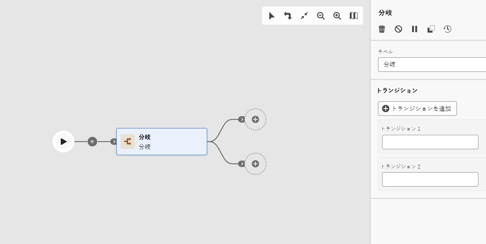

# 分岐 {#fork}

>[!CONTEXTUALHELP]
>id="ajo_orchestration_fork"
>title="「分岐」アクティビティ"
>abstract="**分岐**&#x200B;アクティビティを使用すると、アウトバウンドトランジションを作成して、複数のアクティビティを同時に開始できます。"

>[!CONTEXTUALHELP]
>id="ajo_orchestration_fork_transitions"
>title="分岐アクティビティのトランジション"
>abstract="デフォルトでは、**分岐**&#x200B;アクティビティで 2 つのトランジションが作成されます。 「**トランジションを追加**」ボタンをクリックして追加のアウトバウンドトランジションを定義し、そのラベルを入力します。"

**[!UICONTROL 分岐]**&#x200B;アクティビティは、複数のアウトバウンドトランジションを作成し、複数のアクティビティを並行して実行できる&#x200B;**[!UICONTROL フロー制御]**&#x200B;コンポーネントです。

## 分岐アクティビティの設定{#fork-configuration}

次の手順に従って、**[!UICONTROL 分岐]**&#x200B;アクティビティを設定します。

1. **[!UICONTROL 分岐]**&#x200B;アクティビティを調整されたキャンペーンに追加します。

1. **[!UICONTROL ラベル]**&#x200B;を定義します。

1. 各アウトバウンドトランジションにラベルを割り当てます。デフォルトでは、2 つのトランジションが指定されています。

1. トランジションを削除するには、「」アイコンをクリックします。

1. 必要に応じて、「**[!UICONTROL トランジションを追加]**」をクリックして、さらにアウトバウンドトランジションを追加します。
