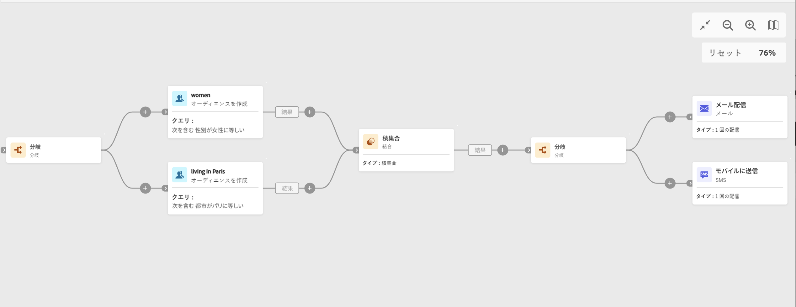

# 分岐 {#fork}

>[!CONTEXTUALHELP]
>id="ajo_orchestration_fork"
>title="「分岐」アクティビティ"
>abstract="**分岐**&#x200B;アクティビティを使用すると、アウトバウンドトランジションを作成して、複数のアクティビティを同時に開始できます。"

>[!CONTEXTUALHELP]
>id="ajo_orchestration_fork_transitions"
>title="分岐アクティビティのトランジション"
>abstract="デフォルトでは、**分岐**&#x200B;アクティビティで 2 つのトランジションが作成されます。 「**トランジションを追加**」ボタンをクリックして追加のアウトバウンドトランジションを定義し、そのラベルを入力します。"

+++ 目次

| 調整されたキャンペーンへようこそ | 最初の調整されたキャンペーンの開始 | データベースのクエリ | キャンペーンアクティビティをキャンセル |
|---|---|---|---|
| [ オーケストレーションされたキャンペーンの概要 ](gs-orchestrated-campaigns.md)  [ 設定手順 ](configuration-steps.md)  [ オーケストレーションされたキャンペーンを作成するための主な手順 ](gs-campaign-creation.md) | [ オーケストレーションされたキャンペーンの作成 ](create-orchestrated-campaign.md)  [ アクティビティのオーケストレーション ](orchestrate-activities.md)  [ オーケストレーションされたキャンペーンでのメッセージの送信 ](send-messages.md)  [ キャンペーンの開始および監視 ](start-monitor-campaigns.md)  [ レポート ](reporting-campaigns.md) | [ クエリの操作Modeler](orchestrated-query-modeler.md)  [ 最初のクエリ ](build-query.md)  [ 編集式を作成 ](edit-expressions.md) | [ アクティビティの基本を学ぶ ](activities/about-activities.md)   アクティビティ： [AND 結合 ](activities/and-join.md) - [ オーディエンスを作成 ](activities/build-audience.md) - [ ディメンションを変更 ](activities/change-dimension.md) - [ 結合 ](activities/combine.md) - [ 重複排除 ](activities/deduplication.md) - [ エンリッチメント ](activities/enrichment.md) - [ 分岐 ](activities/fork.md) - [ 紐付け ](activities/reconciliation.md) - [ 分割 ](activities/split.md)  - |

{style="table-layout:fixed"}

+++

  

**分岐**&#x200B;アクティビティは&#x200B;**フロー制御**&#x200B;アクティビティです。アウトバウンドトランジションを作成して、複数のアクティビティを同時に開始できます。

## 分岐アクティビティの設定{#fork-configuration}

次の手順に従って、**分岐**&#x200B;アクティビティを設定します。

1. **分岐** アクティビティをオーケストレーションされたキャンペーンに追加します。
1. **トランジションを追加**&#x200B;をクリックし、新しいアウトバウンドトランジションを追加します。デフォルトでは、2 つのトランジションが定義されています。
1. 各トランジションにラベルを追加します。

## 例{#fork-example}

次の例では、2 つの&#x200B;**分岐**&#x200B;アクティビティを使用しています。

* 2 つのクエリの前にある 1 つのクエリは、同時に実行されます。
* 積集合の後の 1 つは、ターゲット母集団にメールと SMS を同時に送信します。

