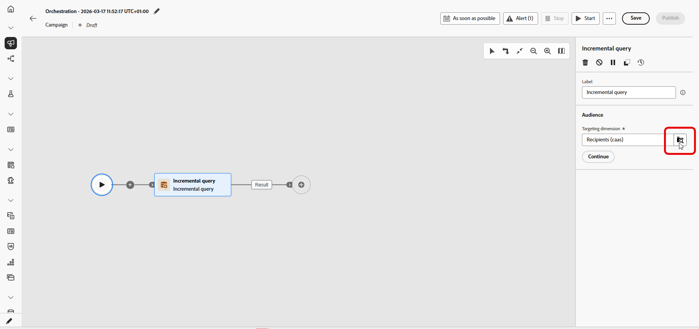
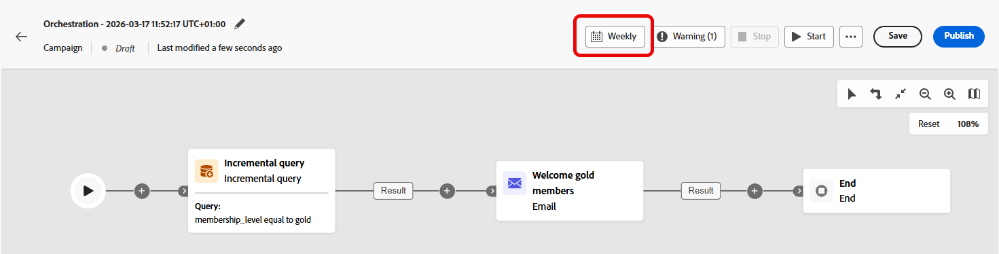

# 増分クエリ {#incremental-query}

>[!CONTEXTUALHELP]
>id="ajo_orchestration_incrementalquery"
>title="増分クエリ"
>abstract="増分クエリは、オーケストレートキャンペーンが実行されるたびにデータベースクエリを実行するターゲティングアクティビティです。 新しいレコードのみを返し、以前の実行に既に含まれているユーザーは除外されるので、同じユーザーを再ターゲットしたり、同じ行を再度書き出したりするのを避けることができます。"

>[!CONTEXTUALHELP]
>id="ajo_orchestration_incrementalquery_processeddata"
>title="処理済みデータ"
>abstract="「処理済みデータ」で、以前の実行からレコードを除外する方法を選択します。 「日付フィールドを使用」オプションでは、アクティビティは個々の ID を追跡する代わりに選択された日付フィールドを使用し、各実行は、日付が最後の実行の後にある行のみを返します。"

>[!CONTEXTUALHELP]
>id="ajo_orchestration_incrementalquery_history"
>title="履歴（日数）"
>abstract="この設定は、そのリストを保持する期間を制御します。 値が 0 の場合は、保持が無限であることを意味し、レコードは削除されません。"

**[!UICONTROL 増分クエリ]** アクティビティは、オーケストレーションされたキャンペーンが実行されるたびにデータベースクエリを実行する&#x200B;**[!UICONTROL ターゲティング]** アクティビティです。 重要なのは、常に&#x200B;**新しい** レコードのみが出力されることです。 以前の実行ですでにピックアップされたユーザーは除外されるので、同じユーザーを再ターゲティングしたり、同じ行を再エクスポートしたりすることは避けられます。

キャンペーンを複数回実行できる場合、たとえばキャンペーンをスケジュールする場合（週単位など）、または外部シグナルやAPIによってトリガーされる場合に使用します。 各実行では、前回の実行で返されなかったレコードのみをターゲットにするため、重複を回避できます。

一般的な用途：

* **メッセージとオーディエンス**：新しいサインアップ、新しい購入者、またはその他の「前回の実行後から新しい」セグメントのみを次のステップ（電子メール、SMSなど）に取り込みます。
* **進行中の書き出し**：既に書き出したものと重複することなく、レポートまたはBI ツール用に新しい行または更新された行のみをファイルに送信します。

実行が行を返さない場合、オーケストレーションされたキャンペーンは&#x200B;**増分クエリ**&#x200B;で停止します。 増分クエリ後のアクティビティは、キャンペーンが再度実行されるまで、データが存在するまで実行されません。

## 増分クエリアクティビティの設定 {#incremental-query-configuration}

ターゲティングディメンションを設定し、クエリを作成し、アクティビティで今後の実行から除外するレコードを決定する方法を選択します。

1. **[!UICONTROL 増分クエリ]** アクティビティをオーケストレーション済みキャンペーンにドロップします。

1. **[!UICONTROL オーディエンス]**&#x200B;で、**[!UICONTROL ターゲティングディメンション]**&#x200B;を選択し（例：受信者、購読者）、**[!UICONTROL 続行]**&#x200B;をクリックします。 詳しくは、[&#x200B; ディメンションのターゲティング &#x200B;](../target-dimension.md)を参照してください。

   

1. 「**[!UICONTROL 条件を追加]**」をクリックして、クエリを定義します。 [&#x200B; ルールビルダー](../orchestrated-rule-builder.md)の使用方法を説明します。

   

1. 「**[!UICONTROL 処理済みデータ]**」で、日付フィールドへの&#x200B;**[!UICONTROL パス]**&#x200B;を選択します。 属性には、**日付時刻**&#x200B;形式を使用する必要があります。 各実行は、最後の実行後の日付の行のみを返します。

   

<!--
   * **[!UICONTROL Exclude results of previous execution]**: The activity maintains a list of records returned in prior runs. Each run excludes those records and returns only new ones. **[!UICONTROL History in days]** controls the retention period for that list. 0 indicates indefinite retention, no records are removed.

   >[!IMPORTANT]
   >
   >This mode stores the primary key of each processed record. Personally identifiable information (PII) must not be used as the primary key.

-->

## 例 {#incremental-query-example}

次の例では、ゴールドメンバーになったばかりのプロファイルにウェルカムメールを送信します。 このキャンペーンは、毎週月曜日に実行するようにスケジュールできます。 各実行では、前回の実行以降にゴールドメンバーシップに適格だったプロファイルのみをターゲットにするため、各受信者にはウェルカムメールが1回送信されます。

* **[!UICONTROL 増分クエリ]**：ゴールド メンバーを選択します。 初回：現在のゴールドメンバー。 後の実行：前の実行以降にゴールドメンバーになったプロファイルのみ。
* **[!UICONTROL メール配信]**: クエリで出力されたプロファイルにウェルカムメールを送信します。

