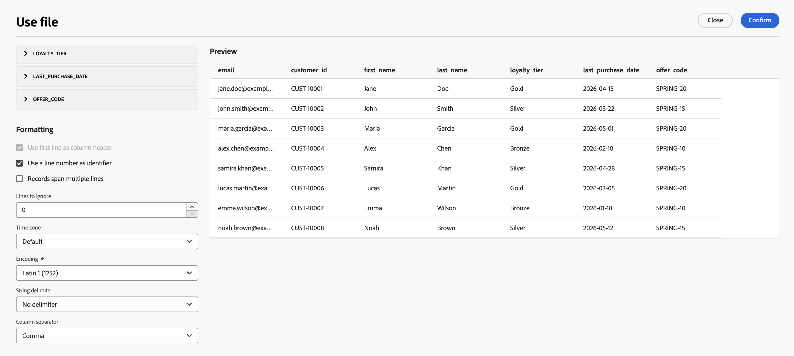

# ファイルを読み込み {#load-file}

>[!CONTEXTUALHELP]
>id="ajo_orchestration_load_file"
>title="ファイルを読み込みアクティビティ"
>abstract="**ファイルを読み込み**&#x200B;アクティビティは、**データ管理**&#x200B;アクティビティです。 これを使用して、オーケストレーションキャンペーンキャンバス上で外部ファイルに保存されているプロファイルとデータを操作し、キャンペーンオーディエンスを定義します。 ファイルデータは実行時に消費され、Adobe Experience Platform データセットとして保持されません。"

**[!UICONTROL ファイルを読み込み]**&#x200B;アクティビティは、**[!UICONTROL データ管理]**&#x200B;アクティビティです。 外部ファイルに保存されているプロファイルとデータを操作する場合に使用します。 受信者リストが外部システム（CRM書き出しやパートナーファイルなど）から取得され、最初に完全なAdobe Experience Platform取り込みパイプラインを構築せずにキャンペーンを実行する場合、オーケストレーションされたキャンペーンで&#x200B;**ファイルベースのターゲティング**&#x200B;がサポートされます。

>[!AVAILABILITY]
>
>**ファイルの読み込み** アクティビティは、組織のセットに対して&#x200B;**可用性の制限**&#x200B;で利用できます。 アクセスをリクエストするには、Adobe担当者にお問い合わせください。 可用性フェーズについては、[Journey Optimizer リリースサイクル &#x200B;](../../rn/releases.md)を参照してください。
>
>アクティビティは現在、**Healthcare Shield**&#x200B;では使用できません。

## 権限 {#permissions}

オーケストレーションされたキャンペーンで&#x200B;**[!UICONTROL ファイルを読み込み]** アクティビティを使用するには、ユーザーに適切な権限を割り当てる必要があります。 両方の権限は、権限UIの&#x200B;**[!UICONTROL Adobe Experience Platform]** > **[!UICONTROL Adobe Journey Optimizer]** > **[!UICONTROL オーケストレーションされたキャンペーン]**&#x200B;で使用できます。

* **[!UICONTROL オーケストレーションされたキャンペーンでファイルを表示]** – 読み取り専用アクセス権を付与します。 この権限を持つユーザーは、**[!UICONTROL ファイルを読み込み]** アクティビティを含むオーケストレーションされたキャンペーンの結果をプレビューできますが、アクティビティを追加したりファイルをアップロードしたりすることはできません。
* **[!UICONTROL オーケストレーションされたキャンペーンでファイルを管理]** — **[!UICONTROL ファイルを読み込み]** アクティビティをキャンペーンキャンバスに追加し、ファイルをアップロードするために必要です。 この権限は、**[!UICONTROL ファイルの読み込み]** アクティビティを作成または設定する必要があるユーザーに割り当てます。

権限の割り当て方法については、[&#x200B; ユーザーと役割の管理](../../administration/permissions.md)を参照してください。

## ガードレールと制限 {#limitations}

ファイルをロード アクティビティには、次の制限が適用されます。

* 1つのファイルにつき最大50 MBまでアップロードできます。
* フラット構造のCSV ファイルとTXT ファイルのみがサポートされます。
* アップロードされたデータは、キャンペーンの実行時に使用され、Adobe Experience Platform データセットとして保存されません。

チャネルとキャンバスのアクティビティに関する制限については、[&#x200B; ガードレールと制限](../guardrails.md#activities-limitations)を参照してください。

## 前提条件 {#prerequisites}

オーケストレーションされたキャンペーンに&#x200B;**[!UICONTROL ファイルを読み込み]** アクティビティを追加してメッセージアクティビティに接続する前に、管理者は次の1回限りの設定を完了する必要があります。

### ファイル形式のターゲットディメンションの作成 {#file-target-dimension}

**[!UICONTROL ファイル]**&#x200B;型の&#x200B;**[!UICONTROL プロファイルターゲットDimension]**&#x200B;を使用すると、オーケストレーションされたキャンペーンは、Adobe Experience Platform スキーマではなく、アップロードされたファイルから受信者を解決できます。 キャンペーン実行時にファイルオーディエンスが処理されるときに使用されるID名前空間と識別子フィールドを定義します。

**[!UICONTROL 管理]** > **[!UICONTROL 設定]** > **[!UICONTROL Campaign Target Dimension]**&#x200B;からターゲットディメンションを作成します。 [&#x200B; ターゲットディメンションの詳細](../target-dimension.md)

ファイルベースのターゲティング用のターゲットディメンションを作成する場合は、次のことを確認してください。

* **[!UICONTROL Dimension ソース]**&#x200B;を&#x200B;**[!UICONTROL ファイル]**&#x200B;に設定します。
* ファイルのID列に一致する&#x200B;**[!UICONTROL ID名前空間]**&#x200B;を選択します（例：**[!UICONTROL 電子メール]**）。
* **[!UICONTROL ID フィールドのパス]**&#x200B;を入力します。 アップロードしたファイルに`email`列が含まれている場合は、識別子を含むファイルフィールド（例：`email`）を使用します。

>[!CAUTION]
>
>ターゲットディメンションを保存した後で、スキーマとIDの値を変更することはできません。 保存する前に、ID名前空間とID フィールドのパスを確認します。

### ファイルベースの配信用のチャネル設定の作成 {#file-channel-configuration}

ファイル形式のターゲットディメンションを使用する専用のチャネル設定を作成します。 この設定は、キャンペーンキャンバスの&#x200B;**[!UICONTROL ファイルの読み込み]** アクティビティに続くメッセージアクティビティで選択されます。

1. **[!UICONTROL 管理]** > **[!UICONTROL チャネル]** > **[!UICONTROL チャネル設定]**&#x200B;に移動し、新しい設定を作成します。

1. 「**[!UICONTROL 実行の詳細]**」で、「**[!UICONTROL オーケストレーションされたキャンペーン]**」タブを選択し、オーケストレーションされたキャンペーンの設定を有効にします。

1. 「**[!UICONTROL プロファイルターゲットDimension]**」フィールドで、前の手順で作成したファイルタイプのターゲットディメンションを選択します。

1. 残りのチャネル設定フィールドに入力して保存します。 [&#x200B; オーケストレーションされたキャンペーンのチャネル設定について詳しく見る](../channel-config.md)

>[!IMPORTANT]
>
>標準プロファイルベースのチャネル設定は、ファイルベースのオーディエンスでは機能しません。 **[!UICONTROL ファイルの読み込み]** アクティビティに続くメッセージアクティビティのファイルタイプ ディメンションをターゲットとするチャネル設定を使用します。

## 「ファイルを読み込み」アクティビティの設定 {#load-file-configuration}

2つの部分でアクティビティを設定します。サンプルファイルで想定されるファイル構造を定義し、キャンペーンの実行時に読み込むファイルを指定します。

1. オーケストレーションされたキャンペーンキャンバスに&#x200B;**[!UICONTROL ファイルを読み込み]** アクティビティを追加します。

   

1. アクティビティの&#x200B;**[!UICONTROL ラベル]**&#x200B;を入力します。

### サンプルファイルの定義 {#sample-file}

サンプルファイルを使用して、**[!UICONTROL 列]**&#x200B;と&#x200B;**[!UICONTROL 書式設定]**&#x200B;を設定します。 サンプルデータは、キャンペーンオーディエンスとして読み込まれません。

1. 「**[!UICONTROL サンプルファイル]**」セクションで、想定される構造を定義するローカルファイルを選択します。

   >[!NOTE]
   >
   > サンプルファイルは、列と書式のみを設定するために使用され、そのデータはキャンペーンオーディエンスとして読み込まれません。 形式は、キャンペーンの実行時に読み込むファイルと一致する必要があります。

1. 「**[!UICONTROL ファイルタイプ]**」ドロップダウンで、ファイルで&#x200B;**区切り列**&#x200B;または&#x200B;**固定幅の列**&#x200B;を使用するかどうかを指定します。

   

1. **[!UICONTROL 列]** セクションで、各列を展開し、そのプロパティを設定します。

   

   **[!UICONTROL データタイプ]**&#x200B;を選択すると、そのタイプに追加のオプションが表示されます。 すべての列に共通するパラメーターとタイプ固有のオプションについては、以下のセクションを展開してください。

   +++共通の列パラメーター

   * **[!UICONTROL 列を無視]** – 選択した場合にインポートから列を除外します。
   * **[!UICONTROL Label]** – 列の表示名（例：`email`）。
   * **[!UICONTROL 内部名]** — ファイル ヘッダーから派生した列のシステム名（読み取り専用）。
   * **[!UICONTROL Data type]** – 列のデータのタイプ。
   * **[!UICONTROL Allow NULLs]** – 列の空の値の管理方法を指定します。

      * **[!UICONTROL Adobe Campaign default]** – 数値フィールドに対してのみエラーが発生します。 それ以外の場合はNULL値を挿入します。
      * **[!UICONTROL 空の値を許可]** – 空の値を許可します。 したがって、null 値が挿入されます。
      * **[!UICONTROL Always populated]** – 値が空の場合にエラーを生成します。

   * **[!UICONTROL エラー処理]** – 列でエラーが発生した場合の動作を定義します。

      * **[!UICONTROL 値を無視]** – 値は無視されます。
      * **[!UICONTROL 行を却下]** – 行全体が処理されません。
      * **[!UICONTROL エラーの場合はデフォルト値を使用]** — エラーの原因となる値を、**[!UICONTROL デフォルト値]** フィールドで定義されたデフォルト値に置き換えます。
      * **[!UICONTROL 値が再マッピングされない場合は、デフォルト値を使用します]** – 誤った値にマッピングが定義されていない限り、**[!UICONTROL デフォルト値]** フィールドで定義されているデフォルト値にエラーを引き起こす値を置き換えます。
      * **[!UICONTROL リマップ値がない場合は行を却下]** – 誤った値にマッピングが定義されていない限り、行全体は処理されません。

   * **[!UICONTROL デフォルト値]** — **[!UICONTROL エラー処理]**&#x200B;がデフォルト値を使用するように設定されている場合に使用するデフォルト値。
   * **[!UICONTROL 値の再マッピング]** – 特定の値を新しい値にマッピングします。 「**[!UICONTROL マッピングを追加]**」をクリックして、各マッピングを定義します（例：`True`/`False`を`1`/`0`に置き換えます）。

   +++

   +++文字列列パラメーター

   * **[!UICONTROL 幅]** – 最大文字数。
   * **[!UICONTROL データ変換]** – 文字列値に適用される大文字と小文字の変換（例：「なし」または「大文字/小文字」）。
   * **[!UICONTROL 空白の管理]** – 文字列値の先頭または末尾のスペースを処理する方法。

   +++

   +++整数列と浮動小数列のパラメーター

   * **[!UICONTROL 形式]** — ファイル内の数値の読み取り方法を定義します。

      * **[!UICONTROL その他]** — **[!UICONTROL 区切り記号]** セクションの&#x200B;**[!UICONTROL 千区切り記号]**&#x200B;と&#x200B;**[!UICONTROL 小数区切り記号]**&#x200B;を定義します。
      * **[!UICONTROL 1,000.00]** — コンマは千区切り記号、ピリオドは小数区切り記号です。
      * **[!UICONTROL 1 000,00]** – 数千の区切り記号はスペース、小数点の区切り記号はコンマ。

   * **[!UICONTROL 区切り記号]** （**[!UICONTROL 形式]**&#x200B;が&#x200B;**[!UICONTROL その他]**&#x200B;の場合）:

      * **[!UICONTROL 千区切り記号]** – 数千を数値でグループ化する文字（使用しない場合は空のままにする）。
      * **[!UICONTROL 小数点区切り記号]** – 数値の小数点以下桁に使用される文字（例：`,`または`.`）。

   +++

   +++日付と時刻の列パラメーター

   オプションは、**[!UICONTROL データ型]**&#x200B;が&#x200B;**日付**、**時刻**&#x200B;または&#x200B;**日時**&#x200B;であるかどうかによって異なります。

   **日付**

   * **[!UICONTROL 日付形式]** — ファイル内での日付の表示方法に一致するパターン（`yyyy/mm/dd`など）。
   * **[!UICONTROL 区切り記号]**:

      * **[!UICONTROL 年、月、日]** – 年、月、日のコンポーネント間の文字（`/`など）。

   **時間**

   * **[!UICONTROL 時間形式]** — ファイル内に表示される時間に一致するパターン（例：`13:30`、24時間および分）。
   * **[!UICONTROL 区切り記号]**:

      * **[!UICONTROL 時間、分、秒]** – 時間、分、秒のコンポーネント間の文字（例：`:`）。

   **日時**

   * **[!UICONTROL 日付形式]** — ファイル内での日付部分の表示方法に一致するパターン。
   * **[!UICONTROL 時刻の形式]** — ファイル内での時刻の表示方法と一致するパターン。
   * **[!UICONTROL 区切り記号]** – 日付と時刻のコンポーネント間の文字。

   +++

1. 「**[!UICONTROL フォーマット]**」セクションで、キャンペーンの実行時に行と列が正しく読み取られるように、ファイルの構造化方法を指定します。 ターゲットファイルは、サンプルファイルと同じフォーマットを使用する必要があります。

   

   * **[!UICONTROL 最初の行を列ヘッダーとして使用]** – 選択すると、ファイルの最初の行は列名として扱われます。 このオプションは、通常、ヘッダー行を含むファイルからサンプルを設定する場合に有効になります。
   * **[!UICONTROL 行番号を識別子として使用]** – 選択すると、各行がファイル内の行番号で識別されます。
   * **[!UICONTROL 複数の行にまたがるレコード]** – 選択すると、1つのレコードがファイル内の複数の行にまたがることができます（たとえば、フィールドに改行が含まれている場合）。
   * **[!UICONTROL 無視する行]** — データが読み取られる前にファイルの先頭でスキップする行数（コメント行やメタデータ行など）。
   * **[!UICONTROL タイムゾーン]** – 日付と時刻の値が読み込まれたときに適用されるタイムゾーン。
   * **[!UICONTROL Encoding]** — ファイルの文字エンコーディング。 ソースファイルに一致するエンコーディングを選択します。
   * **[!UICONTROL 文字列区切り]** — ファイル内の文字列値を囲むために使用される文字。
   * **[!UICONTROL 列区切り記号]** – 区切りファイル内の列を区切る文字。

1. 「**[!UICONTROL 確認]**」をクリックして、サンプルファイル設定を検証します。

### ターゲットファイルを定義 {#target-file}

キャンペーンの実行時に読み込むファイルと、各行が既存の受信者に一致する方法を指定します。

1. 「**[!UICONTROL ターゲットファイル]**」セクションで、ターゲットとするオーディエンスを含むCSVまたはTXT ファイルを選択します。

   

   >[!CAUTION]
   >
   > ターゲットファイルが、サンプルファイルと同じ形式、列構造、列数に従っていることを確認します。

1. 「**[!UICONTROL 管理を却下]**」セクションで、ファイル処理中にエラーが発生した場合のアクティビティの動作を定義します。

   * **[!UICONTROL 許可されるエラー数]** — アクティビティが失敗する前に許可されるエラーの最大数。
   * **[!UICONTROL 却下をファイルに保持]** – 有効にすると、読み込めなかった行は、実行後にレビューのためにサーバー上の却下ファイルに書き込まれます。

1. オプションで、**[!UICONTROL インポート後にファイルを削除]**&#x200B;を有効にして、キャンペーンの実行後にアップロードしたファイルをサーバーから削除します。

**[!UICONTROL ファイルを読み込み]**&#x200B;がオーディエンスを解決したら、アウトバウンドトランジションをダウンストリームアクティビティに接続します。 [キャンペーンアクティビティの調整方法の詳細情報](../orchestrate-activities.md)
